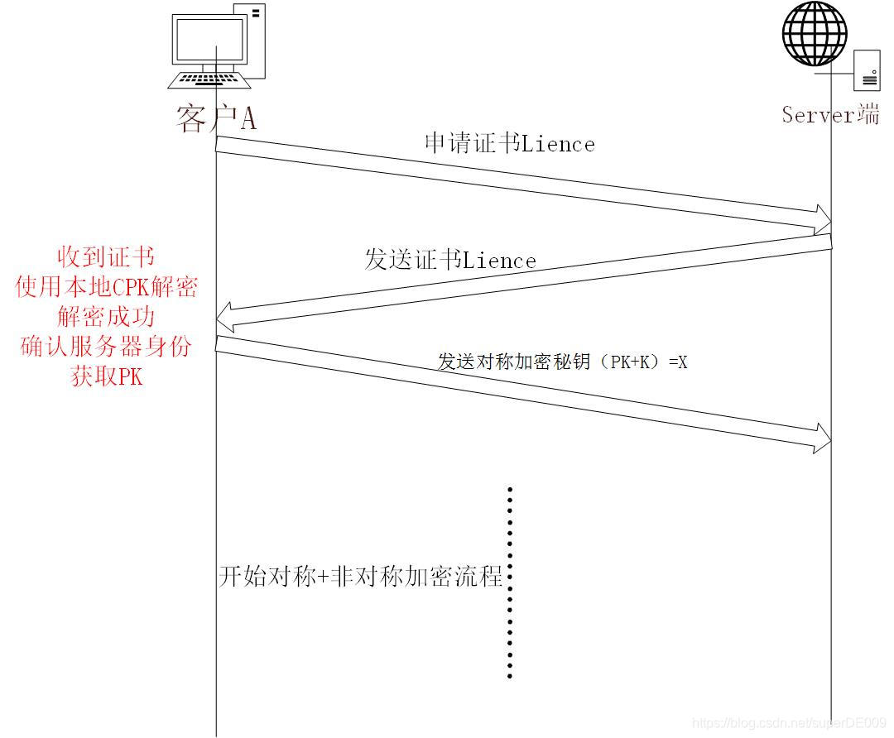
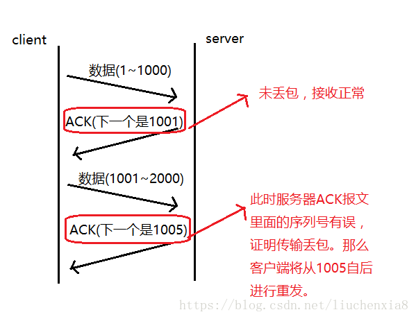

# 计算机网络
[toc]

# 1.Web 页面请求过程
## 1.1 DHCP 配置主机信息

- 假设主机最开始没有 IP 地址以及其它信息，那么就需要先使用 DHCP 来获取。

- 主机生成一个 DHCP 请求报文，并将这个报文放入具有目的端口 67 和源端口 68 的 UDP 报文段中。

- 该报文段则被放入在一个具有广播 IP 目的地址(255.255.255.255) 和源 IP 地址（0.0.0.0）的 IP 数据报中。

- 该数据报则被放置在 MAC 帧中，该帧具有目的地址 FF:FF:FF:FF:FF:FF，将广播到与交换机连接的所有设备。

- 连接在交换机的 DHCP 服务器收到广播帧之后，不断地向上分解得到 IP 数据报、UDP 报文段、DHCP 请求报文，之后生成 DHCP ACK 报文，该报文包含以下信息：IP 地址、DNS 服务器的 IP 地址、默认网关路由器的 IP 地址和子网掩码。该报文被放入 UDP 报文段中，UDP 报文段有被放入 IP 数据报中，最后放入 MAC 帧中。

- 该帧的目的地址是请求主机的 MAC 地址，因为交换机具有自学习能力，之前主机发送了广播帧之后就记录了 MAC 地址到其转发接口的交换表项，因此现在交换机就可以直接知道应该向哪个接口发送该帧。

- 主机收到该帧后，不断分解得到 DHCP 报文。之后就配置它的 IP 地址、子网掩码和 DNS 服务器的 IP 地址，并在其 IP 转发表中安装默认网关。

## 1.2 ARP 解析 MAC 地址

- 主机通过浏览器生成一个 TCP 套接字，套接字向 HTTP 服务器发送 HTTP 请求。为了生成该套接字，主机需要知道网站的域名对应的 IP 地址。

- 主机生成一个 DNS 查询报文，该报文具有 53 号端口，因为 DNS 服务器的端口号是 53。

- 该 DNS 查询报文被放入目的地址为 DNS 服务器 IP 地址的 IP 数据报中。

- 该 IP 数据报被放入一个以太网帧中，该帧将发送到网关路由器。

- DHCP 过程只知道网关路由器的 IP 地址，为了获取网关路由器的 MAC 地址，需要使用 ARP 协议。

- 主机生成一个包含目的地址为网关路由器 IP 地址的 ARP 查询报文，将该 ARP 查询报文放入一个具有广播目的地址（FF:FF:FF:FF:FF:FF）的以太网帧中，并向交换机发送该以太网帧，交换机将该帧转发给所有的连接设备，包括网关路由器。

- 网关路由器接收到该帧后，不断向上分解得到 ARP 报文，发现其中的 IP 地址与其接口的 IP 地址匹配，因此就发送一个 ARP 回答报文，包含了它的 MAC 地址，发回给主机。

## 1.3 DNS 解析域名

- 知道了网关路由器的 MAC 地址之后，就可以继续 DNS 的解析过程了。

- 网关路由器接收到包含 DNS 查询报文的以太网帧后，抽取出 IP 数据报，并根据转发表决定该 IP 数据报应该转发的路由器。

- 因为路由器具有内部网关协议（RIP、OSPF）和外部网关协议（BGP）这两种路由选择协议，因此路由表中已经配置了网关路由器到达 DNS 服务器的路由表项。

- 到达 DNS 服务器之后，DNS 服务器抽取出 DNS 查询报文，并在 DNS 数据库中查找待解析的域名。

- 找到 DNS 记录之后，发送 DNS 回答报文，将该回答报文放入 UDP 报文段中，然后放入 IP 数据报中，通过路由器反向转发回网关路由器，并经过以太网交换机到达主机。

## 1.4 HTTP 请求页面

- 有了 HTTP 服务器的 IP 地址之后，主机就能够生成 TCP 套接字，该套接字将用于向 Web 服务器发送 HTTP GET 报文。

- 在生成 TCP 套接字之前，必须先与 HTTP 服务器进行三次握手来建立连接。生成一个具有目的端口 80 的 TCP SYN 报文段，并向 HTTP 服务器发送该报文段。

- HTTP 服务器收到该报文段之后，生成 TCP SYN ACK 报文段，发回给主机。

>1. Client 首先发送一个连接试探，SYN = 1 表示这是一个连接请求或连接接受报文，同时表示这个数据报不能携带数据，seq = x 表示 Client 自己的初始序号（seq = 0 就代表这是第 0 号包），这时候 Client 进入 syn_sent 状态，表示客户端等待服务器的回复。
>2. Server 监听到连接请求报文后，如同意建立连接，则向 Client 发送确认。报文中的 SYN 和 ACK 都置 1 ，ACK = x + 1 表示期望收到对方下一个报文段的第一个数据字节序号是 x+1，同时表明 x 为止的所有数据都已正确收到（ACK = 1 其实是 ACK = 0 + 1，也就是期望客户端的第 1 个包），seq = y 表示 Server 自己的初始序号（seq = 0 就代表这是服务器这边发出的第 0 号包）。这时服务器进入 syn_rcvd，表示服务器已经收到 Client 的连接请求，等待确认。
>3. Client 收到确认后还需再次发送确认，**同时携带要发送给 Server 的数据**。ACK 置 1 表示确认号 ack= y + 1 有效（代表期望收到服务器的第 1 个包），Client自己的序号 seq= x + 1（表示这就是我的第1个包，相对于第0个包来说的），一旦收到Client的确认之后，这个TCP连接就进入 Established 状态，就可以发起请求了。

- 连接建立之后，浏览器生成 HTTP GET 报文，并交付给 HTTP 服务器。

- HTTP 服务器从 TCP 套接字读取 HTTP GET 报文，生成一个 HTTP 响应报文，将 Web 页面内容放入报文主体中，发回给主机。

- 浏览器收到 HTTP 响应报文后，抽取出 Web 页面内容，之后进行渲染，显示 Web 页面。


# 2.在浏览器输入url后回车，发生了哪些过程
## 2.1 解析URL
URL（Universal Resource Locator）：统一资源定位符。俗称网页地址或者网址。
URL用来表示某个资源的地址。（通过俗称就能看出来）
URL主要由以下几个部分组成：
a.传输协议   b.服务器   c.域名    d.端口    e.虚拟目录    f.文件名    g.锚    h.参数
也就是说，通常一个URL是像下面这样

连起来就是：http://www.aspxfans.com:8080/news/index.asp?boardID=5&ID=24618&page=1#name
上面的链接有几个要注意的地方：“;” 和“/”的使用，80端口默认不显示，“?” 到“#”之间跟着参数，多个参数使用“&”连接，“#”后面跟着锚。
现在来讨论URL解析，当在浏览器中输入URL后，浏览器首先对拿到的URL进行识别，抽取出域名字段。

## 2.2. DNS解析
在进行DNS解析时，会经历以下步骤：

查询浏览器缓存（浏览器会缓存之前拿到的DNS 2-30分钟时间），如果没有找到，

检查系统缓存，检查hosts文件，这个文件保存了一些以前访问过的网站的域名和IP的数据。它就像是一个本地的数据库。如果找到就可以直接获取目标主机的IP地址了。没有找到的话，需要

检查路由器缓存，路由器有自己的DNS缓存，可能就包括了这在查询的内容；如果没有，要

查询ISP DNS 缓存：ISP服务商DNS缓存（本地服务器缓存）那里可能有相关的内容，如果还不行的话，需要，

递归查询：从根域名服务器到顶级域名服务器再到极限域名服务器依次搜索哦对应目标域名的IP。

通过以上的查找，就可以获取到域名对应的IP了。接下来就是向该IP地址定位的HTTP服务器发起TCP连接。

## 2.3. 浏览器与网站建立TCP连接（三次握手）
第一次握手：客户端向服务器端发送请求（SYN=1） 等待服务器确认；

第二次握手：服务器收到请求并确认，回复一个指令（SYN=1，ACK=1）；

第三次握手：客户端收到服务器的回复指令并返回确认（ACK=1）。

通过三次握手，建立了客户端和服务器之间的连接，现在可以请求和传输数据了。
## 2.4.请求和传输数据
## 2.5.浏览器渲染页面
客户端拿到服务器端传输来的文件，找到HTML和MIME文件，通过MIME文件，浏览器知道要用页面渲染引擎来处理HTML文件。

+ ａ.浏览器会解析html源码，然后创建一个 DOM树。

在DOM树中，每一个HTML标签都有一个对应的节点，并且每一个文本也都会有一个对应的文本节点。

在遇到外部资源时（图片、音频、音频、JS、CSS等），浏览器就会去加载外部资源，加载完的资源会缓存起来。

JS和CSS，默认是同步加载。不过JS可以异步加载，图片、音频、视频等则是异步加载。

+ b.浏览器解析CSS代码，计算出最终的样式数据，形成css对象模型CSSOM。

首先会忽略非法的CSS代码，之后按照浏览器默认设置——用户设置——外链样式——内联样式——HTML中的style样式顺序进行渲染。

+ c.利用DOM和CSSOM构建一个渲染树（rendering tree）。
渲染树和DOM树有点像，但是是有区别的。

DOM树完全和html标签一一对应，但是渲染树会忽略掉不需要渲染的元素，比如head、display:none的元素等。

而且一大段文本中的每一个行在渲染树中都是独立的一个节点。
渲染树中的每一个节点都存储有对应的css属性。

+ ｄ.浏览器就根据渲染树直接把页面绘制到屏幕上。

# 3. 对称加密，非对称加密，CA认证
## 3.1 对称加密
对称加密是指服务器和客户端都使用相同的秘钥加密和解密数据，当用户和服务器建立加密连接时，用户会得到服务器唯一的数据加密的秘钥，所有的用户，包括服务器，都是使用这个唯一的秘钥加密自己的信息的。
如：客户A在使用秘钥K加密传输，被加密的密文被发送到服务器上后，服务器使用相同的秘钥K便可以解密A发送的密文。

在这里插入图片描述此时用户B也和服务器建立加密连接，这里用户B使用的秘钥也是K，也就是说用B的秘钥是可以解密A的加密信息的。
这就体现出了对称加密的一个巨大的漏洞：秘钥的唯一性
在对称加密算法中，所有的加密报文都可以被同一个开放的秘钥K加解密。
那么，当用户B在与服务器请求到秘钥K后，在通过对A的抓包后，便可使用秘钥K解密A的所有加密报文，从而获取A的隐私信息。
图解如下：

所以，对称加密由于秘钥K的唯一性，几乎等于明文传输，所以不可用。
## 3.2 非对称加密
因对称加密的不安全性不可用，所以有出现的新的加密方式：非对称加密。
首先，对称加密的两大缺点是，秘钥的唯一性和秘钥的公开性。但是在非对称加密中，这两个缺点都得到了较好的解决。
非对称加密，顾名思义，客户与服务器双方使用的加密的秘钥是不同的。在非对称加密中，原来唯一的秘钥K，被拆分为了两个不同的秘钥。分别为服务器的私钥SK，和客户机的公钥PK。
其中，公钥PK是公开给用户获取的，而私钥SK是一直保存在服务器端的，不向外开放的。
非对称的加密解密流程为：被私钥SK加密的报文只能被公钥PK解密，反之，被公钥PK加密的报文只能被私钥SK解密。
```txt
#私钥：SK
#公钥：PK
#客户机数据：A Data
#服务器数据：S Data
#客户加密报文：Y
#服务器加密报文：Y`
（A Data+PK）=Y
(Y+SK)=A Data
(S Data+SK)=Y`
(Y`+PK)=S Data

```
非对称加密流程图解：

以上，就是非对称加密的基本原理。
如此一来，每一个客户都只有公钥，黑客便无法获得用户发送的隐私信息了。但是黑客仍然有公钥，所以他仍然能够解密服务器发送的信息。所以非对称加密仍然是不太安全的。
## 3.3 对称+非对称加密
因为非对称机密仍然是不安全的，所以，人们结合了对称与非对称加密各自的优点，并由此创建了对称+非对称加密。
首先，我们来总结一下之前两种加密方式各自的优缺点：

- 对称加密：
客户与服务器双方使用相同的秘钥加密。
只要秘钥不被泄露，那么黑客就不能知道双方任何一方的信息。

- 非对称加密:
客户和服务器使用不同的秘钥进行加密。
黑客只能得知服务器发送的信息。

既然对称加密的秘钥不泄露，黑客就不能获取隐私信息。
非对称加密中，黑客又不能获取客户发送的信息。
那么如果我使用非对称加密来加密对称加密的秘钥，再使用对称加密，这样其他用户便不能得知我使用的秘钥了。
这便是对称+非对称加密的创立思想。接下来我们详细介绍其原理。
**客户端向服务器请求公钥，服务器下发，
客户端使用公钥加密自己对称加密的秘钥，发送给服务器，
服务器解析后，使用对称加密与客户机进行通讯。**
如此一来，黑客便不能得知客户机向服务器发送的秘钥，从而客户端和服务器端任何一方的信息黑都不能得知了。
```txt
#私钥：SK
#公钥：PK
#秘钥：K
#客户机数据：A Data
#服务器数据：S Data
#X：非对称加密后的K
#客户加密报文：Y
#服务器加密报文：Y`
（PK+K）=X
（SK+X）=K
(K+S Data)=Y`
(K+A Data)=Y
```

如上图
- 1. 服务器先下发公钥给客户端（黑客可以得知）
- 2. 客户端指定秘钥K，并用公钥PK加密后发送给服务器（黑客不能解密）
- 3. 服务器收到密文用私钥SK解密，使用K加密信息发送给客户端（黑客没有K所以不能得知）。
- 4. 客户端继续用K加密信息进行通信。（黑客不可得知）
如此一来，对称+非对称加密的加密方式已经可以保证用户的信息不会被其他用户解密了，无论是服务器的信息还是客户端的信息。
## 3.4 中间人攻击
虽然对称+非对称加密已经看似十分安全了，但是仍然存在漏洞。
试想一下，如果黑客在客户访问访问服务器之前，对客户进行DNS劫持，使得客户访问到黑客自己建立的伪装服务器，伪装服务器拥有自己的私钥公钥对，客户所申请到的公钥是伪装服务器的伪公钥（FPK），当客户端使用FKP与伪装服务器建立连接后，此时，黑客可以通过自己的伪公钥和伪私钥对客户端发送的所有加密报文进行解密。再通过使用客户端发送的信息去与真正的服务器进行通讯，并将服务器响应的信息通过自己的伪服务器返还给客户端。

如此一来，黑客可以通过自己的伪造服务器得知客户端的所有隐私信息，而客户端却无法察觉到黑客的存在，仍然认为自己在与真正的服务器进行通讯。
## 3.5 CA认证
既然对称+非对称加密也是不安全的，那么我们仍然需要一项新的技术来保证我们http通讯的安全。
首先，我们来分析一下中间人攻击所利用的漏洞：
客户端向服务器发起连接，服务器下发秘钥，进行连接。如此一来，客户端其实并不能判断自己是否是在与真正的服务器端进行连接。这也就给了黑客伪造服务器的机会。
那如果利用下发的公钥来判断服务器的身份的话，就可以确保自己在与真正的服务器进行连接了。
那么，我们该如何使公钥可以验证服务器的身份呢？
这里我们引入一个第三方验证机构，所有的公网服务器都要向这个第三方验证机构进行身份核实，然后第三方验证机构向他发送一个证书，证明这个服务器是真实的。
在真实环境中，这个所谓的第三方验证机构叫做CA证书机构（Certificate Authority），而服务器的身份是指服务器所使用的DNS域名。
CA提供一套非对称加密系统，所有希望被CA认证的服务器都要将自己的公钥发送给CA，当CA认证了服务器的身份（DNS域名）后，就就会用自己的私钥（CSK）来加密服务器的公钥PK，加密后的文件便是该服务器的证书（Lience），并返还给该服务器。
当客户端要与服务器通讯时，客户端先向服务器请求证书，收到证书后，由于证书是有CA证书颁发中心的私钥CSK加密的，所以需要公钥CPK解密，但是如果客户端向CA证书服务器请求的话，就又会被中间人攻击。所以，为了防止这种情况的发生，所有有效的CA证书颁发机构的公钥CPK都是被写死在操作系统中的，客户端不用想CA中心申请，直接使用本地操作系统内的CPK，这样就避免了被中间人攻击。
在解密证书（Lience）后，客户端得到了公钥PK，同时由于证书可以被信任的CPK解密，所以该服务器是可信任的，之后，便可和服务器进行通讯了。
图解：
CA证书申请


至此，CA证书验证系统的基础原理已经讲完了。
现在几乎所有的https加密协议都是使用CA证书的验证。

**证书中有什么**
    证书所有者的公钥
    证书所有者的专有名称
    证书颁发机构的专有名称
    证书的有效起始日期
    证书的过期日期
    证书数据格式的版本号
    序列号，这是证书颁发机构为该证书分配的唯一标识符

# 4.DNS 解析
## 4.1 DNS解析过程
1.在浏览器中输入www.qq.com域名，操作系统会先检查自己本地的hosts文件是否有这个网址映射关系，如果有，就先调用这个IP地址映射，完成域名解析。

2.如果hosts里没有这个域名的映射，则查找本地DNS解析器缓存，是否有这个网址映射关系，如果有，直接返回，完成域名解析。

3.如果hosts与本地DNS解析器缓存都没有相应的网址映射关系，首先会找TCP/IP参数中设置的首选DNS服务器，在此我们叫它本地DNS服务器，
此服务器收到查询时，如果要查询的域名，包含在本地配置区域资源中，则返回解析结果给客户机，完成域名解析，此解析具有权威性。

4.如果要查询的域名，不由本地DNS服务器区域解析，但该服务器已缓存了此网址映射关系，则调用这个IP地址映射，完成域名解析，此解析不具有权威性。

5.如果本地DNS服务器本地区域文件与缓存解析都失效，则根据本地DNS服务器的设置（是否设置转发器）进行查询，
如果未用转发模式，本地DNS就把请求发至 “根DNS服务器”，“根DNS服务器”收到请求后会判断这个域名(.com)是谁来授权管理，并会返回一个负责该顶级域名服务器的一个IP。
本地DNS服务器收到IP信息后，将会联系负责.com域的这台服务器。这台负责.com域的服务器收到请求后，如果自己无法解析，
它就会找一个管理.com域的下一级DNS服务器地址(qq.com)给本地DNS服务器。当本地DNS服务器收到这个地址后，就会找qq.com域服务器，重复上面的动作，进行查询，直至找到www.qq.com主机。

6.如果用的是转发模式，此DNS服务器就会把请求转发至上一级DNS服务器，由上一级服务器进行解析，上一级服务器如果不能解析，或找根DNS或把转请求转至上上级，以此循环。
不管是本地DNS服务器用是是转发，还是根提示，最后都是把结果返回给本地DNS服务器，由此DNS服务器再返回给客户机。

## 4.2 递归查询和迭代查询
+ **递归查询** ： 主机向本地域名服务器的查询一般都是采用递归查询
所谓递归查询就是：如果主机所询问的本地域名服务器不知道被查询的域名的IP地址，那么本地域名服务器就以DNS客户的身份，
向其它根域名服务器继续发出查询请求报文(即替主机继续查询)，而不是让主机自己进行下一步查询。
因此，递归查询返回的查询结果或者是所要查询的IP地址，或者是报错，表示无法查询到所需的IP地址。
+ **迭代查询**： 本地域名服务器向根域名服务器的查询的迭代查询。
迭代查询的特点：当根域名服务器收到本地域名服务器发出的迭代查询请求报文时，要么给出所要查询的IP地址，要么告诉本地服务器：“你下一步应当向哪一个域名服务器进行查询”。
然后让本地服务器进行后续的查询。根域名服务器通常是把自己知道的顶级域名服务器的IP地址告诉本地域名服务器，让本地域名服务器再向顶级域名服务器查询。
顶级域名服务器在收到本地域名服务器的查询请求后，要么给出所要查询的IP地址，要么告诉本地服务器下一步应当向哪一个权限域名服务器进行查询。
最后，知道了所要解析的IP地址或报错，然后把这个结果返回给发起查询的主机

**递归**：客户端只发一次请求，要求对方给出最终结果。

**迭代**：客户端发出一次请求，对方如果没有授权回答，它就会返回一个能解答这个查询的其它名称服务器列表，客户端会再向返回的列表中发出请求，直到找到最终负责所查域名的名称服务器，从它得到最终结果。

**授权回答**：向dns服务器查询一个域名，刚好这个域名是本服务器负责，返回的结果就是授权回答。

从递归和迭代查询可以看出：

客户端-本地dns服务端：这部分属于递归查询。
本地dns服务端---外网：这部分属于迭代查询。
递归查询时，返回的结果只有两种:查询成功或查询失败.
迭代查询，又称作重指引,返回的是最佳的查询点或者主机地址.

## 4.3 DNS 缓存机制原理
简单来说，一条域名的DNS记录会在本地有两种缓存：**浏览器缓存**和**操作系统(OS)缓存**。在浏览器中访问的时候，会优先访问浏览器缓存，如果未命中则访问OS缓存，最后再访问**DNS服务器**(一般是ISP提供)，然后DNS服务器会递归式的查找域名记录，然后返回。
DNS记录会有一个**ttl值**(time to live)，单位是秒，意思是这个记录最大有效期是多少。经过实验，OS缓存会参考ttl值，但是不完全等于ttl值，而浏览器DNS缓存的时间跟ttl值无关，**每种浏览器都使用一个固定值**。
Windows访问DNS后会把记录保存一段短暂的时间，可通过ipconfig /displaydns 查看windows的DNS缓存、通过ipconfig /flushdns来清除。


# 5. TCP与UDP区别
1、TCP面向连接（如打电话要先拨号建立连接）;UDP是无连接的，即发送数据之前不需要建立连接
2、TCP提供可靠的服务。也就是说，通过TCP连接传送的数据，无差错，不丢失，不重复，且按序到达;UDP尽最大努力交付，即不保证可靠交付
3、TCP面向字节流，实际上是TCP把数据看成一连串无结构的字节流;UDP是面向报文的
  UDP没有拥塞控制，因此网络出现拥塞不会使源主机的发送速率降低（对实时应用很有用，如IP电话，实时视频会议等）
4、每一条TCP连接只能是点到点的;UDP支持一对一，一对多，多对一和多对多的交互通信
5、TCP首部开销20字节;UDP的首部开销小，只有8个字节
6、TCP的逻辑通信信道是全双工的可靠信道，UDP则是不可靠信道

## 5.1 TCP如何保证可靠传输
TCP协议保证数据传输可靠性的方式主要有：
校验和
序列号
确认应答
超时重传
连接管理(三次握手与四次挥手)
流量控制
拥塞控制
### 校验和
计算方式：在数据传输的过程中，将发送的数据段都当做一个16位的整数。将这些整数加起来。并且前面的进位不能丢弃，补在后面，最后取反，得到校验和。
发送方：在发送数据之前计算检验和，并进行校验和的填充。
接收方：收到数据后，对数据以同样的方式进行计算，求出校验和，与发送方的进行比对。

注意：如果接收方比对校验和与发送方不一致，那么数据一定传输有误。但是如果接收方比对校验和与发送方一致，**数据不一定传输成功**。
### 确认应答与序列号
序列号：TCP传输时将每个字节的数据都进行了编号，这就是序列号。
确认应答：TCP传输的过程中，每次接收方收到数据后，都会对传输方进行确认应答。也就是发送ACK报文。这个ACK报文当中带有对应的确认序列号，告诉发送方，接收到了哪些数据，下一次的数据从哪里发。

序列号的作用不仅仅是应答的作用，有了序列号能够将接收到的数据根据序列号排序，并且去掉重复序列号的数据。这也是TCP传输可靠性的保证之一。
### 超时重传
在进行TCP传输时，由于确认应答与序列号机制，也就是说发送方发送一部分数据后，都会等待接收方发送的ACK报文，并解析ACK报文，判断数据是否传输成功。如果发送方发送完数据后，迟迟没有等到接收方的ACK报文，这该怎么办呢？而没有收到ACK报文的原因可能是什么呢？

首先，发送方没有介绍到响应的ACK报文原因可能有两点：

+ 数据在传输过程中由于网络原因等直接全体丢包，接收方根本没有接收到。
+ 接收方接收到了响应的数据，但是发送的ACK报文响应却由于网络原因丢包了。
TCP在解决这个问题的时候引入了一个新的机制，叫做超时重传机制。简单理解就是发送方在发送完数据后等待一个时间，时间到达没有接收到ACK报文，那么对刚才发送的数据进行重新发送。如果是刚才第一个原因，接收方收到二次重发的数据后，便进行ACK应答。如果是第二个原因，接收方发现接收的数据已存在（判断存在的根据就是序列号，所以上面说序列号还有去除重复数据的作用），那么直接丢弃，仍旧发送ACK应答。

那么发送方发送完毕后等待的时间是多少呢？如果这个等待的时间过长，那么会影响TCP传输的整体效率，如果等待时间过短，又会导致频繁的发送重复的包。如何权衡？

由于TCP传输时保证能够在任何环境下都有一个高性能的通信，因此这个最大超时时间（也就是等待的时间）是动态计算的。

> 在Linux中（BSD Unix和Windows下也是这样）超时以500ms为一个单位进行控制，每次判定超时重发的超时时间都是500ms的整数倍。重发一次后，仍未响应，那么等待2*500ms的时间后，再次重传。等待4*500ms的时间继续重传。以一个指数的形式增长。累计到一定的重传次数，TCP就认为网络或者对端出现异常，强制关闭连接。

### 连接管理
连接管理就是三次握手与四次挥手的过程，在前面详细讲过这个过程，这里不再赘述。保证可靠的连接，是保证可靠性的前提。
### 流量控制
接收端在接收到数据后，对其进行处理。如果发送端的发送速度太快，导致接收端的结束缓冲区很快的填充满了。此时如果发送端仍旧发送数据，那么接下来发送的数据都会丢包，继而导致丢包的一系列连锁反应，超时重传呀什么的。而**TCP根据接收端对数据的处理能力，决定发送端的发送速度，这个机制就是流量控制**。

在TCP协议的报头信息当中，有一个16位字段的窗口大小。在介绍这个窗口大小时我们知道，窗口大小的内容实际上是接收端接收数据缓冲区的剩余大小。这个数字越大，证明接收端接收缓冲区的剩余空间越大，网络的吞吐量越大。接收端会在确认应答发送ACK报文时，将自己的即时窗口大小填入，并跟随ACK报文一起发送过去。而发送方根据ACK报文里的窗口大小的值的改变进而改变自己的发送速度。如果接收到窗口大小的值为0，那么发送方将停止发送数据。并定期的向接收端发送窗口探测数据段，让接收端把窗口大小告诉发送端。

注：16位的窗口大小最大能表示65535个字节（64K），但是TCP的窗口大小最大并不是64K。在TCP首部中40个字节的选项中还包含了一个窗口扩大因子M，实际的窗口大小就是16为窗口字段的值左移M位。每移一位，扩大两倍。
### 拥塞控制
TCP传输的过程中，发送端开始发送数据的时候，如果刚开始就发送大量的数据，那么就可能造成一些问题。网络可能在开始的时候就很拥堵，如果给网络中在扔出大量数据，那么这个拥堵就会加剧。拥堵的加剧就会产生大量的丢包，就对大量的超时重传，严重影响传输。

所以TCP引入了慢启动的机制，在开始发送数据时，先发送少量的数据探路。探清当前的网络状态如何，再决定多大的速度进行传输。这时候就引入一个叫做拥塞窗口的概念。发送刚开始定义拥塞窗口为 1，每次收到ACK应答，拥塞窗口加 1。在发送数据之前，首先将拥塞窗口与接收端反馈的窗口大小比对，取较小的值作为实际发送的窗口。

拥塞窗口的增长是指数级别的。慢启动的机制只是说明在开始的时候发送的少，发送的慢，但是增长的速度是非常快的。为了控制拥塞窗口的增长，不能使拥塞窗口单纯的加倍，设置一个拥塞窗口的阈值，当拥塞窗口大小超过阈值时，不能再按照指数来增长，而是线性的增长。在慢启动开始的时候，慢启动的阈值等于窗口的最大值，一旦造成网络拥塞，发生超时重传时，慢启动的阈值会为原来的一半（这里的原来指的是发生网络拥塞时拥塞窗口的大小），同时拥塞窗口重置为 1。

拥塞控制是TCP在传输时尽可能快的将数据传输，并且避免拥塞造成的一系列问题。是可靠性的保证，同时也是维护了传输的高效性。
## 5.2 TCP为什么要使用三次握手而不是两次握手
防止已失效的连接请求又传送到服务器端，因而产生错误
不幸的是， 这种解释是不准确的， TCP 采用三次握手的原因其实非常简单， 远没有大部分博客所描述的那样云山雾绕。
这里先给出结论：
1. 为了实现可靠数据传输， TCP 协议的通信双方， 都必须维护一个序列号， 以标识发送出去的数据包中， 哪些是已经被对方收到的。 三次握手的过程即是通信双方相互告知序列号起始值， 并确认对方已经收到了序列号起始值的必经步骤
2. 如果只是两次握手， 至多只有连接发起方的起始序列号能被确认， 另一方选择的序列号则得不到确认


## 5.3 TCP的序号机制有什么用处
为了实现可靠传输，发送方和接收方始终需要同步( SYNchronize )序号。 需要注意的是， 序号并不是从 0 开始的， 而是由发送方随机选择的初始序列号 ( Initial Sequence Number, ISN )开始 。 由于 TCP 是一个双向通信协议， 通信双方都有能力发送信息， 并接收响应。 因此， 通信双方都需要随机产生一个初始的序列号， 并且把这个起始值告诉对方。
+ 序列号（32位）
    用于标识每个报文段，使目的主机可确认已收到指定报文段中的数据。当源主机用于多个报文段发送一个报文时，即使这些报文到达目的主机的顺序不一样，序列号也可以使目的主机按顺序排列它们。
+ 确认号（32位）
    目的主机返回确认号，使源主机知道某个或几个报文段已被接收。如果ACK控制位被设置为1，则该字段有效。确认号等于顺序接收到的最后一个报文段的序号加1，这也是目的主机希望下次接收的报文段的序号值。返回确认号后，计算机认为已接收到小于该确认号的所有数据。
## 5.4 TCP中的time_wait
TIME_WAIT是TCP主动关闭连接一方的一个状态，TCP断开连接的时序图如下：

当主动断开连接的一方（Initiator）发送FIN包给对方，且对方回复了ACK+FIN，然后Initiator回复了ACK后就进入TIME_WAIT状态，一直将持续**2MSL后进入CLOSED状态**。
那么，我们来看如果Initiator不进入TIME_WAIT状态而是直接进入CLOSED状态会有什么问题？
**MSL**
    MSL是Maximum Segment Lifetime英文的缩写，中文可以译为**“报文最大生存时间”**
考虑这种情况，服务器运行在80端口，客户端使用的连接端口是12306，数据传输完毕后服务端主动关闭连接，但是没有进入TIME_WAIT，而是直接计入CLOSED了。这时，客户端又通过同样的端口12306与服务端建立了一个新的连接。假如上一个连接过程中网络出现了异常，导致了某个包重传并延时到达了服务端，这时服务端就无法区分这个包是上一个连接的还是这个连接的。所以，**主动关闭连接一方要等待2MSL，然后才能CLOSE，保证连接中的IP包都要么传输完成，要么被丢弃了。**
**为何一定要等2MSL？如果不等，释放的端口可能会重连刚断开的服务器端口，这样依然存活在网络里的老的TCP报文可能与新TCP连接报文冲突，造成数据冲突，为避免此种情况，需要耐心等待网络老的TCP连接的活跃报文全部死翘翘，2MSL时间可以满足这个需求（尽管非常保守）**
**TTL**
    而ip头中有一个TTL域，**TTL是time to live的缩写**，中文可以译为**“生存时间”**，这个生存时间是由源主机设置初始值但不是存的具体时间，而是存储了一个ip数据报可以经过的最大路由数，每经过一个处理他的路由器此值就减1，当此值为0则数据报将被丢弃，同时发送ICMP报文通知源主机。RFC 793中规定MSL为2分钟，实际应用中常用的是30秒，1分钟和2分钟等。
**等待2MSL时间的目的**
    等待2MSL时间主要目的是**怕最后一个ACK包对方没收到**，那么对方在超时后将重发第三次握手的FIN包，主动关闭端接到重发的FIN包后可以再发一个ACK应答包。在TIME_WAIT状态时两端的端口不能使用，要等到2MSL时间结束才可继续使用。当连接处于2MSL等待阶段时任何迟到的报文段都将被丢弃。不过在实际应用中可以通过设置SO_REUSEADDR选项达到不必等待2MSL时间结束再使用此端口。