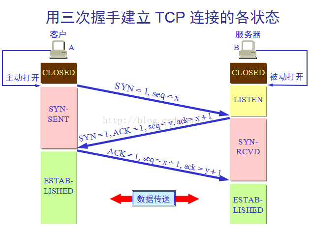

# 计算机网络
[toc]

## 1.Web 页面请求过程

### 1.1 DHCP 配置主机信息

- 假设主机最开始没有 IP 地址以及其它信息，那么就需要先使用 DHCP 来获取。

- 主机生成一个 DHCP 请求报文，并将这个报文放入具有目的端口 67 和源端口 68 的 UDP 报文段中。

- 该报文段则被放入在一个具有广播 IP 目的地址(255.255.255.255) 和源 IP 地址（0.0.0.0）的 IP 数据报中。

- 该数据报则被放置在 MAC 帧中，该帧具有目的地址 FF:\<zero-width space\>FF:\<zero-width space\>FF:\<zero-width space\>FF:\<zero-width space\>FF:FF，将广播到与交换机连接的所有设备。

- 连接在交换机的 DHCP 服务器收到广播帧之后，不断地向上分解得到 IP 数据报、UDP 报文段、DHCP 请求报文，之后生成 DHCP ACK 报文，该报文包含以下信息：IP 地址、DNS 服务器的 IP 地址、默认网关路由器的 IP 地址和子网掩码。该报文被放入 UDP 报文段中，UDP 报文段有被放入 IP 数据报中，最后放入 MAC 帧中。

- 该帧的目的地址是请求主机的 MAC 地址，因为交换机具有自学习能力，之前主机发送了广播帧之后就记录了 MAC 地址到其转发接口的交换表项，因此现在交换机就可以直接知道应该向哪个接口发送该帧。

- 主机收到该帧后，不断分解得到 DHCP 报文。之后就配置它的 IP 地址、子网掩码和 DNS 服务器的 IP 地址，并在其 IP 转发表中安装默认网关。

### 1.2 ARP 解析 MAC 地址

- 主机通过浏览器生成一个 TCP 套接字，套接字向 HTTP 服务器发送 HTTP 请求。为了生成该套接字，主机需要知道网站的域名对应的 IP 地址。

- 主机生成一个 DNS 查询报文，该报文具有 53 号端口，因为 DNS 服务器的端口号是 53。

- 该 DNS 查询报文被放入目的地址为 DNS 服务器 IP 地址的 IP 数据报中。

- 该 IP 数据报被放入一个以太网帧中，该帧将发送到网关路由器。

- DHCP 过程只知道网关路由器的 IP 地址，为了获取网关路由器的 MAC 地址，需要使用 ARP 协议。

- 主机生成一个包含目的地址为网关路由器 IP 地址的 ARP 查询报文，将该 ARP 查询报文放入一个具有广播目的地址（FF:\<zero-width space\>FF:\<zero-width space\>FF:\<zero-width space\>FF:\<zero-width space\>FF:FF）的以太网帧中，并向交换机发送该以太网帧，交换机将该帧转发给所有的连接设备，包括网关路由器。

- 网关路由器接收到该帧后，不断向上分解得到 ARP 报文，发现其中的 IP 地址与其接口的 IP 地址匹配，因此就发送一个 ARP 回答报文，包含了它的 MAC 地址，发回给主机。

### 1.3 DNS 解析域名

- 知道了网关路由器的 MAC 地址之后，就可以继续 DNS 的解析过程了。

- 网关路由器接收到包含 DNS 查询报文的以太网帧后，抽取出 IP 数据报，并根据转发表决定该 IP 数据报应该转发的路由器。

- 因为路由器具有内部网关协议（RIP、OSPF）和外部网关协议（BGP）这两种路由选择协议，因此路由表中已经配置了网关路由器到达 DNS 服务器的路由表项。

- 到达 DNS 服务器之后，DNS 服务器抽取出 DNS 查询报文，并在 DNS 数据库中查找待解析的域名。

- 找到 DNS 记录之后，发送 DNS 回答报文，将该回答报文放入 UDP 报文段中，然后放入 IP 数据报中，通过路由器反向转发回网关路由器，并经过以太网交换机到达主机。

### 1.4 HTTP 请求页面

- 有了 HTTP 服务器的 IP 地址之后，主机就能够生成 TCP 套接字，该套接字将用于向 Web 服务器发送 HTTP GET 报文。

- 在生成 TCP 套接字之前，必须先与 HTTP 服务器进行三次握手来建立连接。生成一个具有目的端口 80 的 TCP SYN 报文段，并向 HTTP 服务器发送该报文段。

- HTTP 服务器收到该报文段之后，生成 TCP SYN ACK 报文段，发回给主机。

- 连接建立之后，浏览器生成 HTTP GET 报文，并交付给 HTTP 服务器。

- HTTP 服务器从 TCP 套接字读取 HTTP GET 报文，生成一个 HTTP 响应报文，将 Web 页面内容放入报文主体中，发回给主机。

- 浏览器收到 HTTP 响应报文后，抽取出 Web 页面内容，之后进行渲染，显示 Web 页面。


## 2.在浏览器输入url后回车，发生了哪些过程
### 2.1 解析URL
URL（Universal Resource Locator）：统一资源定位符。俗称网页地址或者网址。
URL用来表示某个资源的地址。（通过俗称就能看出来）
URL主要由以下几个部分组成：
a.传输协议   b.服务器   c.域名    d.端口    e.虚拟目录    f.文件名    g.锚    h.参数
也就是说，通常一个URL是像下面这样

连起来就是：http://www.aspxfans.com:8080/news/index.asp?boardID=5&ID=24618&page=1#name
上面的链接有几个要注意的地方：“;” 和“/”的使用，80端口默认不显示，“?” 到“#”之间跟着参数，多个参数使用“&”连接，“#”后面跟着锚。
现在来讨论URL解析，当在浏览器中输入URL后，浏览器首先对拿到的URL进行识别，抽取出域名字段。

### 2.2. DNS解析
在进行DNS解析时，会经历以下步骤：

查询浏览器缓存（浏览器会缓存之前拿到的DNS 2-30分钟时间），如果没有找到，

检查系统缓存，检查hosts文件，这个文件保存了一些以前访问过的网站的域名和IP的数据。它就像是一个本地的数据库。如果找到就可以直接获取目标主机的IP地址了。没有找到的话，需要

检查路由器缓存，路由器有自己的DNS缓存，可能就包括了这在查询的内容；如果没有，要

查询ISP DNS 缓存：ISP服务商DNS缓存（本地服务器缓存）那里可能有相关的内容，如果还不行的话，需要，

递归查询：从根域名服务器到顶级域名服务器再到极限域名服务器依次搜索哦对应目标域名的IP。

通过以上的查找，就可以获取到域名对应的IP了。接下来就是向该IP地址定位的HTTP服务器发起TCP连接。

### 2.3. 浏览器与网站建立TCP连接（三次握手）
第一次握手：客户端向服务器端发送请求（SYN=1） 等待服务器确认；

第二次握手：服务器收到请求并确认，回复一个指令（SYN=1，ACK=1）；

第三次握手：客户端收到服务器的回复指令并返回确认（ACK=1）。

通过三次握手，建立了客户端和服务器之间的连接，现在可以请求和传输数据了。
### 2.4.请求和传输数据
### 2.5.浏览器渲染页面
客户端拿到服务器端传输来的文件，找到HTML和MIME文件，通过MIME文件，浏览器知道要用页面渲染引擎来处理HTML文件。

+ ａ.浏览器会解析html源码，然后创建一个 DOM树。

在DOM树中，每一个HTML标签都有一个对应的节点，并且每一个文本也都会有一个对应的文本节点。

在遇到外部资源时（图片、音频、音频、JS、CSS等），浏览器就会去加载外部资源，加载完的资源会缓存起来。

JS和CSS，默认是同步加载。不过JS可以异步加载，图片、音频、视频等则是异步加载。

+ b.浏览器解析CSS代码，计算出最终的样式数据，形成css对象模型CSSOM。

首先会忽略非法的CSS代码，之后按照浏览器默认设置——用户设置——外链样式——内联样式——HTML中的style样式顺序进行渲染。

+ c.利用DOM和CSSOM构建一个渲染树（rendering tree）。
渲染树和DOM树有点像，但是是有区别的。

DOM树完全和html标签一一对应，但是渲染树会忽略掉不需要渲染的元素，比如head、display:none的元素等。

而且一大段文本中的每一个行在渲染树中都是独立的一个节点。
渲染树中的每一个节点都存储有对应的css属性。

+ ｄ.浏览器就根据渲染树直接把页面绘制到屏幕上。

## 3. 对称加密，非对称加密，CA认证
### 3.1 对称加密
对称加密是指服务器和客户端都使用相同的秘钥加密和解密数据，当用户和服务器建立加密连接时，用户会得到服务器唯一的数据加密的秘钥，所有的用户，包括服务器，都是使用这个唯一的秘钥加密自己的信息的。
如：客户A在使用秘钥K加密传输，被加密的密文被发送到服务器上后，服务器使用相同的秘钥K便可以解密A发送的密文。

在这里插入图片描述此时用户B也和服务器建立加密连接，这里用户B使用的秘钥也是K，也就是说用B的秘钥是可以解密A的加密信息的。
这就体现出了对称加密的一个巨大的漏洞：秘钥的唯一性
在对称加密算法中，所有的加密报文都可以被同一个开放的秘钥K加解密。
那么，当用户B在与服务器请求到秘钥K后，在通过对A的抓包后，便可使用秘钥K解密A的所有加密报文，从而获取A的隐私信息。
图解如下：

所以，对称加密由于秘钥K的唯一性，几乎等于明文传输，所以不可用。
### 3.2 非对称加密
因对称加密的不安全性不可用，所以有出现的新的加密方式：非对称加密。
首先，对称加密的两大缺点是，秘钥的唯一性和秘钥的公开性。但是在非对称加密中，这两个缺点都得到了较好的解决。
非对称加密，顾名思义，客户与服务器双方使用的加密的秘钥是不同的。在非对称加密中，原来唯一的秘钥K，被拆分为了两个不同的秘钥。分别为服务器的私钥SK，和客户机的公钥PK。
其中，公钥PK是公开给用户获取的，而私钥SK是一直保存在服务器端的，不向外开放的。
非对称的加密解密流程为：被私钥SK加密的报文只能被公钥PK解密，反之，被公钥PK加密的报文只能被私钥SK解密。
```txt
#私钥：SK
#公钥：PK
#客户机数据：A Data
#服务器数据：S Data
#客户加密报文：Y
#服务器加密报文：Y`
（A Data+PK）=Y
(Y+SK)=A Data
(S Data+SK)=Y`
(Y`+PK)=S Data

```
非对称加密流程图解：

以上，就是非对称加密的基本原理。
如此一来，每一个客户都只有公钥，黑客便无法获得用户发送的隐私信息了。但是黑客仍然有公钥，所以他仍然能够解密服务器发送的信息。所以非对称加密仍然是不太安全的。
### 3.3 对称+非对称加密
因为非对称机密仍然是不安全的，所以，人们结合了对称与非对称加密各自的优点，并由此创建了对称+非对称加密。
首先，我们来总结一下之前两种加密方式各自的优缺点：

- 对称加密：
客户与服务器双方使用相同的秘钥加密。
只要秘钥不被泄露，那么黑客就不能知道双方任何一方的信息。

- 非对称加密:
客户和服务器使用不同的秘钥进行加密。
黑客只能得知服务器发送的信息。

既然对称加密的秘钥不泄露，黑客就不能获取隐私信息。
非对称加密中，黑客又不能获取客户发送的信息。
那么如果我使用非对称加密来加密对称加密的秘钥，再使用对称加密，这样其他用户便不能得知我使用的秘钥了。
这便是对称+非对称加密的创立思想。接下来我们详细介绍其原理。
**客户端向服务器请求公钥，服务器下发，
客户端使用公钥加密自己对称加密的秘钥，发送给服务器，
服务器解析后，使用对称加密与客户机进行通讯。**
如此一来，黑客便不能得知客户机向服务器发送的秘钥，从而客户端和服务器端任何一方的信息黑都不能得知了。
```txt
#私钥：SK
#公钥：PK
#秘钥：K
#客户机数据：A Data
#服务器数据：S Data
#X：非对称加密后的K
#客户加密报文：Y
#服务器加密报文：Y`
（PK+K）=X
（SK+X）=K
(K+S Data)=Y`
(K+A Data)=Y
```

如上图
- 1. 服务器先下发公钥给客户端（黑客可以得知）
- 2. 客户端指定秘钥K，并用公钥PK加密后发送给服务器（黑客不能解密）
- 3. 服务器收到密文用私钥SK解密，使用K加密信息发送给客户端（黑客没有K所以不能得知）。
- 4. 客户端继续用K加密信息进行通信。（黑客不可得知）
如此一来，对称+非对称加密的加密方式已经可以保证用户的信息不会被其他用户解密了，无论是服务器的信息还是客户端的信息。
### 3.4 中间人攻击
虽然对称+非对称加密已经看似十分安全了，但是仍然存在漏洞。
试想一下，如果黑客在客户访问访问服务器之前，对客户进行DNS劫持，使得客户访问到黑客自己建立的伪装服务器，伪装服务器拥有自己的私钥公钥对，客户所申请到的公钥是伪装服务器的伪公钥（FPK），当客户端使用FKP与伪装服务器建立连接后，此时，黑客可以通过自己的伪公钥和伪私钥对客户端发送的所有加密报文进行解密。再通过使用客户端发送的信息去与真正的服务器进行通讯，并将服务器响应的信息通过自己的伪服务器返还给客户端。

如此一来，黑客可以通过自己的伪造服务器得知客户端的所有隐私信息，而客户端却无法察觉到黑客的存在，仍然认为自己在与真正的服务器进行通讯。
### 3.5 CA认证
既然对称+非对称加密也是不安全的，那么我们仍然需要一项新的技术来保证我们http通讯的安全。
首先，我们来分析一下中间人攻击所利用的漏洞：
客户端向服务器发起连接，服务器下发秘钥，进行连接。如此一来，客户端其实并不能判断自己是否是在与真正的服务器端进行连接。这也就给了黑客伪造服务器的机会。
那如果利用下发的公钥来判断服务器的身份的话，就可以确保自己在与真正的服务器进行连接了。
那么，我们该如何使公钥可以验证服务器的身份呢？
这里我们引入一个第三方验证机构，所有的公网服务器都要向这个第三方验证机构进行身份核实，然后第三方验证机构向他发送一个证书，证明这个服务器是真实的。
在真实环境中，这个所谓的第三方验证机构叫做CA证书机构（Certificate Authority），而服务器的身份是指服务器所使用的DNS域名。
CA提供一套非对称加密系统，所有希望被CA认证的服务器都要将自己的公钥发送给CA，当CA认证了服务器的身份（DNS域名）后，就就会用自己的私钥（CSK）来加密服务器的公钥PK，加密后的文件便是该服务器的证书（Lience），并返还给该服务器。
当客户端要与服务器通讯时，客户端先向服务器请求证书，收到证书后，由于证书是有CA证书颁发中心的私钥CSK加密的，所以需要公钥CPK解密，但是如果客户端向CA证书服务器请求的话，就又会被中间人攻击。所以，为了防止这种情况的发生，所有有效的CA证书颁发机构的公钥CPK都是被写死在操作系统中的，客户端不用想CA中心申请，直接使用本地操作系统内的CPK，这样就避免了被中间人攻击。
在解密证书（Lience）后，客户端得到了公钥PK，同时由于证书可以被信任的CPK解密，所以该服务器是可信任的，之后，便可和服务器进行通讯了。
图解：
CA证书申请


至此，CA证书验证系统的基础原理已经讲完了。
现在几乎所有的https加密协议都是使用CA证书的验证。