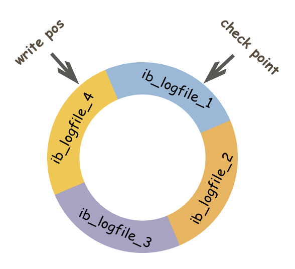
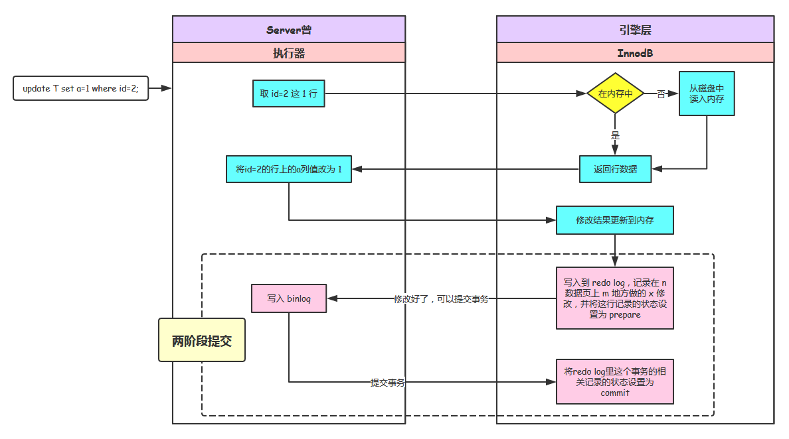
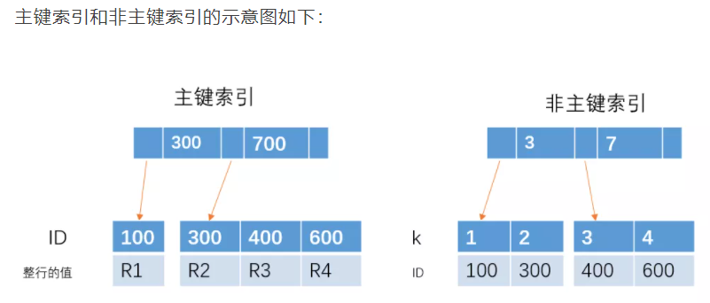

# 数据库
[toc]

# 1. MySQL 语句
## 1.1 获取时间函数
选取日期时间的各个部分：日期、时间、年、季度、月、日、小时、分钟、秒、微秒（注意写法  大小写和在SQL语句内自动加引号问题引号要去除）
```sql
选取日期时间的各个部分：日期、时间、年、季度、月、日、小时、分钟、秒、微秒

set @dt = '2008-09-10 07:15:30.123456';

select date(@dt); -- 2008-09-10
select time(@dt); -- 07:15:30.123456
select year(@dt); -- 2008
select quarter(@dt); -- 3
select month(@dt); -- 9
select week(@dt); -- 36
select day(@dt); -- 10
select hour(@dt); -- 7
select minute(@dt); -- 15
select second(@dt); -- 30
select microsecond(@dt); -- 123456 
```

# 2.问题
## 2.1 MySQL默认引擎是哪个
mysql-5.1版本之前默认引擎是MyISAM，之后是innoDB
## 2.2 MyISAM和InnoDB区别
MyISAM是MySQL的默认数据库引擎（5.5版之前）。虽然性能极佳，而且提供了大量的特性，包括全文索引、压缩、空间函数等，但MyISAM不支持事务和行级锁，而且最大的缺陷就是崩溃后无法安全恢复。不过，5.5版本之后，MySQL引入了InnoDB（事务性数据库引擎），MySQL 5.5版本后默认的存储引擎为InnoDB。

大多数时候我们使用的都是 InnoDB 存储引擎，但是在某些情况下使用 MyISAM 也是合适的比如读密集的情况下。（如果你不介意 MyISAM 崩溃恢复问题的话）。

**两者的对比：**

1. **是否支持行级锁** : MyISAM 只有表级锁(table-level locking)，而InnoDB 支持行级锁(row-level locking)和表级锁,默认为行级锁。
2. **是否支持事务和崩溃后的安全恢复： MyISAM** 强调的是性能，每次查询具有原子性,其执行速度比InnoDB类型更快，但是不提供事务支持。但是**InnoDB** 提供事务支持，外部键等高级数据库功能。 具有事务(commit)、回滚(rollback)和崩溃修复能力(crash recovery capabilities)的事务安全(transaction-safe (ACID compliant))型表。
3. **是否支持外键：** MyISAM不支持，而InnoDB支持。
4. **是否支持MVCC** ：仅 InnoDB 支持。应对高并发事务, MVCC比单纯的加锁更高效;MVCC只在 `READ COMMITTED` 和 `REPEATABLE READ` 两个隔离级别下工作;MVCC可以使用 乐观(optimistic)锁 和 悲观(pessimistic)锁来实现;各数据库中MVCC实现并不统一。推荐阅读：[MySQL-InnoDB-MVCC多版本并发控制](https://segmentfault.com/a/1190000012650596)
5. ......

《MySQL高性能》上面有一句话这样写到:

> 不要轻易相信“MyISAM比InnoDB快”之类的经验之谈，这个结论往往不是绝对的。在很多我们已知场景中，InnoDB的速度都可以让MyISAM望尘莫及，尤其是用到了聚簇索引，或者需要访问的数据都可以放入内存的应用。

一般情况下我们选择 InnoDB 都是没有问题的，但是某些情况下你并不在乎可扩展能力和并发能力，也不需要事务支持，也不在乎崩溃后的安全恢复问题的话，选择MyISAM也是一个不错的选择。但是一般情况下，我们都是需要考虑到这些问题的。

## 2.3.ACID
1. 原子性（Atomicity）：事务开始后所有操作，要么全部做完，要么全部不做，不可能停滞在中间环节。事务执行过程中出错，会回滚到事务开始前的状态，所有的操作就像没有发生一样。也就是说事务是一个不可分割的整体，就像化学中学过的原子，是物质构成的基本单位。
2. 一致性（Consistency）：事务开始前和结束后，数据库的完整性约束没有被破坏 。比如A向B转账，不可能A扣了钱，B却没收到。
3. 隔离性（Isolation）：同一时间，只允许一个事务请求同一数据，不同的事务之间彼此没有任何干扰。比如A正在从一张银行卡中取钱，在A取钱的过程结束前，B不能向这张卡转账。
4. 持久性（Durability）：事务完成后，事务对数据库的所有更新将被保存到数据库，不能回滚。

## 2.4 Mysql的四种隔离级别

SQL标准定义了4类隔离级别，包括了一些具体规则，用来限定事务内外的哪些改变是可见的，哪些是不可见的。低级别的隔离级一般支持更高的并发处理，并拥有更低的系统开销。

**Read Uncommitted（读取未提交数据）**

在该隔离级别，所有事务都可以看到其他未提交事务的执行结果。本隔离级别很少用于实际应用，因为它的性能也不比其他级别好多少。读取未提交的数据，也被称之为脏读（Dirty Read）。

**Read Committed（读取已提交数据）**

这是大多数数据库系统的默认隔离级别（但不是MySQL默认的）。它满足了隔离的简单定义：一个事务只能看见已经提交事务所做的改变。这种隔离级别 也支持所谓的不可重复读（Nonrepeatable Read），因为同一事务的其他实例在该实例处理其间可能会有新的commit，所以同一select可能返回不同结果。

**Repeatable Read（可重复读）**

这是MySQL的默认事务隔离级别，它确保同一事务的多个实例在并发读取数据时，会看到同样的数据行。不过理论上，这会导致另一个棘手的问题：幻读 （Phantom Read）。简单的说，幻读指当用户读取某一范围的数据行时，另一个事务又在该范围内插入了新行，当用户再读取该范围的数据行时，会发现有新的“幻影” 行。InnoDB和Falcon存储引擎通过多版本并发控制（MVCC，Multiversion Concurrency Control）机制解决了该问题。

**Serializable（可串行化、可序列化）**
这是最高的隔离级别，它通过强制事务排序，使之不可能相互冲突，从而解决幻读问题。简言之，它是在每个读的数据行上加上共享锁。在这个级别，可能导致大量的超时现象和锁竞争。

| 类别               | 解释                                                         |
| ------------------ | ------------------------------------------------------------ |
| 读未提交数据       | 就是允许事务读取还没有被其他事务提交的数据，这种情况下会出现脏读、幻读、不可重复读的问题 |
| 读已提交数据       | 只允许事务读取其他事务已经提交的数据，此种级别解决了脏读的问题，但还是不能彻底解决不可重复读、幻读的问题 |
| 可重复读           | 确保事务能够多次从一个字段中读取相同的数据值，在此事务期间不允许其他事务进行对数据变更，避免了脏读、不可重复的问题，但是幻读仍可能出现 |
| 可串行化（序列化） | 确保一个事务可以从一个表中读取相同的行，在此事务持续的期间禁止其他事务对该表进行更新、插入、删除等操作，可以避免所有的并发问题，但是此种情形性能极低 |

| 隔离级别           | 脏读   | 不可重复读 | 幻读   |
| ------------------ | ------ | ---------- | ------ |
| 读未提交数据       | 可能   | 可能       | 可能   |
| 读已提交数据       | 不可能 | 可能       | 可能   |
| 可重复读           | 不可能 | 不可能     | 可能   |
| 可串行化（序列化） | 不可能 | 不可能     | 不可能 |

## 2.5 MVCC
MVCC，全称Multi-Version Concurrency Control，即多版本并发控制。MVCC是一种并发控制的方法，一般在数据库管理系统中，实现对数据库的并发访问，在编程语言中实现事务内存。
## 2.6 死锁
### 2.6.1 什么是死锁
死锁是指两个或者多个事务在同一个资源上相互占用，并请求锁定对方占用的资源，从而导致恶性循环的现象。

死锁是指两个或两个以上的进程在执行过程中，由于竞争资源或者由于彼此通信而造成的一种阻塞的现象，若无外力作用，它们都将无法推进下去。此时称系统处于死锁状态或系统产生了死锁，这些永远在互相等待的进程称为死锁进程。
### 2.6.2 死锁产生的原因
1. 系统资源的竞争
系统资源的竞争导致系统资源不足，以及资源分配不当，导致死锁。
2. 进程运行推进顺序不合适
进程在运行过程中，请求和释放资源的顺序不当，会导致死锁。
### 2.6.3 死锁的四个必要条件
1. **互斥条件**：一个资源每次只能被一个进程使用，即在一段时间内某 资源仅为一个进程所占有。此时若有其他进程请求该资源，则请求进程只能等待。

2. **请求与保持条件**：进程已经保持了至少一个资源，但又提出了新的资源请求，而该资源 已被其他进程占有，此时请求进程被阻塞，但对自己已获得的资源保持不放。

3. **不可剥夺条件**:进程所获得的资源在未使用完毕之前，不能被其他进程强行夺走，即只能 由获得该资源的进程自己来释放（只能是主动释放)。

4. **循环等待条件**: 若干进程间形成首尾相接循环等待资源的关系

这四个条件是死锁的必要条件，只要系统发生死锁，这些条件必然成立，而只要上述条件之一不满足，就不会发生死锁。

### 2.6.4 死锁的避免与预防
#### 2.6.4.1 预防死锁
我们可以通过破坏死锁产生的4个必要条件来 预防死锁，由于资源互斥是资源使用的固有特性是无法改变的。
1. 破坏“不可剥夺”条件：一个进程不能获得所需要的全部资源时便**处于等待状态**，等待期间他占有的资源将被隐式的释放重新加入到 系统的资源列表中，可以被其他的进程使用，而等待的进程只有重新获得自己原有的资源以及新申请的资源才可以重新启动，执行。
2. 破坏”请求与保持条件“：第一种方法**静态分配**即每个进程在开**始执行时就申请他所需要的全部资源**。第二种是**动态分配**即每个进程在申请所需要的资源时他本身不占用系统资源。
3. 破坏“循环等待”条件：采用资源有序分配其基本思想是将系统中的所有资源顺序编号，将紧缺的，稀少的采用较大的编号，**在申请资源时必须按照编号的顺序进行**。

**设置加锁顺序**
两个线程以不同的顺序获取相同的锁，就会发生死锁。解决：**按照相同的顺序来请求锁**。
**支持定时的锁（超时放弃）**
有一项技术可以检测死锁和从死锁中恢复过来，就是LOCK类中的定时功能，代替内置锁机制。
当使用内置锁的时候，只要没有获得锁，就会永远等待下去，而trylock可以指定一个超时时间（Timeout），在等待超过时间后，就会返回一个错误信息，如果超时时限比获取锁的时间长很多，那么就可以在发生某个意外后重新获得控制权。

#### 2.6.4.2 避免死锁
死锁预防是设法至少破坏产生死锁的四个必要条件之一,严格的防止死锁的出现,而死锁避免则不那么严格的限制产生死锁的必要条件的存在,因为即使死锁的必要条件存在,也不一定发生死锁。**死锁避免是在系统运行过程中注意避免死锁的最终发生。**
死锁避免的基本思想：系统对进程发出的每一个系统能够满足的资源申请进行动态检查，并根据检查结果决定是否分配资源，如果分配后系统可能发生死锁，则不予分配，否则予以分配，这是一种保证系统不进入死锁状态的动态策略。 
##### 银行家算法
[银行家算法](https://blog.csdn.net/qq_36260974/article/details/84404369)

## 2.7 MySQL究竟是如何做到持久性的？
我们学习事务中，对于持久性（durability）是这样定义的：事务一旦提交，则其所有的修改将会保存到数据库当做。即使此时系统崩溃，修改的数据也不会丢失。同时数据库连接中，默认有一个参数autocommit=1表示每次执行一条sql如果没有显示启动事务语句（begin或start transaction）就会隐试的开启一个事务。

所以通常情况下，我们对数据库做的任何修改，只要事务提交都可以确保数据不会丢失。

在MySQL中完美的支持事务的存储引擎只有InnoDB，所以以下所有内容都是在InnoDB存储引擎下的故不会再做特别声明。

如果要解释清楚持久性，就绕不开**日志系统**
[MySQL究竟是如何做到持久性的？](https://blog.csdn.net/qq_25448409/article/details/105376450)


## 2.8 MySQL的日志系统
### 2.8.1日志类型
1. 逻辑日志：存储了逻辑SQL修改语句
2. 物理日志：存储了数据被修改的值
### 2.8.2 binlog
**1.定义**
binlog 是 MySQL 的逻辑日志，也叫二进制日志、归档日志，由 MySQL Server 来记录。
用于记录用户对数据库操作的SQL语句（除了查询语句）信息，以二进制的形式保存在磁盘中。

**2.记录方式**
binlog 通过追加的方式写入的，可通过配置参数 max_binlog_size 设置每个 binlog 文件的大小，当文件大小大于给定值后，日志会发生滚动，之后的日志记录到新的文件上。

**3.格式 **
binlog 日志有三种格式，分别为 STATMENT、ROW 和 MIXED。

|      | STATMENT                                                     | ROW                                                          |
| ---- | ------------------------------------------------------------ | ------------------------------------------------------------ |
| 说明 | 基于SQL语句的复制(statement-based replication, SBR)，每一条会修改数据的sql语句会记录到binlog中。是bin log的默认格式。 | 基于行的复制(row-based replication, RBR)：不记录每一条SQL语句的上下文信息，仅保存哪条记录被修改。 |
| 优点 | 不需要记录每一条SQL语句与每行的数据变化，减少了bin log的日志量，节约了磁盘IO，提高性能。 | 会非常清楚的记录下每一行数据修改的细节，不会出现某些特定情况下的存储过程、或function、或trigger的调用和触发无法被正确复制的问题。 |
| 缺点 | 在某些情况下会导致master-slave中的数据不一致，如sleep()函数， last_insert_id()，以及user-defined functions(udf)等会出现问题。 | 会产生大量的日志，尤其是alter table的时候会让日志暴涨。      |

MIXED模式是基于 STATMENT 和 ROW 两种模式的混合复制(mixed-based replication, MBR)，一般的复制使用STATEMENT模式保存 binlog，对于 STATEMENT 模式无法复制的操作使用ROW模式保存 binlog，MySQL 会根据执行的 SQL 语句选择日志保存方式。

### 2.8.3 redo log
1.定义：
redo log 是 MySQL 的物理日志，也叫重做日志，记录存储引擎 InnoDB 的事务日志。

MySQL 每执行一条 SQL 更新语句，不是每次数据更改都立刻写到磁盘，而是先将记录写到 redo log 里面，并更新内存（这时内存与磁盘的数据不一致，将这种有差异的数据称为脏页），一段时间后，再一次性将多个操作记录写到到磁盘上，这样可以减少磁盘 io 成本，提高操作速度。**先写日志，再写磁盘**，这就是 MySQL 里经常说到的 WAL 技术，即 Write-Ahead Logging，又叫预写日志。MySQL 通过 WAL 技术保证事务的持久性。

2.记录方式
InnoDB 的 redo log 大小是固定的，采用循环写的方式记录，当写到结尾时，会回到开头循环写日志。如下图：

write pos表示日志当前记录的位置，当ib_logfile_4写满后，会从ib_logfile_1从头开始记录；
check point表示将日志记录的修改写进磁盘，完成数据落盘，数据落盘后check point会将日志上的相关记录擦除掉，
即write pos->check point之间的部分是redo log空着的部分，用于记录新的记录，check point->write pos之间是redo log待落盘的数据修改记录。当write pos追上check point时，得先停下记录，先推动check point向前移动，空出位置记录新的日志。

有了 redo log，当数据库发生宕机重启后，可通过 redo log 将未落盘的数据（check point之后的数据）恢复，保证已经提交的事务记录不会丢失，这种能力称为crash-safe。
### 2.8.4 两阶段提交
有了 redo log，为什么还需要 binlog 呢？先来看看 binlog 和redo log 的区别：

|          | redo log                                                     | bin log                                                      |
| -------- | ------------------------------------------------------------ | ------------------------------------------------------------ |
| 文件大小 | redo log 的大小是固定的。                                    | binlog 可通过配置参数max_binlog_size 设置每个 binlog 文件的大小。 |
| 实现方式 | redo log 是 InnoDB 引擎层实现的，并不是所有引擎都有。        | binlog是 Server 层实现的，所有引擎都可以使用 binlog 日志。   |
| 记录方式 | redo log 采用循环写的方式记录，当写到结尾时，会回到开头循环写日志。日志上的记录修改落盘后，日志会被覆盖掉，无法用于数据回滚/数据恢复等操作。 | binlog 通过追加的方式记录，当文件大小大于给定值后，日志会发生滚动，之后的日志记录到新的文件上，不会覆盖以前的记录。 |

由 binlog 和 redo log 的区别可知：binlog 日志只用于归档，只依靠 binlog 是没有 crash-safe 能力的。但只有 redo log 也不行，因为 redo log 是InnoDB 特有的，且日志上的记录落盘后会被覆盖掉。因此需要 binlog 和 redo log 二者同时记录，才能保证当数据库发生宕机重启时，数据不会丢失。
 
当执行一条 SQL 更新语句时，过程如下：

可以看到，在“两阶段提交”阶段，将 redo log 的写入分成了两步：prepare 和 commit。在 redo log 状态为 prepare 时记录 binlog 可以保证两个日志的记录一致。
### 2.8.5 如果数据库误操作, 如何执行数据恢复?
DB宕机后重启，InnoDB 会首先去查看数据页中的LSN的数值。这个值代表数据页被刷新回磁盘的 LSN 的大小。然后再去查看 redo log 的 LSN 的大小。
如果数据页中的 LSN 值大说明数据页领先于 redo log 刷新回磁盘，不需要进行恢复。反之需要从redo log中恢复数据。
 
注：LSN 是 日志序列号， 为 log sequence number 的缩写，主要用于发生 crash 时对数据进行 recovery。LSN是一个一直递增的整型数字，表示事务写入到日志的字节总量。
LSN 不仅只存在于重做日志中，在每个数据页头部也会有对应的 LSN 号，该 LSN 记录当前页最后一次修改的 LSN 号，用于在 recovery 时对比重做日志 LSN 号决定是否对该页进行恢复数据。
前面说的check point也是由 LSN 号记录的，LSN 号串联起一个事务开始到恢复的过程。
 
如果将 innodb_flush_log_at_trx_commit 和 sync_binlog 参数设置成 1，前者表示每次事务的 redo log 都直接持久化到磁盘，后者表示每次事务的 binlog 都直接持久化到磁盘，可以双重保证 MySQL 异常重启之后的数据不会丢失。
 
 [MySQL的日志系统](https://www.cnblogs.com/ivy-zheng/p/11094528.html)
 

## 2.9 索引
### 2.9.1 主键索引和非主键索引有什么区别?
主键索引和非主键索引的区别是：非主键索引的叶子节点存放的是主键的值，而主键索引的叶子节点存放的是整行数据，其中非主键索引也被称为二级索引，而主键索引也被称为聚簇索引。

根据这两种结构我们来进行下查询，看看他们在查询上有什么区别。

1、如果查询语句是 select * from table where ID = 100,即主键查询的方式，则只需要搜索 ID 这棵 B+树。

2、如果查询语句是 select * from table where k = 1，即非主键的查询方式，则先搜索k索引树，得到ID=100,再到ID索引树搜索一次，这个过程也被称为回表。
**总结, 非主键索引的查询需要多扫描一颗索引树, 效率相对更低.**
