# 数据结构和算法
[toc]
# 1. B树和B+树
## 1.1 B树
即二叉搜索树：

1.所有非叶子结点至多拥有两个儿子（Left和Right）；

2.所有结点存储一个关键字；

3.非叶子结点的左指针指向小于其关键字的子树，右指针指向大于其关键字的子树；

但B树在经过多次插入与删除后，有可能导致不同的结构：

右边也是一个B树，但它的搜索性能已经是线性的了；同样的关键字集合有可能导致不同树结构索引；所以，使用B树还要考虑尽可能让B树保持左图的结构，和避免右图的结构，也就是所谓的“平衡”问题；     

实际使用的B树都是在原B树的基础上加上平衡算法，即“平衡二叉树”；如何保持B树结点分布均匀的平衡算法是平衡二叉树的关键；平衡算法是一种在B树中插入和删除结点的策略；

## 1.2 B-树
是一种多路搜索树（并不是二叉的）：

1.定义任意非叶子结点最多只有M个儿子；且M>2；

2.根结点的儿子数为[2, M]；

3.除根结点以外的非叶子结点的儿子数为[M/2,M]；

4.每个结点存放至少M/2-1（取上整）和至多M-1个关键字；（至少2个关键字）

5.非叶子结点的关键字个数=指向儿子的指针个数-1；

6.非叶子结点的关键字：K[1], K[2],…, K[M-1]；且K[i] < K[i+1]；

7.非叶子结点的指针：P[1], P[2], …, P[M]；其中P[1]指向关键字小于K[1]的子树，P[M]指向关键字大于K[M-1]的子树，其它P[i]指向关键字属于(K[i-1],K[i])的子树；

8.所有叶子结点位于同一层；

如：（M=3）


B-树的搜索，从根结点开始，对结点内的关键字（有序）序列进行二分查找，如果命中则结束，否则进入查询关键字所属范围的儿子结点；重复，直到所对应的儿子指针为空，或已经是叶子结点；

B-树的特性：

1.关键字集合分布在整颗树中；

2.任何一个关键字出现且只出现在一个结点中；

3.搜索有可能在非叶子结点结束；

4.其搜索性能等价于在关键字全集内做一次二分查找；

5.自动层次控制；

由于限制了除根结点以外的非叶子结点，至少含有M/2个儿子，确保了结点的至少利用率，其最底搜索性能为：


其中，M为设定的非叶子结点最多子树个数，N为关键字总数；所以B-树的性能总是等价于二分查找（与M值无关），也就没有B树平衡的问题；由于M/2的限制，在插入结点时，如果结点已满，需要将结点分裂为两个各占M/2的结点；删除结点时，需将两个不足M/2的兄弟结点合并；

## 1.3 B+树
B+树是B-树的变体，也是一种多路搜索树：

1.其定义基本与B-树同，除了：

2.非叶子结点的子树指针与关键字个数相同；

3.非叶子结点的子树指针P[i]，指向关键字值属于[K[i],K[i+1])的子树（B-树是开区间）；

5.为所有叶子结点增加一个链指针；

6.所有关键字都在叶子结点出现；

如：（M=3）

B+的搜索与B-树也基本相同，区别是B+树只有达到叶子结点才命中（B-树可以在非叶子结点命中），其性能也等价于在关键字全集做一次二分查找；

B+的特性：

1.所有关键字都出现在叶子结点的链表中（稠密索引），且链表中的关键字恰好是有序的；

2.不可能在非叶子结点命中；

3.非叶子结点相当于是叶子结点的索引（稀疏索引），叶子结点相当于是存储（关键字）数据的数据层；

4.更适合文件索引系统；


## 1.1 红黑树
   R-B Tree，全称是Red-Black Tree，又称为“红黑树”，它一种特殊的二叉查找树。红黑树的每个节点上都有存储位表示节点的颜色，可以是红(Red)或黑(Black)。
红黑树的特性:
（1）每个节点或者是黑色，或者是红色。
（2）根节点是黑色。
（3）每个叶子节点（NIL）是黑色。 [注意：这里叶子节点，是指为空(NIL或NULL)的叶子节点！]
（4）如果一个节点是红色的，则它的子节点必须是黑色的。
（5）从一个节点到该节点的子孙节点的所有路径上包含相同数目的黑节点。

注意：
(01) 特性(3)中的叶子节点，是只为空(NIL或null)的节点。
(02) 特性(5)，确保没有一条路径会比其他路径长出俩倍。因而，红黑树是相对是接近平衡的二叉树。

红黑树示意图如下：

### 1.1.1 基本操作-左旋和右旋
红黑树的基本操作是添加、删除。在对红黑树进行添加或删除之后，都会用到旋转方法。为什么呢？道理很简单，添加或删除红黑树中的节点之后，红黑树就发生了变化，可能不满足红黑树的5条性质，也就不再是一颗红黑树了，而是一颗普通的树。而通过旋转，可以使这颗树重新成为红黑树。简单点说，旋转的目的是让树保持红黑树的特性。
旋转包括两种：左旋 和 右旋。下面分别对它们进行介绍。
**左旋：**

对x进行左旋，意味着"将x变成一个左节点"。

**右旋**

对x进行左旋，意味着"将x变成一个左节点"。
**旋转总结：**
(01) 左旋 和 右旋 是相对的两个概念，原理类似。理解一个也就理解了另一个。
(02) 下面谈谈如何区分 左旋 和 右旋。
在实际应用中，若没有彻底理解 左旋 和 右旋，可能会将它们混淆。下面谈谈我对如何区分 左旋 和 右旋 的理解。

 **区分 左旋 和 右旋**
仔细观察上面"左旋"和"右旋"的示意图。我们能清晰的发现，它们是对称的。无论是左旋还是右旋，被旋转的树，在旋转前是二叉查找树，并且旋转之后仍然是一颗二叉查找树。


### 1.1.2 基本操作-- 添加
将一个节点插入到红黑树中，需要执行哪些步骤呢？首先，将红黑树当作一颗二叉查找树，将节点插入；然后，将节点着色为红色；最后，通过旋转和重新着色等方法来修正该树，使之重新成为一颗红黑树。详细描述如下：

第一步: 将红黑树当作一颗二叉查找树，将节点插入。
       红黑树本身就是一颗二叉查找树，将节点插入后，该树仍然是一颗二叉查找树。也就意味着，树的键值仍然是有序的。此外，无论是左旋还是右旋，若旋转之前这棵树是二叉查找树，旋转之后它一定还是二叉查找树。这也就意味着，任何的旋转和重新着色操作，都不会改变它仍然是一颗二叉查找树的事实。
       好吧？那接下来，我们就来想方设法的旋转以及重新着色，使这颗树重新成为红黑树！

第二步：将插入的节点着色为"红色"。
       为什么着色成红色，而不是黑色呢？为什么呢？在回答之前，我们需要重新温习一下红黑树的特性：
(1) 每个节点或者是黑色，或者是红色。
(2) 根节点是黑色。
(3) 每个叶子节点是黑色。 [注意：这里叶子节点，是指为空的叶子节点！]
(4) 如果一个节点是红色的，则它的子节点必须是黑色的。
(5) 从一个节点到该节点的子孙节点的所有路径上包含相同数目的黑节点。
       将插入的节点着色为红色，不会违背"特性(5)"！少违背一条特性，就意味着我们需要处理的情况越少。接下来，就要努力的让这棵树满足其它性质即可；满足了的话，它就又是一颗红黑树了。o(∩∩)o...哈哈

第三步: 通过一系列的旋转或着色等操作，使之重新成为一颗红黑树。
       第二步中，将插入节点着色为"红色"之后，不会违背"特性(5)"。那它到底会违背哪些特性呢？
       对于"特性(1)"，显然不会违背了。因为我们已经将它涂成红色了。
       对于"特性(2)"，显然也不会违背。在第一步中，我们是将红黑树当作二叉查找树，然后执行的插入操作。而根据二叉查找数的特点，插入操作不会改变根节点。所以，根节点仍然是黑色。
       对于"特性(3)"，显然不会违背了。这里的叶子节点是指的空叶子节点，插入非空节点并不会对它们造成影响。
       对于"特性(4)"，是有可能违背的！
       那接下来，想办法使之"满足特性(4)"，就可以将树重新构造成红黑树了。

# 2.跳表
跳表全称为跳跃列表，它允许快速查询，插入和删除一个有序连续元素的数据链表。跳跃列表的平均查找和插入时间复杂度都是O(logn)。
我们可以为链表建立一个“索引”，这样查找起来就会更快，如下图所示，我们在原始链表的基础上，每两个结点提取一个结点建立索引，我们把抽取出来的结点叫做索引层或者索引，down 表示指向原始链表结点的指针。
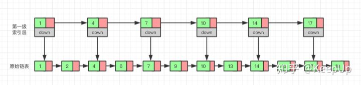

这种通过对链表加多级索引的机构，就是跳表了。

**跳表是用空间来换时间**，跳表的空间复杂度为 o(n)。
**跳表的插入和删除** 
跳表的查询的时间复杂度为 O(logn），因为找到位置之后插入和删除的时间复杂度很低，为 O(1)，所以最终插入和删除的时间复杂度也为 O(longn)。
删除操作的话，如果这个结点在索引中也有出现，我们除了要删除原始链表中的结点，还要删除索引中的。因为单链表中的删除操作需要拿到要删除结点的前驱结点，然后通过指针操作完成删除。所以在查找要删除的结点的时候，一定要获取前驱结点。当然，如果我们用的是双向链表，就不需要考虑这个问题了。

如果我们不停的向跳表中插入元素，就可能会造成两个索引点之间的结点过多的情况。结点过多的话，我们建立索引的优势也就没有了。所以我们需要维护索引与原始链表的大小平衡，也就是结点增多了，索引也相应增加，避免出现两个索引之间结点过多的情况，查找效率降低。

跳表是通过一个随机函数来维护这个平衡的，当我们向跳表中插入数据的的时候，我们可以选择同时把这个数据插入到索引里，那我们插入到哪一级的索引呢，这就需要随机函数，来决定我们插入到哪一级的索引中。

这样可以很有效的防止跳表退化，而造成效率变低。

# 动态规划
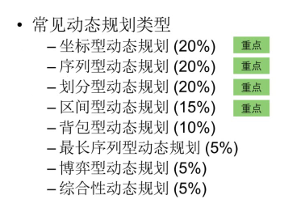
## 最值型动态规划

### 零钱兑换
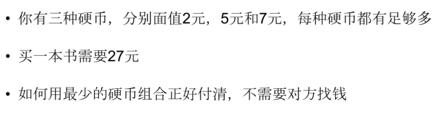
```java
    public int coinChange(int[] coin, int money){
        int n = coin.length;
        int[] f = new int[money+1];
        int i,j;
        f[0] = 0;
        for(i = 1; i <= money; ++i){
            f[i] = Integer.MAX_VALUE;
            for(j = 0; j < n; ++j){
                if(i >= coin[j] && f[i - coin[j]] != Integer.MAX_VALUE && f[i - coin[j]] + 1 < f[i]){
                    f[i] = f[i - coin[j]]+1;
                }
            }
        }
        return f[money]==Integer.MAX_VALUE ? -1 : f[money];
    }
```
### 机器人走方格

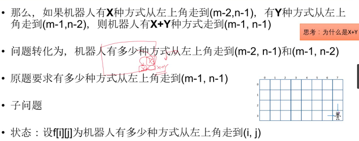
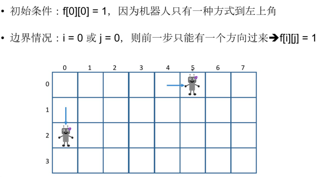
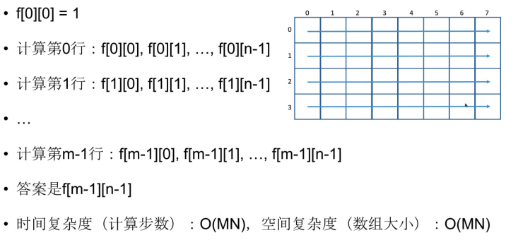
```java
    public int uniquePaths(int m, int n){
        int[][] f = new int[m][n];
        for (int i = 0; i < m; i++) {
            for (int j = 0; j < n; j++) {
                if(i==0||j==0){
                    f[i][j] = 1;
                }else{
                    f[i][j] = f[i-1][j] + f[i][j-1];
                }
            }
        }
        return f[m-1][n-1];
    }
```
### 青蛙过河
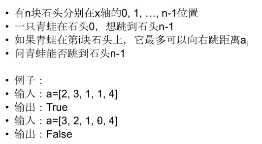

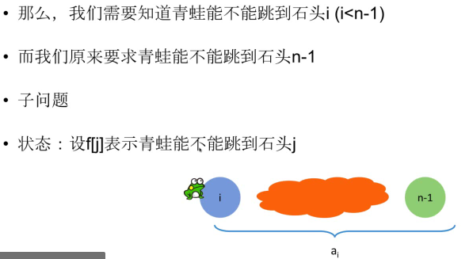


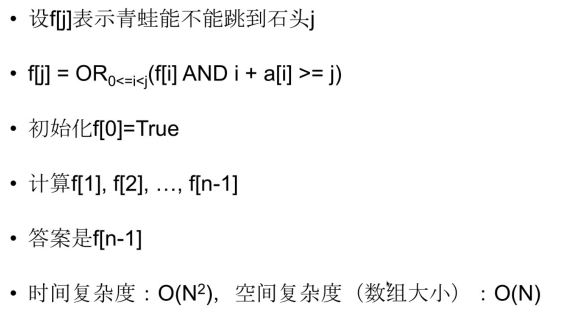
```java
    public boolean canJump(int[] a){
        if(a==null || a.length==0) return false;
        int n = a.length;
        boolean[] f = new boolean[n];
        f[0] = true;
        for (int j = 1; j < n; j++) {
            f[j] = false;
            for(int i = 0; i<j; ++i){
                if(f[i] & i+a[i]>=j){
                    f[j] = true;
                    break;
                }
            }
        }
        return f[n-1];
    }
```
## 2
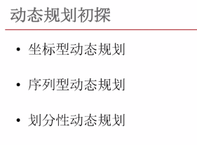
### 机器人走网格2
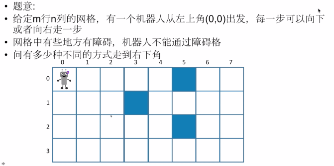

```java
    public int uniquePathsWithObstacles(int[][] a){
        int m = a.length;
        if(m == 0) return 0;
        int n = a[0].length;
        if(n == 0) return 0;
        int[][] f = new int[m][n];
        for (int i = 0; i < m; i++) {
            for (int j = 0; j < n; j++) {
                if(a[i][j]==1){
                    f[i][j] = 0;
                }else{
                    if(i==0 && j==0){
                        f[i][j] = 1;
                    }else{
                        f[i][j] = 0;
                        if(i-1>=0){
                            f[i][j]+=f[i-1][j];
                        }
                        if(j-1>=0){
                            f[i][j]+=f[i][j-1];
                        }
                    }
                }
            }
        }
        return f[m-1][n-1];
    }
```
### 涂房子

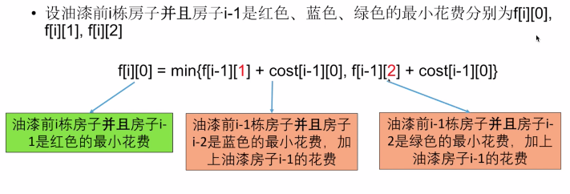


```java
    public int minCost(int[][] costs){
        int n = costs.length;
        if(n==0) return 0;
        int[][] f = new int[n+1][3];
        f[0][0] = f[0][1] = f[0][2] = 0;
        for (int i = 1; i <= n; i++) {
            for (int j = 0; j < 3; j++) {
                f[i][j] = Integer.MAX_VALUE;
                for (int k = 0; k < 3; k++) {
                    if(j==k){
                        continue;
                    }
                    if(f[i-1][k]+costs[i-1][j]<f[i][j]){
                        f[i][j] = f[i-1][k]+costs[i-1][j];
                    }
                }
            }
        }
        int res = Math.min(Math.min(f[n][0],f[n][1]),f[n][2]);
        return res;
    }
```
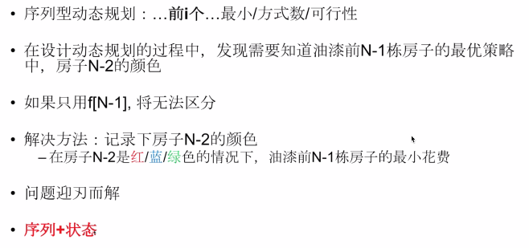
### 字符串解密
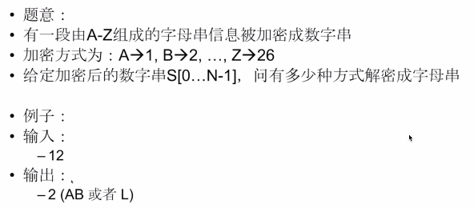


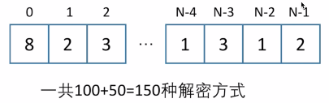

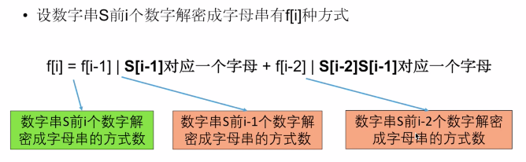
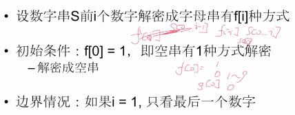
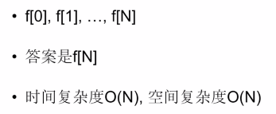
```java
    public int numDecodings(String ss){
        char[] s = ss.toCharArray();
        int n = s.length;
        if(n==0) return 0;
        int[] f = new int[n+1];
        f[0] = 1;
            //first i digits
        for (int i = 1; i <= n; i++) {
            f[i] = 0;
            //last digit
            int t = s[i-1] - '0';
            if(t>=1 && t <= 9){
                f[i] += f[i-1];
            }
            //length must be greater than 1
            if(i>=2){
                t = (s[i-2]-'0')*10 + (s[i-1]-'0');
                if(t>=10 && t<=26){
                    f[i]+=f[i-2];
                }
            }

        }
        return f[n];
    }
```
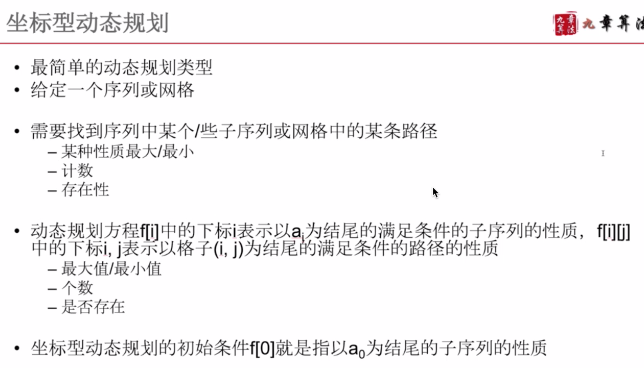

### 最长连续子序列
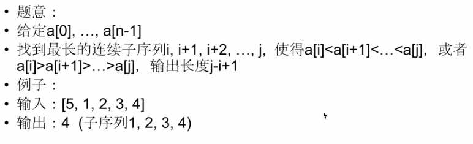
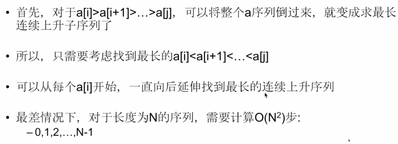
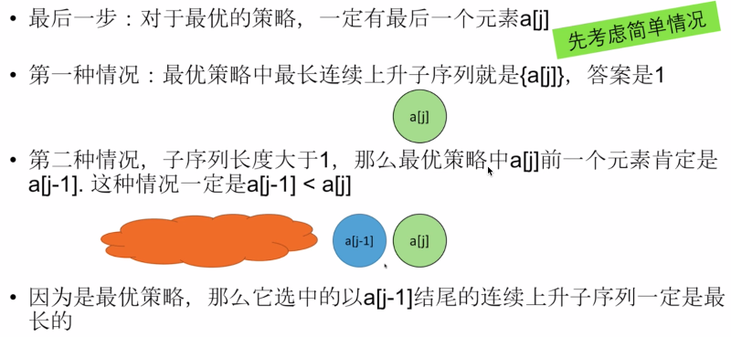

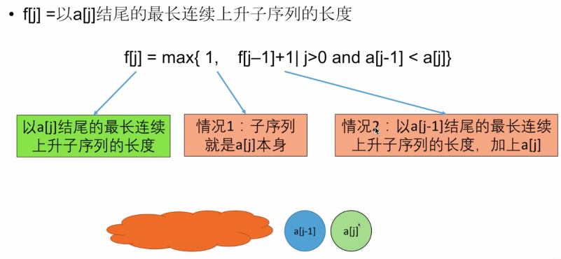
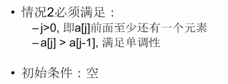

```java
    int result = 0;
    void calc(int[]a,int n){
        int[] f = new int[2];
        int old,now = 0;
        for (int i = 0; i < n; i++) {
            old = now;
            now = 1-now;
            //option 1
            f[now] = 1;
            //option 2
            if(i > 0 && a[i-1] < a[i]){
                f[now] = f[old] +1;
            }
            if(f[now] > result){
                result = f[now];
            }
        }
    }
    public int longestIncreasingContinuousSubsequence(int[] a){
        int n = a.length;
        if(n==0) return 0;
        calc(a,n);
        int i = 0, j = n - 1;
        int t;
        while(i<j){
            t = a[i];
            a[i] = a[j];
            a[j] = t;
            ++i;--j;
        }
        calc(a,n);
        return result;
    }
```
### 最小路径和

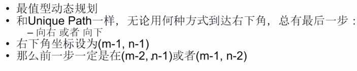
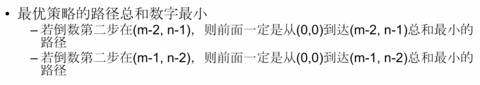
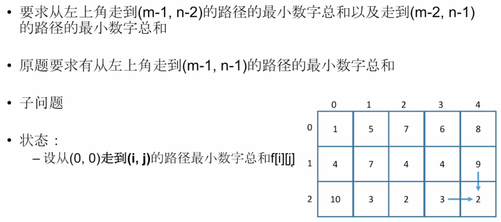
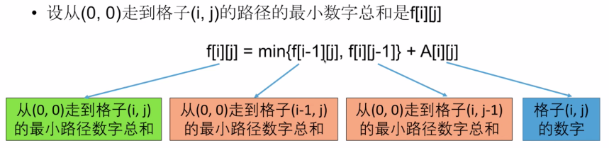

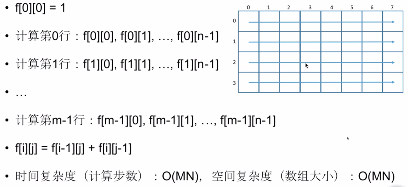
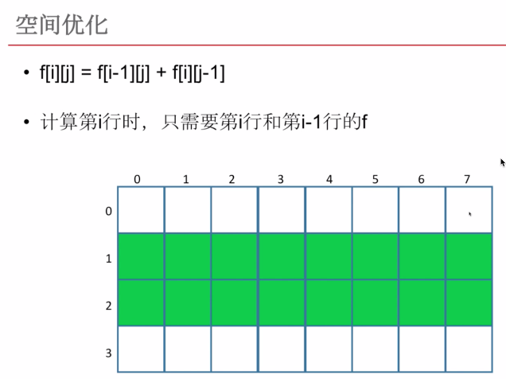
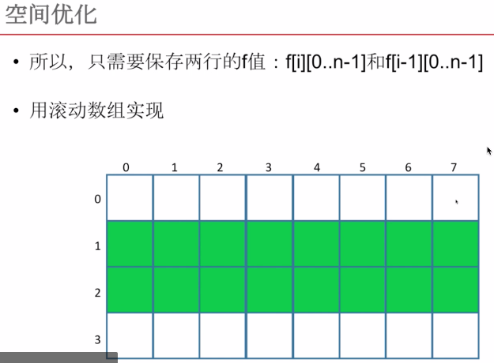
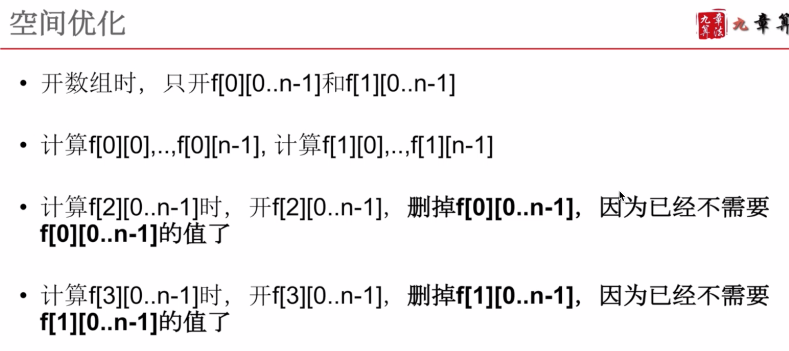
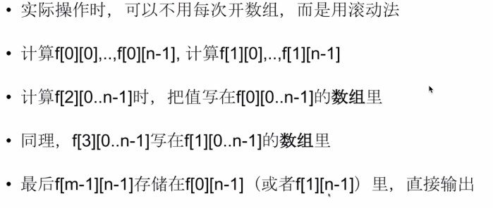
```java
    public int minPathSum(int[][] a){
        if(a==null||a.length==0||a[0].length==0) return 0;
        int m = a.length;
        int n = a[0].length;
        int[][] f = new int[2][n];
        int old = 1,now = 0;
        int t1,t2;
        for (int i = 0; i < m; i++) {
            old = now;//old is row i-1
            now = 1-now;//now is row i
            //rolling array
            for (int j = 0; j < n; j++) {
                if(i==0&&j==0){
                    f[now][j] = a[i][j];
                    continue;
                }
                f[now][j]=a[i][j];
                if(i>0){
                    t1 = f[old][j];
                }else{
                    t1 = Integer.MAX_VALUE;
                }
                if(j>0){
                    t2 = f[now][j-1];
                }else{
                    t2 = Integer.MAX_VALUE;
                }
                if(t1<t2){
                    f[now][j]+=t1;
                }else{
                    f[now][j]+=t2;
                }
            }
        }
        return f[now][n-1];
    }
```
### 炸弹人

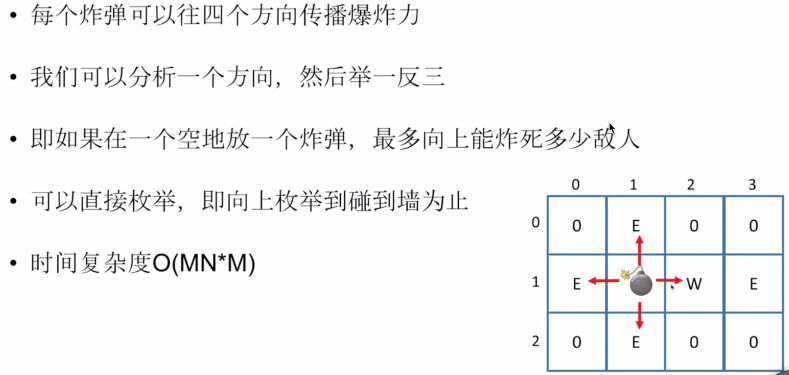
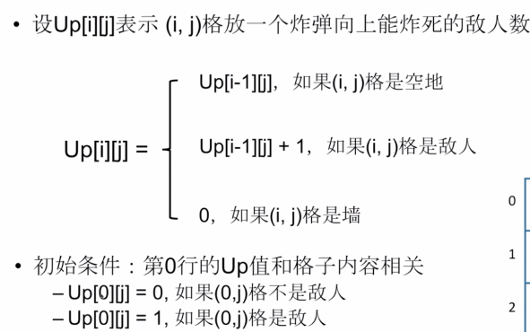

### 位操作
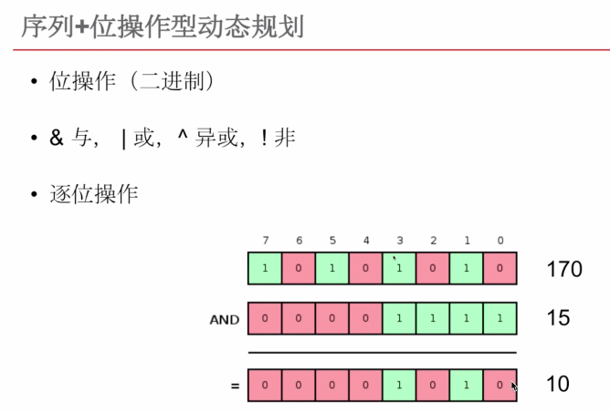


