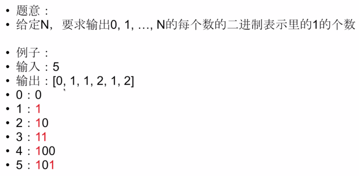

# 数据结构和算法
[toc]
# 1. B树和B+树的区别

# 2.跳表
跳表全称为跳跃列表，它允许快速查询，插入和删除一个有序连续元素的数据链表。跳跃列表的平均查找和插入时间复杂度都是O(logn)。
我们可以为链表建立一个“索引”，这样查找起来就会更快，如下图所示，我们在原始链表的基础上，每两个结点提取一个结点建立索引，我们把抽取出来的结点叫做索引层或者索引，down 表示指向原始链表结点的指针。


这种通过对链表加多级索引的机构，就是跳表了。

**跳表是用空间来换时间**，跳表的空间复杂度为 o(n)。
**跳表的插入和删除** 
跳表的查询的时间复杂度为 O(logn），因为找到位置之后插入和删除的时间复杂度很低，为 O(1)，所以最终插入和删除的时间复杂度也为 O(longn)。
删除操作的话，如果这个结点在索引中也有出现，我们除了要删除原始链表中的结点，还要删除索引中的。因为单链表中的删除操作需要拿到要删除结点的前驱结点，然后通过指针操作完成删除。所以在查找要删除的结点的时候，一定要获取前驱结点。当然，如果我们用的是双向链表，就不需要考虑这个问题了。

如果我们不停的向跳表中插入元素，就可能会造成两个索引点之间的结点过多的情况。结点过多的话，我们建立索引的优势也就没有了。所以我们需要维护索引与原始链表的大小平衡，也就是结点增多了，索引也相应增加，避免出现两个索引之间结点过多的情况，查找效率降低。

跳表是通过一个随机函数来维护这个平衡的，当我们向跳表中插入数据的的时候，我们可以选择同时把这个数据插入到索引里，那我们插入到哪一级的索引呢，这就需要随机函数，来决定我们插入到哪一级的索引中。

这样可以很有效的防止跳表退化，而造成效率变低。

# 动态规划

## 最值型动态规划

### 零钱兑换

```java
    public int coinChange(int[] coin, int money){
        int n = coin.length;
        int[] f = new int[money+1];
        int i,j;
        f[0] = 0;
        for(i = 1; i <= money; ++i){
            f[i] = Integer.MAX_VALUE;
            for(j = 0; j < n; ++j){
                if(i >= coin[j] && f[i - coin[j]] != Integer.MAX_VALUE && f[i - coin[j]] + 1 < f[i]){
                    f[i] = f[i - coin[j]]+1;
                }
            }
        }
        return f[money]==Integer.MAX_VALUE ? -1 : f[money];
    }
```
### 机器人走方格


```java
    public int uniquePaths(int m, int n){
        int[][] f = new int[m][n];
        for (int i = 0; i < m; i++) {
            for (int j = 0; j < n; j++) {
                if(i==0||j==0){
                    f[i][j] = 1;
                }else{
                    f[i][j] = f[i-1][j] + f[i][j-1];
                }
            }
        }
        return f[m-1][n-1];
    }
```
### 青蛙过河


```java
    public boolean canJump(int[] a){
        if(a==null || a.length==0) return false;
        int n = a.length;
        boolean[] f = new boolean[n];
        f[0] = true;
        for (int j = 1; j < n; j++) {
            f[j] = false;
            for(int i = 0; i<j; ++i){
                if(f[i] & i+a[i]>=j){
                    f[j] = true;
                    break;
                }
            }
        }
        return f[n-1];
    }
```
## 2

### 机器人走网格2


```java
    public int uniquePathsWithObstacles(int[][] a){
        int m = a.length;
        if(m == 0) return 0;
        int n = a[0].length;
        if(n == 0) return 0;
        int[][] f = new int[m][n];
        for (int i = 0; i < m; i++) {
            for (int j = 0; j < n; j++) {
                if(a[i][j]==1){
                    f[i][j] = 0;
                }else{
                    if(i==0 && j==0){
                        f[i][j] = 1;
                    }else{
                        f[i][j] = 0;
                        if(i-1>=0){
                            f[i][j]+=f[i-1][j];
                        }
                        if(j-1>=0){
                            f[i][j]+=f[i][j-1];
                        }
                    }
                }
            }
        }
        return f[m-1][n-1];
    }
```
### 涂房子


```java
    public int minCost(int[][] costs){
        int n = costs.length;
        if(n==0) return 0;
        int[][] f = new int[n+1][3];
        f[0][0] = f[0][1] = f[0][2] = 0;
        for (int i = 1; i <= n; i++) {
            for (int j = 0; j < 3; j++) {
                f[i][j] = Integer.MAX_VALUE;
                for (int k = 0; k < 3; k++) {
                    if(j==k){
                        continue;
                    }
                    if(f[i-1][k]+costs[i-1][j]<f[i][j]){
                        f[i][j] = f[i-1][k]+costs[i-1][j];
                    }
                }
            }
        }
        int res = Math.min(Math.min(f[n][0],f[n][1]),f[n][2]);
        return res;
    }
```

### 字符串解密


```java
    public int numDecodings(String ss){
        char[] s = ss.toCharArray();
        int n = s.length;
        if(n==0) return 0;
        int[] f = new int[n+1];
        f[0] = 1;
            //first i digits
        for (int i = 1; i <= n; i++) {
            f[i] = 0;
            //last digit
            int t = s[i-1] - '0';
            if(t>=1 && t <= 9){
                f[i] += f[i-1];
            }
            //length must be greater than 1
            if(i>=2){
                t = (s[i-2]-'0')*10 + (s[i-1]-'0');
                if(t>=10 && t<=26){
                    f[i]+=f[i-2];
                }
            }

        }
        return f[n];
    }
```


### 最长连续子序列


```java
    int result = 0;
    void calc(int[]a,int n){
        int[] f = new int[2];
        int old,now = 0;
        for (int i = 0; i < n; i++) {
            old = now;
            now = 1-now;
            //option 1
            f[now] = 1;
            //option 2
            if(i > 0 && a[i-1] < a[i]){
                f[now] = f[old] +1;
            }
            if(f[now] > result){
                result = f[now];
            }
        }
    }
    public int longestIncreasingContinuousSubsequence(int[] a){
        int n = a.length;
        if(n==0) return 0;
        calc(a,n);
        int i = 0, j = n - 1;
        int t;
        while(i<j){
            t = a[i];
            a[i] = a[j];
            a[j] = t;
            ++i;--j;
        }
        calc(a,n);
        return result;
    }
```
### 最小路径和


```java
    public int minPathSum(int[][] a){
        if(a==null||a.length==0||a[0].length==0) return 0;
        int m = a.length;
        int n = a[0].length;
        int[][] f = new int[2][n];
        int old = 1,now = 0;
        int t1,t2;
        for (int i = 0; i < m; i++) {
            old = now;//old is row i-1
            now = 1-now;//now is row i
            //rolling array
            for (int j = 0; j < n; j++) {
                if(i==0&&j==0){
                    f[now][j] = a[i][j];
                    continue;
                }
                f[now][j]=a[i][j];
                if(i>0){
                    t1 = f[old][j];
                }else{
                    t1 = Integer.MAX_VALUE;
                }
                if(j>0){
                    t2 = f[now][j-1];
                }else{
                    t2 = Integer.MAX_VALUE;
                }
                if(t1<t2){
                    f[now][j]+=t1;
                }else{
                    f[now][j]+=t2;
                }
            }
        }
        return f[now][n-1];
    }
```
### 炸弹人


### 位操作




