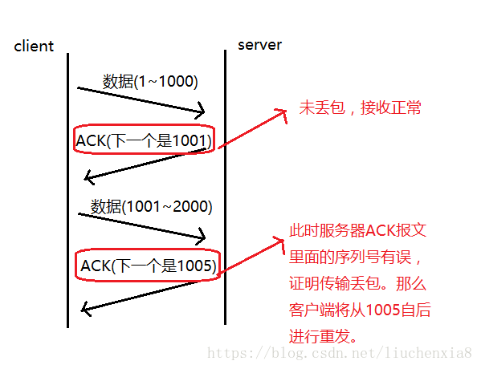
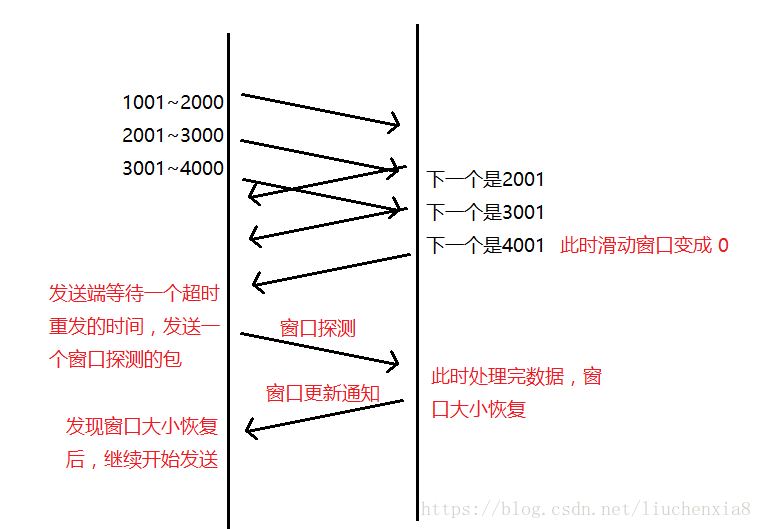
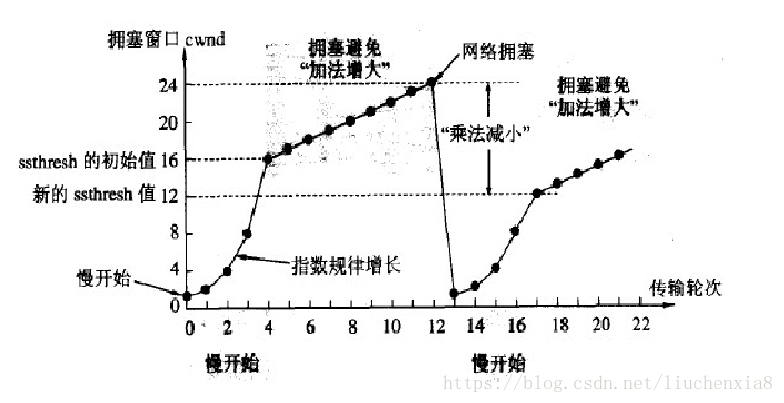

# 操作系统
[toc]
# 1. 进程和线程
## 1.1 进程
进程是一个具有一定独立功能的程序在一个数据集上的一次动态执行的过程，是操作系统进行资源分配和调度的一个独立单位，是应用程序运行的载体。
进程具有的特征：
动态性：进程是程序的一次执行过程，是临时的，有生命期的，是动态产生，动态消亡的；
并发性：任何进程都可以同其他进行一起并发执行；
独立性：进程是系统进行资源分配和调度的一个独立单位；
结构性：进程由程序，数据和进程控制块三部分组成
## 1.2 线程
线程与进程相似，但线程是一个比进程更小的执行单位。一个进程在其执行的过程中可以产生多个线程。与进程不同的是同类的多个线程共享进程的**堆**和**方法区**（JDK1.8之后的元空间）资源，但每个线程有自己的**程序计数器**、**虚拟机栈**和**本地方法栈**，所以系统在产生一个线程，或是在各个线程之间作切换工作时，负担要比进程小得多，也正因为如此，线程也被称为轻量级进程。
**总结：** **线程是进程划分成的更小的运行单位。线程和进程最大的不同在于基本上各进程是独立的，而各线程则不一定，因为同一进程中的线程极有可能会相互影响。线程执行开销小，但不利于资源的管理和保护；而进程正相反。**
## 1.3 线程进程的区别
+ 因为进程拥有独立的堆栈空间和数据段，所以每当启动一个新的进程必须分配给它独立的地址空间，建立众多的数据表来维护它的代码段、堆栈段和数据段，这对于多进程来说十分“奢侈”，**系统开销比较大**，而线程不一样，线程拥有独立的堆栈空间，但是共享数据段，它们彼此之间使用相同的地址空间，共享大部分数据，**比进程更节俭，开销比较小，切换速度也比进程快，效率高**，但是正由于进程之间独立的特点，使得进程安全性比较高，也因为进程有独立的地址空间，一个进程崩溃后，在保护模式下不会对其它进程产生影响，**而线程只是一个进程中的不同执行路径。一个线程死掉就等于整个进程死掉**。
+ 体现在通信机制上面，正因为进程之间互不干扰，相互独立，**进程的通信机制相对很复杂**，譬如管道，信号，消息队列，共享内存，套接字等通信机制，而**线程由于共享数据段所以通信机制很方便**
+ 属于同一个进程的所有线程共享该进程的所有资源，包括文件描述符。而不同的进程相互独立。
+ 线程又称为轻量级进程，进程有进程控制块，线程有线程控制块。
> 线程控制块（Thread Control Block，TCB）是与进程的控制块（PCB）相似的子控制块，只是TCB中所保存的线程状态比PCB中保存少而已。
> 进程控制块（Processing Control Block），是操作系统核心中一种数据结构，主要表示进程状态。其作用是使一个在多道程序环境下不能独立运行的程序（含数据），成为一个能独立运行的基本单位或与其它进程并发执行的进程。或者说，OS是根据PCB来对并发执行的进程进行控制和管理的。 PCB通常是系统内存占用区中的一个连续存区，它存放着操作系统用于描述进程情况及控制进程运行所需的全部信息，它使一个在多道程序环境下不能独立运行的程序成为一个能独立运行的基本单位或一个能与其他进程并发执行的进程。
+ 线程必定也只能属于一个进程，而进程可以拥有多个线程而且至少拥有一个线程。
## 1.4 什么时候用进程？什么时候用线程？
+ 1、需要频繁创建销毁的优先使用线程；因为对进程来说创建和销毁一个进程代价是很大的。
+ 2、线程的切换速度快，所以在需要大量计算，切换频繁时用线程，还有耗时的操作使用线程可提高应用程序的响应
+ 3、因为对CPU系统的效率使用上线程更占优，所以可能要发展到多机分布的用进程，多核分布用线程；
+ 4、并行操作时使用线程，如C/S架构的服务器端并发线程响应用户的请求；
+ 5、需要更稳定安全时，适合选择进程；需要速度时，选择线程更好。

## 1.5 线程共享的资源具体有哪些
a. 堆  由于堆是在进程空间中开辟出来的，所以它是理所当然地被共享的；因此new出来的都是共享的（16位平台上分全局堆和局部堆，局部堆是独享的）

b. 全局变量 它是与具体某一函数无关的，所以也与特定线程无关；因此也是共享的

c. 静态变量 虽然对于局部变量来说，它在代码中是“放”在某一函数中的，但是其存放位置和全局变量一样，存于堆中开辟的.bss和.data段，是共享的

d. 文件等公用资源  这个是共享的，使用这些公共资源的线程必须同步。Win32 提供了几种同步资源的方式，包括信号、临界区、事件和互斥体。
## 1.6 线程独享的资源
程序计数器，本地方法栈，虚拟机栈
# 2. TCP与UDP区别
1、TCP面向连接（如打电话要先拨号建立连接）;UDP是无连接的，即发送数据之前不需要建立连接
2、TCP提供可靠的服务。也就是说，通过TCP连接传送的数据，无差错，不丢失，不重复，且按序到达;UDP尽最大努力交付，即不保证可靠交付
3、TCP面向字节流，实际上是TCP把数据看成一连串无结构的字节流;UDP是面向报文的
  UDP没有拥塞控制，因此网络出现拥塞不会使源主机的发送速率降低（对实时应用很有用，如IP电话，实时视频会议等）
4、每一条TCP连接只能是点到点的;UDP支持一对一，一对多，多对一和多对多的交互通信
5、TCP首部开销20字节;UDP的首部开销小，只有8个字节
6、TCP的逻辑通信信道是全双工的可靠信道，UDP则是不可靠信道

## 2.1 TCP如何保证可靠传输
TCP协议保证数据传输可靠性的方式主要有：
校验和
序列号
确认应答
超时重传
连接管理(三次握手与四次挥手)
流量控制
拥塞控制
### 校验和
计算方式：在数据传输的过程中，将发送的数据段都当做一个16位的整数。将这些整数加起来。并且前面的进位不能丢弃，补在后面，最后取反，得到校验和。
发送方：在发送数据之前计算检验和，并进行校验和的填充。
接收方：收到数据后，对数据以同样的方式进行计算，求出校验和，与发送方的进行比对。

注意：如果接收方比对校验和与发送方不一致，那么数据一定传输有误。但是如果接收方比对校验和与发送方一致，**数据不一定传输成功**。
### 确认应答与序列号
序列号：TCP传输时将每个字节的数据都进行了编号，这就是序列号。
确认应答：TCP传输的过程中，每次接收方收到数据后，都会对传输方进行确认应答。也就是发送ACK报文。这个ACK报文当中带有对应的确认序列号，告诉发送方，接收到了哪些数据，下一次的数据从哪里发。

序列号的作用不仅仅是应答的作用，有了序列号能够将接收到的数据根据序列号排序，并且去掉重复序列号的数据。这也是TCP传输可靠性的保证之一。
### 超时重传
在进行TCP传输时，由于确认应答与序列号机制，也就是说发送方发送一部分数据后，都会等待接收方发送的ACK报文，并解析ACK报文，判断数据是否传输成功。如果发送方发送完数据后，迟迟没有等到接收方的ACK报文，这该怎么办呢？而没有收到ACK报文的原因可能是什么呢？

首先，发送方没有介绍到响应的ACK报文原因可能有两点：

+ 数据在传输过程中由于网络原因等直接全体丢包，接收方根本没有接收到。
+ 接收方接收到了响应的数据，但是发送的ACK报文响应却由于网络原因丢包了。
TCP在解决这个问题的时候引入了一个新的机制，叫做超时重传机制。简单理解就是发送方在发送完数据后等待一个时间，时间到达没有接收到ACK报文，那么对刚才发送的数据进行重新发送。如果是刚才第一个原因，接收方收到二次重发的数据后，便进行ACK应答。如果是第二个原因，接收方发现接收的数据已存在（判断存在的根据就是序列号，所以上面说序列号还有去除重复数据的作用），那么直接丢弃，仍旧发送ACK应答。

那么发送方发送完毕后等待的时间是多少呢？如果这个等待的时间过长，那么会影响TCP传输的整体效率，如果等待时间过短，又会导致频繁的发送重复的包。如何权衡？

由于TCP传输时保证能够在任何环境下都有一个高性能的通信，因此这个最大超时时间（也就是等待的时间）是动态计算的。

> 在Linux中（BSD Unix和Windows下也是这样）超时以500ms为一个单位进行控制，每次判定超时重发的超时时间都是500ms的整数倍。重发一次后，仍未响应，那么等待2*500ms的时间后，再次重传。等待4*500ms的时间继续重传。以一个指数的形式增长。累计到一定的重传次数，TCP就认为网络或者对端出现异常，强制关闭连接。

### 连接管理
连接管理就是三次握手与四次挥手的过程，在前面详细讲过这个过程，这里不再赘述。保证可靠的连接，是保证可靠性的前提。
### 流量控制
接收端在接收到数据后，对其进行处理。如果发送端的发送速度太快，导致接收端的结束缓冲区很快的填充满了。此时如果发送端仍旧发送数据，那么接下来发送的数据都会丢包，继而导致丢包的一系列连锁反应，超时重传呀什么的。而**TCP根据接收端对数据的处理能力，决定发送端的发送速度，这个机制就是流量控制**。

在TCP协议的报头信息当中，有一个16位字段的窗口大小。在介绍这个窗口大小时我们知道，窗口大小的内容实际上是接收端接收数据缓冲区的剩余大小。这个数字越大，证明接收端接收缓冲区的剩余空间越大，网络的吞吐量越大。接收端会在确认应答发送ACK报文时，将自己的即时窗口大小填入，并跟随ACK报文一起发送过去。而发送方根据ACK报文里的窗口大小的值的改变进而改变自己的发送速度。如果接收到窗口大小的值为0，那么发送方将停止发送数据。并定期的向接收端发送窗口探测数据段，让接收端把窗口大小告诉发送端。

注：16位的窗口大小最大能表示65535个字节（64K），但是TCP的窗口大小最大并不是64K。在TCP首部中40个字节的选项中还包含了一个窗口扩大因子M，实际的窗口大小就是16为窗口字段的值左移M位。每移一位，扩大两倍。
### 拥塞控制
TCP传输的过程中，发送端开始发送数据的时候，如果刚开始就发送大量的数据，那么就可能造成一些问题。网络可能在开始的时候就很拥堵，如果给网络中在扔出大量数据，那么这个拥堵就会加剧。拥堵的加剧就会产生大量的丢包，就对大量的超时重传，严重影响传输。

所以TCP引入了慢启动的机制，在开始发送数据时，先发送少量的数据探路。探清当前的网络状态如何，再决定多大的速度进行传输。这时候就引入一个叫做拥塞窗口的概念。发送刚开始定义拥塞窗口为 1，每次收到ACK应答，拥塞窗口加 1。在发送数据之前，首先将拥塞窗口与接收端反馈的窗口大小比对，取较小的值作为实际发送的窗口。

拥塞窗口的增长是指数级别的。慢启动的机制只是说明在开始的时候发送的少，发送的慢，但是增长的速度是非常快的。为了控制拥塞窗口的增长，不能使拥塞窗口单纯的加倍，设置一个拥塞窗口的阈值，当拥塞窗口大小超过阈值时，不能再按照指数来增长，而是线性的增长。在慢启动开始的时候，慢启动的阈值等于窗口的最大值，一旦造成网络拥塞，发生超时重传时，慢启动的阈值会为原来的一半（这里的原来指的是发生网络拥塞时拥塞窗口的大小），同时拥塞窗口重置为 1。

拥塞控制是TCP在传输时尽可能快的将数据传输，并且避免拥塞造成的一系列问题。是可靠性的保证，同时也是维护了传输的高效性。
