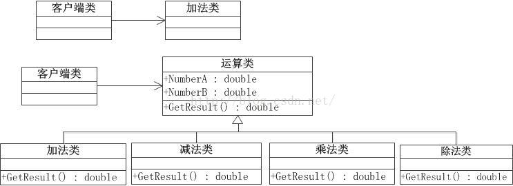

# 设计模式
[toc]
# 1.什么是设计模式
软件设计模式（Design pattern），又称设计模式，是一套被反复使用、多数人知晓的、经过分类编目的、代码设计经验的总结。使用设计模式是为了可重用代码、让代码更容易被他人理解、保证代码可靠性、程序的重用性。
**面向对象最终的设计目标**：
A. 可扩展性：有了新的需求，新的性能可以容易添加到系统中，不影响现有的性能，也不会带来新的缺陷。
B. 灵活性：添加新的功能代码修改平稳地发生，而不会影响到其它部分。
C. 可替换性：可以将系统中的某些代码替换为相同接口的其它类，不会影响到系统。
**设计模式的好处**：
A. 设计模式使人们可以更加简单方便地复用成功的设计和体系结构。
B. 设计模式也会使新系统开发者更加容易理解其设计思路。
# 2.设计模式五大原则
单一职责原则、开闭原则、里氏替换原则、依赖倒置原则、接口隔离原则。
## 2.1 单一职责原则(SRP)
1. SRP定义：就一个类而言，应该仅有一个引起它变化的原因。简而言之，就是功能要单一。
2. 如果一个类承担的职责过多，就等于把这些职责耦合在一起，一个职责的变化可能会削弱或者抑制这个类完成其它职责的能力。这种耦合会导致脆弱的设计，当变化发生时，设计会遭受到意想不到的破坏。(敏捷软件开发)
3. 软件设计真正要做的许多内容，就是发现职责并把那些职责相互分离。(敏捷软件开发)
4. 单一职责原则可以看做是低耦合、高内聚在面向对象原则上的引申，将职责定义为引起变化的原因，以提高内聚性来减少引起变化的原因。职责过多，可能引起它变化的原因就越多，这样导致职责依赖，相互之间就会产生原因，大大损伤其内聚性和耦合度。
5. **不论是在设计类，接口还是方法，单一职责都会处处体现，单一职责的定义：我们把职责定义为系统变化的原因。所有在定义类，接口，方法的时候。定义完以后再去想一想是不能多于一个的动机去改变这个类，接口，方法。如果答案是肯定的，说明定义的类，接口，方法则多于一个职责。故违背单一职责，遇到这种情况应该重新细分职责，直到不会出现多种职责的类，接口方法为止(发现职责，并把那些职责相互分离)。单一职责的为最简单的五种原则之一。在软件设计的过程中处处体现。无处不在。**
## 2.2 开闭原则(OCP)
1. OCP的定义：就是说软件实体(类，方法等等)应该可以扩展，但是不能修改。它是软件设计中也是最重要的一种设计原则。
2. OCP的两个特征：
    A. 对于扩展是开放的。
    B. 对于修改是封闭的。
3. 什么时候应用OCP原则呢？
在我们最初编写代码时，假设变化不会发生，当变化发生时，我们就创建抽象(比如抽象类，接口等等)来隔离以后发生的同类变化。
4. 开闭原则是面向对象设计的核心所在。遵循这个原则可以带来面向对象技术所声称的巨大好处，也就是可维护，可扩展，可复用，灵活性好。开发人员应该仅对程序中呈现出频繁变化的那些部分做出抽象，然而，对于应用程序中的每个部分都刻意地进行抽象同样不是一个好主意。拒绝不成熟的抽象和抽象本身一样重要。
5. **开闭原则是指类、模块、方法是可以扩展的，但不可以修改。开即对扩张开放，闭即对修改关闭。开闭原则的应用体现在，开发人员应该仅仅对程序中频繁出现变化的地方进行抽象(封装变化点)。对变化点的封装即对变化的修改关闭。对于变化的不确定性，可随时扩展。即继承的使用。抽象类的运用。**
6. OCP的UML图： 

## 2.3 里氏替换原则(LSP)
1. LSP的定义：子类型必须能够替换掉它们的父类型。简单地说，这是因为子类型继承了父类，所以子类可以以父类的身份出现。
2. 任何基类可以出现的地方，子类一定可以出现。 LSP是继承复用的基石，只有当衍生类可以替换掉基类，软件单位的功能不受到影响时，基类才能真正被复用，而衍生类也能够在基类的基础上增加新的行为。里氏代换原则是对开闭原则的补充。实现开闭原则的关键步骤就是抽象化。而基类与子类的继承关系就是抽象化的具体实现，所以里氏代换原则是对实现抽象化的具体步骤的规范。
3. 替换原则的实现。对于一组具有类似属性，方法，变量的类。我们可以提取公共属性，方法，变量做为一个基类(抽象类或者类)，使这一组类继承基类，重写虚方法。现在这些继承的类和基类的关系符合Is-A。如基类为动物，则继承类可以为狗，猫。我们可以说猫Is-A动物，狗Is-A动物。

4. 总结：**项目中所有使用子类的地方都可用父类替换，但在调用方法的时候 ，即呈现面向对象编程的多态性**。即里氏替换原则，非常重要的原则，也是比较对难的原则。

## 2.4 依赖倒置原则(DIP)
1. DIP的定义：a. 抽象不应该依赖细节，细节应该依赖于抽象。b. 高层模块不应该依赖于低层模块，二者都应该依赖于抽象。简单说就是，**我们要针对接口编程，而不要针对实现编程。**
2. 反面例子UML图：

缺点：高层模块太依赖低层模块，耦合太紧密。低层模块发生变化会影响到高层模块。
解决方法：利用依赖倒置原则使高层模块和低层模块都依赖于抽象(接口或抽象类)。
修改后的UML图如下：

优点：这样的话修改低层模块不会影响到高层模块，减小了它们之间的耦合度，增强系统的稳定性。
3. 在面向过程的开发语言中分析和设计，总是创建一些高层模块去调用低层模块、策略依赖于细节的软件结构。实际上这种方法的目的就是要定义子程序层次结构，该结构 描述了高层模块怎样调用低层模块。而设计良好的面向对象的程序，正好“倒置”了这种依赖关系高层模，块不再依赖于低层模块，从而低层模块的修改不会影响到高层模块，并且高层模块也是能非常容易的被重用，高层模块和低层模块都影响都依赖于抽象。这样也非常符合强内聚松耦合的编程思想。故该原则也是框架设计的核心原则。
使用传统的过程化程序设计所创建出来的依赖关系结构，策略是依赖于细节的，这是糟糕的，因为这样会使策略受到细节改变的影响，面向对象的程序设计倒置了依赖关系结构，全程细节和策略都依赖抽象，并且常常是客户程序拥有服务接口。事实上，这种依赖关系的倒置正是好的面向对象设计 的标志所在，使用何种语言来编写程序是无关紧要的。如果程序的依赖关系是倒置的，它就是面向对象的设计。如果程序的依赖关系不是倒置的，它就是过程化的设计。
4. 依赖倒置原则是实现许多面向对象技术所宣称的好处的基本低层机制。它的正确应用对于创建可重用的框架来说是必需的。同时它对于构建在变化面前富有弹性的代码也是非常重要的，由于抽象和细节彼此隔离，所以代码也非常容易维护。
5. 总结：依赖倒置原则其实可以说是面向对象设计的标志，用哪种语言来编写程序不重要，如果编写时考虑的都是如何针对抽象编程而不是针对细节编程，即程序中所有的依赖关系都是终止于抽象类或者接口，那就是面向对象的设计，反之那就是过程化的设计了。
## 2.5 接口隔离原则(ISP)
1. ISP的定义：定制服务的例子，每一个接口应该是一种角色，不多不少，不干不该干的事，该干的事都要干。
2. 使用多个专门的接口比使用单一的总接口要好。一个类对另外一个类的依赖性应当是建立在最小的接口上的。一个接口代表一个角色，不应当将不同的角色都交给一个接口。没有关系的接口合并在一起，形成一个臃肿的大接口，这是对角色和接口的污染。不应该强迫客户依赖于它们不用的方法。接口属于客户，不属于它所在的类层次结构。这个说得很明白了，再通俗点说，不要强迫客户使用它们不用的方法，如果强迫用户使用它们不使用的方法，那么这些客户就会面临由于这些不使用的方法的改变所带来的改变。
3. 应该说该原则是处理现有“胖”接口所存在的缺点。如果类的接口不是内聚的，就表示该类具有“胖”接口。换句话说“胖”接口可以分解成多组方法。每一组方法都服务于一组不同的客户程序。这样，量引客户程序可以使用一组成员函数，而其他客户程序可以使用其他组的成员函数。
4. 接口隔离的方法有两种(分享客户就是分离接口)：
A. 使用委托(此委托非.net委托[delegate])分离接口。
    使用委托即创建一个委托类，用此类去实现分离后的其它接口中的方法。
B. 使用多重继承分离接口、
    此方法，即将现有“胖”接口分成供不同客户程序调用的两个或多个接口，而需要实现多个接口的客户程序，则使用多重继承来实现。

这两种方法是实现接口隔离的全部方法，其中第二种方法使用较普遍，也比较简单。而第一种方法使用起来相对比较复杂，而且在使用委托的过程中也会产生重复的对象，则占用运行时间和内存开销。有的时候第二种方法是必须的，第一种方法是不能使用的。如：利用委托对象所做的转换是必需的，或者不同的时候会需要不同的转换。