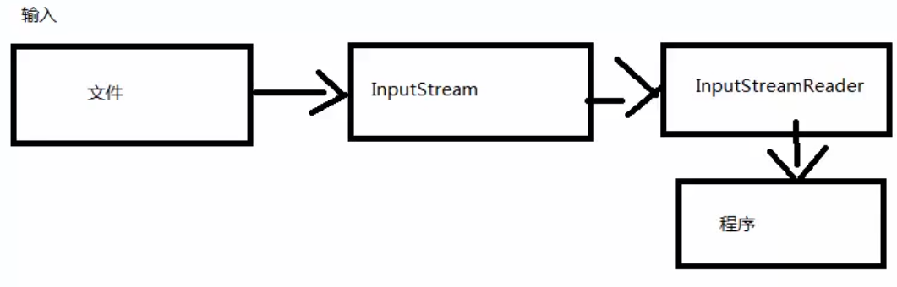
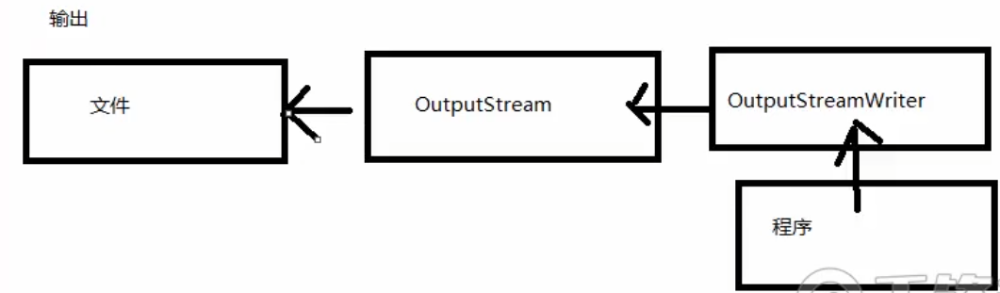
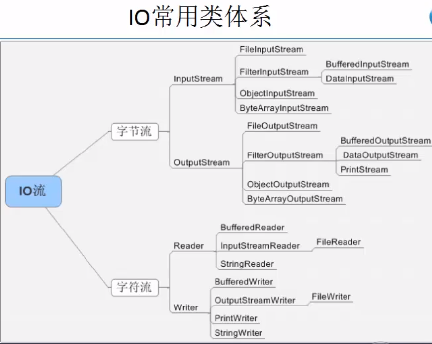

# 文件与IO


# 1. File 类

File类表示文件和目录路径名的抽象表示形式。可以实现文件的创建，删除，重命名，得到路径，创建时间等，是唯一与文件本身有关的操作类。

**操作方法：**

| 方法                         | 作用                                             |
| ---------------------------- | ------------------------------------------------ |
| public File(String pathname) | 构造file类实例，传入路径                         |
| exists()                     | 文件是否存在                                     |
| createNewFile()              | 创建新文件                                       |
| delete()                     | 删除文件。删除文件夹得先把里面的文件删除         |
| isDirectory()                | 判断是否是文件夹                                 |
| isFile()                     | 判断给定的路径是否是文件                         |
| String[] list()              | 列出文件夹中的文件的文件名，不会进入下一层文件夹 |
| File[] listFiles()           | 列出文件夹中的所有文件                           |
| mkdir()                      | 创建文件夹                                       |
| renameTo(File dest)          | 重命名，也可以用作移动文件                       |
| length()                     | 文件大小                                         |
| getPath()                    | 路径名字符串， 相对路径                          |
| getAbsolutePath()            | 绝对路径                                         |
| isHidden()                   | 是否隐藏                                         |
| canRead()                    | 是否可读                                         |

```java
public static final String spearator;    路径分隔符“\”
File f = new File(文件路径)
文件路径：  "c:/test/v.txt" "c:\\test\\v.txt"  "c:"+File.separator+"test"+File.separator+"v.txt"
```

**FileFilter文件过滤器**

```java
public class MyFile {
    public static void main(String[] args) {
        String fileName = "D:\\school";
        File files = new File(fileName);
        File[] filesFilters = files.listFiles(new FileFilter() {
            @Override
            public boolean accept(File file) {
                return file.getName().endsWith(".pdf");
                //返回文件的满足条件
            }
        });
        
        //filesFilters = files.listFiles((pathName)->pathName.getName().endsWith(".pdf"));  //使用lamda表达式
        for(File f:filesFilters){
            System.out.println(f.toString());
        }
    }
}
```

# 2.字节流

**IO流：输入输出流**

流是一组有顺序的，有起点和终点的字节集合，是对数据传输的总称或抽象。即数据在两设备间的传输称为流。 流的本质是数据传输。根据数据传输特性将流抽象为各种类，方便更直观的进行数据操作。

**IO流的分类：**

+ 根据数据处理类型不同分为：字符流和字节流
+ 根据数据流向不同分为：输入流和输出流

**字节输出流**

`OutputStream`类，是表示输出字节流的所有类的超类。输出流接受输出字节并将这些字节发送到`InputStream`类的某个接收器。如果要向文件中输出，用`FileOutputStream`。

**字节输入流**

`InputStream`类，字节输入流的所有类的超类。文件：`FileInputStream`

```java
public class ByteStreamDemo {
    private static void out(){
        //1.确定文件
        File file = new File("D:\\school\\test.txt");
        //2.创建文件输出流对象
        try {
            OutputStream out = new FileOutputStream(file,true);//append为true表示在文件尾部追加内容
            //3.输出到文件的内容
            String info = "哈哈哈";
            out.write(info.getBytes());
            out.close();
        } catch (FileNotFoundException e) {
            e.printStackTrace();
        } catch (IOException e) {
            e.printStackTrace();
        }
    }
    private static void in(){
        //1.确定文件
        File file = new File("D:\\school\\test.txt");
        //2.创建文件输入流对象
        try {
            InputStream in = new FileInputStream(file);
            byte[] bytes = new byte[1024];
            StringBuilder buf = new StringBuilder();
            int len = -1;//表示每次读取的字节数
            //把数据读取到数组中，并返回读取的字节数，当不等于-1时，表示读取到数据，当等于-1时表示文件已经读完
            while ((len = in.read(bytes))!=-1){
                buf.append(new String(bytes,0,len));//一定要从数组的起始位置，到真实读取数据的结束位置。
                //如果不这么写，最后一次读取的数据，可能会保存了上一次的数据。
            }
            in.close();
            System.out.println(buf);
        } catch (FileNotFoundException e) {
            e.printStackTrace();
        } catch (IOException e) {
            e.printStackTrace();
        }
    }
    public static void main(String[] args) {
        out();
        in();
    }
}
```

操作原理：每次只会操作一个字节（从文件中读取或者写入），**默认每次执行写入操作会直接把数据写入文件**。

# 3.字符流

**Writer**

写入字符流的抽象类，子类必须实现的方法仅有`write(char[],int,int)`、`flush()`、`close()`.

对文件的操作使用`FileWriter`

**Reader**

读取字符流的抽象类，子类必须实现的方法仅有`read(char[],int,int)`、`close()`.

对文件的操作使用`FileReader`

```java
public class CharStreamDemo {
    private static void in() {
        File file = new File("D:\\school\\test.txt");
        try {
            Reader in = new FileReader(file);
            char[] cs = new char[1];
            int len = -1;
            StringBuilder buf = new StringBuilder();
            while ((len=in.read(cs))!=-1){
                buf.append(new String(cs,0,len));
            }
            in.close();
            System.out.println(buf);
        } catch (FileNotFoundException e) {
            e.printStackTrace();
        } catch (IOException e) {
            e.printStackTrace();
        }
    }
        private static void out(){
        File file = new File("D:\\school\\test.txt");
        try {
            Writer out = new FileWriter(file);
            out.write("呵呵呵");
            out.close();
        } catch (IOException e) {
            e.printStackTrace();
        }
    }
    public static void main(String[] args) {
        in();
    }
}
```

操作原理：操作的单位是一个字符。**文件字符操作会自动缓存，默认大小为1024字节，在缓存满了后，或者手动刷新缓存，或者关闭流时会把数据写入文件。**

**如何选择字节流还是字符流：**操作非文本文件时，使用字节流。操作文本文件时，使用字符流。

**文件复制**:从一个输入流中读取数据，然后通过输入流写入目标位置。一边读一边写。

```java
private static void copy(String src,String target){
	File srcFile = new File(src);
	File targetFile = new File(target);
    try {
		InputStream in = new FileInputStream(srcFile);
        OutputStream out = new FileOutputStream(targetFile);
        byte[] bytes = new byte[1024];
        int len = -1;
        while ((len=in.read(bytes))!=-1){
        	out.write(bytes,0,len);
        }
        in.close();
        out.close();
   } catch (FileNotFoundException e) {
        e.printStackTrace();
   } catch (IOException e) {
        e.printStackTrace();
   }
}
```

# 4.字节字符流转换

可以将一个字节流转换为字符流，也可以将一个字符流转换为字节流。

`OutputStreamWriter`  可以将输出的字符流转换为字节流的输出形式

`InputStreamReader`  将输入的字节流转换为字符流输入形式

```java
public class ChangeStreamDemo {
    private static void read(InputStream in){
        Reader reader = new InputStreamReader(in, Charset.defaultCharset());
        char[] cs = new char[1024];
        int len = -1;
        try {
            while ((len = reader.read(cs))!=-1){
                System.out.println(new String(cs,0,len));
            }
            reader.close();
        }catch (IOException e){
            e.printStackTrace();
        }
    }
    private static void write(OutputStream out){
        Writer writer = new OutputStreamWriter(out,Charset.defaultCharset());
        try {
            writer.write("xxxxxx");
            writer.close();
        }catch (IOException e){
            e.printStackTrace();
        }
    }
    public static void main(String[] args) throws FileNotFoundException {
        OutputStream out = new FileOutputStream("D:\\school\\test.txt",true);
        write(out);
        
        InputStream in = new FileInputStream("D:\\school\\test.txt");
        read(in);
    }
}
```





# 5.缓冲流

对文件或者其他目标进行频繁的读写操作，效率低，性能差。

使用缓冲流的好处是能更高效地读写信息，其原理：将数据先缓冲起来，然后一起写入或者读取出来。

`BufferedInputStream` : 为另一个输入流添加一些功能，在创建时，会创建一个内部缓冲区数组，用于缓冲数据。

`BufferedOutputStream` : 通过设置这种输出流，应用程序可以将各个字节写入到底层输出流中，而不必针对每次字节写入调用底层系统。

`BufferedReader` : 从字符输入流中读取文本，缓冲各个字符，从而实现字符，数组和行的高效读取。

`BufferedWriter` : 将文本写入字符输出流，缓冲各个字符，从而提供单个字符、数组和字符串的高效写入。

```java
public class BufferStreamDemo {
    private static void byteWriter(){
        File file = new File("D:\\school\\test.txt");
        try {
            OutputStream out  = new FileOutputStream(file);
            //创建字节缓冲流
            BufferedOutputStream bos = new BufferedOutputStream(out);
            String info = "buffer buffer";
            bos.write(info.getBytes());
            bos.close();
            //out.close();   //此处可以不关闭，BufferedOutputStream在关闭的时候已经为OutputStream关闭了
        }catch (FileNotFoundException e){
            e.printStackTrace();
        }catch (IOException e){
            e.printStackTrace();
        }
    }
    private static void byteReader(){
        File file = new File("D:\\school\\test.txt");
        try {
            InputStream in = new FileInputStream(file);
            BufferedInputStream bis = new BufferedInputStream(in);
            byte[] bytes = new byte[1024];
            int len = -1;
            while ((len=bis.read(bytes))!=-1){
                System.out.println(new String(bytes,0,len));
            }
            bis.close();
        } catch (FileNotFoundException e) {
            e.printStackTrace();
        } catch (IOException e) {
            e.printStackTrace();
        }
    }
    public static void main(String[] args) {
        byteWriter();
        byteReader();
    }
}
```

`BufferedOutputStream` 内部默认的缓存大小是8kb，每次写入时存储到缓存中的byte数组中，当数组存满时，会把数组的数据写入文件中，并且缓存下标归零。

```
public class BufferStreamDemo {
    private static void charReader(){
        File file = new File("D:\\school\\test.txt");
        try {
            Reader reader = new FileReader(file);
            BufferedReader br = new BufferedReader(reader);
            char[] cs = new char[1024];
            int len = -1;
            while ((len=br.read(cs))!=-1){
                System.out.println(new String(cs,0,len));
            }
            br.close();
        } catch (FileNotFoundException e) {
            e.printStackTrace();
        } catch (IOException e) {
            e.printStackTrace();
        }
    }
    private static void charWriter(){
        File file = new File("D:\\school\\test.txt");
        try {
            Writer writer = new FileWriter(file);
            BufferedWriter bw = new BufferedWriter(writer);
            bw.write("rrrrrr");
            bw.flush();
            bw.close();

        } catch (FileNotFoundException e) {
            e.printStackTrace();
        } catch (IOException e) {
            e.printStackTrace();
        }
    }
    public static void main(String[] args) {
        charWriter();
        charReader();
    }
}
```

字符缓冲流：

+ 加入字符缓冲流可以增强读取功能（readLine）
+ 可以更高效的读取数据，默认缓存是8k，但可以手动指定缓存大小，把数据读取到缓存中，减少每次转换过程，效率更高。

# 6.打印流

打印流的主要功能是用于输出，分为：

+ 字节打印流  `PrintStream`
+ 字符打印流  `PrintWriter`

打印流可以很方便的进行输出

```java
public class PrintStreamDemo {
    private static void bytePrint(){
        File file = new File("D:\\school\\test.txt");
        try {
            OutputStream out = new FileOutputStream(file);
            //加缓存
            BufferedOutputStream bos = new BufferedOutputStream(out);
            //增强打印功能
            PrintStream ps = new PrintStream(bos);
            ps.println("print");
            ps.close();
        } catch (FileNotFoundException e) {
            e.printStackTrace();
        }
    }
    private static void chatPrint(){
        File file = new File("D:\\school\\test.txt");
        try {
            Writer out = new FileWriter(file);
            BufferedWriter bos = new BufferedWriter(out);
            PrintWriter pw = new PrintWriter(bos);
            pw.println("xxxxxx");
            pw.close();
        } catch (IOException e) {
            e.printStackTrace();
        }
    }
    public static void main(String[] args) {
        chatPrint();
    }
}
```

# 7.对象流

对象流的两个分类：

+ ObjectOutputStream 将java对象的基本数据类型和图形写入OutputStream
+ ObjectInputStream 对以前使用ObjectOutputStream写入的基本数据和对象进行反序列化

序列化和反序列化：

+ Java序列化就是指把Java对象转换为字节序列的过程。Java反序列化就是指把字节序列恢复为Java对象的过程。

+ 序列化最重要的作用：在传递和保存对象时.保证对象的完整性和可传递性。对象转换为有序字节流,以便在网络上传输或者保存在本地文件中。

  反序列化的最重要的作用：根据字节流中保存的对象状态及描述信息，通过反序列化重建对象。

  总结：核心作用就是对象状态的保存和重建。（整个过程核心点就是字节流中所保存的对象状态及描述信息）

`transient`关键字：在变量声明时使用，表示在序列化中该变量被忽略。

```java
//如果一个类创建的对象，需要被序列化，那么该类必须实现Serializable接口
//Serializable是一个标记接口，没有任何定义，为了告诉JVM该类对象可以被序列化
//什么时候对象需要被序列化？
//1.对象保存到文件中（存储到物理介质）
//2.对象需要在网络上传输
public class Dog implements Serializable {
    private String name;
    private int age;
    private String sex;
    private transient int id;//在序列化中被忽略。
    ...getter setter...
    public Dog(String name, int age, String sex) {
        this.name = name;
        this.age = age;
        this.sex = sex;
    }
    public Dog() {
        super();
    }
    @Override
    public String toString() {
        return "Dog{" +
                "name='" + name + '\'' +
                ", age=" + age +
                ", sex='" + sex + '\'' +
                '}';
    }
}
```

```java
public class ObjectStreamDemo {
    //对象序列化，把对象写入文件。实际写入的是类名，属性名，属性类型，属性的值等。
    private static void writeObject(){
        Dog dog = new Dog("ww",2,"母");
        File file = new File("D:\\school\\test.txt");
        OutputStream out = null;
        try {
            out = new FileOutputStream(file);
            ObjectOutputStream oos = new ObjectOutputStream(out);
            oos.writeObject(dog);
            oos.close();
        } catch (FileNotFoundException e) {
            e.printStackTrace();
        } catch (IOException e) {
            e.printStackTrace();
        }
    }
    //反序列化，从文件中读取
    private static void readObject(){
        File file = new File("D:\\school\\test.txt");
        try {
            InputStream in = new FileInputStream(file);
            ObjectInputStream ois = new ObjectInputStream(in);
            Dog dog = (Dog)ois.readObject();
            ois.close();
            System.out.println(dog);
        } catch (FileNotFoundException e) {
            e.printStackTrace();
        } catch (IOException e) {
            e.printStackTrace();
        } catch (ClassNotFoundException e) {
            e.printStackTrace();
        }
    }
    public static void main(String[] args) {
        writeObject();
        readObject();
    }
}
```

如果要同时序列化多个对象，可以采用序列化对象数组的形式。

# 8.字节流数组

`ByteArrayInputStream` : 包含一个内部缓冲区，该缓冲区包含从流中读取的字节。内部计数器跟踪read方法要提供的下一个字节。关闭`ByteArrayInputStream`无效。此类中的方法在关闭此流后仍可被调用，而不会产生异常。

`ByteArrayOutputStream` : 此类实现一个输出流，其中的数据被写入到一个byte数组中，缓冲区会随着数据的不断写入而自动增长。可以使用`toByteArray()`和`toString()`获取数据。关闭`ByteArrayOutputStream` 无效。此类中的方法在关闭此流后仍可被调用，而不会产生异常。

```java
//字节数组流，基于内存操作，内部维护着一个数组，我们可以利用流的读取机制来处理字符串。无序关闭。
public class ByteArrayStreamDemo {
    private static void byteArray(){
        String s = "123456789adfjadjf*)(@@#$@!##jiHJi";
        ByteArrayInputStream bais = new ByteArrayInputStream(s.getBytes());
        ByteArrayOutputStream baos = new ByteArrayOutputStream();
        int curr = -1;//每次读取的字节
        while ((curr = bais.read())!=-1){
            if((curr>=65 && curr<=90) ||(curr>=97 && curr<=122)){
                baos.write(curr);
            }
        }
        //无序关闭，原因：字节数组是基于内存的操作
        System.out.println(baos.toString());
    }
    public static void main(String[] args) {
        byteArray();
    }
}
```

# 9.数据流

DataInputStream : 数据输入流允许应用程序以与机器无关方式从底层输入流中读取基本java数据类型。应用程序可以使用数据输出流写入稍后由数据输入流读取的数据。DataInputStream对于多线程访问不一定是安全的。线程安全是可选的，它由此类方法的使用者负责。

DataOutputStream : 数据输出流允许应用程序以适当方式将基本java数据类型写入输出流中，然后，应用程序可以使用数据输入流将数据读入。

```java
//数据流
public class DataStreamDemo {
    private static  void read(){
        File file = new File("D:\\school\\test.txt");
        InputStream in = null;
        try {
            in = new FileInputStream(file);
            BufferedInputStream bis = new BufferedInputStream(in);
            DataInputStream dis = new DataInputStream(bis);
            int num = dis.readInt();
            byte b = dis.readByte();
            String s = dis.readUTF();
            System.out.println(num+" "+ b+ " "+s);
            dis.close();
        } catch (FileNotFoundException e) {
            e.printStackTrace();
        } catch (IOException e) {
            e.printStackTrace();
        }

    }
    private  static void write(){
        File file = new File("D:\\school\\test.txt");
        try {
            OutputStream out = new FileOutputStream(file);
            BufferedOutputStream bos = new BufferedOutputStream(out);
            DataOutputStream dos = new DataOutputStream(bos);
            dos.writeInt(10);
            dos.writeByte(1);
            dos.writeUTF("中");
            dos.close();
        } catch (FileNotFoundException e) {
            e.printStackTrace();
        } catch (IOException e) {
            e.printStackTrace();
        }
    }
    public static void main(String[] args) {
        write();
        read();
    }
}
```

# 10.合并流、字符串流、管道流

`SequenceInputStream` 表示其他输入流的逻辑串联。它从输入流的有序集合开始，从第一个输入流开始读取，直到到达文件末尾，接着从第二个输入流读取，依次类推，直到到达包含的最后一个输入流的末尾为止。

字符串流：

+ StringReader 其源为一个字符串的字符流
+ StringWriter 一个字符流，可以用于其回收在字符串缓冲区中的输出，来构造字符串。关闭无效，关闭流后依旧可以被调用。

管道流：

管道输入流应该连接到管道输出流，管道输入流提供写入管道输出流的所有数据字节。通常，数据由某个线程从PipedInputStream对象读取，并由其他线程将其写入到相应的PipedOutputStream。不建议对这两个对象尝试使用单线程，因为这样可能死锁。管道输入流包含一个缓冲区，可在缓冲区限定的范围内将读操作和写操作分离开。如果向连接管道输出流提供数据字节的线程不再存在，则认为管道已经损坏。

# 11. Properties 文件操作

Properties（Java.util.Properties），主要用于读取java的配置文件，各种语言都有自己所支持的配置文件，让用户脱离程序本身修改相关配置。

主要方法：

+ getProperty(String key)  用指定的键在此属性列表中搜索属性，也就是通过参数key得到对应的value
+ load(InputStream inStream) 从输入流中读取属性列表（键和元素对），通过指定的文件来装载获取该文件中的所有键值对，以供getProperty(String key) 来搜索
+ setProperty(String key,String comments) 调用Hashtable的方法put，通过调用基类的put来设置键值对
+ store(OutputStream out , String comments) 以适合使用load方法加载到properties表中的格式，将此properties表中的属性列表写入输出流，与load方法相反，该方法将键值对写入到指定的文件中。
+ clear() 清除所有装载的键值对。

```java
public class PropertiesDemo {
    private static String version = "";
    private static String name = "" ;
    private static String password = "";

    static {
        writeConfig("2","ffff","4354293");
        readConfig();
    }
    //读取配置文件
    private static void readConfig(){
        Properties p = new Properties();
        InputStream inStream = null;
        try {
            //inStream = Thread.currentThread().getContextClassLoader().getResourceAsStream("com/src/../user.properties");//可以放在其他路径上
            inStream = new FileInputStream("user.properties");
            p.load(inStream);
            version = p.getProperty("version");
            name = p.getProperty("username");
            password = p.getProperty("password");
        } catch (FileNotFoundException e) {
            e.printStackTrace();
        } catch (IOException e) {
            e.printStackTrace();
        }
    }
    //写入配置文件
    private static void writeConfig(String version, String username,String password){
        Properties p = new Properties();
        p.put("version",version);
        p.put("username",username);
        p.put("password",password);
        OutputStream out = null;
        try {
            out = new FileOutputStream("user.properties");
            p.store(out,"update config");
            out.close();
        } catch (FileNotFoundException e) {
            e.printStackTrace();
        } catch (IOException e) {
            e.printStackTrace();
        }
    }
    public static void main(String[] args) {
//        readConfig();
        System.out.println(version+" ,"+name+","+password);
    }
}
```

```properties
#update config
#Fri Jun 26 13:44:54 CST 2020
password=4354293
version=2
username=ffff
```

# 12.文件压缩与解压缩

ZipOutputStream  实现文件的压缩

+ ZipOutputStream(OutputStream out)  创建新的zip输出流
+ void putNextEntry(ZipEntry e)  开始写入新的zip文件条目并将流定位到条目数据的开始处。
+ ZipEntry(String name) 使用指定名称创建新的zip条目

ZipInputStream  实现文件的解压

+ ZipInputStream(InputStream in)  创建新的zip输入流
+ ZipEntry getNextEntry() 读取下一个zip文件条目并将流定位到该条目数据的开始处

```java
public class CompressionAndDecompressionDemo {
    //压缩
    private static void compression(String zipFileName, File targetFile){
        System.out.println("正在压缩");
        try {
            //要生成的压缩文件
            ZipOutputStream out = new ZipOutputStream(new FileOutputStream(zipFileName));
            BufferedOutputStream bos = new BufferedOutputStream(out);
            zip(out,targetFile,targetFile.getName(),bos);
            bos.close();
            out.close();;
        } catch (FileNotFoundException e) {
            e.printStackTrace();
        } catch (IOException e) {
            e.printStackTrace();
        }
    }
    //解压
    private static void decompression(String targetFileName ,String parent){
        try {
            ZipInputStream zIn = new ZipInputStream(new FileInputStream(targetFileName));
            ZipEntry entry = null;
            File file = null;
            while ((entry = zIn.getNextEntry())!=null && !entry.isDirectory()){
                file = new File(parent,entry.getName());
                if(!file.exists()){
                    new File(file.getParent()).mkdirs();//创建文件的上级目录
                }
                FileOutputStream out = new FileOutputStream(file);
                BufferedOutputStream bos = new BufferedOutputStream(out);
                byte[] bytes = new byte[1024];
                int len = -1;
                while ((len=zIn.read(bytes))!=-1){
                    bos.write(bytes,0,len);
                }
                bos.close();
                System.out.println(file.getAbsolutePath()+"解压成功");
            }
        } catch (FileNotFoundException e) {
            e.printStackTrace();
        } catch (IOException e) {
            e.printStackTrace();
        }
    }

    private static void zip(ZipOutputStream zOut,File targetFile,String name,BufferedOutputStream bos) throws IOException {
        //如果是目录
        if(targetFile.isDirectory()){
            File[] files = targetFile.listFiles();
            if(files.length==0){
                zOut.putNextEntry(new ZipEntry(name+"/"));//处理空目录
            }
            for(File f:files){
                zip(zOut,f,name+"/"+f.getName(),bos);
            }
        }else {
            zOut.putNextEntry(new ZipEntry(name));
            FileInputStream in = new FileInputStream(targetFile);
            BufferedInputStream bis = new BufferedInputStream(in);
            byte[] bytes = new byte[1024];
            int len = -1;
            while ((len=bis.read(bytes))!=-1){
                bos.write(bytes,0,len);
            }
            bis.close();
        }
    }

    public static void main(String[] args) {
//        compression("D:\\school\\test.zip",new File("D:\\school\\test.txt"));
        decompression("D:\\school\\test.zip","D:\\school\\test");
    }
}
```

# 13.Path和Files

Path接口

+ Path表示的是一个目录名序列，其后可以跟着一个文件名，路径中第一个部件是根部件时就是绝对路径，如 / 或 c:\ ，而允许访问的根部件取决于文件系统。
+ 以根部件开始的路径是绝对路径，否则是相对路径
+ 静态的Paths.get方法接受一个或多个字符串，字符串之间自动使用默认文件系统的路径分隔符链接起来(Unix是/  ,windows是 \ ) ,这就解决了跨平台的问题，接着解析连接起来的结果，如果不是合法路径，就抛出InvalidPathException异常。否则就返回一个path对象。

```java
public class PathFilesDemo {
    public static void main(String[] args) {
        File file = new File("D:\\school\\test.txt");
        Path p1 = Paths.get("D:\\school","test.txt");
        System.out.println(p1);
        Path p2 = file.toPath();
        System.out.println(p2);
        Path p3 = FileSystems.getDefault().getPath("D:\\school","test.txt");
        System.out.println(p3);
    }
}
```

Files工具类

+ 1.读写文件

  static Path write(Path path,byte[] bytes,OpenOption .. options)  写入文件

  static byte[] readAllBytes(Path path) 读取文件中的所有字节

+ 2.复制，剪切，删除

  static Path copy(Path source,Path target,CopyOption ... options) 

  static Path move(Path source,Path target,CopyOption ... options) 

  static Path delete(Path path)//如果path不存在，文件将抛出异常，建议使用下面的接口

  static boolean deleteIfExists(Path path)

+ 3.创建文件和目录

  Files.createDirectory(path)  // 创建新目录，除了最后一个部件，其他必须是已存在的。

  Files.createDirectories(path) //创建路径中的中间目录，能创建不存在的中间部件。

  Files.createFile(Path) //创建一个空文件，检查文件存在，如果已存在则抛出异常，检查文件是原子性的，在此过程中无法执行文件创建操作。

  Path newPath = Files.createTempFile(dir,prefix,suffix);
  
  Path newPath = Files.createTempDirectory(dir,prefix);//添加前、后缀创建临时文件或临时目录

```java
public class PathFilesDemo {
    public static void main(String[] args) throws IOException {
        File file = new File("D:\\school\\test.txt");
        Path p1 = Paths.get("D:\\school","test.txt");
        System.out.println(p1);
        Path p2 = file.toPath();
        System.out.println(p2);
        Path p3 = FileSystems.getDefault().getPath("D:\\school","test.txt");
        System.out.println(p3);

        //写入文件
        Path p4 =Paths.get("D:\\school\\test.txt");
        String info = "xxxxxfjiadfoan";
        Files.write(p4,info.getBytes("gb2312"),StandardOpenOption.APPEND);

        //读取文件
        byte[] bytes = Files.readAllBytes(p4);
        System.out.println(new String(bytes));
        //复制文件
        Files.copy(p3,Paths.get("D:\\school\\tcopy.txt"),StandardCopyOption.REPLACE_EXISTING);
        //移动文件

        Files.move(p3,Paths.get("D:\\school\\tcopy.txt"),StandardCopyOption.REPLACE_EXISTING);
        //删除文件
        Files.delete(p3);
        //创建目录
        Files.createDirectories(Paths.get("D:\\school\\BB"));
        //创建文件
        Files.createFile(Paths.get("D:\\school\\test.out"));
    }
}
```

  

  

  

  

  

  

  