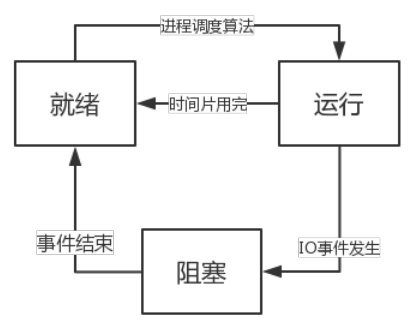
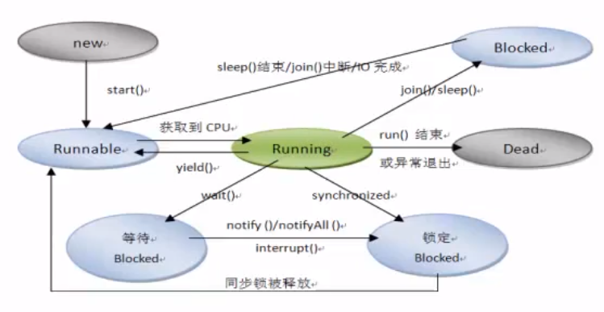

[toc]

# 1.进程与线程

## 1.1 进程

程序是指令和数据的有序集合，其本身没有任何运行的含义，是一个静态的概念。而进程是程序在处理机上的一次执行过程，它是一个动态的概念。进程是一个具有一定独立功能的程序，一个实体，每一个进程都有它自己的地址空间。

## 1.2 进程的状态

进程执行时的间断性，决定了进程可能具有多种状态，有以下三种：

+ 就绪状态  Ready
+ 运行状态  Running
+ 阻塞状态  Blocked



## 1.3 线程

线程实际上是在进程基础之上的进一步划分，一个进程启动之后，里面的若干程序又可以划分成若干个线程。线程：是进程中的一个执行路径，共享一个内存空间，线程之间可以自由切换，并发执行，一个进程最少有一个线程（单线程程序）

一个程序可以同时执行多个任务，来提高效率

+ 并行：就是两个任务同时运行(多个cpu)
+ 并发：是指两个任务同时请求运行，而处理器一次只能接受一个任务，就会把两个任务安排轮流执行，由于CPU时间片运行时间较短，就会感觉两个任务在同时执行。

# 2.线程的基本使用

实现线程的两种方式：

+ 继承Thread类
+ 实现Runnable接口(推荐，因为功能封装在接口里，更加灵活)

```java
public class ThreadDemo1 {
    public static void main(String[] args) {
        MyThread myThread = new MyThread();
        myThread.start();
        MyRunnable myRunnable = new MyRunnable();
        new Thread(myRunnable).start();
    }
}
```

# 3.线程休眠

public static void sleep(long millis) 使当前正在执行的线程以指定的毫秒数暂停，释放cpu时间片，具体取决于系统定时器和调度程序的精度和准确性。线程不会丢失任何显示器的所有权。

如果millis为负数，会抛出IllegalArgumentException异常

在使用sleep()进行休眠的时候，此时如果任何线程中断当前线程（使用interrupt函数），sleep()会抛出异常InterruptedException，当前线程的中断状态将被清除。

public static void sleep(long millis, int nanos)  参数是毫秒，纳秒

static Thread currentThread() 返回对当前正在执行的线程对象的引用

# 4.join与中断线程

+ public final join() throws InterruptedException

  该方法等待此线程死亡，即主进程调用子线程的这个方法时，会等待子线程执行完毕，主进程才会继续往下执行。

+ public void interrupt()

  中断这个线程，只是为该线程做了一个中断标记，要不要中断还是该线程自己决定，如果该线程正在sleep，则无法中断，抛出InterruptedException异常。

+ public static boolean interrupted()  

  测试当前线程是否中断。该方法可以清除线程的中断状态，即如果该方法被连续调用两次，那么第二次调用将返回false（除非当前线程再次中断，第一个调用已经清除其中断状态后）

```java
public class ThreadDemo2 {
    public static void main(String[] args) {
        MyRunnable2 mr2 = new MyRunnable2();
        Thread t = new Thread(mr2);
        t.start();
        for(int i=0;i<10;i++){
            System.out.println(Thread.currentThread().getName()+"--"+i);
            try {
                Thread.sleep(200);
                if(i==5){
//                    t.join();
                    t.interrupt();//中断线程，只是做了中断标记
                    //此时只会抛出异常，不会中断t线程
                }
            } catch (InterruptedException e) {
                e.printStackTrace();
            }
        }

    }
}
class MyRunnable2 implements Runnable{
    @Override
    public void run() {
        for(int i=0;i<10;i++){
            System.out.println(Thread.currentThread().getName()+"--"+i);
            try {
                Thread.sleep(200);
            } catch (InterruptedException e) {
                e.printStackTrace();
            }
        }

    }
}
```

上面的例子会由于t线程在休眠中，无法进行中断操作，所以会抛出异常。下面的例子则正确展示了如何解决这种问题：

```java
public class ThreadDemo2 {
    public static void main(String[] args) {
        MyRunnable2 mr2 = new MyRunnable2();
        Thread t = new Thread(mr2);
        t.start();
        for(int i=0;i<10;i++){
            System.out.println(Thread.currentThread().getName()+"--"+i);
            try {
                Thread.sleep(200);
                if(i==5){
//                    t.join();
                    t.interrupt();//中断线程，只是做了中断标记
                }
            } catch (InterruptedException e) {
                e.printStackTrace();
            }
        }

    }
}
class MyRunnable2 implements Runnable{
    @Override
    public void run() {
        for(int i=0;i<10;i++){
            if(Thread.interrupted()){
                break;
            }
            System.out.println(Thread.currentThread().getName()+"--"+i);
            try {
                Thread.sleep(200);
            } catch (InterruptedException e) {
                e.printStackTrace();
                Thread.currentThread().interrupt();
            }
        }

    }
}
```

在t线程里抛出异常后，会在catch里打上中断标记，那么在下一次循环里，会被Thread.interrupted()获取到，返回true，从而正确中断循环。这样会比较麻烦，建议使用**自定义中断标记**：

```java
class MyRunnable3 implements Runnable{
    private boolean flag;

    public void setFlag(boolean flag) {
        this.flag = flag;
    }

    public MyRunnable3(){
        flag=true;
    }
    @Override
    public void run() {
        while (flag){
            
        }
    }
}
```

# 5.守护线程与yield

Java程序入口就是由JVM启动`main`线程，`main`线程又可以启动其他线程。当所有线程都运行结束时，JVM退出，进程结束。

如果有一个线程没有退出，JVM进程就不会退出。所以，必须保证所有线程都能及时结束。

但是有一种线程的目的就是无限循环，例如，一个定时触发任务的线程：

```java
class TimerThread extends Thread {
    @Override
    public void run() {
        while (true) {
            System.out.println(LocalTime.now());
            try {
                Thread.sleep(1000);
            } catch (InterruptedException e) {
                break;
            }
        }
    }
}
```

如果这个线程不结束，JVM进程就无法结束。问题是，由谁负责结束这个线程？

然而这类线程经常没有负责人来负责结束它们。但是，当其他线程结束时，JVM进程又必须要结束，怎么办？

答案是使用守护线程（Daemon Thread）。

守护线程是指为其他线程服务的线程。在JVM中，所有非守护线程都执行完毕后，无论有没有守护线程，虚拟机都会自动退出。

因此，JVM退出时，不必关心守护线程是否已结束。

在守护线程中，编写代码要注意：守护线程不能持有任何需要关闭的资源，例如打开文件等，因为虚拟机退出时，守护线程没有任何机会来关闭文件，这会导致数据丢失。

** 引用自：[廖雪峰的官方网站](https://www.liaoxuefeng.com/wiki/1252599548343744/1306580788183074)

| 方法                                    | 介绍                                         |
| --------------------------------------- | -------------------------------------------- |
| public final void setDaemon(boolean on) | 将此线程标记为deamon线程或用户线程。         |
| public final boolean isDaemon()         | 测试这个线程是否为守护线程                   |
| public static void yield()              | 暂停当前正在执行的线程对象，并执行其他线程。 |

```java
public class ThreadDemo3 {
    public static void main(String[] args) {
        MyRunnable4 mr4 = new MyRunnable4();
        Thread t = new Thread(mr4);
        t.setName("Thread-t");
        //优先级高可以提高该线程抢点CPU时间片的概率
        t.setPriority(Thread.MAX_PRIORITY);
        
        //线程可以分为守护线程和用户线程，当进程中没有用户线程时，jvm会退出
        t.setDaemon(true);//把线程设置为守护线程
        System.out.println(t.isAlive());
        t.start();
        System.out.println(t.isAlive());

        for(int i=0;i<10;i++){
            System.out.println(Thread.currentThread().getName()+"--"+i);
            try {
                Thread.sleep(200);
            } catch (InterruptedException e) {
                e.printStackTrace();
            }
            if(i==5){
                Thread.yield();//让出本次cpu时间片
            }
        }
    }
}
class MyRunnable4 implements Runnable{
    @Override
    public void run() {
        for(int i=0;i<10;i++){
            System.out.println(Thread.currentThread().getName()+"--"+i);
            try {
                Thread.sleep(200);
            } catch (InterruptedException e) {
                e.printStackTrace();
            }
        }
    }
}
```

# 7.线程同步

## 7.1 多线程共享数据

在多线程的操作中，多个线程有可能同时处理同一个资源，这就是多线程的共享数据。

## 7.2 线程同步

解决数据共享问题，必须使用同步，所谓同步就是指多个线程在同一个时间段内只能有一个线程执行指定代码，其他线程需要等待此线程完成之后才可以继续执行。牺牲性能换取安全，所以同步的代码块尽量保持简短。

线程同步的方法：

+ 同步代码块

  synchronized(要同步的对象){

  ​	要同步的操作；

  }

+ 同步方法

  public synchronized void method(){

  ​	要同步的操作；

  }

+ Lock（ReentrantLock）

## 7.3 同步准则

+ 使代码块保持简短，把不随线程变化的预处理和后处理移除synchronized块
+ 不要阻塞，如InputStream.read()
+ 在持有锁时，不要对其他对象调用方法

```java
public class ThreadDemo4 {
    public static void main(String[] args) {
        MyRunnable5 mr5 = new MyRunnable5();
        Thread t1 = new Thread(mr5);
        Thread t2 = new Thread(mr5);
        t1.start();
        t2.start();
    }
}

class MyRunnable5 implements Runnable{
    private int ticket=10;//售票
    //public Object obj = new Object();
    @Override
    public void run() {
        for(int i=0;i<20;i++){
                synchronized (this){//可以用obj
                    if(ticket>0){
                        ticket--;
                        try {
                            Thread.sleep(1000);
                        } catch (InterruptedException e) {
                            e.printStackTrace();
                        }
                        System.out.println("您购买的票已剩余"+ticket+"张");
                    }
                }
                method();
        }
    }
    private synchronized void method(){
        if(ticket>0) {
            ticket--;
            try {
                Thread.sleep(1000);
            } catch (InterruptedException e) {
                e.printStackTrace();
            }
            System.out.println("您购买的票已剩余" + ticket + "张");
        }
    }
    //lock实现同步
    //互斥锁
    ReentrantLock lock = new ReentrantLock();
    private void method2(){
        lock.lock();//锁
        if(ticket>0) {
            ticket--;
            try {
                Thread.sleep(1000);
            } catch (InterruptedException e) {
                e.printStackTrace();
            }
            System.out.println("您购买的票已剩余" + ticket + "张");
        }
        lock.unlock();//释放锁
    }
}
```

# 8.死锁

多线程中要进行资源的共享，就需要同步，但同步过多，就可能造成死锁。

[Java多线程，死锁](https://www.cnblogs.com/xiaoxi/p/8311034.html)

# 9.生产者与消费者案例

生产者不断生产产品，消费者不断取走产品

```java
public class ProducterCustomerDemo {
    public static void main(String[] args) {
        Food food = new Food();
        Producter p = new Producter(food);
        CustomerR c = new CustomerR(food);
        Thread t1 = new Thread(p);
        Thread t2 = new Thread(c);
        t1.start();
        t2.start();

    }
}
//生产者
class Producter implements Runnable{
    private Food food;

    public Producter(Food food) {
        this.food = food;
    }

    @Override
    public void run() {
        for(int i=0;i<20;i++){
            if(i%2==0){
                food.set("锅包肉","酸甜口味");
            }else {
                food.set("佛跳墙","xxxxxxx");
            }
        }
    }
}
//消费者
class CustomerR implements Runnable{
    private Food food;

    public CustomerR(Food food) {
        this.food = food;
    }

    @Override
    public void run() {
        for(int i=0;i<20;i++){
            food.get();
        }
    }
}


class Food{
    private String name;
    private String desc;
    private boolean flag = true;//true表示可以生产，false表示不能生产
    //有了flag能使两个线程协同工作，先生产，再消费，交替进行。
    //sleep：让线程进入休眠，让出cpu的时间片，不释放对象监视器的所有权（对象锁）
    //wait： 让线程进入等待状态，让出cpu的时间片，并释放对象监视器的所有权，等待其他线程通过notify方法来唤醒
    //生产产品
    public synchronized void set(String name,String desc){
        if(!flag){
            //不能生产
            try {
                this.wait();//线程进入等待状态，释放监视器的所有权（对象锁）
            } catch (InterruptedException e) {
                e.printStackTrace();
            }
        }
        this.setName(name);
        try {
            Thread.sleep(500);
        } catch (InterruptedException e) {
            e.printStackTrace();
        }
        this.setDesc(desc);
        flag=false;
        this.notify();//唤醒等待的线程（随机的一个）
    }
    //获得产品
    public synchronized void get(){
        if(flag){
            //不能消费
            try {
                this.wait();
            } catch (InterruptedException e) {
                e.printStackTrace();
            }

        }
        try {
            Thread.sleep(500);
        } catch (InterruptedException e) {
            e.printStackTrace();
        }
        System.out.println(this.getName()+" - "+this.getDesc());
        flag = true;
        this.notify();
    }


    public Food(String name, String desc) {
        this.name = name;
        this.desc = desc;
    }
    public Food() {
    }

    @Override
    public String toString() {
        return "Food{" +
                "name='" + name + '\'' +
                ", desc='" + desc + '\'' +
                '}';
    }

    public String getName() {
        return name;
    }

    public void setName(String name) {
        this.name = name;
    }

    public String getDesc() {
        return desc;
    }

    public void setDesc(String desc) {
        this.desc = desc;
    }
}
```

# 10.线程的生命周期



# 11.线程池

线程池是预先创建线程的一种技术，在还没有任务到来之前，创建一定数量的线程，放入空闲队列中，然后对这些资源进行复用，减少频繁地创建和销毁对象。

java里线程池的顶级接口是Executor，是一个执行线程的工具，线程池接口是ExecutorService。

java.util.concurrent包：并发编程中很常用的实用工具类

Executor接口：执行已提交的Runnable任务对象

ExecutorService接口：Executor提供了管理终止的方法，以及可以为跟踪一个或多个异步任务执行状况而生成Future的方法。

Executors类：此包中所定义的Executor、ExecutorService等的工厂和实用方法。

四种创建线程池的方法：

+ newSingleThreadExecutor:

  创建一个单线程的线程池。只有一个线程在工作，串行执行所有任务。如果这个唯一的线程因为异常而结束，则会有一个新的线程来代替它。此线程池能保证所有任务的执行顺序按照任务的提交顺序执行

+ newFixedThreadPool: 

  创建固定大小的线程池，每次提交一个任务就创建一个线程，直到线程达到线程池的最大大小。线程池的大小一旦达到最大值则保持不变，如果某个线程因执行异常而结束，那么线程池会补充一个新线程。

+ newCachedThreadPool:

  创建一个可缓存的线程池。如果线程池的大小超过了处理任务所需要的线程，那么就会回收部分空闲（60秒不执行任务）的线程，当任务数增加时，又可以智能地添加新线程来处理任务，此线程池不会对线程池大小做限制，完全依赖于操作系统（或者说jvm）能够创建的最大线程大小

+ newScheduledThreadPool:

  创建一个大小无限的线程池，支持定时以及周期性执行任务的需求。需要传一个代表线程池初始大小的变量作为参数。

```java
public class ThreadDemo5 {
    public static void main(String[] args) {
        //创建线程池的四种方法
        //创建一个单线程的线程池
//        ExecutorService es = Executors.newSingleThreadExecutor();
        //创建一个固定大小的线程池
//        ExecutorService es = Executors.newFixedThreadPool(2);
        ExecutorService es = Executors.newCachedThreadPool();
        es.execute(new MyRunnable6());
        es.execute(new MyRunnable6());
        es.shutdown();

        //延迟2秒执行
        ScheduledExecutorService es2 = Executors.newScheduledThreadPool(3);
        es2.schedule(new MyRunnable6(),9000, TimeUnit.MILLISECONDS);
        es2.shutdown();
    }
}
class MyRunnable6 implements  Runnable{
    @Override
    public void run() {
        for(int i=0;i<10;i++){
            System.out.println(Thread.currentThread().getName()+"--"+i);
            try {
                Thread.sleep(300);
            } catch (InterruptedException e) {
                e.printStackTrace();
            }
        }
    }
}
```