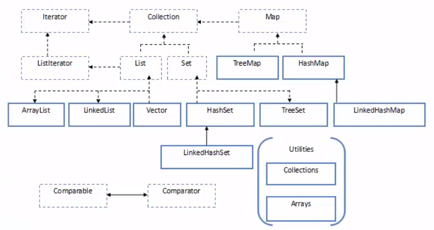

[toc]

# 1.集合概述

**集合框架：**



集合框架是一个用来代表和操纵集合的统一架构。所有的集合框架都包含如下内容：

- **接口：**是代表集合的抽象数据类型。例如 Collection、List、Set、Map 等。之所以定义多个接口，是为了以不同的方式操作集合对象
- **实现（类）：**是集合接口的具体实现。从本质上讲，它们是可重复使用的数据结构，例如：ArrayList、LinkedList、HashSet、HashMap。
- **算法：**是实现集合接口的对象里的方法执行的一些有用的计算，例如：搜索和排序。这些算法被称为多态，那是因为相同的方法可以在相似的接口上有着不同的实现。

除了集合，该框架也定义了几个 Map 接口和类。Map 里存储的是键/值对。尽管 Map 不是集合，但是它们完全整合在集合中。

**collection 接口**

是Collection层次结构中的根接口。Collection表示一组对象，称为collection的元素，一些collection允许有重复的元素，而一些则不允许，可以有序，或无序。此接口不提供任何直接实现，只提供更具体的子接口（如set和list实现）。此接口用来传递collection，并且在最大普遍性的地方操作这些collection。

# 2.List

public interface List< E > extends Collection< E >  

有序的collection，也称为序列。此接口的用户可以对列表中每个元素的插入位置进行精确的控制。用户可以根据元素的整数索引（在列表中的位置）访问元素，并搜索列表中的元素。

常用的有：ArrayList  Vector   LinkedList

```java
public class ListDemo {
    private static void arrayList(){
        List<String> list = new ArrayList<>();
        list.add("xxx");
        list.add("yyy");
        list.add("zzz");
//        list.add(10);//未声明list保存的类型时，可以保存多种类型的元素
        for(int i=0;i<list.size();i++){
            System.out.println(list.get(i));
        }
        if(list.contains("xxx")){
            System.out.println("contain xxx");
        }
        list.remove("yyy");
        String[] array = list.toArray(new String[]{});
        for(String s:array){
            System.out.println(s);
        }
    }
    public static void main(String[] args) {
        arrayList();
    }
}
```

## 2.1 ArrayList

实现原理：

+ 采用动态数组实现，默认构造方法创建了一个空数组
+ 第一次添加元素，扩展容量为10，之后的扩充算法：原来数组大小+原来数组大小的一半
+ 不适合进行删除或插入操作
+ 为了防止数组动态扩充次数过多，建议创建ArrayList时，给定初始容量
+ 线程不安全，适合单线程访问时使用，效率高。

## 2.2 Vector

实现原理：

+ 采用动态数组实现，默认构造方法创建了一个大小为10的对象数组
+ vector的扩充算法：当增量为0时，扩充为原来大小的两倍，当增量大于0时，扩充为原来大小+增量。增量可以在初始化时给定
+ 不适合进行删除或插入操作
+ 为了防止数组动态扩充次数过多，建议创建Vector时，给定初始容量
+ 线程安全，适合在多线程访问时使用，在单线程下使用效率低

## 2.3 LinkedList

实现原理：

+ 采用双向链表结构实现
+ 适合插入，删除操作，性能高


## 2.4 Vector和ArrayList和LinkedList的区别

+ ArrayList是最常用的List实现类，内部是通过数组实现的，它允许对元素进行快速随机访问。数组的缺点是每个元素之间不能有间隔，当数组大小不满足时需要增加存储能力，就要讲已经有数组的数据复制到新的存储空间中。当从ArrayList的中间位置插入或者删除元素时，需要对数组进行复制、移动、代价比较高。因此，它适合随机查找和遍历，不适合插入和删除。
+ Vector与ArrayList一样，也是通过数组实现的，不同的是它支持线程的同步，即某一时刻只有一个线程能够写Vector，避免多线程同时写而引起的不一致性，但实现同步需要很高的花费，因此，访问它比访问ArrayList慢。
+ LinkedList是用链表结构存储数据的，很适合数据的动态插入和删除，随机访问和遍历速度比较慢。另外，他还提供了List接口中没有定义的方法，专门用于操作表头和表尾元素，可以当作堆栈、队列和双向队列使用。
+ vector是线程（Thread）同步（Synchronized）的，所以它也是线程安全的，而Arraylist是线程异步（ASynchronized）的，是不安全的。如果不考虑到线程的安全因素，一般用Arraylist效率比较高。
+ 如果集合中的元素的数目大于目前集合数组的长度时，vector增长率为目前数组长度的100%,而arraylist增长率为目前数组长度的50%.如过在集合中使用数据量比较大的数据，用vector有一定的优势。
+ 如果查找一个指定位置的数据，vector和arraylist使用的时间是相同的，都是0(1),这个时候使用vector和arraylist都可以。而如果移动一个指定位置的数据花费的时间为0(n-i)n为总长度，这个时候就应该考虑到使用Linkedlist,因为它移动一个指定位置的数据所花费的时间为0(1),而查询一个指定位置的数据时花费的时间为0(i)。
+ ArrayList 和Vector是采用数组方式存储数据，此数组元素数大于实际存储的数据以便增加和插入元素，都允许直接序号索引元素，但是插入数据要设计到数组元素移动 等内存操作，所以索引数据快插入数据慢，Vector由于使用了synchronized方法（线程安全）所以性能上比ArrayList要差，LinkedList使用双向链表实现存储，按序号索引数据需要进行向前或向后遍历，但是插入数据时只需要记录本项的前后项即可，所以插入数度较快！

**实际开发中如何选择list的具体实现**：

+ 是否考虑安全性问题
+ 是否频繁插入，删除操作
+ 是否是存储后遍历

# 3.Set

public interface Set< E > extends Collection< E >

一个不包含重复元素的collection，且最多包含一个null对象，无序。常用实现类：HashSet, TreeSet, LinkedHashSet

## 3.1 HashSet

实现原理：

+ 基于哈希表（HashMap）实现
+ 不允许重复，可以有一个null元素
+ 不保证顺序恒久不变
+ 添加元素时把元素作为HashMap的key来存储，HashMap的value使用一个固定的object对象
+ 排除重复元素是通过equals来检查对象是否相同
+ 判断两个对象是否相同，先判断两个对象的hashCode是否相同（如果两个对象的hashCode相同，不一定是同一个对象，如果不同，那一定不是同一个对象），如果不同，则两个对象不是同一个对象。如果相同，还要进行equals判断，equals相同则是同一个对象，不同则不是同一个对象。
+ 自定义对象要认为属性值都相同时为同一个对象，有这种需求时，我们要重写对象所在的hashCode和equals方法。

```java
public class SetDemo {
    private static void hashSet(){
        Set<String> set = new HashSet<>();
        set.add("xxx");
        set.add("yyy");
        set.add("xxx");//重复插入，只会保存一个
        System.out.println(set.size());
        String[] names = set.toArray(new String[]{});
        for(String s:names){
            System.out.println(s);
        }
        //插入的是对象
        Cat c1 = new Cat("xxx",4,1);
        Cat c2 = new Cat("yyy",5,3);
        Cat c3 = new Cat("zzz",1,4);
        Cat c4 = new Cat("xxx",4,1);
        Set<Cat> cats = new HashSet<>();
        cats.add(c1);
        cats.add(c2);
        cats.add(c3);
        cats.add(c4);
        System.out.println(cats.size());//当cat类没有复写hashCode和equals方法时，这里的大小是4，因为是不同的对象，如果有复写，则是3
        for(Cat c:cats){
            System.out.println(c);
        }
        System.out.println("c1="+c1.hashCode()%16);
        System.out.println("c2="+c1.hashCode()%16);
        System.out.println("c3="+c1.hashCode()%16);
        System.out.println("c4="+c1.hashCode()%16);
    }
    public static void main(String[] args) {
       hashSet();
    }
}
```

```java
public class Cat {
    private String name;
    private int age;
    private int id;

    @Override
    public boolean equals(Object o) {
        if (this == o) return true;
        if (o == null || getClass() != o.getClass()) return false;
        Cat cat = (Cat) o;
        return age == cat.age &&
                id == cat.id &&
                Objects.equals(name, cat.name);
    }

    @Override
    public int hashCode() {
        return Objects.hash(name, age, id);
    }

    @Override
    public String toString() {
        return "Cat{" +
                "name='" + name + '\'' +
                ", age=" + age +
                ", id=" + id +
                '}';
    }

    public Cat(String name, int age, int id) {
        this.name = name;
        this.age = age;
        this.id = id;
    }

    public String getName() {
        return name;
    }

    public void setName(String name) {
        this.name = name;
    }

    public int getAge() {
        return age;
    }

    public void setAge(int age) {
        this.age = age;
    }

    public int getId() {
        return id;
    }

    public void setId(int id) {
        this.id = id;
    }
}
```

## 3.2 TreeSet

基于TreeMap的NavigableSet实现。使用元素的自然顺序对元素进行排序，或者根据创建set时提供的Comparator进行排序，具体取决于使用的构造方法。

TreeSet 是有序的，基于TreeMap(二叉树数据结构)，对象需要比较大小，通过对象比较器来实现，对象比较器还可以取出重复元素。如果自定义的数据类没有实现比较器Comparator这个接口，将无法添加到TreeSet中。

```java
public class CatComparator implements Comparator<Cat> {
    @Override
    public int compare(Cat cat, Cat t1) {
        return cat.getAge()-t1.getAge();
    }
}
```

```java
public class SetDemo {
    private static void treeSet(){
        TreeSet<Cat> tree = new TreeSet<>(new CatComparator());//需要实现比较器
        Cat c1 = new Cat("xxx",4,1);
        Cat c2 = new Cat("yyy",5,3);
        Cat c3 = new Cat("zzz",1,4);
        Cat c4 = new Cat("xxx",4,1);//相同的没有插进去
        tree.add(c1);
        tree.add(c2);
        tree.add(c3);
        tree.add(c4);
        System.out.println(tree.size());
        for(Cat c:tree){
            System.out.println(c);
        }
    }
    public static void main(String[] args) {
        treeSet();
    }
}
/*
3
Cat{name='zzz', age=1, id=4}
Cat{name='xxx', age=4, id=1}
Cat{name='yyy', age=5, id=3}
*/
```

## 3.3 LinkedHashSet

具有可预知迭代顺序的Set接口的哈希表和链接列表实现。此实现与HashSet的不同之处在于，其维护着一个运行于所有条目的双重链接列表。此链接列表定义了迭代顺序，即将元素插入到set中的顺序（插入顺序）进行迭代。插入顺序不受set中重新插入的元素的影响。（如果在s.contains(e)返回true后立即调用s.add(e)，则元素e会被重新插入到set s中。如果实现了hashCode和equals方法，则不会重复插入）。

这样做的意义或者好处就是LinkedHashSet中的元素顺序是可以保证的，也就是说遍历序和插入序是一致的。

```java
public class SetDemo {
    private static void linkedHashSet(){
        LinkedHashSet<Cat> tree = new LinkedHashSet<>();
        Cat c1 = new Cat("xxx",4,1);
        Cat c2 = new Cat("yyy",5,3);
        Cat c3 = new Cat("zzz",1,4);
        Cat c4 = new Cat("xxx",4,1);//相同的没有插进去
        tree.add(c1);
        tree.add(c2);
        tree.add(c3);
        tree.add(c4);
        System.out.println(tree.size());
        for(Cat c:tree){
            System.out.println(c);
        }
    }
    public static void main(String[] args) {
        linkedHashSet();
    }
}
/*
3
Cat{name='xxx', age=4, id=1}
Cat{name='yyy', age=5, id=3}
Cat{name='zzz', age=1, id=4}
*/
```

# 4.集合的遍历

+ foreach

+ Iterator

  对collection进行迭代的迭代器

  | 方法              | 介绍                                                   |
  | ----------------- | ------------------------------------------------------ |
  | boolean hasNext() | 如果仍有元素可以迭代，则返回true                       |
  | E next()          | 返回迭代的下一个元素                                   |
  | void remove()     | 从迭代器指向的collection中移除迭代器返回的最后一个元素 |

  

+ ListIterator 列表迭代器，允许程序按任一方向遍历列表，迭代期间修改列表，并获得迭代器在列表中的当前位置。

  |                       | 介绍                 |
  | --------------------- | -------------------- |
  | void add(E e)         | 增加元素             |
  | boolean hasPrevious() | 判断是否有前一个元素 |
  | E previous()          | 取出前一个元素       |
  | void set(E e)         | 修改元素的内容       |
  | int previousIndex()   | 前一个索引位置       |
  | int nextIndex()       | 下一个索引位置       |

+ Enumeration  实现Enumeration接口的对象，它生成一系列元素，一次生成一个。连续调用nextElement方法将返回一系列的连续元素。

  注：此接口的功能与Iterator接口的功能重复，建议使用Iterator

  | 方法                      | 介绍                 |
  | ------------------------- | -------------------- |
  | boolean hasMoreElements() | 判断是否有下一个元素 |
  | E nextElement()           | 取出当前元素         |

  ```java
  public class IteratorDemo {
      //foreach
      private static void foreach(Collection<Cat> c){
          for(Cat cat:c){
              System.out.println(cat);
          }
          System.out.println("--------------------");
          c.forEach((Cat cat) -> {
              System.out.println(cat);
          });
          System.out.println("--------------------");
          c.forEach( cat -> {
              System.out.println(cat);
          });
          System.out.println("--------------------");
          c.forEach(System.out::println);
  
      }
      //iterator
      private static void iterator(Collection<Cat> c){
          Iterator<Cat> iter = c.iterator();
          while (iter.hasNext()){
              System.out.println(iter.next());
          }
      }
      private static void enumeration(){
          Vector<String> vs = new Vector<>();
          vs.add("xxx");
          vs.add("yyy");
          Enumeration<String> es = vs.elements();
          while (es.hasMoreElements()){
              System.out.println(es.nextElement());
          }
      }
  
      public static void main(String[] args) {
          List<Cat> list = new ArrayList<>();
          Cat c1 = new Cat("xxx",4,1);
          Cat c2 = new Cat("yyy",5,3);
          Cat c3 = new Cat("zzz",1,4);
          Cat c4 = new Cat("x7x",4,1);
          list.add(c1);
          list.add(c2);
          list.add(c3);
          list.add(c4);
          foreach(list);
  //        iterator(list);
  //        enumeration();
      }
  
  }
  ```

# 5.Map

  public interface Map<k ,V>

  将键映射到值的对象，一个映射不能包含重复的键，每个键最多只能映射到一个值。

  具体的实现类：HashMap, TreeMap, Hashtable, LinkedHashMap

| 方法                                | 介绍                          |
| ----------------------------------- | ----------------------------- |
| void clear()                        | 清空Map集合中的内容           |
| boolean containsKey(Object key)     | 判断集合中是否存在指定的key   |
| boolean containsValue(Object value) | 判断集合中是否存在指定的value |
| Set<Map,Entry<K,V>> entrySet()      | 将Map接口变为Set集合          |
| V get(Object key)                   | 根据key找到其对应的value      |

## 5.1 HashMap

public class HashMap< K , V > extends AbstractMap< K, V > implements Map < K, V > ,Cloneable,Serializable

基于哈希表的Map接口的实现。此实现提供所有可选的映射操作，并允许使用null值和null键。（除了非同步和允许使用null之外，HashMap类与Hashtable大致相同。）此类不保证映射的顺序，特别是它不保证该顺序恒久不变。

```java
public class MapDemo {
    private static void hashMap(){
        Map<Integer,String> map = new HashMap<>();
        map.put(1,"xx");
        map.put(2,"yy");
        map.put(3,"zz");
        System.out.println("size = "+ map.size());
        System.out.println(map.get(1));
        //Map的遍历1  遍历entry
        Set<Entry<Integer,String>> entrySet =  map.entrySet();
        for(Entry e:entrySet){
            System.out.println(e.getKey()+"->"+e.getValue());
        }
        //Map的遍历2  遍历键
        Set<Integer> keys = map.keySet();
        for(Integer i:keys){
            String value = map.get(i);
            System.out.println(i+"->"+value);
        }
        //Map的遍历3  遍历值
        Collection<String> values = map.values();
        for(String s :values) {
            System.out.println(s);
        }
        //Map的遍历4  foreacn
        map.forEach((key,value)-> System.out.println(key+"->"+value));
    }
    public static void main(String[] args) {
        hashMap();
    }
}
```

实现原理：

+ 基于哈希表（数组+链表+二叉树（红黑树））二叉树是1.8新增的
+ 加载因子0.75，默认数组大小为16
+ 对象存储在哈希表中，把key对象通过hash()方法计算hash值，用此hash值对数组长度取余（默认16），来决定对key对象在数组中的存储位置，当这个位置有多个对象时，以链表结构存储，Jdk1.8后，当链表长度大于8时，链表将转换为红黑树结构存储。目的是为了取值时提高效率，取值更快。存储的数据量越大，性能的表现越明显。
+ **扩充原理**：当数组的容量超过了75%，那么表示该数组需要扩充。当前数组容量扩大一倍。扩充次数过多会影响性能，每次扩充时哈希表都会重新散列（重新计算每个对象的存储位置）。
+ 线程不安全，适合单线程中使用。

## 5.2 Hashtable

public class Hashtable< K,V > extends Dictionary< K, V > implements Map< K,V >,Cloneable, Serializable

此类实现一个哈希表，该哈希表将键映射到相应的值。任何非null对象都可以用作键或值。为了成功地在哈希表中存储和获取对象，用作键的对象必须实现hashCode方法和equals方法。

 Hashtable与HashMap的区别：

+ Hashtable 从JDK1.0开始就有了，基于哈希表实现（数组+链表），默认数组大小为11，加载因子0.75，扩充方式为：原数组扩大一倍并+1。Hashtable是线程安全的，用于多线程。

## 5.3 LinkedHashMap

Map接口的哈希表和链接列表的实现，具有可预知的迭代顺序。是HashMap的子类，可以保证顺序恒久不变。此类使用一个双重链表来维护元素添加的顺序。

## 5.4 TreeMap

基于红黑树的NavigableMap实现。该映射根据其键的自然顺序进行排序，或者根据创建映射时提供的Comparator进行排序，具体取决于使用的构造方法。

```java
public class MapDemo {
    private static void treeMap(){
        Map<String,String> table = new TreeMap<>();
        table.put("one","lllll");
        table.put("two","xxxxx");
        table.put("three","bbbbb");
        table.forEach((key,value)-> System.out.println(key+"->"+value));

        Map<Dog,String> dogs = new TreeMap<>();
        dogs.put(new Dog("hhh",2,1),"lllll");
        dogs.put(new Dog("hx",5,2),"lll13");
        dogs.put(new Dog("hdfh",3,3),"lllll44");
        dogs.forEach((key,value)-> System.out.println(key+"->"+value));

    }


    public static void main(String[] args) {
        treeMap();
    }
}
```

```java
public class Dog implements Comparable<Dog>{
    private String name;
    private int age;
    private int id;

    @Override
    public String toString() {
        return "Cat{" +
                "name='" + name + '\'' +
                ", age=" + age +
                ", id=" + id +
                '}';
    }

    public Dog(String name, int age, int id) {
        this.name = name;
        this.age = age;
        this.id = id;
    }

    //。。。getter setter。。。

    @Override
    public int compareTo(Dog dog) {
        return this.id-dog.id;
    }
}
```

## 5.5 JDK1.8添加的Map接口的新方法

```java
public class MapNewMethodDemo {
    public static void main(String[] args) {
        Map<Integer,String> map = new HashMap<>();
        map.put(1,"jack");
        map.put(2,"tom");
        map.put(3,"lily");
        //取不到值时，使用默认值
        String value = map.getOrDefault(4,"null");
        System.out.println(value);
        //添加值，只会添加不存在key的值，如果已经存在key，则不会替换
        String val = map.putIfAbsent(3,"vince");
        System.out.println(val);
        //删除 只有键和值都匹配时才会删除
        map.remove(3,"lily1");
        //代替
        map.replace(3,"vince");
        map.replace(3,"vince","vince1");//只有第一个参数的key，和第二个参数的value匹配，才能替换

        //计算,为给定的key修改value
        map.compute(1,(k,v1)->v1+"1");
        map.computeIfAbsent(5,(k)->k+"xxx");//如果没有这个k才会添加
        //合并
        map.merge(1,"888",(oldv,newv)->oldv.concat(newv));
        //遍历
        map.forEach((k,v)-> System.out.println(k+"->"+v));
    }
}
```

# 6.Collections工具类

Collections工具类提供了大量针对collection/map的操作，总体可分为四类，都为静态方法。

## 6.1 排序操作

主要针对list接口

| 方法                           | 介绍                                                         |
| ------------------------------ | ------------------------------------------------------------ |
| reverse(List list)             | 反转指定list集合中的元素顺序                                 |
| shuffle(List list)             | 对list中的元素进行随机排序（洗牌）                           |
| sort(List list)                | 对list里的元素根据自然升序排序                               |
| sort(List list,Comparator c)   | 自定义比较器排序                                             |
| swap(List list,int i,int j)    | 将指定list集合中i处元素和j处元素进行交换                     |
| rotate(List list,int distance) | 将所有元素向右移位指定长度，如果distance等于size那么结果不变 |

## 6.2 查找和替换

主要针对Collection接口

| 方法                                        | 介绍                                                         |
| ------------------------------------------- | ------------------------------------------------------------ |
| binarySerach(List list,Object key)          | 使用二分搜索，获取指定对象在list中的索引，前提是集合已经排序 |
| max(Collection coll)                        | 返回最大元素                                                 |
| max(Collection coll, Comparator comp)       | 根据自定义比较器，返回最大元素                               |
| min(Collection coll)                        | 返回最小元素                                                 |
| min(Collection coll, Comparator comp)       | 根据自定义比较器，返回最小元素                               |
| fill(List list,Object obj)                  | 使用指定对象填充                                             |
| frequency(Collection coll,Object o)         | 返回指定集合中指定对象出现的次数                             |
| replaceAll(List list,Object old,Object new) | 替换                                                         |

## 6.3 同步控制

Collections 工具类中提供了多个synchronizedXxx方法，该方法返回指定集合对象对应的同步对象，从而解决多线程并发访问集合时线程的安全问题。HashSet、ArrayList、HashMap都是线程不安全的，如果需要考虑同步，则使用这些方法：synchronizedSet, synchronizedSortSet, synchronizedList, synchronizedMap, synchronizedSortMap。**需要注意的是，在使用迭代方法遍历集合时，需要手工同步返回的集合。**

##  6.4 设置不可变集合

 Collections 有三类方法可以返回一个不可变集合：

| 方法              | 介绍                                       |
| ----------------- | ------------------------------------------ |
| emptyXxx()        | 返回一个空的不可变的集合对象               |
| singletonXxx()    | 返回一个只包含指定对象的，不可变的集合对象 |
| unmodifiableXxx() | 返回指定集合对象的不可变视图               |

## 6.5 其他

| 方法                                                | 介绍                                                         |
| --------------------------------------------------- | ------------------------------------------------------------ |
| disjoint(Collection< ? > c1, Collection< ? > c2 )   | 如果指定collection中没有相同的元素，则返回true               |
| addAll(Collection< ? super T > c, T ... a)          | 一种方便的方式，将所有指定元素添加到指定collection中         |
| Comparator< T > reverseOrder (Comparator < T > cmp) | 返回一个比较器，它强行反转指定比较器的顺序。如果指定比较器为null，则此方法等同于reverseOreder()。（换句话说，它返回一个比较器，该比较器将强行反转实现Comparable接口那些对象Collection上的自然顺序） |

```java
public class CollectionsDemo {
    public static void main(String[] args) {
        List<String> list = new ArrayList<>();
        list.add("xxx");
        list.add("yyy");
        list.add("zzz");
        //排序
//        Collections.reverse(list);
//        Collections.shuffle(list);
//        Collections.sort(list);
//        Collections.swap(list,0,2);
//        Collections.rotate(list,1);

        //查找和替换
//        System.out.println(Collections.binarySearch(list,"yyy"));
//        System.out.println(Collections.max(list));
//        System.out.println(Collections.min(list));
//        Collections.fill(list,"bin");
//        System.out.println(Collections.frequency(list,"xxx"));
//        Collections.replaceAll(list,"xxx","bin");

        //同步控制
        List<String> syncList = Collections.synchronizedList(new ArrayList<String>());

        //设置不可变集合，
//        List<String> slist = Collections.emptyList();
//        slist.add("bing");//会抛出异常，不可添加
        //这个不可变的空list可以用于方法返回值，在方法调用后得到的结果通过size来判断是否有值，而不需要判断是否为空。
        /*比如：
        public static List<String> count(){
            List<String> list = null;
            if(....==null){
                return Collections.emptyList();
            }
        }
        List<String> li = count():
        if(li.size()==0){
            //....
        }
        */

        //反转排序
        Collections.sort(list,Collections.reverseOrder());

        System.out.println("-------");
        list.forEach(System.out::println);
    }
}
```

 # 7.Optional容器类（JDK1.8)

Opational容器类是一个可以为null的容器对象。如果值存在则isPresent()方法会返回true，调用get()方法会返回该对象

| 方法        | 介绍                                                         |
| ----------- | ------------------------------------------------------------ |
| of          | 为非null的值创建一个Optional                                 |
| ofNullable  | 为指定的值创建一个Optional，如果指定的值为null，则返回一个空的Optional |
| isPresent   | 如果值存在则返回ture，否则false                              |
| get         | 如果Optional有值，则将其返回，否则抛出NoSuchElementException |
| ifPresent   | 如果Optional实例有值，则为其调用consumer，否则不做处理       |
| orElse      | 如果有值将其返回，否则返回他的指定值                         |
| orElseGet   | 与orElse类似，区别在于得到的默认值。orELse将传入的字符串作为默认值，orElseGet可以接受Supplier接口的实现用来生成默认值 |
| orElseThrow | 如果有值则将其返回，否则抛出supplier接口创建的异常           |
| map         | 如果有值，则对其执行调用mapping函数得到返回值，如果返回值不为null，则创建包含mapping返回值的Optional作为map方法返回值，否则返回空optional |
| flatMap     | 如果有值，为其执行mapping函数返回optional类型返回值，否则返回空optional。flatMap与map方法类似，区别在于flatMap中的mapper返回值必须是optional。调用结束时，flatMap不会对结果用optional封装。 |
| filter      | 如果有值并且满足断言条件，返回包含该值的optional，否则返回空optional |

```java
public class OpationalDemo {
    public static void main(String[] args) {
        //创建方式
        Optional<String> opt = Optional.of("bin");
//        Optional<String> opt1 = Optional.ofNullable("bin");
        Optional<String> opt2  = Optional.empty();
        System.out.println(opt.isPresent());
        System.out.println(opt.get());
        opt.ifPresent((value)-> System.out.println(value));
        System.out.println(opt2.orElse("没有值"));
        System.out.println(opt2.orElseGet(()->"default"));
//        try {
//            opt2.orElseThrow(Exception::new);
//        } catch (Exception e) {
//            e.printStackTrace();
//        }
        Optional<String> opt3 = opt.map((value)->value.toUpperCase());
        System.out.println(opt3.orElse("no value"));

        Optional<String> opt4 = opt.flatMap((value)->Optional.of(value.toUpperCase()));
        System.out.println(opt4.orElse("no value"));

        Optional<String> opt5 = opt.filter((v)->v.length()>3);
        System.out.println(opt5.orElse("小于3"));
    }
}
/*
true
bin
bin
没有值
default
BIN
BIN
小于3

Process finished with exit code 0

*/
```

# 8.Queue和Deque

队列（Queue）是一种特殊的线性表，先进先出，只允许在表的前端（front，队头）进行删除操作，在表的后端（rear，队尾）进行插入操作。队列中没有元素时，称为空队列。

LinkedList是Queue接口的实现类

| 方法               | 介绍                                                         |
| ------------------ | ------------------------------------------------------------ |
| boolean add(E e)   | 向队列插入元素，成功时返回true，如果没有可用的空间，则抛出IllegalStateException |
| E element()        | 获取但不移除队头元素                                         |
| boolean offer(E e) | 向队列插入元素，成功时返回true，此方法优于add(E)             |
| E peek()           | 获取但不移除队头元素,若队列为空则返回null                    |
| E poll()           | 获取并移除队头元素,若队列为空则返回null                      |
| E remove()         | 获取并移除队头元素                                           |

Deque: 一个线性collection，支持在两端插入和移除元素。

此接口既支持有容量限制的双端队列，也支持没有固定大小限制的双端队列。接口定义在双端队列两端访问元素的方法，提供插入，移除和检查元素的方法。

```java
public class QueueDequeDemo {

    private static void queue(){
        Queue<String> queue = new LinkedList<>();
        queue.add("xxx");
        queue.add("yyy");
        queue.add("zzz");
        System.out.println(queue.size());
        System.out.println(queue.peek());
        System.out.println(queue.size());
        System.out.println(queue.poll());
        System.out.println(queue.size());
    }
    private static void deque(){
        Deque<String> deque = new LinkedList<>();
        deque.add("xxx");
        deque.add("yyy");
        deque.add("zzz");
        System.out.println(deque.size());
        System.out.println(deque.getFirst());
        System.out.println(deque.getLast());
    }
    public static void main(String[] args) {
        deque();
    }
}
```

