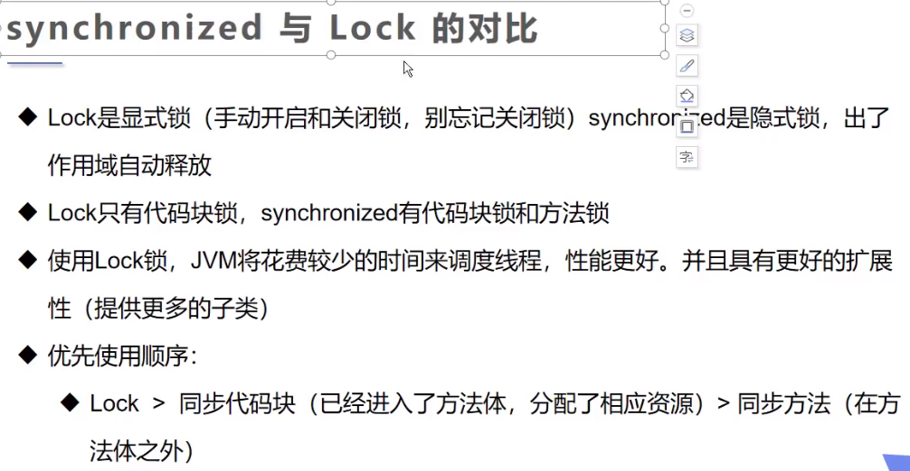

# 一，创建线程的方式
> start()和run()的区别
> 用start方法来启动线程，真正实现了多线程运行，这时无需等待run方法体代码执行完毕而直接继续执行下面的代码。通过调用Thread类的start()方法来启动一个线程，这时此线程处于就绪（可运行）状态，并没有运行，一旦得到cpu时间片，就开始执行run()方法，这里方法run()称为线程体，它包含了要执行的这个线程的内容，run方法运行结束，此线程随即终止。此时会出现异步执行的效果
> run方法只是thread的一个普通方法调用，还是在主线程里执行，是不会开启多线程的，同步执行
## 1.继承Thread类，重写run()方法
```java
public class MyThread extends Thread {
    @Override
    public void run() {
        for (int i = 0; i < 20; i++) {
            System.out.println("我在看代码"+i);
        }
    }

    public static void main(String[] args) {
        MyThread thread = new MyThread();
        thread.start();
        for (int i = 0; i < 1000; i++) {
            System.out.println("我在学习多线程"+i);
        }
    }
}
```

## 2.实现Runnable接口，重写run()方法---静态代理

```java
class MyRunnable implements Runnable{
    @Override
    public void run() {
        for (int i = 0; i < 20; i++) {
            System.out.println("我在看代码"+i);
        }
    }

    public static void main(String[] args) {
        new Thread(new MyRunnable()).start();
        for (int i = 0; i < 1000; i++) {
            System.out.println("我在学习多线程"+i);
        }
    }
}
```

## 3.实现callable接口
> callable的好处
> 1. 可以定义返回值   2. 可以抛出异常

```java
class MyCallable implements Callable<Integer> {
    private int a;
    public MyCallable(int a){
        this.a=a;
    }

    @Override
    public Integer call() throws Exception {
        return a;
    }

    public static void main(String[] args) throws ExecutionException,InterruptedException {
        MyCallable m1 = new MyCallable(1);
        MyCallable m2 = new MyCallable(2);
        ExecutorService ser = Executors.newFixedThreadPool(2);
        Future<Integer> r1 = ser.submit(m1);
        Future<Integer> r2 = ser.submit(m2);
        System.out.println(r1.get());
        System.out.println(r2.get());
        ser.shutdownNow();
    }
}
```

# 二，线程的状态


# 三，线程方法


```java
Runnable a = new Runnable() {
    @Override
    public void run() {
        System.out.println(Thread.currentThread().getName()+"开始执行");
        Thread.yield();
        System.out.println(Thread.currentThread().getName()+"结束执行");
    }
};
new Thread(a,"a").start();
new Thread(a,"b").start();
```



# 四，线程协作


