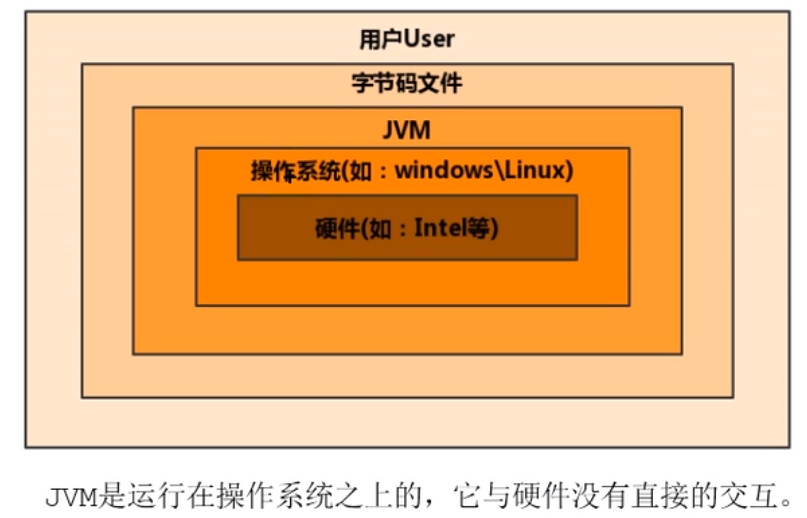
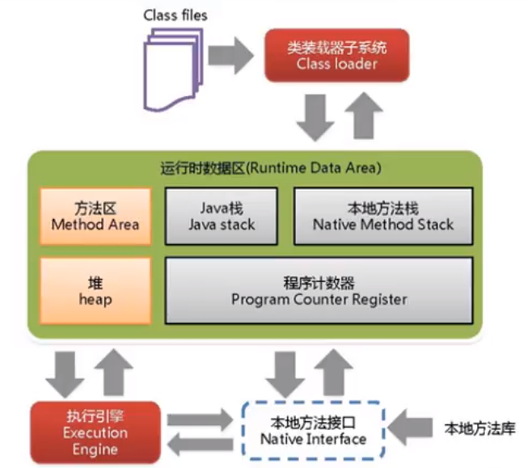
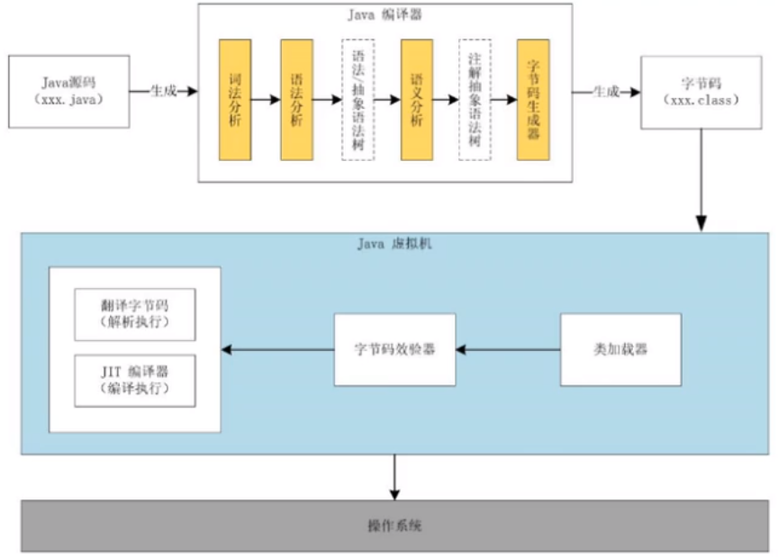

[toc]

# 字节码

字节码（Byte-code）是一种包含执行程序，由一序列 op 代码/数据对组成的[二进制文件](https://baike.baidu.com/item/二进制文件/996661)，是一种中间码。

我们平常说的java字节码，指的是用java语言编译成的字节码。准确的说任何能在JVM平台上执行的字节码格式都是一样的，所以应该统称为**JVM字节码**。不同语言、不同的编译器可以编译出相同的字节码，字节码文件也可以在不同的JVM上运行（Linux平台、windows平台等）。

Java虚拟机与Java语言并没有必然的联系，它只与特定的二进制文件格式--Class文件格式所关联，Class文件中包含了Java虚拟机指令集（或者成为字节码，Bytecodes）和符号表，还有一些其他辅助信息。

# 虚拟机

虚拟机（Virtual Machine）就是一台虚拟的计算机，是一款软件，用来执行一些列虚拟计算机指令。虚拟机可分为以下两类：

+ 系统虚拟机：对物理计算机的仿真，提供可运行完整操作系统的软件平台。如visual box
+ 程序虚拟机：专门为执行单个计算机程序而设计，典型代表是java虚拟机，在java虚拟机中执行的指令我们称为java字节码指令。

无论是系统虚拟机还是程序虚拟机，在上面运行的软件都被限制于虚拟机提供的资源中。

# Java虚拟机

是一台执行java字节码的虚拟计算机，它拥有独立的运行机制，其运行的java字节码也未必由java语言编译而成。

JVM平台的各种语言可以共享java虚拟机带来的跨平台性，优秀的垃圾回收器，以及可靠的即时编译器。

java技术的核心就是java虚拟机，（JVM，java virtual machine）因为所有的java程序都运行在java虚拟机内部。

**作用**：java虚拟机就是二进制字节码的运行环境，负责装载字节码到其内部，解释/编译对应平台上的机器指令执行。每一条java指令，java虚拟机规范中都有详细定义，如怎么取操作数，怎么处理操作数，处理结果放在哪里。

**特点**：一次编译，导出运行；自动内存管理；自动垃圾回收功能

**JVM的位置**

从java文件编译成class文件，需要前端编译器，如javac。

# JVM的整体结构

HotSpot VM是目前市面上高性能虚拟机的代表之一，它采用解释器与即时编译器并存的架构。

# Java代码执行流程

java代码通过前端编译器编译成字节码，通过后端编译器（JIT）编译成机器指令。

# JVM的架构模型

java编译器输入的指令流基本上是一种基于**栈的指令集架构**，另外一种指令集架构则是基于**寄存器的指令集架构**。这两种架构的特点：

基于栈式架构的特点：

+ 设计和实现更简单，适用于资源受限的系统；
+ 避开了寄存器的分配难题：使用零地址指令方式分配；
+ 指令流中的指令大部分是零地址指令，其执行过程依赖于操作栈。指令集更小，编译器容易实现；
+ 不需要硬件支持，可移植性更好，更好实现跨平台。

基于寄存器架构的特点：

+ 典型的应用是x86的二进制指令集：比如传统的PC以及Android的Davlik虚拟机；
+ 指令集架构则完全依赖硬件，可移植性差；
+ 性能优秀和执行更高效；
+ 花费更少的指令去完成一项操作；
+ 在大部分情况下，基于寄存器架构的指令集往往都以一地址指令，二地址指令和三地址指令为主，而基于栈式架构的指令集却是以零地址指令为主。

总结：

由于跨平台性的设计，java的指令都是根据栈来设计的。不同平台cpu架构不同，所以不能设计为基于寄存器的。优点是跨平台，指令集小，编译器容易实现，缺点是性能下降，实现同样的功能需要更多的指令。

栈：跨平台性，指令集小，指令多；执行性能比寄存器差。

# JVM的生命周期

## 虚拟机的启动

java虚拟机的启动是通过引导类加载器（bootstrap class loader）创建一个初始类（initial class）来完成的，这个类是由虚拟机的具体实现来指定的。

## 虚拟机的执行

+ 一个运行中的java虚拟机有着一个清晰的任务：执行java程序
+ 程序开始执行时才运行，程序结束时才停止
+ 执行一个java程序时， 真正在执行的是一个叫做java虚拟机的进程。

## 虚拟机的退出

有如下几种情况：

+ 程序正常执行结束
+ 程序在执行过程中遇到异常或错误而异常终止
+ 由于操作系统出现错误而导致java虚拟机进程终止
+ 某线程调用Runtime类或System类的exit方法，或Runtime类的halt方法，并且java安全管理器也允许这次exit或halt操作
+ 除此之外，JNI（java native interface）规范描述了用JNI Invocation API来加载或卸载java虚拟机时，java虚拟机退出的情况

# HotSpot VM

JDK默认的虚拟机，从服务器、桌面到移动端、嵌入式都有应用，名称中的HotSpot指的就是它的热点代码探测技术：

+ 通过计数器找到最具编译价值的代码，触发即时编译或栈上替换
+ 通过编译器与解释器协同工作，在最优化的程序响应时间与最佳执行性能中取得平衡