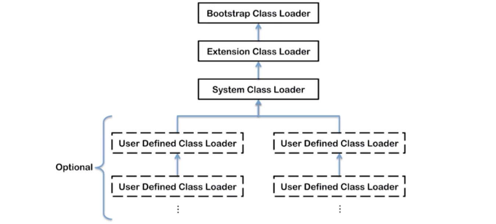

[toc]

# 1.JVM架构


# 2.类加载器与类的加载过程

## 2.1 类加载器子系统作用


+ 类加载器子系统负责从文件系统或者网络系统中加载class文件，class文件在文件开头有特定的文件标识。
+ classLoader只负责class文件的加载，至于它是否可以运行，则由Execution Engine决定
+ 加载的类信息存放于一块称为方法区的内存空间。除了类的信息外，方法区中还会存放运行时常量池信息，可能还包括字符串字面量和数字常量（这部分常量信息是class文件中常量池部分的内存映射）。

## 2.2 类加载器ClassLoader角色


+ class file 存在于硬盘上，可以理解为设计师画在纸板上的模板，而最终这个模板在执行的时候是要加载到JVM当中来根据这个文件实例化出n个一模一样的实例。
+ class file加载到JVM中，被称为DNA元数据模板，放在方法区。
+ 在.class文件 --> JVM --> 最终成为元数据模板，此过程就要一个运输工具（类装载器class loader），扮演一个快递员的角色。

## 2.2 类的加载过程


加载的三个过程：加载，链接，初始化

**加载：**

1. 通过一个类的全限定名获取定义此类的二进制字节流
2. 将这个字节流所代表的静态存储结构转化为方法区的运行时数据结构
3. 在内存中生成一个代表这个类的**java.lang.Class对象**，作为方法区这个类的各种数据的访问入口。

加载.class文件的方式：

+ 从本地系统中直接加载
+ 通过网络获取，典型场景：Web Applet
+ 从zip压缩包中读取，成为日后jar、war格式的基础
+ 运行时计算生成，使用最多的是：动态代理技术
+ 由其他文件生成，典型场景：JSP应用
+ 从专有数据库中提取.class文件，比较少见
+ 从加密文件中获取，典型的防Class文件被反编译的保护措施

**链接：**

1. 验证（Verify）

   + 目的在于确保Class文件的字节流中包含信息符合当 前虚拟机要求，保证被加载类的正确性，不会危害虚拟机自身安全。
   + 主要包括四种验证，文件格式验证，源数据验证，字节码验证，符号引用验证

2. 准备（Prepare)

   + 为类变量分配内存并且设置该类变量的默认初始值，即零值；

     如：

     ```java
     private static int a = 1; //在准备阶段，会把a赋值为0，在初始化阶段才会被赋值为1。其他类型也是同样的道理，如boolean会被赋值为false
     ```

   + **这里不包含用final修饰的sttic，因为final在编译的时候就会分配了，准备阶段会显式初始化**

   + **这里不会为实例变量分配初始化**，类变量会分配在方法去中，而实例变量是会随着对象一起分配到java堆中。

3. 解析(Resolve)

   + 将常量池内的符号引用转换为直接引用的过程。
   + 事实上，解析操作网晚会伴随着jvm在执行完初始化之后再执行
   + 符号引用就是一组符号来描述所引用的目标。符号应用的字面量形式明确定义在《java虚拟机规范》的class文件格式中。直接引用就是直接指向目标的指针、相对偏移量或一个间接定位到目标的句柄
   + 解析动作主要针对类或接口、字段、类方法、接口方法、方法类型等。对应常量池中的CONSTANT_Class_info/CONSTANT_Fieldref_info、CONSTANT_Methodref_info等。

**初始化：**

+ 初始化阶段就是执行类构造器方法<clinit>的过程
+ 此方法不需要定义，是javac编译器自动收集类中的所有类变量的赋值动作和静态代码块中的语句合并而来
+ 构造器方法<clinit>中指令按语句在源文件中出现的顺序执行
+ <clinit>不同于类的构造器，（关联：构造器是虚拟机视角下的init()）
+ 若该类具有父类，JVM会保证子类的<clinit>执行前，父类的<clinit>已经执行完毕
+ 虚拟机必须保证一个类的<clinit>方法在多线程下被同步加锁

注意: 并非所有的类都会拥有一个<clinit>方法, 满足下列条件之一的类不会拥有<clinit>方法:

+ 该类既没有声明任何类变量，也没有静态初始化语句;

+ 该类声明了类变量，但没有明确使用类变量初始化语句或静态初始化语句初始化;

+ 该类仅包含静态 final 变量的类变量初始化语句，并且类变量初始化语句是编译时常量表达式;

```java
public class ClassInitTest {
    private static int num = 1;
    static{
        num = 2;
        number = 20;
        System.out.println(num);
        //System.out.println(number);//报错,非法的前向引用
    }
    private static int number = 10;

    public static void main(String[] args) {
        System.out.println(ClassInitTest.num);
        System.out.println(ClassInitTest.number);
    }
}
/*
输出结果：
2
2
10
*之所以number会是10，是因为在链接的准备阶段，先把number赋值为0，然后在初始化阶段，按照顺序，先赋值为20，然后赋值为10。如果把number的声明放在static之前，则值会成为static里赋值的值。
*所以我们最好要保证静态常量在使用前被赋予值, 否则会出现意想不到的情况.
*/
```


```java
public class HelloLoader{
    public static void main(String[] args){
        System.out.println("dxxxx");
    }
}
```

# 3.类加载器分类

 JVM支持两种类型的加载器，分别为**引导类加载器--C/C++实现（BootStrap ClassLoader）**和**自定义类加载器--由Java实现**

从概念上来讲，自定义类加载器一般指的是程序中由开发人员自定义的一类类加载器，但是java虚拟机规范却没有这么定义，而是**将所有派生于抽象类ClassLoader的类加载器都划分为自定义类加载器**。



注意上图中的加载器划分关系为包含关系，并不是继承关系

按照这样的加载器的类型划分，在程序中我们最常见的类加载器是：引导类加载器BootStrapClassLoader、自定义类加载器(Extension Class Loader、System Class Loader、User-Defined ClassLoader）

**自定义类与核心类库的加载器**

1.对于用户自定义类来说：将使用系统类System Class Loader加载器中的AppClassLoader进行加载

2.java核心类库都是使用引导类加载器BootStrapClassLoader加载的

```java
public class ClassLoaderTest {
    public static void main(String[] args) {
        //获取系统类加载器
        ClassLoader systemClassLoader = ClassLoader.getSystemClassLoader();
        System.out.println(systemClassLoader);//jdk.internal.loader.ClassLoaders$AppClassLoader@78308db1

        //获取其上层：扩展类加载器
        ClassLoader extClassLoader = systemClassLoader.getParent();
        System.out.println(extClassLoader);//jdk.internal.loader.ClassLoaders$PlatformClassLoader@5fd0d5ae

        //获取其上层：获取不到引导类加载器
        ClassLoader bootstrapClassLoader = extClassLoader.getParent();
        System.out.println(bootstrapClassLoader);//null

        //对于用户自定义类来说：默认使用系统类加载器进行加载
        ClassLoader classLoader = ClassLoaderTest.class.getClassLoader();
        System.out.println(classLoader);//jdk.internal.loader.ClassLoaders$AppClassLoader@78308db1

        //String类使用引导类加载器进行加载的。-->Java的核心类库都是使用引导类加载器进行加载的。
        ClassLoader classLoader1 = String.class.getClassLoader();
        System.out.println(classLoader1);//null
    }
}
```

## 3.1 虚拟机自带加载器

+ **启动类加载器（引导类加载器，BootStrap ClassLoader）**

  1.这个类加载使用**C/C++语言实现的**，嵌套在JVM内部

  2.它用来加载java的核心库（JAVA_HOME/jre/lib/rt.jar、resources.jar或sun.boot.class.path路径下的内容），用于提供JVM自身需要的类

  3.并不继承自java.lang.ClassLoader,没有父加载器

  4.加载拓展类和应用程序类加载器，并指定为他们的父加载器，即ClassLoader

  5.出于安全考虑，BootStrap启动类加载器只加载包名为java、javax、sun等开头的类

+ **拓展类加载器（Extension ClassLoader）**

  1.java语言编写 ，由sun.misc.Launcher$ExtClassLoader实现。

  2.派生于ClassLoader类

  3.父类加载器为启动加载器

  4.从java.ext.dirs系统属性所指定的目录中加载类库，或从JDK的安装目录的jre/lib/ext子目录（扩展目录）下加载类库。**如果用户创建的JAR放在此目录下，也会由拓展类加载器自动加载**

+ **应用程序类加载器（系统类加载器，AppClassLoader）**

  1.java语言编写， 由sun.misc.Launcher$AppClassLoader实现。

  2.派生于ClassLoader类

  3.它负责加载环境变量classpath或系统属性 java.class.path指定路径下的类库

  **4.该类加载器是程序中默认的类加载器**，一般来说，java应用的类都是由它来完成加载

  5.通过ClassLoader#getSystemClassLoader()方法可以获取到该类加载器  

## 3.2 用户自定义类加载器

为什么要使用用户自定义类加载器？

+ 隔离加载类
+ 修改类加载的方式
+ 拓展加载源
+ 防止源码泄漏

**用户自定义类加载器实现步骤**：

1. 幵发人员可以通过继承抽象类java.lang.ClassLoader类的方式，实现自己的类加载器，以满足一些特殊的需求
2. 在JDK1.2之前，在自定义类加载器时，总会去继承ClassLoader类并重写loadClass()方法，从而实现自定义的类加载类，但是在JDK1.2之后已不再建议用户去覆盖loadClass()方法，而是建议把自定义的类加载逻辑写在findClass ()方法中
3. 在编写自定义类加载器时，如果没有太过于复杂的需求，可以直接继承 URLClassLoader类，这样就可以避免自己去编写findClass ()方法及其获取字节码流的方式，使自定义类加载器编写更加简洁。

# 4.ClassLoader

ClassLoader类，它是一个抽象类，其后所有的类加载器都继承自ClassLoader（不包括启动类加载器）

| 方法                                               | 描述                                                         |
| -------------------------------------------------- | ------------------------------------------------------------ |
| getParent()                                        | 返回该类加载器的超类加载器                                   |
| loadClass(String name)                             | 加载名称为name的类，返回结果为java.lang.Class类的实例        |
| findClass(String name)                             | 查找名称为name的类，返回结果为java.lang.Class类的实例        |
| findLoadedClass(String name)                       | 查找名称为name的已经被加载过的类，返回结果为java.lang.Class类的实例 |
| defineClass(String name,byte[] b, int off,int len) | 把字节数组b中的内容转换为一个java类，返回结果为java.lang.Class类的实例 |
| resolveClass(Class< ? > c )                        | 连接指定的一个java类                                         |

获取ClassLoader的途径

+ 获取当前类的ClassLoader

  claxxx.getClassLoader()

+ 获取当前线程上下文的ClassLoader

  Thread.currentThread().getContextClassLoader()

+ 获取系统的ClassLoader

  ClassLoader.getSystemClassLoader()

+ 获取调用者的ClassLoader

  DriverManager.getCallerClassLoader()

```java
public class ClassLoaderTest {
    public static void main(String[] args) {
        try {
            ClassLoader classLoader = Class.forName("java.lang.String").getClassLoader();
            System.out.println(classLoader);//null

            ClassLoader classloader1 = Thread.currentThread().getContextClassLoader();
            System.out.println(classloader1);//jdk.internal.loader.ClassLoaders$AppClassLoader@78308db1

            ClassLoader classLoader2 = ClassLoader.getSystemClassLoader().getParent();
            System.out.println(classLoader2);//jdk.internal.loader.ClassLoaders$PlatformClassLoader@5fd0d5ae
        } catch (ClassNotFoundException e) {
            e.printStackTrace();
        }
    }
}
```

# 5.双亲委派机制

Java虚拟机对class文件采用的是**按需加载**的方式，也就是说当需要使用该类时才会将她的class文件加载到内存生成的class对象。而且加载某个类的class文件时，java虚拟机采用的是**双亲委派模式**，即把请求交由父类处理，它是一种任务委派模式

工作原理：

1. 如果一个类加载器收到了类加载请求，它并不会自己先去加载，而是把这个请求委托给父亲的加载器去执行；
2. 如果父类加载器还存在其父类加载器，则进一步向上委托，依次递归，请求最终将到达最顶层的启动类加载器；
3. 如果父类加载器可以完成类加载任务，就成功返回，倘若父类加载器无法完成此加载任务，子加载器才会尝试自己去加载，这就是双亲委派模式。


```java
package java.lang;
public class String{
   	static {
        System.out.pringln("自定义的String");
    }
    public static void main(String[] args){
        System.out.pringln("hello String");
    }
}
/*
虽然我们自定义了一个java.lang包下的String尝试覆盖核心类库中的String，但是由于双亲委派机制，启动加载器会加载java核心类库的String类（BootStrap启动类加载器只加载包名为java、javax、sun等开头的类），而核心类库中的String并没有main方法，所以本程序在运行时会报错：“在类 java.lang.String 中找不到 main 方法”
*/
```

**双亲委派机制的优势：**

1.避免类的重复加载，如上

2.保护程序安全，防止核心API被随意修改

启动类加载器可以抢在标准扩展类装载器之前去装载类，而标准扩展类装载器可以抢在类路径加载器之前去装载那个类，类路径装载 器又可以抢在自定义类加载器之前去加载它。所以Java虚拟机先从最可信的Java核心API查找类型，这是为了防止不可靠的类扮演被信任的类，试想一 下，网络上有个名叫java.lang.Integer的类，它是某个黑客为了想混进java.lang包所起的名字，实际上里面含有恶意代码，但是这种 伎俩在双亲模式加载体系结构下是行不通的，因为网络类加载器在加载它的时候，它首先调用双亲类加载器，这样一直向上委托，直到启动类加载器，而启动类加载 器在核心Java API里发现了这个名字的类，所以它就直接加载Java核心API的java.lang.Integer类，然后将这个类返回，所以自始自终网络上的 java.lang.Integer的类是不会被加载的。

3.保证核心API包的访问权限

但是如果这个移动代码不是去试图替换一个被信任的类（就是前面说的那种情况），而是想在一个被信任的包中插入一个全新的类型，情况会怎样呢？比如一个名为 java.lang.Virus的类，经过双亲委托模式，最终类装载器试图从网络上下载这个类，因为网络类装载器的双亲们都没有这个类（当然没有了，因为 是病毒嘛）。假设成功下载了这个类，那你肯定会想，Virus和lang下的其他类痛在java.lang包下，暗示这个类是Java API的一部分，那么是不是也拥有修改Java.lang包中数据的权限呢？答案当然不是，因为要取得访问和修改java.lang包中的权 限，java.lang.Virus和java.lang下其他类必须是属于同一个运行时包的，什么是运行时包？运行时包是指由同一个类装载器装载的、属 于同一个包的、多个类型的集合。考虑一下，java.lang.Virus和java.lang其他类是同一个类装载器装载的吗？不是 的！java.lang.Virus是由网络类装载器装载的！

　　自定义类：java.lang.MeDsh（java.lang包需要访问权限，阻止我们用包名自定义类）

**沙箱安全机制**

​	自定义String类，但是在加载自定义String类的时候会率先使用引导类加载器加载，而引导类加载器在加载的过程中会先加载jdk自带的文件（rt.jar包中java\lang\String.class），报错信息说没有main方法，就是因为加载的是rt.jar包中的String类。这样可以保证对java核心源代码的保护，这就是沙箱安全机制。

# 6.其他

## 6.1 JVM中表示两个class对象是否为同一个类

在jvm中表示两个class对象是否为同一个类存在的两个必要条件

+ 类的完整类名必须一致，包括包名
+ 即使类的完整类名一致，同时要求加载这个类的ClassLoader（指ClassLoader实例对象）必须相同；是引导类加载器、还是自定义类加载器

换句话说，在jvm中，即使这两个类对象（class对象）来源同一个Class文件，被同一个虚拟机所加载，但只要加载它们的ClassLoader实例对象不同，那么这两个类对象也是不相等的.

## 6.2 对类加载器的引用

JVM必须知道一个类型是由启动类加载器加载的还是由用户类加载器加载的。如果一个类型由用户类加载器加载的，那么jvm会**将这个类加载器的一个引用作为类型信息的一部分保存在方法区中**。当解析一个类型到另一个类型的引用的时候，JVM需要保证两个类型的加载器是相同的。

## 6.3 类的主动使用和被动使用

**java程序对类的使用方式分为：主动使用和被动使用，即是否调用了clinit()方法**

主动使用在类加载系统中的第三阶段initialization即初始化阶段调用了clinit()方法

而被动使用不会去调用

主动使用，分为七种情况

1. 创建类的实例

2. 访问某各类或接口的静态变量，或者对静态变量赋值

3. 调用类的静态方法

4. 反射 比如Class.forName(com.dsh.jvm.xxx)

5. 初始化一个类的子类

6. java虚拟机启动时被标明为启动类的类

7. JDK 7 开始提供的动态语言支持：java.lang.invoke.MethodHandle实例的解析结果REF_getStatic、REF_putStatic、REF_invokeStatic句柄对应的类没有初始化，则初始化

除了以上七种情况，其他使用java类的方式都被看作是对**类的被动使用，都不会导致类的初始化。**

学习来源：[尚硅谷2020最新版宋红康JVM教程](https://www.bilibili.com/video/BV1PJ411n7xZ)