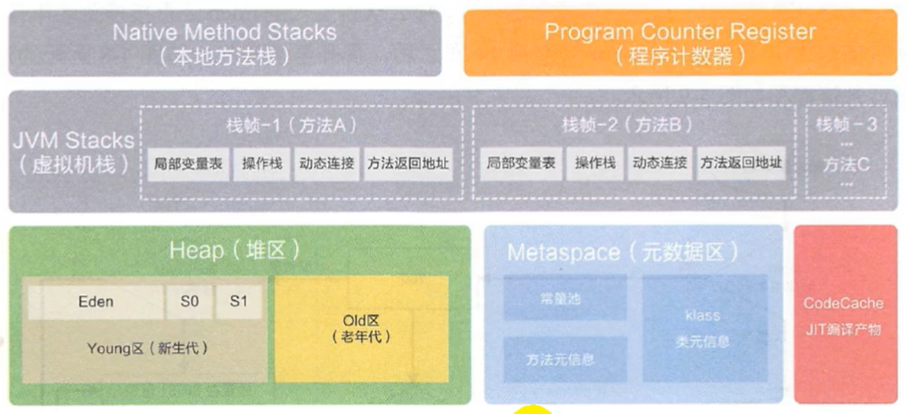
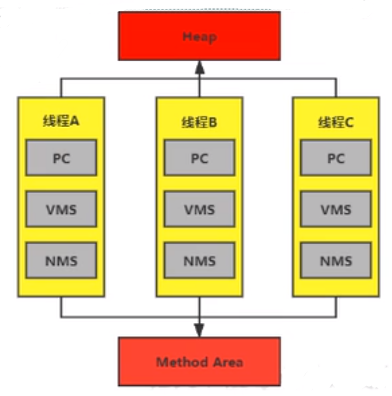

### JVM运行时数据区划分

内存是非常重要的系统资源，是硬盘和cpu的中间仓库及桥梁，承载着操作系统和应用程序的实时运行。JVM内存布局规定了JAVA在运行过程中内存申请、分配、管理的策略，保证了JVM的高效稳定运行。**不同的jvm对于内存的划分方式和管理机制存在着部分差异**（对于Hotspot主要指方法区）

（图源阿里）JDK8的元数据区+JIT编译产物 就是JDK8以前的方法区

每个Java应用程序都有一个Runtime类的实例，该实例允许该应用程序与运行该应用程序的环境进行交互。 当前运行时可以从getRuntime方法获得。

java虚拟机定了了若干种程序运行期间会使用到的运行时数据区，其中有一些会随着虚拟机启动而创建，随着虚拟机退出而销毁。另外一些则是与县城一一对应的，这些与线程对应的数据区域会随着线程开始和结束而创建和销毁。

如图，灰色的区域为单独线程私有的，红色的为多个线程共享的，即

1. 每个线程：独立包括程序计数器、栈、本地栈

2. 线程间共享：堆、堆外内存（方法区、永久代或元空间、代码缓存）

### Java线程

1. 线程是一个程序里的运行单元，JVM允许一个程序有多个线程并行的执行；

2. 在HotSpot JVM，每个线程都与操作系统的本地线程直接映射。

　　当一个java线程准备好执行以后，此时一个操作系统的本地线程也同时创建。java线程执行终止后。本地线程也会回收。

3. 操作系统负责所有线程的安排调度到任何一个可用的CPU上。一旦本地线程初始化成功，它就会调用java线程中的run())方法.

**JVM系统线程分类**

如果你使用jconsole或者任何一个调试工具，都能看到在后台有许多线程在运行。这些后台线程不包括调用main方法的main线程以及所有这个main线程自己创建的线程；

这些主要的后台系统线程在HotSpot JVM里主要是以下几个：

1. 虚拟机线程：这种线程的操作时需要JVM达到安全点才会出现。这些操作必须在不同的线程中发生的原因是他们都需要JVM达到安全点，这样堆才不会变化。这种线程的执行包括“stop-the-world”的垃圾收集，线程栈收集，线程挂起以及偏向锁撤销
2. 周期任务线程：这种线程是时间周期事件的提现（比如中断），他们一般用于周期性操作的调度执行。
3. GC线程：这种线程对于JVM里不同种类的垃圾收集行为提供了支持
4. 编译线程：这种线程在运行时会降字节码编译成本地代码
5. 信号调度线程：这种线程接收信号并发送给JVM,在它内部通过调用适当的方法进行处理。

学习来源：[尚硅谷2020最新版宋红康JVM教程](https://www.bilibili.com/video/BV1PJ411n7xZ)