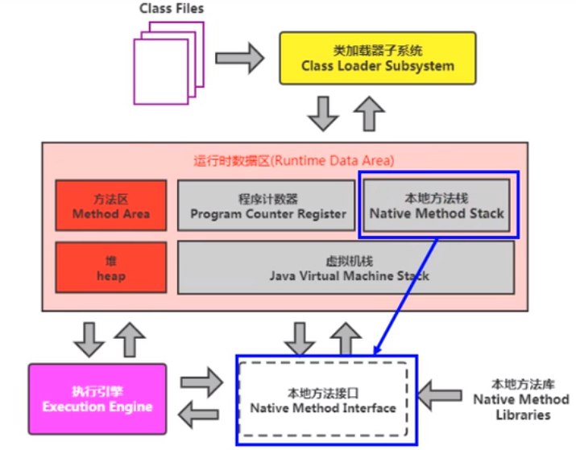

# 1.本地方法接口
## 1.1什么是本地方法？

简单地讲，一个Native Method就是一个Java调用非Java代码的接口，该方法的实现可以为其他语言。用`native`关键字修饰的方法，在定义的时候，并不提供实现体，而是由非java语言在外部实现的。本地接口的作用是融合不同的编程语言为Java所用，它的初衷是融合C/C++程序。

标识符`native`可以与其他所有的java标识符连用，但是`abstract`除外。

```java
/**
 * 本地方法
 */
public  class IHaveNatives {

    //abstract 没有方法体
    public abstract void abstractMethod(int x);

    //native 和 abstract不能共存，native是有方法体的，由C语言来实现
    public native void Native1(int x);

    native static public long Native2();

    native synchronized private float Native3(Object o);

    native void Native4(int[] array) throws Exception;

}

```


## 1.2 为什么要使用本地方法？

Java使用起来非常方便，但是有些层次的任务用Java实现起来非常不容易，或者效率不好。

+ **与Java环境外交互**：如与底层系统（操作系统或某些硬件交换信息）。本地方法正是这样一种交流机制：它为我们提供了一个非常简洁的接口，而我们无需去了解Java应用之外的繁琐的细节。
+ **与操作系统交互**：JVM支持着java语言本身和运行库，它是java程序赖以生存的平台，它由一个解释器（解释字节码）和一些连接到本地代码的库组成。然而不管怎样，它毕竟不是一个完整的系统，它经常依赖于一些底层系统的支持。这些底层系统常常是强大的操作系统。通过使用本地方法，我们得以用java实现了jre的与底层系统的交互，甚至jvm的一些部分就是用C写的。还有，如果我们要使用一些java语言本身没有提供封装的操作系统特性时，我们也需要使用本地方法。
+ **Sun’s Java**：Sun的解释器是用C实现的，这使得它能像一些普通的C一样与外部交互。jre大部分是用java实现的，它也通过一些本地方法与外界交互。例如：类java.lang.Thread的setPriority()方法是用Java实现的，但是它实现调用的事该类里的本地方法setPriority0（）。这个本地方法是用C实现的，并被植入JVM内部，在Windows 95的平台上，这个本地方法最终将调用Win32 SetProority（）API。这是一个本地方法的具体实现由JVM直接提供，更多的情况是本地方法由外部的动态链接库（external dynamic link library）提供，然后被JVM调用。

**现状：**

目前该方法的是用越来越少了，除非是与硬件有关的应用，比如通过java程序驱动打印机或者java系统管理生产设备，在企业级应用已经比较少见。因为现在的异构领域间的通信很发达，比如可以使用Socket通信，也可以是用Web Service等等，不多做介绍。

# 2.本地方法栈(Native Method Stack)

**Java虚拟机栈用于管理Java方法的调用，而本地方法栈用于管理本地方法的调用**

本地方法栈，也是线程私有的。

允许被实现成固定或者是可动态拓展的内存大小。（在内存溢出方面是相同的）

- 如果线程请求分配的栈容量超过本地方法栈允许的最大容量，Java虚拟机将会抛出一个StackOverFlowError异常。
- 如果本地方法栈可以动态扩展，并且在尝试扩展的时候无法申请到足够的内存，或者在创建新的线程时没有足够的内存去创建对应的本地方法栈，那么java虚拟机将会抛出一个OutOfMemoryError异常。

本地方法是使用C语言实现的

它的具体做法是Native Method Stack中登记native方法，在Execution Engine执行时加载本地方法库。




**当某个线程调用一个本地方法时，它就进入了一个全新的并且不再受虚拟机限制的世界。它和虚拟机拥有同样的权限**

- 本地方法可以通过本地方法接口来 **访问虚拟机内部的运行时数据区**
- 它甚至可以直接使用本地处理器中的寄存器
- 直接从本地内存的堆中分配任意数量的内存

并不是所有的JVM都支持本地方法。因为Java虚拟机规范并没有明确要求本地方法栈的使用语言、具体实现方式、数据结构等。如果JVM产品不打算支持native方法，也可以无需实现本地方法栈。

在hotSpot JVM中，直接将本地方法栈和虚拟机栈合二为一。

