[toc]

# 1.堆的核心概述

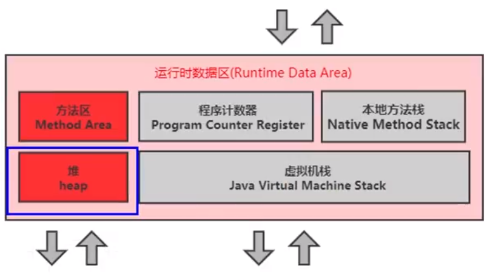

一个进程对应一个jvm实例，一个运行时数据区，又包含多个线程，这些线程共享了方法区和堆，每个线程包含了程序计数器、本地方法栈和虚拟机栈。

1. 一个jvm实例只存在一个堆内存，堆也是java内存管理的核心区域
2. Java堆区在JVM启动的时候即被创建，其空间大小也就确定了。是JVM管理的最大一块内存空间（堆内存的大小是可以调节的）
3. 《Java虚拟机规范》规定，堆可以处于**物理上不连续**的内存空间中，但在**逻辑上它应该被视为连续的**
4. 所有的线程共享java堆，在这里还可以划分线程私有的缓冲区（TLAB:Thread Local Allocation Buffer）（面试问题：堆空间一定是所有线程共享的么？不是，TLAB线程在堆中独有的，这是因为如果所有的数据都是共享的，那么并发性会较差，而在堆中开辟一个区域，这个区域给每个线程划分出一个块，为线程私有的，则称为TLAB）
5. 《Java虚拟机规范》中对java堆的描述是：所有的对象实例以及数组都应当在运行时分配在堆上。
   - 从实际使用的角度看，“几乎”所有的对象的实例都在这里分配内存 （‘几乎’是因为可能存储在栈上）
6. 数组或对象永远不会存储在栈上，因为栈帧中保存引用，这个引用指向对象或者数组在堆中的位置
7. 在方法结束后，堆中的对象不会马上被移除，仅仅在垃圾收集的时候才会被移除
8. 堆，是GC(Garbage Collection，垃圾收集器)执行垃圾回收的重点区域

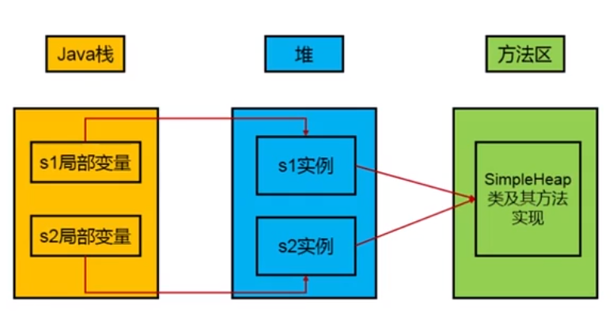

## 1.1 内存细分

JDK 7以前： 新生区+养老区+永久区

- Young Generation Space：  新生区           **Young/New**
  - 又被分为Eden区和Survior区  
- Tenure generation Space：  养老区       **Old/Tenure**
- Permanent Space：      永久区           **Perm**

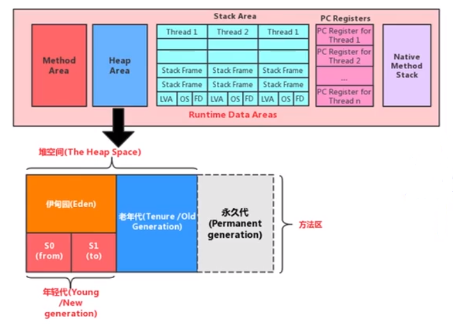

(注意一下永久代还不在堆空间中)

JDK 8以后： 新生区+养老区+元空间

- Young Generation Space：   新生区           **Young/New**
  - 又被分为Eden区和Survior区  
- Tenure generation Space：  养老区       **Old/Tenure**
- Meta Space：        元空间         **Meta**

约定，这三类说法都代表同一个意思：

+ 新生区  新生代  年轻代
+ 养老区  老年区  老年代
+ 永久区  永久代

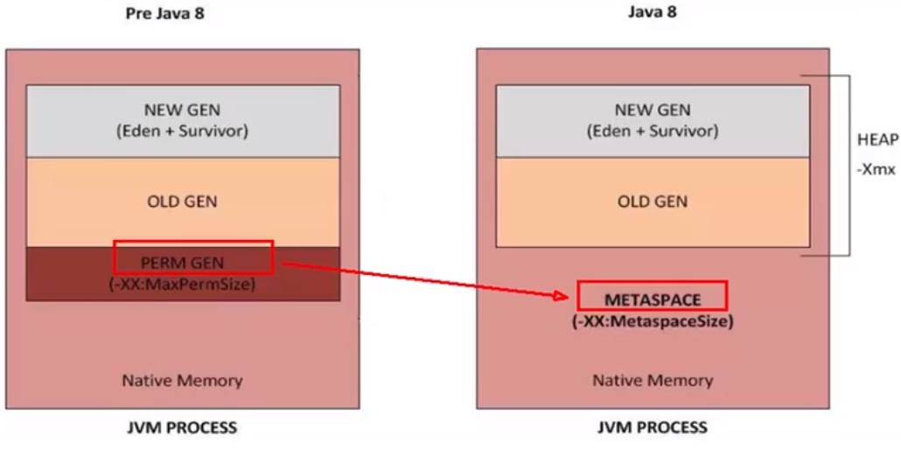

# 2.设置堆内存大小与OOM

## 2.1 堆空间大小的设置

Java堆区用于存储java对象实例，堆的大小在jvm启动时就已经设定好了，可以通过 "-Xmx"和 "-Xms"来进行设置

- -Xms 用于表示堆的起始内存，等价于 -XX:InitialHeapSize
  - -Xms 用来设置堆空间（年轻代+老年代）的初始内存大小
    - -X 是jvm的运行参数
    - ms 是memory start
- -Xmx 用于设置堆的最大内存，等价于 -XX:MaxHeapSize

一旦堆区中的内存大小超过 -Xmx所指定的最大内存时，将会抛出OOM异常

通常会将-Xms和-Xmx两个参数配置相同的值，其目的就是为了能够在java垃圾回收机制清理完堆区后不需要重新分隔计算堆区的大小，从而提高性能

默认情况下，初始内存大小：物理内存大小/64;最大内存大小：物理内存大小/4

- 手动设置：-Xms600m -Xmx600m
- 开发中建议将初始堆内存和最大堆内存设置成相同的值。这是为了避免GC不断调整堆内存的大小

查看设置的参数：

- 方式一： 终端输入jps(查看当前程序运行的进程) ，  然后 jstat -gc 进程id(查看当前进程的信息)
- 方式二：（控制台打印）Edit Configurations->VM Options 添加  `-XX:+PrintGCDetails` 

## 2.2 查看堆内存的大小

```java
public class HeapSpaceInitial {
    public static void main(String[] args) {

        //返回Java虚拟机中的堆内存总量
        long initialMemory = Runtime.getRuntime().totalMemory() / 1024 / 1024;
        //返回Java虚拟机试图使用的最大堆内存量
        long maxMemory = Runtime.getRuntime().maxMemory() / 1024 / 1024;

        System.out.println("-Xms : " + initialMemory + "M");//-Xms : 245M
        System.out.println("-Xmx : " + maxMemory + "M");//-Xmx : 3641M

        System.out.println("系统内存大小为：" + initialMemory * 64.0 / 1024 + "G");//系统内存大小为：15.3125G
        System.out.println("系统内存大小为：" + maxMemory * 4.0 / 1024 + "G");//系统内存大小为：14.22265625G

        try {
            Thread.sleep(1000000);
        } catch (InterruptedException e) {
            e.printStackTrace();
        }
    }
}

```


## 2.3 OOM

java.lang.OutOfMemoryError: Java heap space

Throwable的两个子类：Error,Exception 错误和异常，广义上的异常还会包括这里两个内容，即把本是Error的OOM说成是异常，这里就是广义上的异常。

```java
/**
 * -Xms600m -Xmx600m
 */
public class OOMTest {
    public static void main(String[] args) {
        ArrayList<Picture> list = new ArrayList<>();
        while(true){
            try {
                Thread.sleep(20);
            } catch (InterruptedException e) {
                e.printStackTrace();
            }
            list.add(new Picture(new Random().nextInt(1024 * 1024)));
        }
    }
}

class Picture{
    private byte[] pixels;

    public Picture(int length) {
        this.pixels = new byte[length];
    }
}

```

# 3. 年轻代与老年代

存储在JVM中的java对象可以被划分为两类：

- 一类是生命周期较短的瞬时对象，这类对象的创建和消亡都非常迅速
- 另外一类对象的生命周期非常长，在某些情况下还能与JVM的生命周期保持一致

Java堆区进一步细分可以分为年轻代（YoungGen）和老年代（OldGen）

其中年轻代可以分为Eden空间、Survivor0空间和Survivor1空间（有时也叫frmo区，to区）

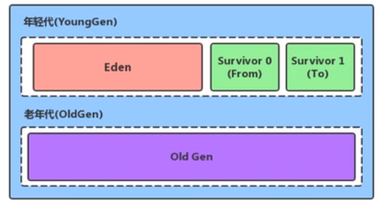

新生代与老年代的结构占比一般在开发中不会改变

配置新生代与老年代在堆结构的占比

- 默认-XX：NewRatio=2，表示新生代占1，老年代占2，新生代占整个堆的1/3
- 可以修改-XX:NewRatio=4，表示新生代占1，老年代占4，新生代占整个堆的1/5


在hotSpot中，Eden空间和另外两个Survivor空间缺省所占的比例是8：1：1（测试的时候是6：1：1），开发人员可以通过选项 -XX:SurvivorRatio 调整空间比例，如-XX:SurvivorRatio=8

几乎所有的Java对象都是在Eden区被new出来的

绝大部分的Java对象都销毁在新生代了（IBM公司的专门研究表明，新生代80%的对象都是“朝生夕死”的）

可以使用选项-Xmn设置新生代最大内存大小（这个参数一般使用默认值就好了）

```java
/**
 * -Xms600m -Xmx600m
 *
 * -XX:NewRatio ： 设置新生代与老年代的比例。默认值是2.
 * -XX:SurvivorRatio ：设置新生代中Eden区与Survivor区的比例。默认值是8
 * -XX:-UseAdaptiveSizePolicy ：关闭自适应的内存分配策略 '-'关闭,'+'打开  （暂时用不到）
 * -Xmn:设置新生代的空间的大小。 （一般不设置）
 *
 */
public class EdenSurvivorTest {
    public static void main(String[] args) {
        System.out.println("我只是来打个酱油~");
        try {
            Thread.sleep(1000000);
        } catch (InterruptedException e) {
            e.printStackTrace();
        }
    }
}
```

# 4. 图解对象分配过程

为新对象分配内存是件非常严谨和复杂的任务，JVM的设计者们不仅需要考虑内存如何分配、在哪里分配的问题，并且由于内存分配算法与内存回收算法密切相关，所以还需要考虑GC执行完内存回收后是否会在内存空间中产生内存碎片。

1. new的对象先放伊甸园区。此区有大小限制。
2. 当伊甸园的空间填满时，程序又需要创建对象，JVM的垃圾回收器将对伊甸园区进行垃圾回收（Minor GC),将伊甸园区中的不再被其他对象所引用的对象进行销毁。再加载新的对象放到伊甸园区
3. 然后将伊甸园中的剩余对象移动到幸存者0区。
4. 如果再次触发垃圾回收，此时上次幸存下来的放到幸存者0区的，如果没有回收，就会放到幸存者1区。
5. 如果再次经历垃圾回收，此时会重新放回幸存者0区，接着再去幸存者1区。
6. 啥时候能去养老区呢？可以设置次数。默认是15次。·可以设置参数：-XX:MaxTenuringThreshold=进行设置。 
7. 在养老区，相对悠闲。当老年区内存不足时，再次触发GC：Major GC，进行养老区的内存清理。
8. 若养老区执行了Major GC之后发现依然无法进行对象的保存，就会产生OOM异常。

**总结**
**针对幸存者s0,s1区：复制之后有交换，谁空谁是to**
**关于垃圾回收：频繁在新生区收集，很少在养老区收集，几乎不再永久区/元空间收集。**


绿色是不过期的，红色是过期的，GC把没过期的从Eden放入S0中，将age设置为1，Eden区被清空。S1是空的，把S1称为To区，S0为From区。


当Eden区再次满了后，把对象放入S1当中，age设置为1。然后判断S0中的对象是否需要被回收，不用回收的放到S1中，age增1。这个时候S0清空，S0被称为To区。S1变成From区。依此循环。


当age达到阈值时，将对象进行“晋升”，放入老年代中。

Surviver区满了，不会触发YGC/Minor GC，但不意味着Surviver区不存在垃圾回收，而是在Eden区满的时候，YGC/Minor GC会对Surviver区和Eden区同时进行回收，而此时如果Surviver区满了装不下了，会把一些老的对象晋升到老年代里。

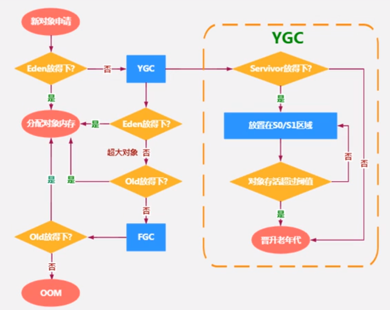

**代码举例**

```java
public class HeapInstanceTest {
    byte[] buffer = new byte[new Random().nextInt(1024 * 200)];

    public static void main(String[] args) {
        ArrayList<HeapInstanceTest> list = new ArrayList<HeapInstanceTest>();
        while (true) {
            list.add(new HeapInstanceTest());
            try {
                Thread.sleep(10);
            } catch (InterruptedException e) {
                e.printStackTrace();
            }
        }
    }
}
```

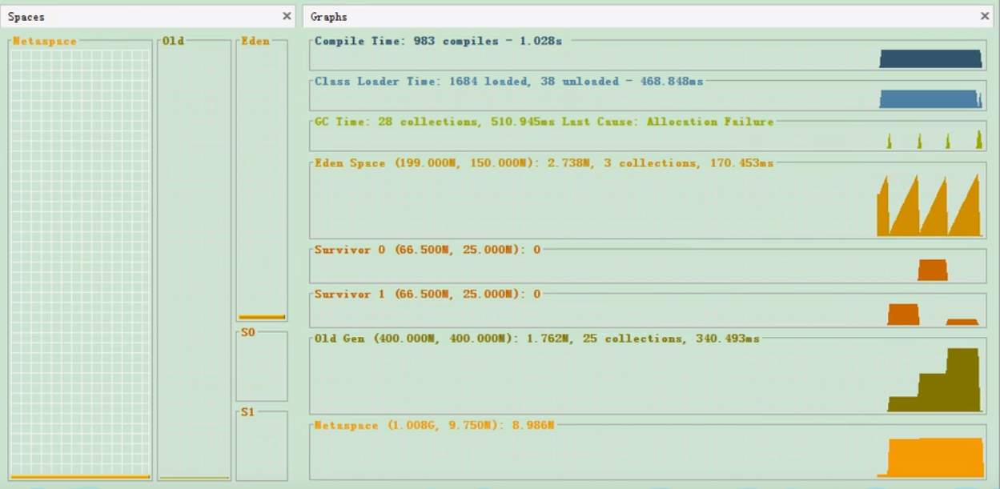

Eden区的曲线，每一次满了之后GC会将对象放入Surviver区，以及老年代中，直到老年代满了，发生OOM。

**常用调优工具**

- JDK命令行
- Eclipse：Memory Analyzer Tool
- Jconsole
- VisualVM
- Jprofiler
- Java Flight Recorder
- GCViewer
- GC Easy

# 5.Minor GC、Major GC、Full GC

Minor GC等价于YGC(Young GC)

## 5.1 收集方式

JVM在进行GC时，并非每次都针对上面三个内存区域（新生代、老年代、方法区）一起回收的，大部分时候回收都是指新生代。

针对hotSpot VM的实现，它里面的GC按照回收区域又分为两大种类型：一种是部分收集（Partial GC），一种是整堆收集（Full GC）

- 部分收集：不是完整收集整个Java堆的垃圾收集。其中又分为：
  - 新生代收集（Minor GC/Young GC）：只是新生代(Eden/S0,S1)的垃圾收集
  - 老年代收集（Major GC/Old GC）：只是老年代的垃圾收集
    - 目前，只有CMS GC会有单独收集老年代的行为
    - 注意，很多时候Major GC 会和 Full GC混淆使用，需要具体分辨是老年代回收还是整堆回收
  - 混合收集（Mixed GC）：收集整个新生代以及部分老年代的垃圾收集
    - 目前，只有G1 GC会有这种行为
- 整堆收集（Full GC）：收集整个java堆和方法区的垃圾收集

## 5.2 最简单的分代式GC策略的触发条件

- 年轻代GC（Minor GC）触发机制
  - 当年轻代空间不足时，就会触发Minor GC，这里的年轻代满指的是Eden代满，Survivor满不会引发GC.(每次Minor GC会清理年轻代的内存，Survivor是被动GC，不会主动GC)
  - 因为Java队形大多都具备朝生夕灭的特性，所以Minor GC 非常频繁，一般回收速度也比较快，这一定义既清晰又利于理解。
  - Minor GC 会引发STW（Stop the World），暂停其他用户的线程，等垃圾回收结束，用户线程才恢复运行。

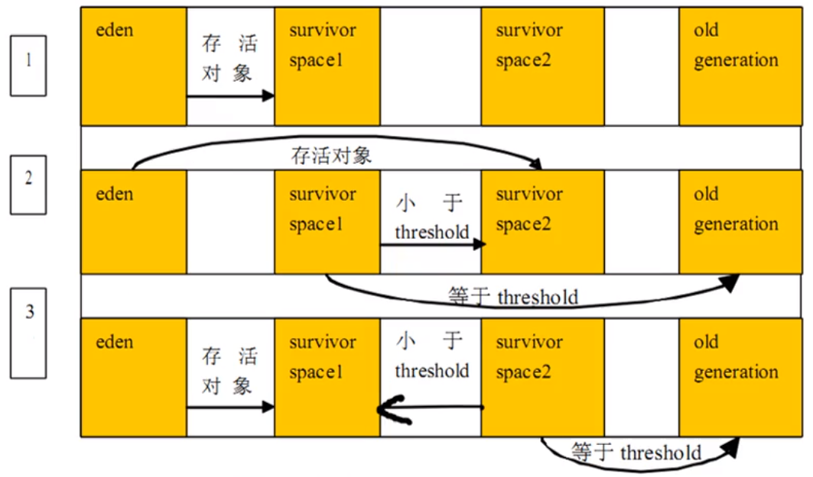

- 老年代GC(Major GC/Full GC)触发机制
  - 指发生在老年代的GC,对象从老年代消失时，Major GC 或者 Full GC 发生了
  - 出现了Major GC，经常会伴随至少一次的Minor GC（不是绝对的，在Parallel Scavenge 收集器的收集策略里就有直接进行Major GC的策略选择过程）
    - 也就是老年代空间不足时，会先尝试触发Minor GC。如果之后空间还不足，则触发Major GC
  - Major GC速度一般会比Minor GC慢10倍以上，STW时间更长
  - 如果Major GC后，内存还不足，就报OOM了
- Full GC触发机制
  - 触发Full GC执行的情况有以下五种
    - ①调用System.gc()时，系统建议执行Full GC，但是不必然执行
    - ②老年代空间不足
    - ③方法区空间不足
    - ④通过Minor GC后进入老年代的平均大小小于老年代的可用内存
    - ⑤由Eden区，Survivor S0（from）区向S1（to）区复制时，对象大小由于To Space可用内存，则把该对象转存到老年代，且老年代的可用内存小于该对象大小
  - 说明：Full GC 是开发或调优中尽量要避免的，这样暂停时间会短一些

# 6. 堆空间分代思想

为什么要把Java堆分代？不分代就不能正常工作了么

- 经研究，不同对象的生命周期不同。70%-99%的对象都是临时对象。
  - 新生代：有Eden、Survivor构成（s0,s1 又称为from to），to总为空
  - 老年代：存放新生代中经历多次依然存活的对象


- 其实不分代完全可以，分代的唯一理由就是**优化GC性能**。如果没有分代，那所有的对象都在一块，就如同把一个学校的人都关在一个教室。GC的时候要找到哪些对象没用，这样就会对堆的所有区域进行扫描，而很多对象都是朝生夕死的，如果分代的话，把新创建的对象放到某一地方，当GC的时候先把这块存储“朝生夕死”对象的区域进行回收，这样就会腾出很大的空间出来。


# 7. 内存分配策略

+ 如果对象在Eden出生并经过第一次Minor GC后依然存活，并且能被Survivor容纳的话，将被移动到Survivor空间中，把那个将对象年龄设为1.对象在Survivor区中每熬过一次MinorGC，年龄就增加一岁，当它的年龄增加到一定程度（默认15岁，其实每个JVM、每个GC都有所不同）时，就会被晋升到老年代中
  + 对象晋升老年代的年龄阈值，可以通过选项 -XX：MaxTenuringThreshold来设置

+ 针对不同年龄段的对象分配原则如下：
  + 优先分配到Eden
  + 大对象直接分配到老年代
    + 尽量避免程序中出现过多的大对象
  + 长期存活的对象分配到老年代
  + 动态对象年龄判断
    + 如果Survivor区中相同年龄的所有对象大小的总和大于Survivor空间的一半，年龄大于或等于该年龄的对象可以直接进入到老年代。无需等到MaxTenuringThreshold中要求的年龄
  + 空间分配担保
    + -XX: HandlePromotionFailure

# 8. 为对象分配内存(TLAB)

**为什么有TLAB（Thread Local Allocation Buffer）**

- 堆区是线程共享区域，任何线程都可以访问到堆区中的共享数据
- 由于对象实例的创建在JVM中非常频繁，因此在并发环境下从堆区中划分内存空间是线程不安全的
- 为避免多个线程操作同一地址，需要使用加锁等机制，进而影响分配速度

**什么是TLAB**

- 从内存模型而不是垃圾收集的角度，对Eden区域继续进行划分，JVM为每个线程分配了一个私有缓存区域，它包含在Eden空间内
- 多线程同时分配内存时，使用TLAB可以避免一系列的非线程安全问题，同时还能够提升内存分配的吞吐量，因此我们可以将这种内存分配方式称之为**快速分配策略**
- 所有OpenJDK衍生出来的JVM都提供了TLAB的设计

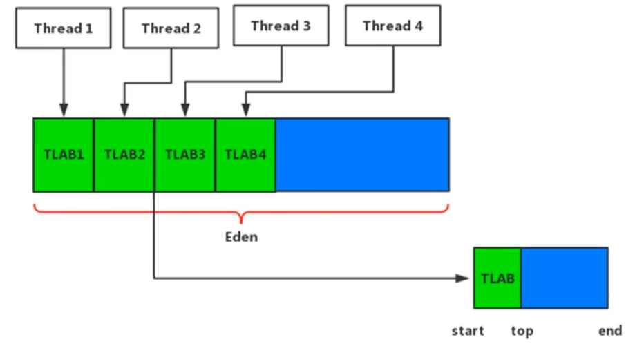

**说明**

- 尽管不是所有的对象实例都能够在TLAB中成功分配内存，但JVM确实是将TLAB作为内存分配的首选
- 在程序中，开发人员可以通过选项“-XX:UseTLAB“ 设置是否开启TLAB空间
- 默认情况下，TLAB空间的内存非常小，仅占有整个EDen空间的1%，当然我们可以通过选项 ”-XX:TLABWasteTargetPercent“ 设置TLAB空间所占用Eden空间的百分比大小
- 一旦对象在TLAB空间分配内存失败时，JVM就会尝试着通过**使用加锁机制**确保数据操作的原子性，从而直接在Eden空间中分配了内存

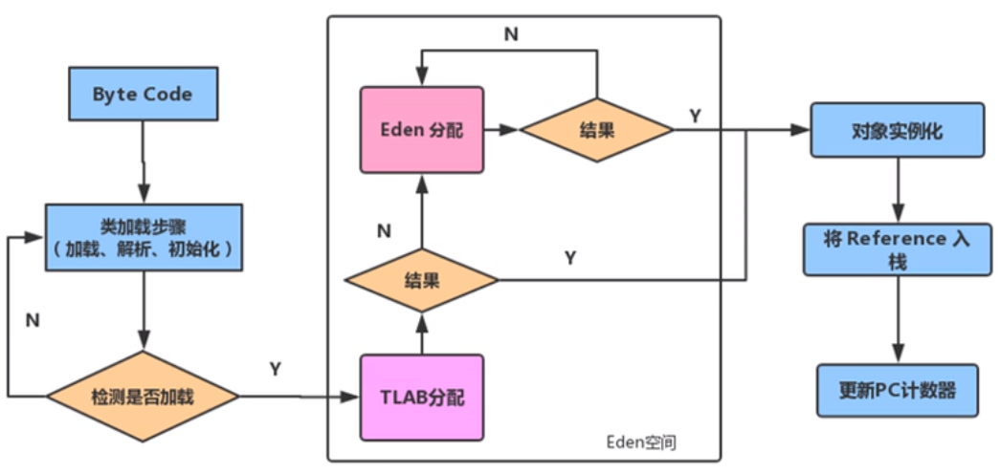

所以说堆空间不是都是共享的，还有TLAB是私有的。

# 9.堆空间的参数设置

[官方文档](https://docs.oracle.com/javase/8/docs/technotes/tools/unix/java.html)

+ -XX:PrintFlagsInitial: 查看所有参数的默认初始值
+ -XX:PrintFlagsFinal：查看所有的参数的最终值（可能会存在修改，不再是初始值）
  + 具体查看某个参数的指令：
    + jps：查看当前运行中的进程
    + jinfo -flag SurvivorRatio 进程id： 查看新生代中Eden和S0/S1空间的比例

+ -Xms: 初始堆空间内存（默认为物理内存的1/64）
+ -Xmx: 最大堆空间内存（默认为物理内存的1/4）
+ -Xmn: 设置新生代大小（初始值及最大值）
+ -XX:NewRatio: 配置新生代与老年代在堆结构的占比
+ -XX:SurvivorRatio：设置新生代中Eden和S0/S1空间的比例
+ -XX:MaxTenuringThreshold：设置新生代垃圾的最大年龄(默认15)
+ -XX:+PrintGCDetails：输出详细的GC处理日志
  + 打印gc简要信息：① -XX:+PrintGC   ② -verbose:gc

+ -XX:HandlePromotionFailure：是否设置空间分配担保


在发生Minor Gc之前，虚拟机会**检查老年代最大可用的连续空间是否大于新生代所有对象的总空间**。

- 如果大于，则此次Minor GC是安全的
- 如果小于，则虚拟机会查看-XX:HandlePromotionFailure设置值是否允许担保失败。（JDK 7以后的规则HandlePromotionFailure可以认为就是true）
  - 如果HandlePromotionFailure=true,那么会继续**检查老年代最大可用连续空间是否大于历次晋升到老年代的对象的平均大小**。
    - √如果大于，则尝试进行一次Minor GC,但这次Minor GC依然是有风险的；
    - √如果小于，则改为进行一次Fu11 GC。
  - √如果HandlePromotionFailure=false,则改为进行一次Fu11 GC。

在JDK6 Update24之后（JDK7），HandlePromotionFailure参数不会再影响到虚拟机的空间分配担保策略，观察openJDK中的源码变化，虽然源码中还定义了HandlePromotionFailure参数，但是在代码中已经不会再使用它。JDK6 Update24之后的规则变为**只要老年代的连续空间大于新生代对象总大小或者历次晋升的平均大小就会进行Minor GC**,否则将进行Full GC。

# 10. 堆是分配对象存储的唯一选择吗

 在《深入理解Java虚拟机》中关于Java堆内存有这样一段描述：随着JIT编译期的发展与**逃逸分析技术**逐渐成熟，**栈上分配、标量替换优化技术**将会导致一些微妙的变化，所有的对象都分配到堆上也渐渐变得不那么“绝对”了。
  在Java虚拟机中，对象是在Java堆中分配内存的，这是一个普遍的常识。但是，有一种特殊情况，那就是如果**经过逃逸分析（Escape Analysis)后发现，一个对象并没有逃逸出方法的话，那么就可能被优化成栈上分配**。这样就无需在堆上分配内存，也无须进行垃圾回收了。这也是最常见的堆外存储技术。
  此外，前面提到的基于OpenJDK深度定制的TaoBaoVM,其中创新的GCIH(GCinvisible heap)技术实现off-heap,将生命周期较长的Java对象从heap中移至heap外，并且GC不能管理GCIH内部的Java对象，以此达到降低GC的回收频率和提升GC的回收效率的目的。

## 10.1 逃逸分析

如何将堆上的对象分配到栈，需要使用逃逸分析手段。

这是一种可以有效减少Java程序中同步负载和内存堆分配压力的跨函数全局数据流分析算法。

通过逃逸分析，Java Hotspot编译器能够分析出一个新的对象的引用的使用范围从而决定是否要将这个对象分配到堆上。

逃逸分析的基本行为就是分析对象动态作用域：

- 当一个对象在方法中被定义后，对象只在方法内部使用，则认为没有发生逃逸。
- 当一个对象在方法中被定义后，它被外部方法所引用，则认为发生逃逸。例如作为调用参数传递到其他地方中。

如何快速的判断是否发生了逃逸分析，就看new的对象实体是否有可能在方法外被调用

```java
public void method(){
    V v = new V();
    //use V
    //......
    v = null;
}
```

没有发生逃逸的对象，则可以分配到栈上，随着方法执行的结束，栈空间就被移除。

```java
public static StringBuffer createStringBuffer(String s1,String s2){
    StringBuffer sb = new StringBuffer();
    sb.append(s1);
    sb.append(s2);
    return sb;
}
```

由于上述方法返回的sb在方法外被使用，发生了逃逸，上述代码如果想要StringBuffer sb不逃出方法，可以这样写：

```java
public static String createStringBuffer(String s1,String s2){
    StringBuffer sb = new StringBuffer();
    sb.append(s1);
    sb.append(s2);
    return sb.toString();
}
```

```java
/**
 * 逃逸分析
 *
 *  如何快速的判断是否发生了逃逸，就看new的对象实体是否有可能在方法外被调用。
 */
public class EscapeAnalysis {

    public EscapeAnalysis obj;

    /*
    方法返回EscapeAnalysis对象，发生逃逸
     */
    public EscapeAnalysis getInstance(){
        return obj == null? new EscapeAnalysis() : obj;
    }
    /*
    为成员属性赋值，发生逃逸
     */
    public void setObj(){
        this.obj = new EscapeAnalysis();
    }
    //思考：如果当前的obj引用声明为static的？仍然会发生逃逸。

    /*
    对象的作用域仅在当前方法中有效，没有发生逃逸
     */
    public void useEscapeAnalysis(){
        EscapeAnalysis e = new EscapeAnalysis();
    }
    /*
    引用成员变量的值，发生逃逸
     */
    public void useEscapeAnalysis1(){
        EscapeAnalysis e = getInstance();
        //getInstance().xxx()同样会发生逃逸
    }
}
```

### 参数设置

- 在JDK 6u23版本之后，HotSpot中默认就已经开启了逃逸分析
- 如果使用了较早的版本，开发人员可以通过
  - -XX:DoEscapeAnalysis 显式开启逃逸分析
  - -XX:+PrintEscapeAnalysis查看逃逸分析的筛选结果

**结论**
 开发中能使用局部变量的，就不要使用在方法外定义

## 10.2 逃逸分析：代码优化

使用逃逸分析，编译器可以对代码做如下优化：

1. 栈上分配：将堆分配转化为栈分配。如果一个对象在子线程中被分配，要使指向该对象的指针永远不会逃逸，对象可能是栈分配的候选，而不是堆分配
2. 同步省略：如果一个对象被发现只能从一个线程被访问到，那么对于这个对象的操作可以不考虑同步
3. 分离对象或标量替换：有的对象可能不需要作为一个连续的内存结构存在也可以北方问道，那么对象的部分（或全部）可以不存储在内存，而是存储在CPU寄存器中。

### 10.2.1 栈上分配

JIT编译器在编译期间根据逃逸分析的结果，发现如果一个对象并没有逃逸出方法的话，就可能被优化成栈上分配。分配完成之后，继续在调用栈内执行，最后线程结束，栈空间被回收，局部变量对象也被回收。这样就无须进行垃圾回收了

常见的栈上分配场景：给成员变量赋值、方法返回值、实例引用传递

以下代码，关闭逃逸分析（-XX:-DoEscapeAnalysi），维护10000000个对象，如果开启逃逸分析，只维护少量对象（JDK7 逃逸分析默认开启）

```java
/**
 * 栈上分配测试
 * -Xmx1G -Xms1G -XX:-DoEscapeAnalysis -XX:+PrintGCDetails
 */
public class StackAllocation {
    public static void main(String[] args) {
        long start = System.currentTimeMillis();

        for (int i = 0; i < 10000000; i++) {
            alloc();
        }
        // 查看执行时间
        long end = System.currentTimeMillis();
        System.out.println("花费的时间为： " + (end - start) + " ms");
        // 为了方便查看堆内存中对象个数，线程sleep
        try {
            Thread.sleep(1000000);
        } catch (InterruptedException e1) {
            e1.printStackTrace();
        }
    }

    private static void alloc() {
        User user = new User();//未发生逃逸
    }

    static class User {

    }
}
```

当没有开启逃逸分析时，即：-XX:-DoEscapeAnalysis，程序打印：花费时间76ms，内存情况如下：


当开启逃逸分析时，即：-XX:+DoEscapeAnalysis，程序打印：花费时间4ms，内存情况如下：

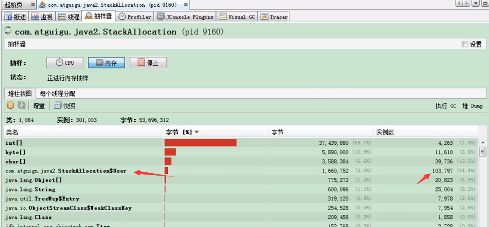

### 10.2.2 同步省略(消除)

线程同步的代价是相当高的，同步的后果是降低并发性和性能

在动态编译同步块的时候，JIT编译器可以借助逃逸分析来**判断同步块所使用的锁对象是否只能够被一个线程访问而没有被发布到其他线程**。如果没有，那么JIT编译器在编译这个同步块的时候就会取消对这部分代码的同步。这样就能大大提高并发性和性能。这个取消同步的过程就叫同步省略，也叫**锁消除**

```java
/**
 * 同步省略说明
 */
public class SynchronizedTest {
    public void f() {
        Object hollis = new Object();
        synchronized(hollis) {
            System.out.println(hollis);
        }
    }
    //代码中对hollis这个对象进行加锁，但是hollis对象的生命周期只在f（）方法中
    //并不会被其他线程所访问控制，所以在JIT编译阶段就会被优化掉。
    //优化为 ↓
    public void f2() {
        Object hollis = new Object();
        System.out.println(hollis);
    }
    //但是在编译成的指令还是会有同步的指令块，但是在运行的时候是不会有的
}
```

### 10.2.3 分离对象或标量替换

**标量Scalar**是指一个无法在分解成更小的数据的数据。Java中的原始数据类型就是标量

相对的，那些还可以分解的数据叫做**聚合量(Aggregate)**，Java中对象就是聚合量，因为它可以分解成其他聚合量和标量

在JIT阶段，如果经过逃逸分析，发现一个对象不会被外界访问的话，那么经过JIT优化，就会把这个对象拆解成若干个其中包含的若干个成员变量来替代。这个过程就是**标量替换**

```java
public class ScalarTest {
    public static void main(String[] args) {
        alloc();   
    }
    public static void alloc(){
        Point point = new Point(1,2);
    }
}
class Point{
    private int x;
    private int y;
    public Point(int x,int y){
        this.x = x;
        this.y = y;
    }
}
```

以上代码，经过标量替换后，就会变成

```java
public static void alloc(){
    int x = 1;
    int y = 2;
}
```

可以看到，Point这个聚合量经过逃逸分析后，发现他并没有逃逸，就被替换成两个标量了。那么标量替换有什么好处呢？就是可以大大减少堆内存的占用。因为一旦不需要创建对象了，那么就不再需要分配堆内存了。
标量替换为栈上分配提供了很好的基础。

标量替换参数： -XX:+EliminateAllocations: 开启了标量替换（默认打开），允许将对象打散分配在栈上。

```java
/**
 * 标量替换测试
 *  -Xmx100m -Xms100m -XX:+DoEscapeAnalysis -XX:+PrintGC -XX:-EliminateAllocations
 */
public class ScalarReplace {
    public static class User {
        public int id;//标量（无法再分解成更小的数据）
        public String name;//聚合量（String还可以分解为char数组）
    }

    public static void alloc() {
        User u = new User();//未发生逃逸
        u.id = 5;
        u.name = "www.atguigu.com";
    }

    public static void main(String[] args) {
        long start = System.currentTimeMillis();
        for (int i = 0; i < 10000000; i++) {
            alloc();
        }
        long end = System.currentTimeMillis();
        System.out.println("花费的时间为： " + (end - start) + " ms");
    }
}
```

## 10.3 逃逸分析：小结

关于逃逸分析的论文在1999年就已经发表了，但直到JDK1.6才有实现，而且这项技术到如今也并不是十分成熟的。

其根本原因就是无法保证逃逸分析的性能消耗一定能高于他的消耗。虽然经过逃逸分析可以做标量替换、栈上分配、和锁消除。但是逃逸分析自身也是需要进行一系列复杂的分析的，这其实也是一个相对耗时的过程。

一个极端的例子，就是经过逃逸分析之后，发现没有一个对象是不逃逸的。那这个逃逸分析的过程就白白浪费掉了。

虽然这项技术并不十分成熟，但是它也是即时编译器优化技术中一个十分重要的手段。

注意到有一些观点，认为通过逃逸分析，JVM会在栈上分配那些不会逃逸的对象，这在理论上是可行的，但是取决于JVM设计者的选择。据我所知，Oracle HotspotJVM中并未这么做，这一点在逃逸分析相关的文档里已经说明，所以可以明确所有的对象实例都是创建在堆上。

目前很多书籍还是基于JDK7以前的版本，JDK已经发生了很大变化，intern字符串的缓存和静态变量曾经都被分配在永久代上，而永久代已经被元数据区取代。但是，intern字符串缓存和静态变量并不是被转移到元数据区，而是直接在堆上分配，所以这一点同样符合前面一点的结论：**对象实例都是分配在堆上**。


【**本章小结**】：

+ 年轻代是对象的诞生、省长、消亡的区域，一个对象在这里产生、应用、最后被垃圾回收器收集、结束生命

+ 老年代防止长生命周期对象，通常都是从Survivor区域筛选拷贝过来的Java对象。当然，也有特殊情况，我们知道普通的对象会被分配在TLAB上，如果对象较大，JVM会试图直接分配在Eden其他位置上；如果对象他打，完全无法在新生代找到足够长的连续空闲空间，JVM就会直接分配到老年代

+ 当GC只发生在年轻代中，回收年轻对象的行为被称为MinorGC。当GC发生在老年代时则被称为MajorGC或者FullGC。一般的，MinorGC的发生频率要比MajorGC高很多，即老年代中垃圾回收发生的频率大大低于年轻代

