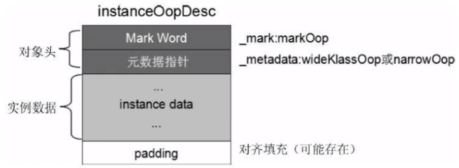
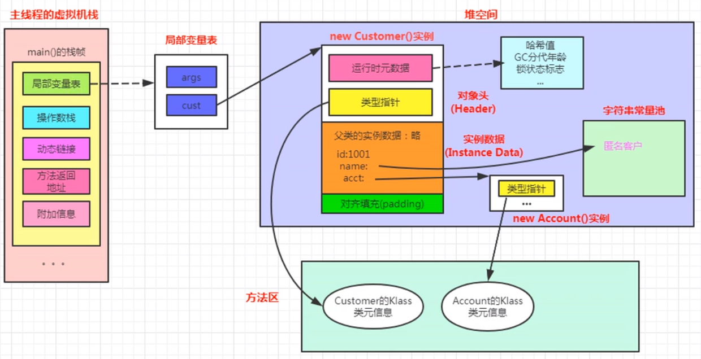
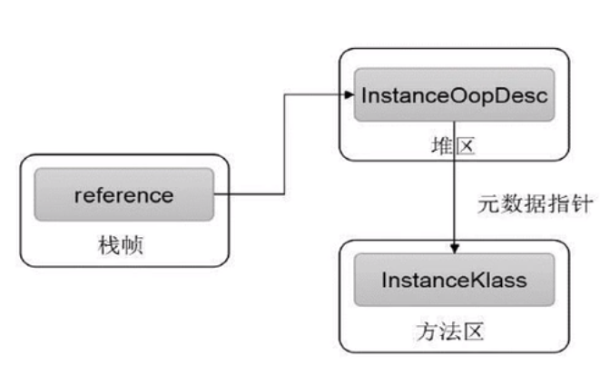
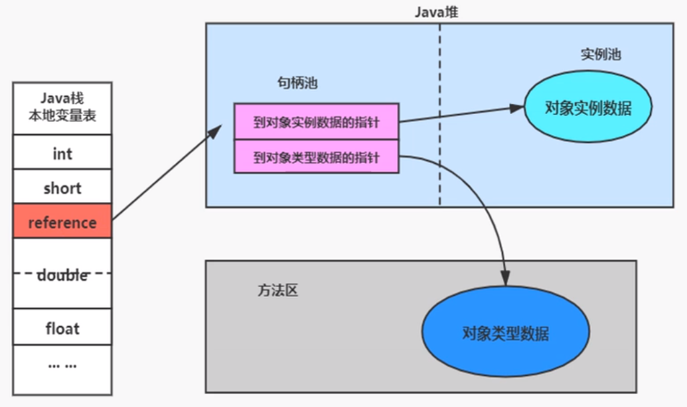
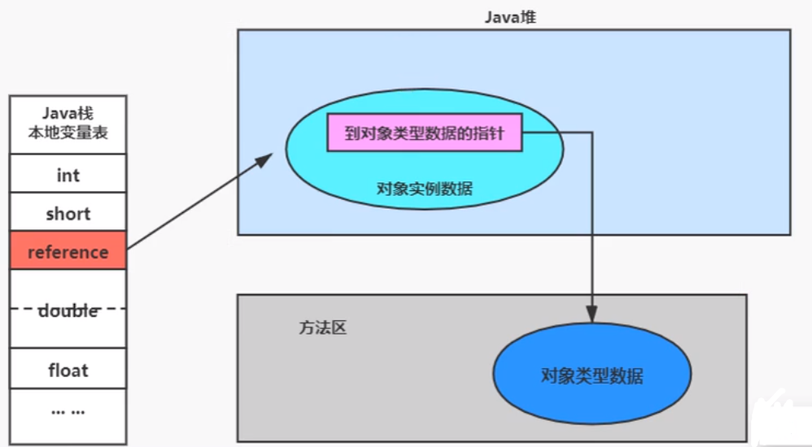
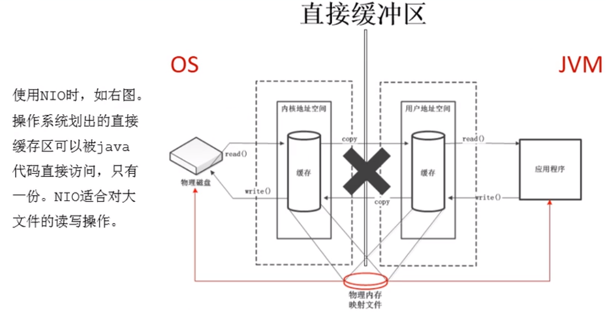

[toc]

# 1. 对象的实例化


## 1.1 创建对象的方式

+ new
  + 最常见的方式
  + 变形1 ： Xxx的静态方法
  + 变形2 ： XxBuilder/XxoxFactory的静态方法

+ Class的newInstance（）：反射的方式，只能调用空参的构造器，权限必须是public（已过时）

+ Constructor的newInstance（Xxx）：反射的方式，可以调用空参、带参的构造器，权限没有要求

+ 使用clone（） ：不调用任何构造器，当前类需要实现Cloneable接口，实现clone（）

+ 使用反序列化：从文件中、从网络中获取一个对象的二进制流

+ 第三方库Objenesis

## 1.2 对象创建的步骤

1. 判断对象对应的类是否加载、链接、初始化

2. 为对象分配内存
   1. 如果内存规整一指针碰撞
   2. 如果内存不规整：
      1. 虚拟机需要维护一个列表
      2. 空闲列表分配

3. 处理并发安全问题
   1. 采用CAS配上失败重试保证更新的原子性
   2. 每个线程预先分配一块TLAB

4. 初始化分配到的空间一所有属性设置默认值，保证对象实例字段在不赋值时可以直接使用

5. 设置对象的对象头

6. 执行init方法进行初始化

### 1.2.1 判断对象对应的类是否加载、链接、初始化

虚拟机遇到一条new指令，首先去检查这个指令的参数能否在Metaspace的常量池中定位到一个类的符号引用，并且检查这个符号引用代表的类是否已经被加载、解析和初始化。（ 即判断类元信息是否存在）。如果没有，那么在双亲委派模式下，使用当前类加载器以ClassLoader+包名+类名为Key进行查找对应的.class文件。如果没有找到文件，则抛出ClassNotFoundException异常，如果找到，则进行类加载，并生成对应的Class类对象

### 1.2.2 为对象分配内存

首先计算对象占用空间大小，接着在堆中划分一块内存给新对象。 如果实例成员变量是引用变量，仅分配引用变量空间即可，即4个字节大小。

- 如果内存规整，使用指针碰撞
   如果内存是规整的，那么虚拟机将采用的是指针碰撞法（BumpThePointer）来为对象分配内存。意思是所有用过的内存在一边，空闲的内存在另外一边，中间放着一个指针作为分界点的指示器，分配内存就仅仅是把指针向空闲那边挪动一段与对象大小相等的距离罢了。如果垃圾收集器选择的是Serial、ParNew这种基于压缩算法的，虚拟机采用这种分配方式。一般使用带有compact （整理）过程的收集器时，使用指针碰撞。
- 如果内存不规整，虚拟机需要维护一个列表，使用空闲列表分配
   如果内存不是规整的，已使用的内存和未使用的内存相互交错，那么虛拟机将采用的是空闲列表法来为对象分配内存。意思是虚拟机维护了一个列表，记录上哪些内存块是可用的，再分配的时候从列表中找到一块足够大的空间划分给对象实例，并更新列表上的内容。这种分配方式成为“空闲列表（Free List） ”。

说明：选择哪种分配方式由Java堆是否规整决定，而Java堆是否规整又由所采用的垃圾收集器是否带有压缩整理功能决定。

### 1.2.3  处理并发安全问题

在分配内存空间时，另外一个问题是及时保证new对象时候的线程安全性：创建对象是非常频繁的操作，虚拟机需要解决并发问题。虚拟机采用 了两种方式解决并发问题：

- CAS （ Compare And Swap ）失败重试、区域加锁：保证指针更新操作的原子性；
- TLAB把内存分配的动作按照线程划分在不同的空间之中进行，即每个线程在Java堆中预先分配一小块内存，称为本地线程分配缓冲区，（TLAB ，Thread Local Allocation Buffer） 虚拟机是否使用TLAB，可以通过一XX：+/一UseTLAB参数来 设定。

### 1.2.4 初始化分配到的空间

内存分配结束，虚拟机将分配到的内存空间都初始化为零值（不包括对象头）。这一步保证了对象的实例字段在Java代码中可以不用赋初始值就可以直接使用，程序能访问到这些字段的数据类型所对应的零值。

 给对象的属性赋值的操作：
 ① 属性的默认初始化 
 ② 显式初始化 
 ③ 代码块中初始化 
 ④ 构造器中初始化

### 1.2.5 设置对象的对象头

将对象的所属类（即类的元数据信息）、对象的HashCode和对象的GC信息、锁信息等数据存储在对象的对象头中。这个过程的具体设置方式取决于JVM实现。

### 1.2.6 执行init方法进行初始化

在Java程序的视角看来，初始化才正式开始。初始化成员变量，执行实例化代码块，调用类的构造方法，并把堆内对象的首地址赋值给引用变量。 因此一般来说（由字节码中是否跟随有invokespecial指令所决定），new指令之 后会接着就是执行方法，把对象按照程序员的意愿进行初始化，这样一个真正可用的对象才算完全创建出来。

```java
/**
 * 测试对象实例化的过程
 *  ① 加载类元信息 - ② 为对象分配内存 - ③ 处理并发问题  - ④ 属性的默认初始化（零值初始化）
 *  - ⑤ 设置对象头的信息 - ⑥ 属性的显式初始化、代码块中初始化、构造器中初始化
 *
 *  给对象的属性赋值的操作：
 *  ① 属性的默认初始化 - ② 显式初始化 / ③ 代码块中初始化 - ④ 构造器中初始化
 */
public class Customer{
    int id = 1001;
    String name;
    Account acct;

    {
        name = "匿名客户";
    }
    public Customer(){
        acct = new Account();
    }

}

class Account{

}
```

# 2. 对象的内存布局

## 2.1 对象头

包含两部分

- 运行时元数据

  - 哈希值（ HashCode ）
  - GC分代年龄
  - 锁状态标志
  - 线程持有的锁
  - 偏向线程ID
  - 偏向时间戳

- 类型指针：指向类元数据的InstanceKlass，确定该对象所属的类型

  说明：如果是数组，还需记录数组的长度

## 2.2 实例数据（Instance Data）

说明：它是对象真正存储的有效信息，包括程序代码中定义的各种类型的字段（包括从父类继承下来的和本身拥有的字段） 规则：

- 相同宽度的字段总被分配在一起
- 父类中定义的变量会出现在子类之前
- 如果CompactFields参数为true（默认为true），子类的窄变量可能插入到父类变量的空隙

## 2.3 对齐填充（Padding）

不是必须的，也没特别含义，仅仅起到占位符作用

## 2.4 小结





# 3. 对象的访问定位

JVM是如何通过栈帧中的对象引|用访问到其内部的对象实例的呢？-> 定位,通过栈上reference访问



对象访问的主要方式有两种

- 句柄访问

  优点：reference中存储稳定句柄地址，对象被移动（垃圾收集时移动对象很普遍）时只会改变句柄中实例数据指针即可，reference本身不需要被修改



- 直接指针(HotSpot采用 , 访问方式会好一点，直接找到对象，效率高)
- 

# 4. 直接内存(Direct Memory) *

- 不是虚拟机运行时数据区的一部分，也不是《Java虚拟机规范》中定义的内存区域
- 直接内存是Java堆外的、直接向系统申请的内存区间
- 来源于NIO，通过存在堆中的DirectByteBuffer操作Native内存

```java
/**
 *  IO                  NIO (New IO / Non-Blocking IO)
 *  byte[] / char[]     Buffer
 *  Stream              Channel
 *
 * 查看直接内存的占用与释放
 */
public class BufferTest {
    private static final int BUFFER = 1024 * 1024 * 1024;//1GB

    public static void main(String[] args){
        //直接分配本地内存空间
        ByteBuffer byteBuffer = ByteBuffer.allocateDirect(BUFFER);
        System.out.println("直接内存分配完毕，请求指示！");

        Scanner scanner = new Scanner(System.in);
        scanner.next();

        System.out.println("直接内存开始释放！");
        byteBuffer = null;
        System.gc();
        scanner.next();
    }
}
```




+ 通常，访问直接内存的速度会优于Java堆。即读写性能高
  + 因此出于性能考虑，读写频繁的场合可能会考虑使用直接内存
  + Java的NIO库允许Java程序使用直接内存，用于数据缓冲区

+ 也可能导致OutOfMemoryError异常:OutOfMemoryError: Direct buffer memory

- 由于直接内存在Java堆外，因此它的大小不会直接受限于 -Xmx指定的最大堆大小，但是系统内存是有限的，Java堆和直接内存的总和依然受限于操作系统能给出的最大内存。
- 缺点
  - 分配回收成本较高
  - 不受JVM内存回收管理
- 直接内存大小可以通过MaxDirectMemorySize设置
- 如果不指定，默认与堆的最大值 -Xmx参数值一致

简单理解： java process memory = java heap + native memory

