[toc]

# 1.垃圾回收概述

## 1.1 什么是垃圾

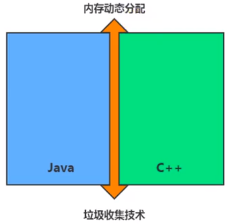

什么是垃圾（ Garbage） 呢？
 ➢垃圾是指在运行程序中没有任何指针指向的对象，这个对象就是需要被回收的垃圾。
 ➢外文： An object is considered garbage when it can no longer be reached from any pointer in the runningprogram.
如果不及时对内存中的垃圾进行清理，那么，这些垃圾对象所占的内存空 间会一直保留到应用程序结束，被保留的空间无法被其他对象使用。甚至可能导致内存溢出。

+ 垃圾收集，不是Java语言的伴生产物。早在1960年，第一门开始使用内存动态分配和垃圾收集技术的Lisp语言诞生。

- 关于垃圾收集有三个经典问题：
  - ➢哪些内存需要回收？
  - ➢什么时候回收？
  - ➢如何回收？

+ 垃圾收集机制是Java的招牌能力，极大地提高了开发效率。如今，垃圾收集几乎成为现代语言的标配，即使经过如此长时间的发展，Java的垃圾收集机制仍然在不断的演进中，不同大小的设备、不同特征的应用场景，对垃圾收集提出了新的挑战，这当然也是面试的热点。

## 1.2 大厂面试题

**蚂蚁金服**：

- 你知道哪几种垃圾回收器，各自的优缺点，重点讲一下 cms和g1
  - 一面： JVM GC算法有哪些，目前的JDK版本采用什么回收算法
  - 一面： （ G1回收器讲下回收过程
- GC是什么？为什么要有GC？
  - 一面： GC的两种判定方法？ CMS收集器与G1收集器的特点。

**百度**：

- 说一下GC算法，分代回收说下
- 垃圾收集策略和算法

**天猫**：

- 一面： jvm GC原理，JVM怎么回收内存
- 一面： CMS特点，垃圾回收算法有哪些？各自的优缺点，他们共同的缺点是什么？

**滴滴**：

- 一面： java的垃圾回收器都有哪些，说下g1的应用场景，平时你是如何搭配使用垃圾回收器的

京东：

- 你知道哪几种垃圾收集器，各自的优缺点，重点讲下cms和G1，包括原理，流程，优缺点。垃圾回收算法的实现原理。

阿里：

- 讲一讲垃圾回收算法。
- 什么情况下触发垃圾回收？
- 如何选择合适的垃圾收集算法？
- JVM有哪三种垃圾回收器？

字节跳动：

- 常见的垃圾回收器算法有哪些，各有什么优劣？
- system.gc （）和runtime.gc（）会做什么事情？
- 一面： Java GC机制？ GC Roots有哪些？
- 二面： Java对象的回收方式，回收算法。
- CMS和G1了解么，CMS解决什么问题，说一下回收的过程。
- CMS回收停顿了几次，为什么要停顿两次。

## 1.3 为什么需要GC

对于高级语言来说，一个基本认知是如果不进行垃圾回收，内存迟早都会被消耗完，因为不断地分配内存空间而不进行回收，就好像不停地生产生活垃圾而从来不打扫一样。

除了释放没用的对象，垃圾回收也可以清除内存里的记录碎片。碎片整理将所占用的堆内存移到堆的一端，以便JVM 将整理出的内存分配给新的对象。

随着应用程序所应付的业务越来越庞大、复杂，用户越来越多，没有GC就不能保证应用程序的正常进行。而经常造成STW的GC又跟不上实际的需求，所以才会不断地尝试对GC进行优化。

## 1.4 早期垃圾回收

- 在早期的C/C++时代，垃圾回收基本.上是手工进行的。开发人员可以使用 new关键字进行内存申请，并使用delete关键字进行内存释放。比如以下代码：

```
MibBridge *pBridge = new cmBaseGroupBridge () 
//如果注册失败，使用Delete释放该对象所占内存区域
if (pBridge->Register(kDestroy)!= NO_ERROR)
	delete pBridge
```

- 这种方式可以灵活控制内存释放的时间，但是会给开发人员带来频繁申请和释放内存的管理负担。倘若有一处内存区间由于程序员编码的问题忘记被回收，那么就会产生内存泄漏，垃圾对象永远无法被清除，随着系统运行时间的不断增长，垃圾对象所耗内存可能持续上升，直到出现内存溢出并造成应用程序崩溃。
- 在有了垃圾回收机制后，上述代码块极有可能变成这样：

```
MibBridge *pBridge = new cmBaseGroupBridge()
pBridge -> Register(kDestroy)
```

- 现在，除了Java以外，C#、Python、 Ruby等语言都使用了自动垃圾回收的思想，也是未来发展趋势。可以说，这种自动化的内存分配和垃圾回收的方式己经成为现代开发语言必备的标准。

## 1.5 Java垃圾回收机制

自动内存管理，无需开发人员手动参与内存的分配与回收，这样**降低内存泄漏和内存溢出的风险**

- 没有垃圾回收器，java也会和cpp一样，各种悬垂指针，野指针，泄露问题让你头疼不已。

自动内存管理机制，将程序员从繁重的内存管理中释放出来，可以更专心地专注于业务开发

oracle官 网关于垃圾回收的介绍

- [介绍](http://docs.oracle.com/javase/8/docs/technotes/guides/vm/gctuning/toc.html)

**担忧：**

对于Java开发人员而言，自动内存管理就像是一个黑匣子，如果过度依赖于 “自动”，那么这将会是一场灾难，最严重的就会弱化Java开发人员在程序出现内存溢出时定位问题和解决问题的能力。

此时，了解JVM的自动内存分配和内存回收原理就显得非常重要，只有在真正了解JVM是如何管理内存后，我们才能够在遇见OutOfMemoryError时， 快速地根据错误异常日志定位问题和解决问题。

当需要排查各种内存溢出、内存泄漏问题时，当垃圾收集成为系统达到更高并发量的瓶颈时，我们就必须对这些“自动化”的技术实施必要的监控和调节。

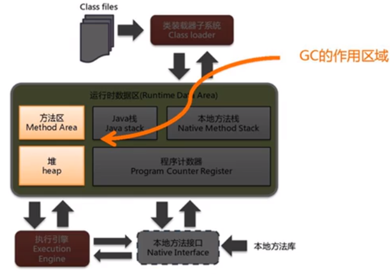

垃圾回收器可以对年轻代回收，也可以对老年代回收，甚至是全堆和方法区的回收。

- 其中，Java堆是垃圾收集器的工作重点。

从次数上讲：

- 频繁收集Young区
- 较少收集Old区
- 基本不动Perm区

# 2. 垃圾回收相关算法

**垃圾标记阶段:对象存活判断**

- 在堆里存放着几乎所有的Java对象实例，在GC执行垃圾回收之前，首先需要区分出内存中哪些是存活对象，哪些是已经死亡的对象。只有被标记为己经死亡的对象，GC才会在执行垃圾回收时，释放掉其所占用的内存空间，因此这个过程我们可以称为垃圾标记阶段。
- 那么在JVM中究竟是如何标记一个死亡对象呢？简单来说，当一个对象已经不再被任何的存活对象继续引用时，就可以宣判为已经死亡。
- 判断对象存活一般有两种方式：**引用计数算法**  和  **可达性分析算法**。

## 2.1 标记阶段：引用计数算法

- 引用计数算法（Reference Counting）比较简单，对每个对象保存一个整型 的引用计数器属性。用于记录对象被引用的情况。
- 对于一个对象A，只要有任何一个对象引用了A，则A的引用计数器就加1；当引用失效时，引用计数器就减1。只要对象A的引用计数器的值为0，即表示对象A不可能再被使用，可进行回收。
- 优点：**实现简单，垃圾对象便于辨识；判定效率高，回收没有延迟性。**
- 缺点：
  - ➢它需要单独的字段存储计数器，这样的做法增加了存储空间的开销。
  - ➢每次赋值都需要更新计数器，伴随着加法和减法操作，这增加了时间开销。
  - ➢引用计数器有一个严重的问题，即**无法处理循环引用**的情况。这是一 条致命缺陷，导致在Java的垃圾回收器中没有使用这类算法。

循环引用：

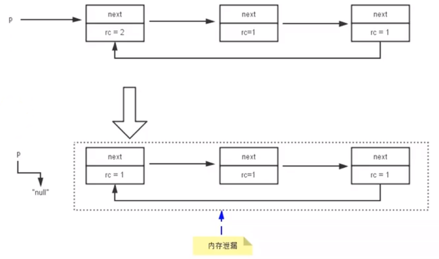

```java
/**
 * -XX:+PrintGCDetails
 * 证明：java使用的不是引用计数算法
 */
public class RefCountGC {
    //这个成员属性唯一的作用就是占用一点内存
    private byte[] bigSize = new byte[5 * 1024 * 1024];//5MB

    Object reference = null;

    public static void main(String[] args) {
        RefCountGC obj1 = new RefCountGC();
        RefCountGC obj2 = new RefCountGC();

        obj1.reference = obj2;
        obj2.reference = obj1;

        obj1 = null;
        obj2 = null;
        //显式的执行垃圾回收行为
        //这里发生GC，obj1和obj2能否被回收？
        System.gc();

        try {
            Thread.sleep(1000000);
        } catch (InterruptedException e) {
            e.printStackTrace();
        }
    }
}
```

**图示分析证明java没有采用引用计数法**

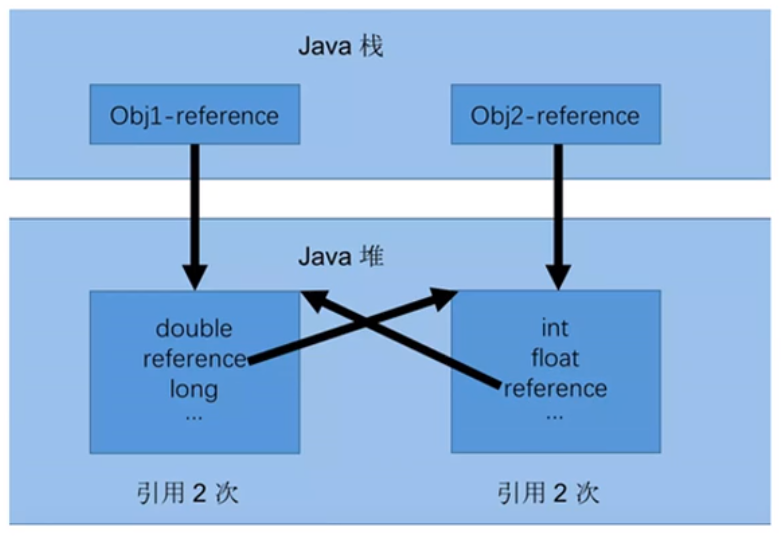

如果不下小心直接把0bj1 一reference和0bj2 一reference置null。 则在Java堆当中的两块内存依然保持着互相引用，无法回收。

**小结**

引用计数算法， 是很多语言的资源回收选择，例如因人工智能而更加火热的Python，它更是同时支持引用计数和垃圾收集机制。

具体哪种最优是要看场景的，业界有大规模实践中仅保留引用计数机制，以提高吞吐量的尝试。

Java并没有选择引用计数，是因为其存在一个基本的难题，也就是很难处理循环引用关系。

Python 如何解决循环引用？

- ➢手动解除： 很好理解，就是在合适的时机，解除引用关系。
- ➢使用弱引用weakref，weakref是Python提供的标准库，旨在解决循环引用。

## 2.2 标记阶段：可达性分析算法

### 2.2.1 可达性分析算法(或根搜索算法、追踪性垃圾收集)

相对于引用计数算法而言，可达性分析算法不仅同样具备实现简单和执行高 效等特点，**更重要的是该算法可以有效地解决在引用计数算法中循环引用的问题，防止内存泄漏的发生。**

相较于引用计数算法，这里的可达性分析就是Java、C#选择的。这种类型的垃圾收集通常也叫作追踪性垃圾收集（Tracing Garbage Collection）。

所谓"GC Roots"根集合就是一组必须活跃的引用。

基本思路：

- ➢可达性分析算法是以根对象集合(GCRoots）为起始点，按照从上至下的方式**搜索被根对象集合所连接的目标对象是否可达**。
- ➢使用可达性分析算法后，内存中的存活对象都会被根对象集合直接或间接连接着，搜索所走过的路径称为**引用链**（Reference Chain）
- ➢如果目标对象没有任何引用链相连，则是不可达的，就意味着该对象己经死亡，可以标记为垃圾对象。
- ➢在可达性分析算法中，只有能够被根对象集合直接或者间接连接的对象才是存活对象。

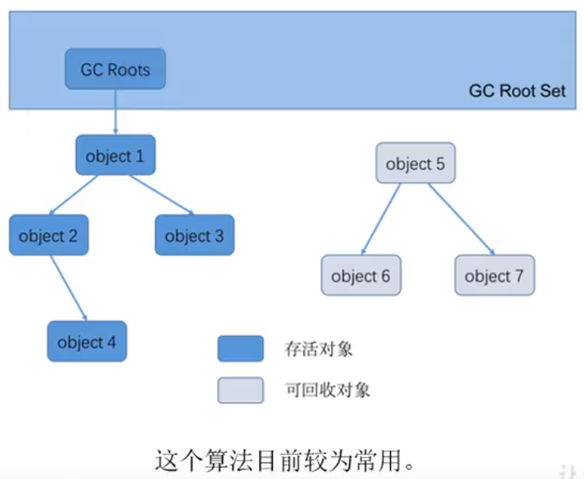

### 2.2.2 GC Roots

在Java语言中，GC Roots包括以下几类元素：

- 虚拟机栈中引用的对象
  - ➢比如：各个线程被调用的方法中使用到的参数、局部变量等。
- 本地方法栈内JNI（通常说的本地方法）引用的对象
- 方法区中类静态属性引用的对象
  - ➢比如：Java类的引用类型静态变量
- 方法区中常量引用的对象
  - ➢比如：字符串常量池（string Table） 里的引用
- 所有被同步锁synchroni zed持有的对象
- Java虚拟机内部的引用。
  - ➢基本数据类型对应的Class对象，一些常驻的异常对象（如： NullPointerException、OutOfMemoryError） ，系统类加载器。
- 反映java虚拟机内部情况的JMXBean、JVMTI中注册的回调、本地代码缓存等
- 除了这些固定的GCRoots集合以外，根据用户所选用的垃圾收集器以及当 前回收的内存区域不同，还可以有其他对象“临时性”地加入，共同构成完整GC Roots集合。比如：分代收集和局部回收（Partial GC）。
  - ➢如果只针对Java堆中的某一块区域进行垃圾回收（比如：典型的只针 对新生代），必须考虑到内存区域是虚拟机自己的实现细节，更不是孤立封闭的，这个区域的对象完全有可能被其他区域的对象所引用，这时候就需要一.并将关联的区域对象也加入GC Roots集合中去考虑，才能保证可达性分析的准确性。
- 小技巧：由于Root采用栈方式存放变量和指针，所以如果一个指针，它保存了堆内存里面的对象，但是自己又不存放在堆内存里面，那它就是一个Root

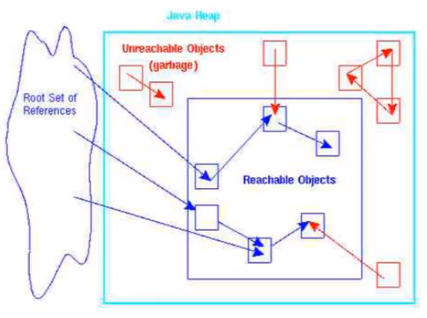

**注意**

- 如果要使用可达性分析算法来判断内存是否可回收，那么分析工作必须在一个能保障一致性的快照中进行。这点不满足的话分析结果的准确性就无法保证。
- 这点也是导致GC进行时必须“StopTheWorld"的一个重要原因。
  - ➢即使是号称（几乎）不会发生停顿的CMS收集器中，枚举根节点时也是**必须要停顿**的。

## 2.3 对象的finalization机制

Java语言提供了对象终止（finalization）机制来允许开发人员提供对象被销毁之前的自定义处理逻辑。

当垃圾回收器发现没有引用指向一个对象，即：垃圾回收此对象之前，总会先调用这个对象的finalize（）方法。

finalize（）方法允许在子类中被重写，用于在对象被回收时进行资源释放。通常在这个方法中进行一些资源释放和清理的工作，比如关闭文件、套接字和数据库连接等。

应该交给垃圾回收机制调用。理由包括下面三点：永远不要主动调用某个对象的finalize （）方法

- ➢在finalize（） 时可能会导致对象复活。
- ➢finalize（）方法的执行时间是没有保障的，它完全由GC线程决定，极端情况下，若不发生GC，则finalize（） 方法将没有执行机会。
- ➢一个糟糕的finalize （）会严重影响GC的性能。

从功能上来说，finalize（）方法与C++ 中的析构函数比较相似，但是Java采用的是基于垃圾回收器的自动内存管理机制，所以finalize（）方法在本质，上不同于C++ 中的析构函数。

**对象是否"死亡"**

- 由于finalize （）方法的存在，**虚拟机中的对象一般处于三种可能的状态**

- 如果从所有的根节点都无法访问到某个对象，说明对象己经不再使用了。一般来说，此对象需要被回收。但事实上，也并非是“非死不可”的，这时候它们暂时处于“缓刑”阶段。**一个无法触及的对象有可能在某一个条件下“复活”自己**，如果这样，那么对它的回收就是不合理的，为此，定义虚拟机中的对象可能的三种状态。如下：

  - ➢**可触及的**：从根节点开始，可以到达这个对象。
  - ➢**可复活的**：对象的所有引用都被释放，但是对象有可能在finalize（）中复活。
  - ➢**不可触及的**：对象的finalize（）被调用，并且没有复活，那么就会进入不可触及状态。不可触及的对象不可能被复活，因为finalize（） 只会被调用一一次。

- 以上3种状态中，是由于finalize（）方法的存在，进行的区分。只有在对象不可触及时才可以被回收。 

**判定是否可以回收具体过程**

判定一个对象objA是否可回收，至少要经历两次标记过程：

1. 如果对象objA到GC Roots没有引用链，则进行第一 次标记。
2. 进行筛选，判断此对象是否有必要执行finalize（）方法
   1. ①如果对 象objA没有重写finalize（）方法，或者finalize （）方法已经被虚拟机调用过，则虚拟机视为“没有必要执行”，objA被判定为不可触及的。
   2. ②如果对象objA重写了finalize（）方法，且还未执行过，那么objA会被插入到F-Queue队列中，由一个虚拟机自动创建的、低优先级的Finalizer线程触发其finalize（）方法执行。
   3. ③**finalize（）方法是对象逃脱死亡的最后机会**，稍后GC会对F-Queue队列中的对象进行第二次标记。如果objA在finalize（）方法中与引用链上的任何一个对象建立了联系，那么在第二次标记时，objA会被移出“即将回收”集合。之后，对象会再次出现没有引用存在的情况。在这个情况下，finalize方法不会被再次调用，对象会直接变成不可触及的状态，也就是说，一个对象的finalize方法只会被调用一次。

**代码测试可复活的对象**

```java
/**
 * 测试Object类中finalize()方法，即对象的finalization机制。
 *
 */
public class CanReliveObj {
    public static CanReliveObj obj;//类变量，属于 GC Root 
    //此方法只能被调用一次
    @Override
    protected void finalize() throws Throwable {
        super.finalize();
        System.out.println("调用当前类重写的finalize()方法");
        obj = this;//当前待回收的对象在finalize()方法中与引用链上的一个对象obj建立了联系
    }


    public static void main(String[] args) {
        try {
            obj = new CanReliveObj();
            // 对象第一次成功拯救自己
            obj = null;
            System.gc();//调用垃圾回收器
            System.out.println("第1次 gc");
            // 因为Finalizer线程优先级很低，暂停2秒，以等待它
            Thread.sleep(2000);
            if (obj == null) {
                System.out.println("obj is dead");
            } else {
                System.out.println("obj is still alive");
            }
            System.out.println("第2次 gc");
            // 下面这段代码与上面的完全相同，但是这次自救却失败了
            obj = null;
            System.gc();
            // 因为Finalizer线程优先级很低，暂停2秒，以等待它
            Thread.sleep(2000);
            if (obj == null) {
                System.out.println("obj is dead");
            } else {
                System.out.println("obj is still alive");
            }
        } catch (InterruptedException e) {
            e.printStackTrace();
        }
    }
}

控制台输出
第1次 gc
调用当前类重写的finalize()方法
obj is still alive
第2次 gc
obj is dead
```

## 2.4 MAT与JProfiler的GC Roots溯源

MAT是Memory Analyzer的简称，它是一 款功能强大的Java堆内存分析器。用于查找内存泄漏以及查看内存消耗情况。
MAT是基于Eclipse开发的，是一款免费的性能分析工具。
可以在http://www.eclipse org/mat/下载并使用MAT。

## 2.5 清除阶段

当成功区分出内存中存活对象和死亡对象后，GC接下来的任务就是执行垃圾回收，释放掉无用对象所占用的内存空间，以便有足够的可用内存空间为新对象分配内存.
目前在JVM中比较常见的三种垃圾收集算法是标记-清除算法（ Mark-Sweep）、复制算法（Copying）、标记-压缩算法（Mark-Compact）

### 2.5.1 标记-清除算法

**背景**

标记一清除算法（Mark一Sweep）是一种非常基础和常见的垃圾收集算法，该算法被J . McCarthy等人在1960年提出并应用于Lisp语言。

**执行过程**

当堆中的有效内存空间（available memory） 被耗尽的时候，就会停止整个程序（也被称为stop the world），然后进行两项工作，第一项则是标记，第二项则是清除。

- 标记： Collector从引用根节点开始遍历，标记所有被引用的对象(非垃圾对象/可达对象)。一般是在对象的Header中记录为可达对象。
- 清除： Collector对堆 内存从头到尾进行线性的遍历，如果发现某个对象在其Header中没有标记为可达对象，则将其回收。


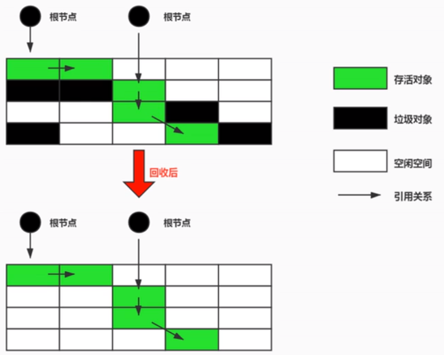

**缺点**

- ➢效率不算高
- ➢在进行GC的时候，需要停止整个应用程序，导致用户体验差
- ➢**这种方式清理出来的空闲内存是不连续的，产生内存碎片**。需要维护一个空闲列表

**注意：何为清除？**

- **这里所谓的清除并不是真的置空**，而是把需要清除的对象地址保存在空闲的地址列表里。下次有新对象需要加载时，判断垃圾的位置空间是否够，如果够，就存放。

### 2.5.2 标记-清除算法

**背景**

为了解决标记一清除算法在垃圾收集效率方面的缺陷，M.L.Minsky于1963年发表了著名的论文，“ 使用双存储区的Li sp语言垃圾收集器CALISP Garbage Collector Algorithm Using SerialSecondary Storage ）”。M.L. Minsky在该论文中描述的算法被人们称为复制（Copying）算法，它也被M. L.Minsky本人成功地引入到了Lisp语言的一个实现版本中。

**核心思想**

将活着的内存空间分为两块，每次只使用其中一块，在垃圾回收时将正在使用的内存中的存活对象复制到未被使用的内存块中，之后清除正在使用的内存块中的所有对象，交换两个内存的角色，最后完成垃圾回收。
**堆中S0和S1使用的就是复制算法**

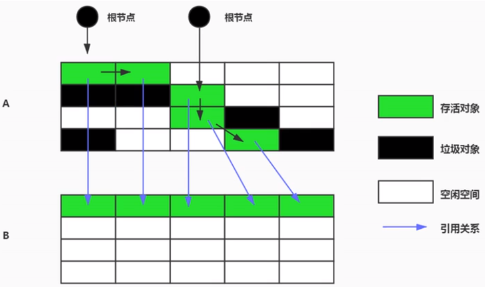

**优点**

- 没有标记和清除过程，实现简单，运行高效
- 复制过去以后保证空间的连续性，不会出现“碎片”问题。

**缺点**

- 此算法的缺点也是很明显的，就是需要两倍的内存空间。
- 对于G1这种分拆成为大量region的GC，复制而不是移动，意味着GC需要维护region之间对象引用关系，不管是内存占用或者时间开销也不小。

**特别的**
如果系统中的垃圾对象很多，复制算法不会很理想。因为复制算法需要复制的存活对象数量并不会太大，或者说非常低才行。

**应用场景**

在新生代，对常规应用的垃圾回收，一次通常可以回收708一 99的内存空间。回收性价比很高。所以现在的商业虚拟机都是用这种收集算法回收新生代。

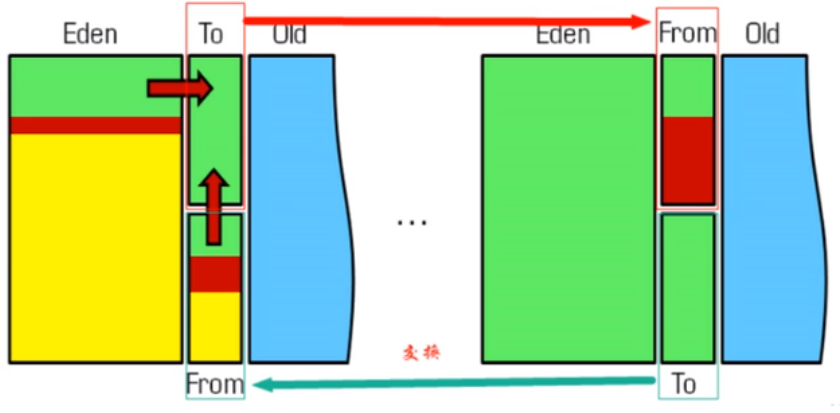

### 2.5.3 标记-压缩(整理)算法

**背景**
复制算法的高效性是建立在存活对象少、垃圾对象多的前提下的。这种情况在新生代经常发生，但是在老年代，更常见的情况是大部分对象都是存活对象。如果依然使用复制算法，由于存活对象较多，复制的成本也将很高。因此，**基于老年代垃圾回收的特性，需要使用其他的算法**。
标记-清除算法的确可以应用在老年代中，但是该算法不仅执行效率低下，而且在执行完内存回收后还会产生内存碎片，所以JVM的设计者需要在此基础之上进行改进。标记-压缩（Mark-Compact） 算法由此诞生。
1970年前后，G. L. Steele 、C. J. Chene和D.S. Wise 等研究者发布标记一压缩算法。在许多现代的垃圾收集器中，人们都使用了标记一压缩算法或其改进版本。

**执行过程**

- 第一阶段和标记-清除算法一样，从根节点开始标记所有被引用对象.
- 第二阶段将所有的存活对象压缩到内存的一端，按顺序排放。
- 之后，清理边界外所有的空间。

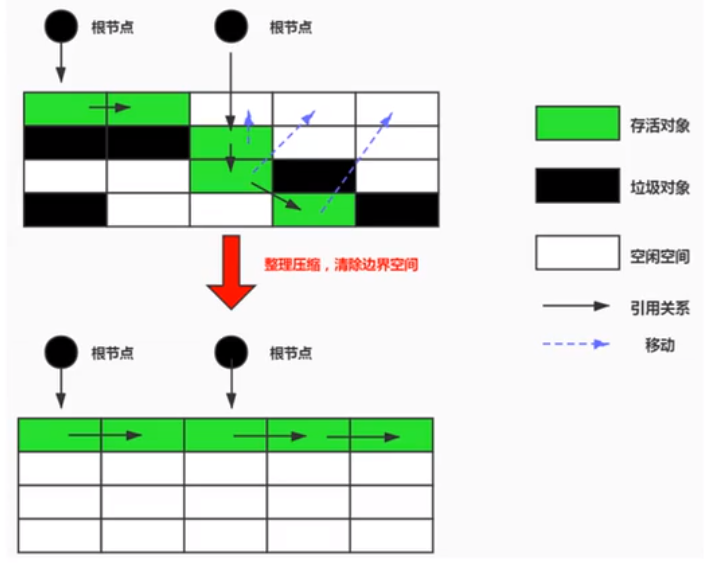

- 标记-压缩算法的最终效果等同于标记-清除算法执行完成后，再进行一次内存碎片整理，因此，也可以把它称为标记-清除-压缩（Mark- Sweep-Compact）算法。
- 二者的本质差异在于标记-清除算法是一种非移动式的回收算法，标记-压缩是移动式的。是否移动回收后的存活对象是一项优缺点并存的风险决策。
- 可以看到，标记的存活对象将会被整理，按照内存地址依次排列，而未被标记的内存会被清理掉。如此一来，当我们需要给新对象分配内存时，JVM只需要持有一个内存的起始地址即可，这比维护一个空闲列表显然少了许多开销。

**指针碰撞（Bump the Pointer ）**：如果内存空间以规整和有序的方式分布，即已用和未用的内存都各自一边，彼此之间维系着一个记录下一次分配起始点的标记指针，当为新对象分配内存时，只需要通过修改指针的偏移量将新对象分配在第一个空闲内存位置上，这种分配方式就叫做指针碰撞（Bump the Pointer） 。

**优点**

- 消除了标记-清除算法当中，内存区域分散的缺点，我们需要给新对象分配内存时，JVM只需要持有一个内存的起始地址即可。
- 消除了复制算法当中，内存减半的高额代价。

**缺点**

- 从效率上来说，标记-整理算法要低于复制算法。
- 移动对象的同时，如果对象被其他对象引用，则还需要调整引用的地址。移动过程中，需要全程暂停用户应用程序。即： STW

### 2.5.4 小结

- 效率上来说，复制算法是当之无愧的老大，但是却浪费了太多内存。
- 而为了尽量兼顾上面提到的三个指标，标记-整理算法相对来说更平滑一些，但是效率.上不尽如人意，它比复制算法多了一个标记的阶段，比标记一清除多了一个整理内存的阶段。

|          |    Mark-Sweep    |  Mark-Compact  |               Copying               |
| :------: | :--------------: | :------------: | :---------------------------------: |
|   速度   |       中等       |      最慢      |                最快                 |
| 空间开销 | 少(但会堆积碎片) | 少(不堆积碎片) | 通常需要活对象的2倍大小(不堆积碎片) |
| 移动对象 |        否        |       是       |                 是                  |

## 2.6 分代收集算法

难道就没有一种最优的算法么?
**没有最好的算法,只有更合适的算法**
前面所有这些算法中，并没有一种算法可以完全替代其他算法，它们都具有自己独特的优势和特点。分代收集算法应运而生。
**分代收集算法**，是基于这样一个事实：不同的对象的生命周期是不一样的。因此，**不同生命周期的对象可以采取不同的收集方式，以便提高回收效率**。一般是把Java堆分为新生代和老年代，这样就可以根据各个年代的特点使用不同的回收算法，以提高垃圾回收的效率。
在Java程序运行的过程中，会产生大量的对象，其中有些对象是与业务信息相关，比如Http请求中的Session对象、线程、Socket连接， 这类对象跟业务直接挂钩，因此生命周期比较长。但是还有一些对象，主要是程序运行过程中生成的临时变量，这些对象生命周期会比较短，比如： String对象， 由于其不变类的特性，系统会产生大量的这些对象，有些对象甚至只用一次即可回收。

目前几乎所有的GC都是采用分代收集（Generational Collecting） 算法执行垃圾回收的。  在HotSpot中，基于分代的概念，GC所使用的内存回收算法必须结合年轻代和老年代各自的特点。

- 年轻代（Young Gen）
  - 年轻代特点：区域相对老年代较小，对象生命周期短、存活率低，回收频繁。
  - 这种情况**复制算法**的回收整理，速度是最快的。复制算法的效率只和当前存活对象大小有关，因此很适用于年轻代的回收。而复制算法内存利用率不高的问题，通过hotspot中的两个survivor的设计得到缓解。·
- 老年代（Tenured Gen）
  - 老年代特点：区域较大，对象生命周期长、存活率高，回收不及年轻代频繁。
  - 这种情况存在大量存活率高的对象，复制算法明显变得不合适。一般是由标记-清除或者是标记-清除与标记-整理的混合实现。
    - ➢Mark阶段的开销与存活对象的数量成正比。
    - ➢Sweep阶段的开销与所管理区域的大小成正相关。
    - ➢Compact阶段的开销与存活对象的数据成正比。

以HotSpot中的CMS回收器为例，CMS是基于Mark-Sweep实现的，对于对象的回收效率很高。而对于碎片问题，CMS采用基于Mark-Compact算法的Serial 0ld回收器作为补偿措施：当内存回收不佳（碎片导致的Concurrent Mode Failure时），将采用Serial 0ld执行Full GC以达到对老年代内存的整理。
**分代的思想被现有的虚拟机广泛使用。几乎所有的垃圾回收器都区分新生代和老年代。**

## 2.7 增量收集算法、分区算法

### 2.7.1  增量收集算法

上述现有的算法，在垃圾回收过程中，应用软件将处于一种stop the World的状态。在Stop the World状态下，应用程序所有的线程都会挂起，暂停一切正常的工作，等待垃圾回收的完成。如果垃圾回收时间过长，应用程序会被挂起很久，将严重影响用户体验或者系统的稳定性。为了解决这个问题，即对实时垃圾收集算法的研究直接导致了增量收集（Incremental Collecting） 算法的诞生。

**基本思想**

如果一次性将所有的垃圾进行处理，需要造成系统长时间的停顿，那么就可以让垃圾收集线程和应用程序线程交替执行。每次，**垃圾收集线程只收集一小片区域的内存空间，接着切换到应用程序线程。依次反复，直到垃圾收集完成**。
总的来说，增量收集算法的基础仍是传统的标记-清除和复制算法。增量收集算法**通过对线程间冲突的妥善处理，允许垃圾收集线程以分阶段的方式完成标记、清理或复制工作**。

**缺点**

使用这种方式，由于在垃圾回收过程中，间断性地还执行了应用程序代码，所以能减少系统的停顿时间。但是，因为线程切换和上下文转换的消耗，会使得垃圾回收的总体成本上升，**造成系统吞吐量的下降**。

### 2.7.2  分区算法
一般来说，在相同条件下，堆空间越大，一次GC时所需要的时间就越长，有关GC产生的停顿也越长。为了更好地控制GC产生的停顿时间，将一块 大的内存区域分割成多个小块，根据目标的停顿时间，每次合理地回收若干个小区间，而不是整个堆空间，从而减少一次GC所产生的停顿。
分代算法将按照对象的生命周期长短划分成两个部分，分区算法将整个堆空间划分成连续的不同小区间。
每一个小区间都独立使用，独立回收。这种算法的好处是可以控制一次回收多少个小区间。

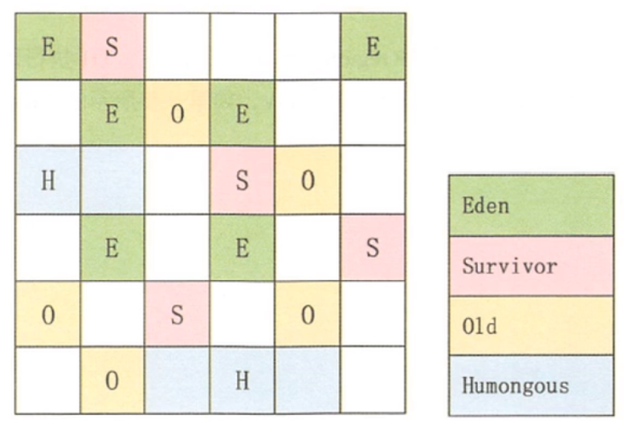

**写在最后**

注意，这些只是基本的算法思路，实际GC实现过程要复杂的多，目前还在发展中的前沿GC都是复合算法，并且并行和并发兼备。

# 3. 垃圾回收相关概念

## 3.1 System.gc()的理解

在默认情况下，通过System.gc()或者Runtime . getRuntime() .gc()的调用，会**显式触发Full GC**，同时对老年代和新生代进行回收，尝试释放被丢弃对象占用的内存。

然而System.gc()调用附带一个免责声明，**无法保证对垃圾收集器的调用(无法保证马上触发GC**。

JVM实现者可以通过system.gc()调用来决定JVM的GC行为。而一般情况下，垃圾回收应该是自动进行的，无须手动触发，否则就太过于麻烦了。在一些特殊情况下，如我们正在编写一个性能基准，我们可以在运行之间调用System.gc()。

以下代码,如果注掉System.runFinalization(); 那么控制台不保证一定打印,证明了System.gc()无法保证GC一定执行

```java
public class SystemGCTest {
    public static void main(String[] args) {
        new SystemGCTest();
        System.gc();//提醒jvm的垃圾回收器执行gc,但是不确定是否马上执行gc
        //与Runtime.getRuntime().gc();的作用一样。
        System.runFinalization();//强制调用使用引用的对象的finalize()方法
    }

    @Override
    protected void finalize() throws Throwable {
        super.finalize();
        System.out.println("SystemGCTest 重写了finalize()");
    }
}
```

**手动gc理解不可达对象的回收行为**

```java
public class LocalVarGC {
    public void localvarGC1() {
        byte[] buffer = new byte[10 * 1024 * 1024];//10MB
        System.gc();
        //输出: 不会被回收, FullGC时被放入老年代
        //[GC (System.gc()) [PSYoungGen: 14174K->10736K(76288K)] 14174K->10788K(251392K), 0.0089741 secs] [Times: user=0.01 sys=0.00, real=0.01 secs]
        //[Full GC (System.gc()) [PSYoungGen: 10736K->0K(76288K)] [ParOldGen: 52K->10649K(175104K)] 10788K->10649K(251392K), [Metaspace: 3253K->3253K(1056768K)], 0.0074098 secs] [Times: user=0.01 sys=0.02, real=0.01 secs]
    }

    public void localvarGC2() {
        byte[] buffer = new byte[10 * 1024 * 1024];
        buffer = null;
        System.gc();
        //输出: 正常被回收
        //[GC (System.gc()) [PSYoungGen: 14174K->544K(76288K)] 14174K->552K(251392K), 0.0011742 secs] [Times: user=0.00 sys=0.00, real=0.00 secs]
        //[Full GC (System.gc()) [PSYoungGen: 544K->0K(76288K)] [ParOldGen: 8K->410K(175104K)] 552K->410K(251392K), [Metaspace: 3277K->3277K(1056768K)], 0.0054702 secs] [Times: user=0.01 sys=0.00, real=0.01 secs]

    }

    public void localvarGC3() {
        {
            byte[] buffer = new byte[10 * 1024 * 1024];
        }
        System.gc();//buffer 还占用变量表
        //输出: 不会被回收, FullGC时被放入老年代
        //[GC (System.gc()) [PSYoungGen: 14174K->10736K(76288K)] 14174K->10784K(251392K), 0.0076032 secs] [Times: user=0.02 sys=0.00, real=0.01 secs]
        //[Full GC (System.gc()) [PSYoungGen: 10736K->0K(76288K)] [ParOldGen: 48K->10649K(175104K)] 10784K->10649K(251392K), [Metaspace: 3252K->3252K(1056768K)], 0.0096328 secs] [Times: user=0.01 sys=0.01, real=0.01 secs]
    }

    public void localvarGC4() {
        {
            byte[] buffer = new byte[10 * 1024 * 1024];
        }
        int value = 10;
        System.gc();//buffer在变量表中被value变量占用了，就没有引用了
        //输出: 正常被回收
        //[GC (System.gc()) [PSYoungGen: 14174K->496K(76288K)] 14174K->504K(251392K), 0.0016517 secs] [Times: user=0.01 sys=0.00, real=0.00 secs]
        //[Full GC (System.gc()) [PSYoungGen: 496K->0K(76288K)] [ParOldGen: 8K->410K(175104K)] 504K->410K(251392K), [Metaspace: 3279K->3279K(1056768K)], 0.0055183 secs] [Times: user=0.00 sys=0.00, real=0.01 secs]
    }

    public void localvarGC5() {
        localvarGC1();
        System.gc();
        //输出: 正常被回收
        //[GC (System.gc()) [PSYoungGen: 14174K->10720K(76288K)] 14174K->10744K(251392K), 0.0121568 secs] [Times: user=0.02 sys=0.00, real=0.02 secs]
        //[Full GC (System.gc()) [PSYoungGen: 10720K->0K(76288K)] [ParOldGen: 24K->10650K(175104K)] 10744K->10650K(251392K), [Metaspace: 3279K->3279K(1056768K)], 0.0101068 secs] [Times: user=0.01 sys=0.02, real=0.01 secs]
        //[GC (System.gc()) [PSYoungGen: 0K->0K(76288K)] 10650K->10650K(251392K), 0.0005717 secs] [Times: user=0.00 sys=0.00, real=0.00 secs]
        //[Full GC (System.gc()) [PSYoungGen: 0K->0K(76288K)] [ParOldGen: 10650K->410K(175104K)] 10650K->410K(251392K), [Metaspace: 3279K->3279K(1056768K)], 0.0045963 secs] [Times: user=0.01 sys=0.00, real=0.00 secs]
    }

    public static void main(String[] args) {
        LocalVarGC local = new LocalVarGC();
        local.localvarGC5();
    }
}
```

## 3.2 内存溢出与内存泄漏

### 3.2.1 内存溢出

- 内存溢出相对于内存泄漏来说，尽管更容易被理解，但是同样的，内存溢出也是引发程序崩溃的罪魁祸首之一。
- 由于GC一直在发展，所有一般情况下，除非应用程序占用的内存增长速度非常快，造成垃圾回收已经跟不上内存消耗的速度，否则不太容易出现OOM的情况。
- 大多数情况下，GC会进行各种年龄段的垃圾回收，实在不行了就放大招，来一次独占式的Full GC操作，这时候会回收大量的内存，供应用程序继续使用。
- javadoc中对OutOfMemoryError的解释是，**没有空闲内存，并且垃圾收集器也无法提供更多内存**。

- 首先说没有空闲内存的情况：说明Java虚拟机的堆内存不够。原因有二：

  - （1） **Java虚拟机的堆内存设置不够。**
     比如：可能存在内存泄漏问题；也很有可能就是堆的大小不合理，比如我们要处理比较可观的数据量，但是没有显式指定JVM堆大小或者指定数值偏小。我们可以通过参数-Xms、-Xmx来调整。

  - （2）**代码中创建了大量大对象，并且长时间不能被垃圾收集器收集（存在被引用）**

    对于老版本的Oracle JDK，因为永久代的大小是有限的，并且JVM对永久代垃圾回收（如，常量池回收、卸载不再需要的类型）非常不积极，所以当我们不断添加新类型的时候，永久代出现OutOfMemoryError也非常多见，尤其是在运行时存在大量动态类型生成的场合；类似intern字符串缓存占用太多空间，也会导致0OM问题。对应的异常信息，会标记出来和永久代相关： "java. lang. OutOfMemoryError： PermGen space"。
     随着元数据区的引入，方法区内存已经不再那么窘迫，所以相应的OOM有所改观，出现00M，异常信息则变成了：“java. lang. OutOfMemoryError： Metaspace"。 直接内存不足，也会导致0OM。

- 这里面隐含着一层意思是，在抛出OutOfMemoryError之 前，通常垃圾收集器会被触发，尽其所能去清理出空间。

  - ➢例如：在引用机制分析中，涉及到JVM会去尝试回收软引用指向的对象等。
  - ➢在java.nio.BIts.reserveMemory（）方法中，我们能清楚的看到，System.gc（）会被调用，以清理空间。

- 当然，也不是在任何情况下垃圾收集器都会被触发的

  - ➢比如，我们去分配一个超大对象，类似一个超大数组超过堆的最大值，JVM可以判断出垃圾收集并不能解决这个问题，所以直接拋出OutOfMemoryError

### 3.2.2  内存泄漏(Memory Leak)
- 也称作“存储渗漏”。严格来说，**只有对象不会再被程序用到了，但是GC又不能回收他们的情况，才叫内存泄漏**。
- 但实际情况很多时候一些不太好的实践（或疏忽）会导致对象的生命周期变得很长甚至导致OOM，也可以叫做宽泛意义上的“内存泄漏
- 尽管内存泄漏并不会立刻引起程序崩溃，但是一旦发生内存泄漏，程序中的可用内存就会被逐步蚕食，直至耗尽所有内存，最终出现OutOfMemory异常，导致程序崩溃。
- 注意，这里的存储空间并不是指物理内存，而是指虚拟内存大小，这个虚拟内存大小取决于磁盘交换区设定的大小。

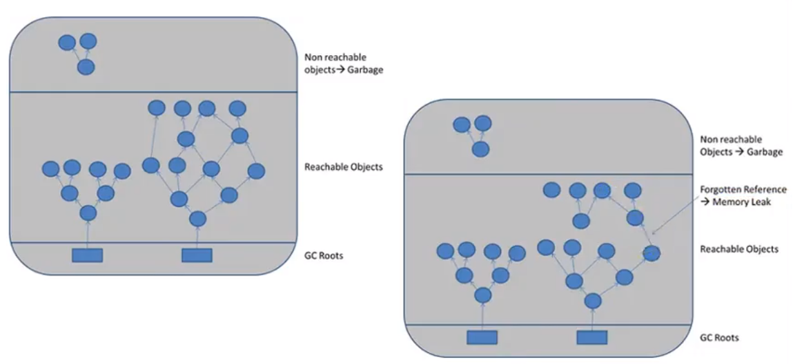

**举例**

- 1、单例模式
   单例的生命周期和应用程序是一样长的，所以单例程序中，如果持有对外部对象的引用的话，那么这个外部对象是不能被回收的，则会导致内存泄漏的产生。
- 2、一些提供close的资源未关闭导致内存泄漏 数据库连接（ dataSourse. getConnection（）），网络连接（socket）和io连接必须手动close，否则是不能被回收的。

## 3.3 Stop The World

- Stop-the-World，简称STW，指的是GC事件发生过程中，会产生应用程序的停顿。停顿产生时整个应用程序线程都会被暂停，没有任何响应，有点像卡死的感觉，这个停顿称为STW。.
  - ➢可达性分析算法中枚举根节点（GC Roots）会导致所有Java执行线程停顿。.
    - 分析工作必须在一个能确保一致性的快照 中进行
    - 一致性指整个分析期间整个执行系统看起来像被冻结在某个时间点上V- - 如果出现分析过程中对象引用关系还在不断变化，则分析结果的准确性无法保证
- 被STW中断的应用程序线程会在完成GC之后恢复，频繁中断会让用户感觉像是网速不快造成电影卡带一样， 所以我们需要减少STW的发生。
- STW事件和采用哪款GC无关，所有的GC都有这个事件。
- 哪怕是G1也不能完全避免Stop-the-world情况发生，只能说垃圾回收器越来越优秀，回收效率越来越高，尽可能地缩短了暂停时间。
- STW是JVM在后台自动发起和自动完成的。在用户不可见的情况下，把用户正常的工作线程全部停掉。
- 开发中不要用System.gc（）；会导致Stop-the-world的发生。

**测试代码**

```java
public class StopTheWorldDemo {
    public static class WorkThread extends Thread {
        List<byte[]> list = new ArrayList<byte[]>();

        public void run() {
            try {
                while (true) {
                    for(int i = 0;i < 1000;i++){
                        byte[] buffer = new byte[1024];
                        list.add(buffer);
                    }

                    if(list.size() > 10000){
                        list.clear();
                        System.gc();//会触发full gc，进而会出现STW事件
                    }
                }
            } catch (Exception ex) {
                ex.printStackTrace();
            }
        }
    }

    public static class PrintThread extends Thread {
        public final long startTime = System.currentTimeMillis();

        public void run() {
            try {
                while (true) {
                    // 每秒打印时间信息
                    long t = System.currentTimeMillis() - startTime;
                    System.out.println(t / 1000 + "." + t % 1000);
                    Thread.sleep(1000);
                }
            } catch (Exception ex) {
                ex.printStackTrace();
            }
        }
    }

    public static void main(String[] args) {
        WorkThread w = new WorkThread();
        PrintThread p = new PrintThread();
        w.start();
        p.start();
    }
}
```

## 3.4 垃圾回收的并行与并发

### 3.4.1  并发(Concurrent)
- 在操作系统中，是指一个时间段中有几个程序都处于己启动运行到运行完毕之间，且这几个程序都是在同一个处理器上运行。
- 并发不是真正意义上的“同时进行”，只是CPU把一个时间段划分成几个时间片段（时间区间），然后在这几个时间区间之间来回切换，由于CPU处理的速度非常快，只要时间间隔处理得当，即可让用户感觉是多个应用程序同时在进行。

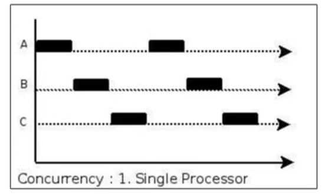

### 3.4.2 并行(Parallel)

- 当系统有一个以上CPU时，当一个CPU执行一个进程时，另一个CPU可以执行另一个进程，两个进程互不抢占CPU资源，可以同时进行，我们称之为并行（Parallel）。
- 其实决定并行的因素不是CPU的数量，而是CPU的核心数量，比如一个CPU多个核也可以 并行。
- 适合科学计算，后台处理等弱交互场景


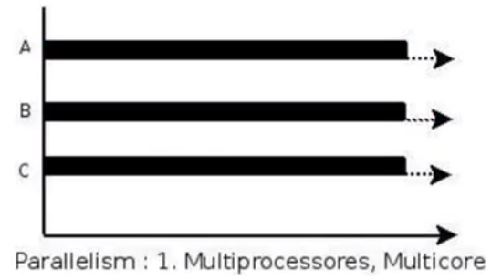

**二者对比**

- 并发，指的是多个事情，在同一时间段内同时发生了。
- 并行，指的是多个事情，在同一时间点上同时发生了。
- 并发的多个任务之间是互相抢占资源的。
- 并行的多个任务之间是不互相抢占资源的。
- 只有在多CPU或者一个CPU多核的情况中，才会发生并行。否则，看似同时发生的事情，其实都是并发执行的。

### 3.4.3 垃圾回收的并发与并行

并发和并行，在谈论垃圾收集器的上下文语境中，它们可以解释如下：

- 并行（Parallel） ：指多条垃圾收集线程并行工作，但此时用户线程仍处于等待状态。
  - 如ParNew、 Parallel Scavenge、 Parallel Old；
- 串行（Serial）
  - 相较于并行的概念，单线程执行。
  - 如果内存不够，则程序暂停，启动JVM垃圾回收器进行垃圾回收。回收完，再启动程序的线程。

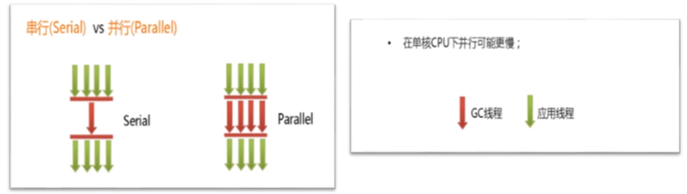

- 并发（Concurrent） ：指用户线程与垃圾收集线程同时执行（但不一定是并行的，可能会交替执行），垃圾回收线程在执行时不会停顿用户程序的运行。
  - ➢用户程序在继续运行，而垃圾收集程序线程运行于另一个CPU上；
  - ➢如： CMS、G1

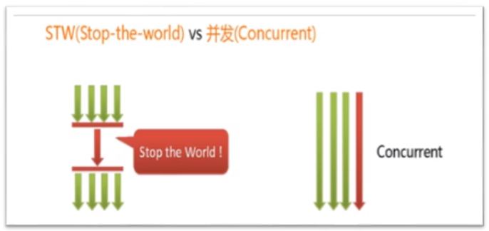

**这里的并发与并行的概念需要与多线程中的概念加以区分**

## 3.5 安全点与安全区域

### 3.5.1 安全点(Safepoint)

- 程序执行时并非在所有地方都能停顿下来开始GC，只有在特定的位置才能停顿下来开始GC，这些位置称为“安全点（Safepoint） ”
- Safe Point的选择很重要，如果太少可能导致GC等待的时间太长，如果太频繁可能导致运行时的性能问题。大部分指令的执行时间都非常短暂，通常会根据“是否具有让程序长时间执行的特征”为标准。比如：选择些执行时间较长的指令作为Safe Point， 如方法调用、循环跳转和异常跳转等。

**如何在GC发生时，检查所有线程都跑到最近的安全点停顿下来呢？**

- **抢先式中断**： （目前没有虚拟机采用了） 首先中断所有线程。如果还有线程不在安全点，就恢复线程，让线程跑到安全点。
- **主动式中断**： 设置一个中断标志，各个线程运行到Safe Point的时候主动轮询这个标志，如果中断标志为真，则将自己进行中断挂起。

### 3.5.2  安全区域(Safe Region)

  Safepoint机制保证了程序执行时，在不太长的时间内就会遇到可进入GC的Safepoint 。但是，程序“不执行”的时候呢？例如线程处于Sleep 状态或Blocked状态，这时候线程无法响应JVM的中断请求，“走” 到安全点去中断挂起，JVM也不太可能等待线程被唤醒。对于这种情况，就需要安全区域（Safe Region）来解决。
  安全区域是指在一段代码片段中，对象的引用关系不会发生变化，在这个区域中的任何位置开始GC都是安全的。我们也可以把Safe Region 看做是被扩展了的Safepoint。

**实际执行时:**

- 1、当线程运行到Safe Region的代码时，首先标识已经进入了Safe Region，如果这段时间内发生GC，JVM会 忽略标识为Safe Region状态 的线程；
- 2、当线程即将离开Safe Region时， 会检查JVM是否已经完成GC，如果完成了，则继续运行，否则线程必须等待直到收到可以安全离开SafeRegion的信号为止；

## 3.6 引用

- 我们希望能描述这样一类对象： 当内存空间还足够时，则能保留在内存中；如果内存空间在进行垃圾收集后还是很紧张，则可以抛弃这些对象。
-  【既偏门又非常高频的面试题】强引用、软引用、弱引用、虚引用有什么区别？具体使用.场景是什么？
- 在JDK 1.2版之后，Java对引用的概念进行了扩充，将引用分为强引用（Strong Reference）、软引用（Soft Reference） 、弱引用（Weak Reference） 和虚引用（Phantom Reference） 4种，这4种引用强度依次逐渐减弱。
- 除强引用外，其他3种引用均可以在java.lang.ref包中找到它们的身影。如下图，显示了这3种引用类型对应的类，开发人员可以在应用程序中直接使用它们。

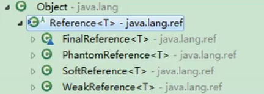

Reference子类中只有终结器引用是包内可见的，其他3种引用类型均为public，可以在应用程序中直接使用

- **强引用（StrongReference）**：最传统的“引用”的定义，是指在程序代码之中普遍存在的引用赋值，即类似“Object obj=new object（ ）”这种引用关系。**无论任何情况下，只要强引用关系还存在，垃圾收集器就永远不会回收掉被引用的对象。**
- **软引用（SoftReference）** ：在系统将要发生内存溢出之前，将会把这些对象列入回收范围之中进行第二次回收。如果这次回收后还没有足够的内存，才会抛出内存溢出异常。
- **弱引用（WeakReference）** ：被弱引用关联的对象只能生存到下一次垃圾收集之前。当垃圾收集器工作时，无论内存空间是否足够，都会回收掉被弱引用关联的对象。
- **虚引用（PhantomReference）** ：一个对象是否有虛引用的存在，完全不会对其生存时 间构成影响，也无法通过虚引用来获得一个对象的实例。**为一个对象设置虛引用关联的唯一目的就是能在这个对象被收集器回收时收到一个系统通知(回收跟踪)。**

### 3.6.1 强引用--不回收

- 在Java程序中，最常见的引用类型是强引用（普通系统99%以上都是强引用），也就是我们最常见的普通对象引用，也是默认的引用类型。
- 当在Java语言中使用new操作符创建一个新的对象， 并将其赋值给一个变量的时候，这个变量就成为指向该对象的一个强引用。
- 强引用的对象是可触及的，垃圾收集器就永远不会回收掉被引用的对象。
- 对于一个普通的对象，如果没有其他的引用关系，只要超过了引用的作用域或者显式地将相应（强）引用赋值为null，就是可以当做垃圾被收集了，当然具体回收时机还是要看垃圾收集策略。
- 相对的，软引用、 弱引用和虚引用的对象是软可触及、弱可触及和虛可触及的，在一定条件下，都是可以被回收的。所以，强引用是造成Java内存泄漏的主要原因之一。

```java
public class StrongReferenceTest {
    public static void main(String[] args) {
        StringBuffer str = new StringBuffer ("Hello,尚硅谷");
        StringBuffer str1 = str;

        str = null;
        System.gc();

        try {
            Thread.sleep(3000);
        } catch (InterruptedException e) {
            e.printStackTrace();
        }

        System.out.println(str1);
    }
}
```

**举例**

`StringBuffer str = new StringBuffer ("Hello,尚硅谷");`
局部变量str指向StringBuffer实例所在堆空间，通过str可以操作该实例，那么str就是StringBuffer实例的强引用
对应内存结构：

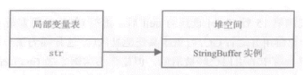

此时,如果再运行一个赋值语句:
`StringBuffer str1 = str;`
对应内存结构:

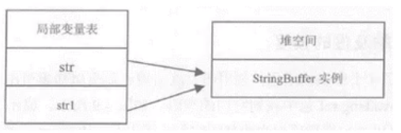
本例中的两个引用，都是强引用，强引用具备以下特点：

- 强引用可以直接访问目标对象。
- 强引用所指向的对象在任何时候都不会被系统回收，虚拟机宁愿抛出OOM异常，也不会回收强引用所指向对象。
- 强引用可能导致内存泄漏。

### 3.6.2 软引用--内存不足即回收

- 软引用是用来描述一 些还有用，但非必需的对象。**只被软引用关联着的对象，在系统将要发生内存溢出异常前，会把这些对象列进回收范围之中进行第二次回收**，如果这次回收还没有足够的内存，才会抛出内存溢出异常。
- **软引用通常用来实现内存敏感的缓存**。比如：高速缓存就有用到软引用。如果还有空闲内存，就可以暂时保留缓存，当内存不足时清理掉，这样就保证了使用缓存的同时，不会耗尽内存。
- 垃圾回收器在某个时刻决定回收软可达的对象的时候，会清理软引用，并可选地把引用存放到一个引用队列（ Reference Queue）。
- 类似弱引用，只不过Java虚拟机会尽量让软引用的存活时间长一些，迫不得已才清理。
- 软引用：
  - 当内存足够: 不会回收软引用的可达对象
  - 当内存不够时: 会回收软引用的可达对象
- 在JDK 1. 2版之后提供了java.lang.ref.SoftReference类来实现软引用。

```java
Object obj = new object（）； //声明强引用
SoftReference<0bject> sf = new SoftReference<0bject>（obj）；
obj = null； //销毁强引用
```

**测试代码**

```java
/**
 * 软引用的测试：内存不足即回收
 * -Xms10m -Xmx10m -XX:+PrintGCDetails
 */
public class SoftReferenceTest {
    public static class User {
        public User(int id, String name) {
            this.id = id;
            this.name = name;
        }

        public int id;
        public String name;

        @Override
        public String toString() {
            return "[id=" + id + ", name=" + name + "] ";
        }
    }

    public static void main(String[] args) {
        //创建对象，建立软引用
//        SoftReference<User> userSoftRef = new SoftReference<User>(new User(1, "songhk"));
        //上面的一行代码，等价于如下的三行代码
        User u1 = new User(1,"songhk");
        SoftReference<User> userSoftRef = new SoftReference<User>(u1);
        u1 = null;//取消强引用


        //从软引用中重新获得强引用对象
        System.out.println(userSoftRef.get());

        System.gc();
        System.out.println("After GC:");
//        //垃圾回收之后获得软引用中的对象
        System.out.println(userSoftRef.get());//由于堆空间内存足够，所以不会回收软引用的可达对象。
//
        try {
            //让系统认为内存资源紧张、不够
//            byte[] b = new byte[1024 * 1024 * 7];
            byte[] b = new byte[1024 * 7168 - 399 * 1024];//恰好能放下数组又放不下u1的内存分配大小 不会报OOM，也会回收
        } catch (Throwable e) {
            e.printStackTrace();
        } finally {
            //再次从软引用中获取数据
            System.out.println(userSoftRef.get());//在报OOM之前，垃圾回收器会回收软引用的可达对象。
        }
    }
}
```

### 3.6.3 弱引用--发现即回收

- 弱引用也是用来描述那些非必需对象，**被弱引用关联的对象只能生存到下一次垃圾收集发生为止**。在系统GC时，只要发现弱引用，不管系统堆空间使用是否充足，都会回收掉只被弱引用关联的对象。
- 但是，由于垃圾回收器的线程通常优先级很低，因此，并不一 定能很快地发现持有弱引用的对象。**在这种情况下，弱引用对象可以存在较长的时间**。
- 弱引用和软引用一样，在构造弱引用时，也可以指定一个引用队列，当弱引用对象被回收时，就会加入指定的引用队列，通过这个队列可以跟踪对象的回收情况。
- **软引用、弱引用都非常适合来保存那些可有可无的缓存数据**。如果这么做，当系统内存不足时，这些缓存数据会被回收，不会导致内存溢出。而当内存资源充足时，这些缓存数据又可以存在相当长的时间，从而起到加速系统的作用。
- 在JDK1.2版之后提后了java.lang.ref.WeakReference类来实现弱引用

```java
Object obj = new object（）； //声明强引用
WeakReference<0bject> sf = new WeakReference<0bject>（obj）；
obj = null； //销毁强引用
```

- 弱引用对象与软引用对象的最大不同就在于，当GC在进行回收时，需要通过算法检查是否回收软引用对象，而对于弱引用对象，GC总是进行回收。弱引用对象更容易、更快被GC回收。
- **面试题：你开发中使用过WeakHashMap吗？**
  - 通过查看WeakHashMap源码,可以看到其内部类Entry使用的就是弱引用
  - line 702 -> `private static class Entry extends WeakReference implements Map.Entry {...}`

**测试代码**

```java
public class WeakReferenceTest {
    public static class User {
        public User(int id, String name) {
            this.id = id;
            this.name = name;
        }

        public int id;
        public String name;

        @Override
        public String toString() {
            return "[id=" + id + ", name=" + name + "] ";
        }
    }

    public static void main(String[] args) {
        //构造了弱引用
        WeakReference<User> userWeakRef = new WeakReference<User>(new User(1, "songhk"));
        //从弱引用中重新获取对象
        System.out.println(userWeakRef.get());

        System.gc();
        // 不管当前内存空间足够与否，都会回收它的内存
        System.out.println("After GC:");
        //重新尝试从弱引用中获取对象
        System.out.println(userWeakRef.get());
    }
}
```

### 3.6.4 虚引用(Phantom Reference)--对象回收跟踪

- 虚引用(Phantom Reference),也称为“幽灵引用”或者“幻影引用”，是所有引用类型中最弱的一个。
- 一个对象是否有虚引用的存在，完全不会决定对象的生命周期。如果一个对象仅持有虚引用，那么它和没有引用几乎是一样的，随时都可能被垃圾回收器回收。
- 它不能单独使用，也无法通过虚引用来获取被引用的对象。当试图通过虚引用的get（）方法取得对象时，总是null。
- **为一个对象设置虚引用关联的唯一目的在于跟踪垃圾回收过程**。比如：能在这个对象被收集器回收时收到一个系统通知。
- **虚引用必须和引用队列一起使用。**虚引用在创建时必须提供一个引用队列作为参数。当垃圾回收器准备回收一个对象时，如果  发现它还有虛引用，就会在回收对象后，将这个虚引用加入引用队列，以通知应用程序对象的回收情况。
- **由于虚引用可以跟踪对象的回收时间，因此，也可以将一些资源释放操作放置在虛引用中执行和记录。**
- 在JDK 1. 2版之后提供了PhantomReference类来实现虚引用。

```java
object obj = new object();
ReferenceQueuephantomQueue = new ReferenceQueue( ) ;
PhantomReference<object> pf = new PhantomReference<object>(obj, phantomQueue); 
obj = null;
```

**测试代码**

```java
public class PhantomReferenceTest {
    public static PhantomReferenceTest obj;//当前类对象的声明
    static ReferenceQueue<PhantomReferenceTest> phantomQueue = null;//引用队列

    public static class CheckRefQueue extends Thread {
        @Override
        public void run() {
            while (true) {
                if (phantomQueue != null) {
                    PhantomReference<PhantomReferenceTest> objt = null;
                    try {
                        objt = (PhantomReference<PhantomReferenceTest>) phantomQueue.remove();
                    } catch (InterruptedException e) {
                        e.printStackTrace();
                    }
                    if (objt != null) {
                        System.out.println("追踪垃圾回收过程：PhantomReferenceTest实例被GC了");
                    }
                }
            }
        }
    }

    @Override
    protected void finalize() throws Throwable { //finalize()方法只能被调用一次！
        super.finalize();
        System.out.println("调用当前类的finalize()方法");
        obj = this;
    }

    public static void main(String[] args) {
        Thread t = new CheckRefQueue();
        t.setDaemon(true);//设置为守护线程：当程序中没有非守护线程时，守护线程也就执行结束。
        t.start();

        phantomQueue = new ReferenceQueue<PhantomReferenceTest>();
        obj = new PhantomReferenceTest();
        //构造了 PhantomReferenceTest 对象的虚引用，并指定了引用队列
        PhantomReference<PhantomReferenceTest> phantomRef = new PhantomReference<PhantomReferenceTest>(obj, phantomQueue);

        try {
            //不可获取虚引用中的对象
            System.out.println(phantomRef.get());

            //将强引用去除
            obj = null;
            //第一次进行GC,由于对象可复活，GC无法回收该对象
            System.gc();
            Thread.sleep(1000);
            if (obj == null) {
                System.out.println("obj 是 null");
            } else {
                System.out.println("obj 可用");
            }
            System.out.println("第 2 次 gc");
            obj = null;
            System.gc(); //一旦将obj对象回收，就会将此虚引用存放到引用队列中。
            Thread.sleep(1000);
            if (obj == null) {
                System.out.println("obj 是 null");
            } else {
                System.out.println("obj 可用");
            }
        } catch (InterruptedException e) {
            e.printStackTrace();
        }
    }
}
输出
null
调用当前类的finalize()方法
obj 可用
第 2 次 gc
追踪垃圾回收过程：PhantomReferenceTest实例被GC了
obj 是 null
```

### 3.6.5 终结器引用(FinalReference)

- 它用以实现对象的finalize（）方法，也可以称为终结器引用。
- 无需手动编码， 其内部配合引用队列使用。
- 在GC时， 终结器引用入队。由Finalizer线程通过终结器引用找到被引用对象并调用它的finalize（）方法，第二次GC时才能回收被引用对象。

# 4. 垃圾回收器

## 4.1 GC的分类与性能指标

### 4.1.1 垃圾回收器概述

- 垃圾收集器没有在规范中进行过多的规定，可以由不同的厂商、不同版本的JVM来实现。
- 由于JDK的版本处于高速迭代过程中，因此Java发展至今已经衍生了众多的GC版本。
- 从不同角度分析垃圾收集器，可以将GC分为不同的类型。

### 4.1.2 垃圾回收器分类

**按线程数(指的是垃圾回收的线程数)分，可以分为串行垃圾回收器和并行垃圾回收器**

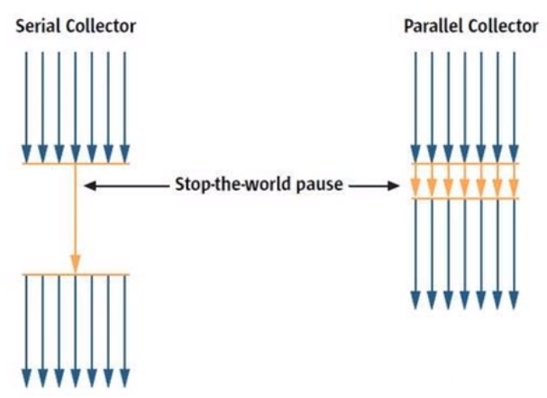

串行回收指的是在同一时间段内只允许有一个CPU用于执行垃圾回收操作，此时工作线程被暂停，直至垃圾收集工作结束。

- ➢在诸如单CPU处理器或者较小的应用内存等硬件平台不是特别优越的场合，串行回收器的性能表现可以超过并行回收器和并发回收器。所以，**串行回收默认被应用在客户端的Client模式下的JVM中**
- ➢在并发能力比较强的CPU上，并行回收器产生的停顿时间要短于串行回收器。

和串行回收相反，并行收集可以运用多个CPU同时执行垃圾回收，因此提升了应用的吞吐量，不过并行回收仍然与串行回收一样，采用独占式，使用了“ Stop-the-world”机制。

**按照工作模式分，可以分为并发式垃圾回收器和独占式垃圾回收器**

- 并发式垃圾回收器与应用程序线程交替工作，以尽可能减少应用程序的停顿时间。
- 独占式垃圾回收器（Stop the world）一旦运行，就停止应用程序中的所有用户线程，直到垃圾回收过程完全结束。

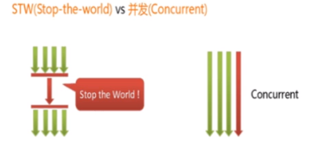

**按碎片处理方式分，可分为压缩式垃圾回收器和非压缩式垃圾回收器**

- 压缩式垃圾回收器会在回收完成后，对存活对象进行压缩整理，消除回收后的碎片。
  - 再分配对象空间使用: 指针碰撞
- 非压缩式的垃圾回收器不进行这步操作。
  - 再分配对象空间使用: 空闲列表

**按工作的内存区间分，又可分为年轻代垃圾回收器和老年代垃圾回收器**

### 4.1.3 评估GC的性能指标

**六个指标：**

- **吞吐量**：运行用户代码的时间占总运行时间的比例

  - （总运行时间：程序的运行时间 + 内存回收的时间）

- 垃圾收集开销：吞吐量的补数，垃圾收集所用时间与总运行时间的比例。

- **暂停时间**：执行垃圾收集时，程序的工作线程被暂停的时间

- 收集频率：相对于应用程序的执行，收集操作发生的频率。

- **内存占用**： Java堆区所占的内存大小

- 快速：一个对象从诞生到被回收所经历的时间。

  

- 这三者(吞吐量、暂停时间、内存占用)共同构成一个“不可能三角”。三者总体的表现会随着技术进步而越来越好。一款优秀的收集器通常最多同时满足其中的两项。

- 这三项里，暂停时间的重要性日益凸显。因为随着硬件发展，内存占用多些越来越能容忍，硬件性能的提升也有助于降低收集器运行时对应用程序的影响，即提高了吞吐量。而内存的扩大，对延迟反而带来负面效果。

- 简单来说，主要抓住两点：

  - 吞吐量
  - 暂停时间

#### 4.1.3.1 吞吐量

- 吞吐量就是CPU用于运行用户代码的时间与CPU总消耗时间的比值，即吞吐量=运行用户代码时间/ （运行用户代码时间+垃圾收集时间）
  - ➢比如：虚拟机总共运行了100分钟，其中垃圾收集花掉1分钟，那吞吐量就是99%
- 这种情况下，应用程序能容忍较高的暂停时间，因此，高吞吐量的应用程序有更长的时间基准，快速响应是不必考虑的。
- 吞吐量优先，意味着在单位时间内，STW的时间最短： 0.2 + 0.2 = 0.4

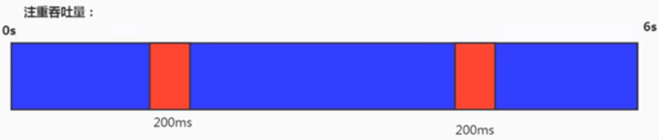

#### 4.1.3.2 暂停时间

- “暂停时间”是指一个时间段内应用程序线程暂停，让GC线程执行的状态
  - ➢例如，GC期间100毫秒的暂停时间意味着在这100毫秒期间内没有应用程序线程是活动的。.
- 暂停时间优先，意味着尽可能让单次STW的时间最短： 0.1 + 0.1 + 0.1 + 0.1+0.1=0.5

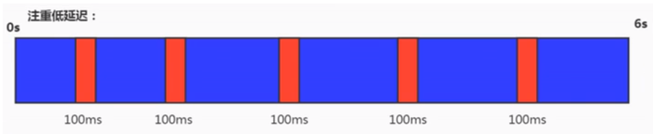

#### 4.1.3.3 吞吐量VS暂停时间

高吞吐量较好因为这会让应用程序的最终用户感觉只有应用程序线程在做“生产性”工作。直觉上，吞吐量越高程序运行越快。

低暂停时间（低延迟）较好因为从最终用户的角度来看不管是GC还是其他原因导致一个应用被挂起始终是不好的。这取决于应用程序的类型，有时候甚至短暂的200毫秒暂停都可能打断终端用户体验。因此，具有低的较大暂停时间是非常重要的，特别是对于一个交互式应用程序。

不幸的是”高吞吐量”和”低暂停时间”是一对相互竞争的目标（矛盾）。

- ➢因为如果选择以吞吐量优先，那么必然需要降低内存回收的执行频率，但是这样会导致GC需要更长的暂停时间来执行内存回收。
- ➢相反的，如果选择以低延迟优先为原则，那么为了降低每次执行内存回收时的暂停时间，也只能频繁地执行内存回收，但这又引起了年轻代内存的缩诚和导致程序吞吐量的下降。

在设计（或使用） GC算法时，我们必须确定我们的目标： 一个GC算法只可能针对两个目标之一（即只专注于较大吞吐量或最小暂停时间），或.尝试找到一个二者的折衷。

**现在标准：在最大吞吐量优先的情况下，降低停顿时间。**

## 4.2 不同的垃圾回收器概述

垃圾收集机制是Java的招牌能力，极大地提高了开发效率。这当然也是面试的热点。
那么，Java常见的垃圾收集器有哪些？

### 4.2.1 垃圾收集器发展史

有了虚拟机，就一定需要收集垃圾的机制，这就是Garbage Collection， 对应的产品我们称为Garbage Collector.

- 1999年随JDK1.3.1一 起来的是串行方式的Serial GC，它是第一款GC。ParNew垃圾收集器是Serial收集器的多线程版本
- 2002年2月26日，Parallel GC和Concurrent Mark Sweep GC跟随JDK1.4.2一起发布
- Parallel GC在JDK6之后成为HotSpot默认GC。
- 2012年，在JDK1.7u4版本中，G1可用。
- 2017年，JDK9中G1变成默认的垃圾收集器，以替代CMS。
- 2018年3月，JDK10中G1垃圾回收器的并行完整垃圾回收，实现并行性来改善最坏情况下的延迟。
- ------------分水岭------------
- 2018年9月，JDK11发布。引入Epsilon垃圾回收器，又被称为"No一0p （无操作） "回收器。同时，引入ZGC：可伸缩的低延迟垃圾回收器（Experimental）。
- 2019年3月，JDK12发布。 增强G1，自动返回未用堆内存给操作系统。同时，引入Shenandoah GC：低停顿时间的GC （Experimental）。
- 2019年9月，JDK13发布。增强ZGC，自动返回未用堆内存给操作系统。
- 2020年3月，JDK14发布。删除CMS垃圾回收器。扩展ZGC在macOS和Windows.上的应用

### 4.2.2 7款经典的垃圾收集器

- 串行回收器：Serial. Serial Old
- 并行回收器：ParNew. Parallel Scavenge. Parallel Old
- 并发回收器：CMS. G1