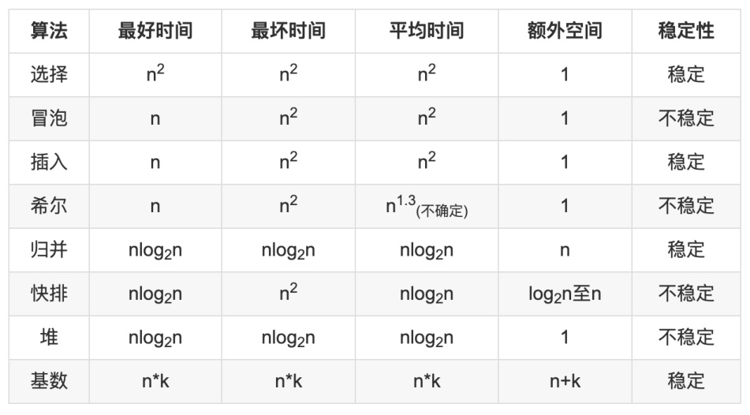

[toc]

# 一、二叉树
## 遍历
### 前序遍历
```java
    public List<Integer> preorderTraversal(TreeNode root) {
        List<Integer> result = new LinkedList<Integer>();
        Stack<TreeNode> stack = new Stack<>();
      
        while(root!=null || !stack.isEmpty()){
            while(root!=null){
                result.add(root.val);
                stack.push(root);
                root = root.left;
            }
            root = stack.pop();
            root = root.right;
        }
        return result;
    }
```
### 中序遍历
```java
    public List<Integer> inorderTraversal(TreeNode root) {
        List<Integer> result = new LinkedList<Integer>();
        Stack<TreeNode> stack = new Stack<>();
        TreeNode temp = root;
        while(temp!=null || !stack.isEmpty()){
            while(temp!=null){
                stack.push(temp);
                temp = temp.left;
            }
            temp = stack.pop();
            result.add(temp.val);
            temp = temp.right;
        }
        return result;
    }
```
### 后序遍历
```java
    public List<Integer> postorderTraversal(TreeNode root) {
        List<Integer> result = new LinkedList<Integer>();
        Deque<TreeNode> stack = new LinkedList<TreeNode>();
        TreeNode prev = null;
        while(root!=null || !stack.isEmpty()){
            while(root!=null){
                stack.push(root);
                root=root.left;
            }
            root = stack.pop();
            if(root.right==null|| root.right==prev){
                result.add(root.val);
                prev = root;
                root = null;
            }else{
                stack.push(root);
                root = root.right;
            }
        }
        return result;
    }
```
### 层次遍历
```java
    List<List<Integer>> result = new LinkedList<>();
    public List<List<Integer>> levelOrder(TreeNode root) {
        dfs(root,0);
        return result;
    }
    public void dfs(TreeNode root,int level){
        if(root==null) return;
        if(level==result.size()){
            result.add(new LinkedList<Integer>());
        }
        result.get(level).add(root.val);
        dfs(root.left,level+1);
        dfs(root.right,level+1);
    }
```
### 锯齿形层次遍历
```java
    List<List<Integer>> result = new LinkedList<>();
    public List<List<Integer>> zigzagLevelOrder(TreeNode root) {
        dfs(root,0);
        return result;
    }
    public void dfs(TreeNode root,int level){
        if(root==null) return ;
        if(level==result.size()){
            result.add(new LinkedList<Integer>());
        }
        if((level & 1)==1){
            result.get(level).add(0,root.val);
        }else{
            result.get(level).add(root.val);
        }
        dfs(root.left,level+1);
        dfs(root.right,level+1);
    }
```

# 二、排序
[这或许是东半球分析十大排序算法最好的一篇文章](https://mp.weixin.qq.com/s/Qf416rfT4pwURpW3aDHuCg)
[十大经典排序算法动画与解析，看我就够了！](https://mp.weixin.qq.com/s/vn3KiV-ez79FmbZ36SX9lg)
## 冒泡排序
```java

    //冒泡排序
    public int[] bubbleSort(int[] nums){
        int n = nums.length;
        for(int i = 0;i<n-1;i++){
            for(int j = i+1;j<n;j++){
                if(nums[i]>nums[j]){
                    nums[i] = nums[i] ^ nums[j];
                    nums[j] = nums[i] ^ nums[j];
                    nums[i] = nums[i] ^ nums[j];
                }
            }
        }
        return nums;
    }
    //冒泡排序的优化
    public int[] bubbleSortGood(int[] nums){
        int n = nums.length;
        for(int i = 0;i<n-1;i++){
            boolean flag = true;
            for(int j = i+1;j<n;j++){
                if(nums[i]>nums[j]){
                    nums[i] = nums[i] ^ nums[j];
                    nums[j] = nums[i] ^ nums[j];
                    nums[i] = nums[i] ^ nums[j];
                    flag = false;
                }
            }
            if(flag) return nums;
        }
        return nums;
    }
```
## 选择排序
```java
    //选择排序
    public int[] chooseSort(int[] nums){
        for(int i=0;i<nums.length-1;++i){
            int min = i;
            for(int j = i+1;j<nums.length;++j){
                if(nums[j]<nums[min]){
                    min = j;
                }
            }
            nums[i] = nums[i] ^ nums[min];
            nums[min] = nums[i] ^ nums[min];
            nums[i] = nums[i] ^ nums[min];
        }
        return nums;
    }
```
## 插入排序
```java
    //插入排序
    public int[] insertSort(int[] nums){
        for(int i=1;i<nums.length;i++){
            int cur = nums[i];
            int j=i-1;
            for(;j>=0;j--){
                if(nums[j]>cur){
                    nums[j+1]=nums[j];
                }else{
                    break;
                }
            }
            nums[j+1]=cur;
        }
        return nums;
    }
```

## 希尔排序
```java
    //希尔排序
    public int[] xirSort(int[] nums){
        //区间
        int gap = 1;
        while (gap< nums.length){
            gap=gap*3+1;
        }
        while (gap>0){
            for (int i=gap;i< nums.length;i++){
                int temp = nums[i];
                int j = i-gap;
                while (j>=0 && nums[j]>temp){
                    nums[j+gap] = nums[j];
                    j-=gap;
                }
                nums[j+gap] = temp;
            }
            gap = gap/3;
        }
        return nums;
    }

```

## 归并排序
```java
    //归并排序
    public int[] mergeSort(int[] nums){
        int[] tempArr = new int[nums.length];
        mergeSortCore(nums,tempArr,0, nums.length-1);
        return nums;
    }
    /**
     * 归并排序
     * @param arr 排序数组
     * @param tempArr 临时存储数组
     * @param startIndex 排序起始位置
     * @param endIndex 排序终止位置
     */
    public void mergeSortCore(int[] arr,int[] tempArr,int startIndex,int endIndex){
        if(endIndex<=startIndex) return;
        int mid = startIndex+(endIndex-startIndex)/2;
        mergeSortCore(arr,tempArr,startIndex,mid);
        mergeSortCore(arr,tempArr,mid+1,endIndex);
        merge(arr,tempArr,startIndex,mid,endIndex);
    }
    /**
     * 归并
     * @param arr 排序数组
     * @param tempArr 临时存储数组
     * @param startIndex 归并起始位置
     * @param midIndex 归并中间位置
     * @param endIndex 归并终止位置
     */
    public void merge(int[] arr,int[]tempArr,int startIndex,int midIndex,int endIndex){
        //复制要合并的数据
        for(int s = startIndex;s<=endIndex;s++) tempArr[s] = arr[s];

        int left = startIndex;//左边首位下标
        int right = midIndex+1;//右边首位下标
        for(int k = startIndex;k<=endIndex;k++){
            if(left>midIndex)
                //如果左边的首位下标大于中部下标，证明左边的数据已经排完了。
                arr[k] = tempArr[right++];
            else if(right>endIndex)
                //如果右边的首位下标大于了数组长度，证明右边的数据已经排完了。
                arr[k] = tempArr[left++];
            else if(tempArr[right] < tempArr[left])
                arr[k] = tempArr[right++];//将右边的首位排入，然后右边的下标指针+1。
            else
                arr[k] = tempArr[left++];//将左边的首位排入，然后左边的下标指针+1。
        }
    }

```
## 快速排序
```java
    //快速排序
    public int[] fastSort(int[] nums){
        fastSortCore(nums,0, nums.length-1);
        return nums;
    }
    public void fastSortCore(int[] arr,int startIndex,int endIndex){
        if(endIndex<=startIndex) return;

        int left = startIndex;
        int right = endIndex;
        int key = arr[left];
        while (left<right){
            while (left<right && arr[right] >= key) right--;

            arr[left] = arr[right];
            while (left<right && arr[left] <=key) left++;
            arr[right] = arr[left];
        }
        arr[left]=key;
        fastSortCore(arr,startIndex,left-1);
        fastSortCore(arr,right+1,endIndex);
    }
```

## 堆排序
```java
    public static int[] heapSort(int[] arr) {
        int length = arr.length;
        //构建堆
        buildHeap(arr, length);
        for ( int i = length - 1; i > 0; i-- ) {
            //将堆顶元素与末位元素调换
            int temp = arr[0];
            arr[0] = arr[i];
            arr[i] = temp;
            //数组长度-1 隐藏堆尾元素
            length--;
            //将堆顶元素下沉 目的是将最大的元素浮到堆顶来
            sink(arr, 0, length);
        }
        return arr;
    }
    private static void buildHeap(int[] arr, int length) {
        for (int i = length / 2; i >= 0; i--) {
            sink(arr, i, length);
        }
    }

    /**
     * 下沉调整
     * @param arr 数组
     * @param index 调整位置
     * @param length 数组范围
     */
    private static void sink(int[] arr, int index, int length) {
        int leftChild = 2 * index + 1;//左子节点下标
        int rightChild = 2 * index + 2;//右子节点下标
        int present = index;//要调整的节点下标

        //下沉左边
        if (leftChild < length && arr[leftChild] > arr[present]) {
            present = leftChild;
        }

        //下沉右边
        if (rightChild < length && arr[rightChild] > arr[present]) {
            present = rightChild;
        }

        //如果下标不相等 证明调换过了
        if (present != index) {
            //交换值
            int temp = arr[index];
            arr[index] = arr[present];
            arr[present] = temp;

            //继续下沉
            sink(arr, present, length);
        }
    }
```
**PriorityQueue**：**优先级队列**。优先级队列中，数据按关键词有序排列，插入新数据的时候，会自动插入到合适的位置保证队列有序。（顺序有两种形式：升序或者是降序，默认是升序）
```java
PriorityQueue<Integer> min = new PriorityQueue<>(); 最小堆
min.add(x)
min.poll()返回队列中最小的数字
min.peek()查看最小数字

PriorityQueue<Integer> max =  new PriorityQueue<>((l1,l2)->l2-l1); 最大堆
max.add(x)
max.poll()返回队列中最大的数字
max.peek()查看最大数字
```
## 计数排序
```java
    //计数排序
    public int[] countSort(int[] arr) {
        //找出数组中的最大值
        int max = arr[0];
        for (int i = 1; i < arr.length; i++) {
            if (arr[i] > max) {
                max = arr[i];
            }
        }
        //初始化计数数组
        int[] countArr = new int[max + 1];

        //计数
        for (int i = 0; i < arr.length; i++) {
            countArr[arr[i]]++;
            arr[i] = 0;
        }

        //排序
        int index = 0;
        for (int i = 0; i < countArr.length; i++) {
            if (countArr[i] > 0) {
                arr[index++] = i;
            }
        }
        return arr;
    }
```
## 桶排序
```java
    //桶排序
    public int[] bucketSort(int[] arr){
        //最大最小值
        int max = arr[0];
        int min = arr[0];
        int length = arr.length;

        for(int i=1; i<length; i++) {
            if(arr[i] > max) {
                max = arr[i];
            } else if(arr[i] < min) {
                min = arr[i];
            }
        }

        //最大值和最小值的差
        int diff = max - min;

        //桶列表
        ArrayList<ArrayList<Integer>> bucketList = new ArrayList<>();
        for(int i = 0; i < length; i++){
            bucketList.add(new ArrayList<>());
        }

        //每个桶的存数区间
        float section = (float) diff / (float) (length - 1);

        //数据入桶
        for(int i = 0; i < length; i++){
            //当前数除以区间得出存放桶的位置 减1后得出桶的下标
            int num = (int) (arr[i] / section) - 1;
            if(num < 0){
                num = 0;
            }
            bucketList.get(num).add(arr[i]);
        }

        //桶内排序
        for(int i = 0; i < bucketList.size(); i++){
            //jdk的排序速度当然信得过
            Collections.sort(bucketList.get(i));
        }

        //写入原数组
        int index = 0;
        for(ArrayList<Integer> arrayList : bucketList){
            for(int value : arrayList){
                arr[index] = value;
                index++;
            }
        }
        return arr;
    }
```
## 基数排序
```java
//基数排序
    public int[] baseBucketSort(int[] arr){
        int length = arr.length;

        //最大值
        int max = arr[0];
        for(int i = 0;i < length;i++){
            if(arr[i] > max){
                max = arr[i];
            }
        }
        //当前排序位置
        int location = 1;

        //桶列表
        ArrayList<ArrayList<Integer>> bucketList = new ArrayList<>();

        //长度为10 装入余数0-9的数据
        for(int i = 0; i < 10; i++){
            bucketList.add(new ArrayList());
        }

        while(true)
        {
            //判断是否排完
            int dd = (int)Math.pow(10,(location - 1));
            if(max < dd){
                break;
            }

            //数据入桶
            for(int i = 0; i < length; i++)
            {
                //计算余数 放入相应的桶
                int number = ((arr[i] / dd) % 10);
                bucketList.get(number).add(arr[i]);
            }

            //写回数组
            int nn = 0;
            for (int i=0;i<10;i++){
                int size = bucketList.get(i).size();
                for(int ii = 0;ii < size;ii ++){
                    arr[nn++] = bucketList.get(i).get(ii);
                }
                bucketList.get(i).clear();
            }
            location++;
        }
        return arr;
    }
```
## 排序算法的复杂度和稳定性

| 算法 | 最好时间 | 最坏时间 |   平均时间   | 额外空间 | 稳定性 |
| :--: | :------: | :------: | :----------: | :------: | :----: |
| 选择 |    n2    |    n2    |      n2      |    1     | 不稳定 |
| 冒泡 |    n     |    n2    |      n2      |    1     |  稳定  |
| 插入 |    n     |    n2    |      n2      |    1     |  稳定  |
| 希尔 |    n     |    n2    | n1.3(不确定) |    1     | 不稳定 |
| 归并 |  nlog2n  |  nlog2n  |    nlog2n    |    n     |  稳定  |
| 快排 |  nlog2n  |    n2    |    nlog2n    | log2n至n | 不稳定 |
|  堆  |  nlog2n  |  nlog2n  |    nlog2n    |    1     | 不稳定 |
| 基数 |   n*k    |   n*k    |     n*k      |   n+k    |  稳定  |



# 杂项
## 数据结构的转化
### int[] 转Set<Integer>
```java
Int[] intArray = new Int[]{1,2};
Set<Integer> set = Arrays.stream(intArray).boxed().collect(Collectors.toSet());
```
### Map 转 List
```java
Map<Integer,Integer> map = new HashMap<>();
map.put(1,3);
map.put(2,4);
List<Integer> integers = new ArrayList<>(map.values());
```
### String 转Char[]
```java
String s = "abc";
char[] charArray = s.toCharArray();
```
## 例题
### 151.翻转字符串
使用java的语言特性或者使用双端队列/栈
```java
class Solution {
    public String reverseWords(String s) {
        // 除去开头和末尾的空白字符
        s = s.trim();
        // 正则匹配连续的空白字符作为分隔符分割
        List<String> wordList = Arrays.asList(s.split("\\s+"));
        Collections.reverse(wordList);
        return String.join(" ", wordList);
    }
}
```