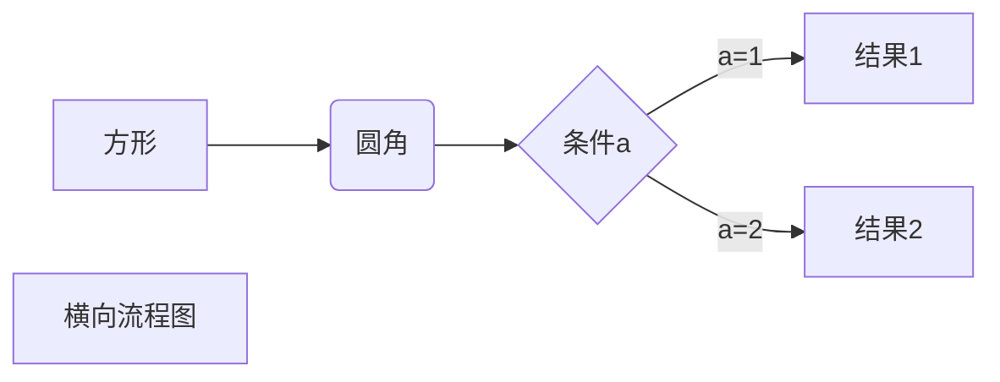
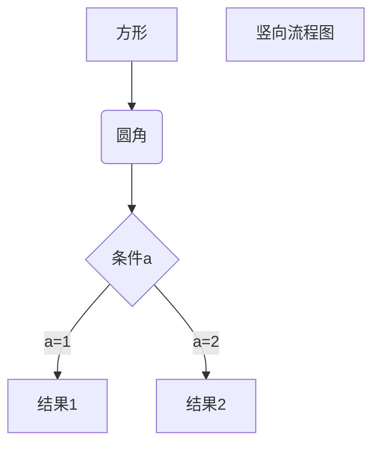
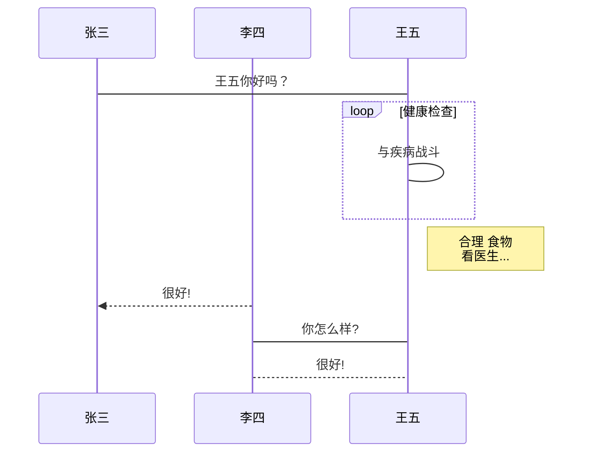
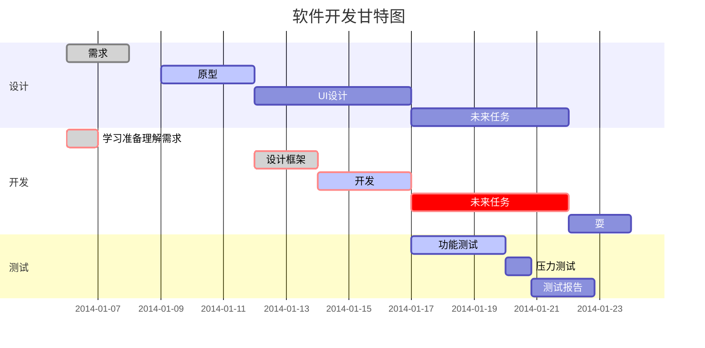

# hello world!

### 标题

# 一级标题

## 二级标题

### 三级标题

#### 四级标题

##### 五级标题

###### 六级标题


### 文本

这是一个段落

末尾添加两个空格然后回车

或者使用空行来换行

*斜体文本*

_斜体文本_

**粗体文本**
__粗体文本__

***粗斜体文本***

___粗斜体文本___

分割线

***

---

*****

~~删除线 在文本两边加波浪~~

<u>下划线</u>

你觉得呢[^注脚]

[^注脚]: 这是注脚显示的文本

引用[^1]

[^1]: 我觉得不好


创建脚注格式类似这样 [^RUNOOB]。

[^RUNOOB]: 菜鸟教程 -- 学的不仅是技术，更是梦想！！！


### 列表

* 第一项 使用* + - 作为列表标记

* 第二项

  

* 第一项

* 第二项

1. 等你
2. 数字加上.
3. 第三项

###### 列表嵌套

1. 第一项
   - 第一个
   - 第二个
2. 第二项
   - 第一个
   - 第二个

### 区块

> 区块引用
>
> ddd

>

>

>

> >第一层
> >
> >> 第二层


> 区块中使用列表
>
> 1. 第一
> 2. 第二
>
> + 第一
> + 第二
> + 第三

列表中使用区块

+ 第一

  > diy
  >
  > dier
  >
  > 

+ 第二


### 代码

`printf()`函数

```javasc
$(document).ready(function(){
    alert('roundbo');
})
```

```c
printf("is your");
```


### 链接

这是一个链接[链接](https://www.baidu.com)

<https://www.baidu.com>

链接也可以用变量来代替，文档末尾附带变量地址

这个链接1 [Google][1]

round链接[Runoob][runoob]

[1]: https://baidu.com
[runoob]: https://baidu.com


### 图片


### 表格

| 表头   |  表头  |
| :----- | :----: |
| 单元格 | 单元格 |


### 高级技巧

转义  \* \\ \*
$$
\mathbf{V}_1 \times \mathbf{V}_2 =  \begin{vmatrix} 
\mathbf{i} & \mathbf{j} & \mathbf{k} \\
\frac{\partial X}{\partial u} &  \frac{\partial Y}{\partial u} & 0 \\
\frac{\partial X}{\partial v} &  \frac{\partial Y}{\partial v} & 0 \\
\end{vmatrix}
$$


1、横向流程图源码格式：


2、竖向流程图源码格式：


3、标准流程图源码格式：

```flow
st=>start: 开始框
op=>operation: 处理框
cond=>condition: 判断框(是或否?)
sub1=>subroutine: 子流程
io=>inputoutput: 输入输出框
e=>end: 结束框
st->op->cond
cond(yes)->io->e
cond(no)->sub1(right)->op
```
4、标准流程图源码格式（横向）：

```flow
st=>start: 开始框
op=>operation: 处理框
cond=>condition: 判断框(是或否?)
sub1=>subroutine: 子流程
io=>inputoutput: 输入输出框
e=>end: 结束框
st(right)->op(right)->cond
cond(yes)->io(bottom)->e
cond(no)->sub1(right)->op
```
5、UML时序图源码样例：

```sequence
对象A->对象B: 对象B你好吗?（请求）
Note right of 对象B: 对象B的描述
Note left of 对象A: 对象A的描述(提示)
对象B-->对象A: 我很好(响应)
对象A->对象B: 你真的好吗？
```
6、UML时序图源码复杂样例：

```sequence
Title: 标题：复杂使用
对象A->对象B: 对象B你好吗?（请求）
Note right of 对象B: 对象B的描述
Note left of 对象A: 对象A的描述(提示)
对象B-->对象A: 我很好(响应)
对象B->小三: 你好吗
小三-->>对象A: 对象B找我了
对象A->对象B: 你真的好吗？
Note over 小三,对象B: 我们是朋友
participant C
Note right of C: 没人陪我玩
```
7、UML标准时序图样例：


8、甘特图样例：


