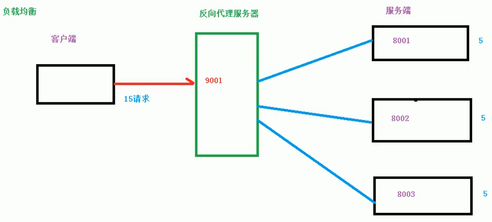
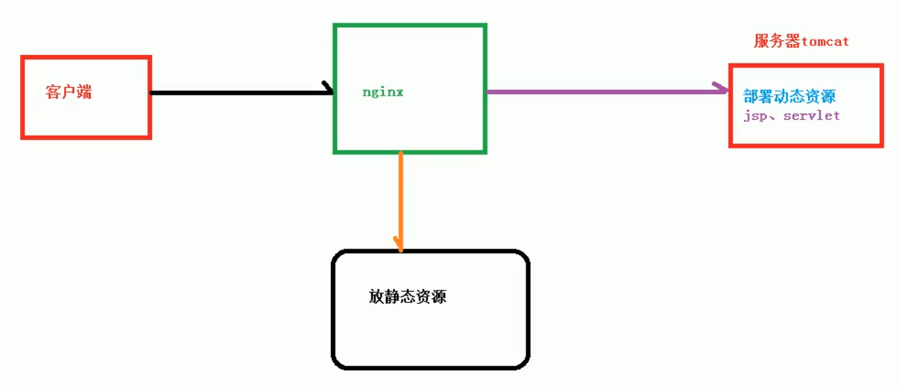

[toc]


# nginx

## 一、简介

*Nginx* (engine x) 是一个高性能的[HTTP](https://baike.baidu.com/item/HTTP)和[反向代理](https://baike.baidu.com/item/反向代理/7793488)web服务器，其特点是占有内存少，[并发](https://baike.baidu.com/item/并发/11024806)能力强，事实上nginx的并发能力在同类型的网页服务器中表现较好

### 反向代理

+ 正向代理

  在客户端（浏览器）配置代理服务器，通过代理服务器进行互联网访问


+ 反向代理

  我们只需要将请求发送到反向代理服务器，由反向代理服务器去选择目标服务器获取数据后，再返回给客户端，此时反向代理服务器和目标服务器就是一个服务器，暴露的是代理服务器的地址，隐藏了真实服务器的地址。


### 负载均衡

增加服务器的数量，将原先请求集中到单个服务器上的情况改为请求分发到多个服务器上，将负载分发到不同的服务器也就是我们所说的负载均衡。



### 动静分离

为了加快网站的解析速度，可以把动态页面和静态页面由不同的服务器来解析，加快解析速度，降低原来单个服务器的压力。



### nginx的安装

1. 安装gcc

   gcc -v

   yum -y install gcc

2. pcre、pcre-devel安装

   yum install -y pcre pcre-devel

3. zlib

   yum install -y zlib zlib-devel

4. openssl

   yum install -y openssl openssl-devel

5. nginx

   在官网下载压缩包，解压

   tar -zxvf  nginx-1.9.9.tar.gz

   执行命令：

   ./configure

   make && make install

   切换到/user/local/nginx目录里，可以修改nginx.conf 文件，到sbin目录下运行nginx

   ./nginx

   查看服务是否启动成功

   ps -ef| grep nginx

6. 查看防火墙端口开放

   firewall-cmd --list-all

   如果没有开放端口，则使用：

   sudo firewall-cmd --add-port=xxx/tcp --permanent

   firewall-cmd --reload

## 二、常用命令

使用nginx的命令需要进入目录：user/local/nginx/sbin

1. 查看nginx版本号

   ./nginx -v

2. 启动nginx

   ./nginx

3. 关闭nginx

   ./nginx -s stop

4. 重新加载nginx

   ./nginx -s reload 

## 三、配置文件

配置文件位置：/user/local/nginx/conf/nginx.conf

**配置文件由三部分组成**

1. **全局块**

   从配置文件开始到events块之间的内容，主要设置一些影响nginx服务器整体运行的配置命令

   ```txt
   #user  nobody;
   worker_processes  1; #工作进程：数目。表示可支持的并发处理量。根据硬件调整，通常等于cpu数量或者2倍cpu数量。
    
   #错误日志存放路径
   #error_log  logs/error.log;
   #error_log  logs/error.log  notice;
   #error_log  logs/error.log  info;
    
   #pid        logs/nginx.pid; # nginx进程pid存放路径
   ```
   
2. **events块**

   涉及的指令主要影响nginx服务器与用户的网络连接

   ```txt
   events {
       worker_connections  1024; # 工作进程的最大连接数量
   }
   ```

3. **http块**

   这是nginx服务器配置中最频繁的部分，代理，缓存和日志等绝大多数功能和第三方模块的配置都在这里，http块可以包括**http全局块**和**server块**

   + **http全局块**

     包括文件引入、MIME-TYPE定义、日志自定义、连接超时时间、单链接请求数上限等。

     ```txt
     include       mime.types; #指定mime类型，由mime.type来定义
     default_type  application/octet-stream;
      
     # 日志格式设置
     #log_format  main  '$remote_addr - $remote_user [$time_local] "$request" '
     #                  '$status $body_bytes_sent "$http_referer" '
     #                  '"$http_user_agent" "$http_x_forwarded_for"';
      
     #access_log  logs/access.log  main; #用log_format指令设置日志格式后，需要用access_log来指定日志文件存放路径
     					
     sendfile  on; #指定nginx是否调用sendfile函数来输出文件，对于普通应用，必须设置on。
     			如果用来进行下载等应用磁盘io重负载应用，可设着off，以平衡磁盘与网络io处理速度，降低系统uptime。
     #tcp_nopush  on; #此选项允许或禁止使用socket的TCP_CORK的选项，此选项仅在sendfile的时候使用
      
     #keepalive_timeout  0;  #keepalive超时时间
     keepalive_timeout  65;
      
     #gzip  on; #开启gzip压缩服务
     ```

   + **server块**

     server块和虚拟主机有密切关系，虚拟主机从用户角度看，和一台独立的硬件主机是完全一样的，该技术的产生是为了节省互联网服务器硬件成本。

     每个 http 块可以包括多个 server 块，而每个 server 块就相当于一个虚拟主机。

     而每个 server 块也分为全局 server 块，以及可以同时包含多个 locaton 块。

     

     + ##### 全局 server 块

       最常见的配置是本虚拟机主机的监听配置和本虚拟主机的名称或 IP 配置。

     + ##### location 块

       一个 server 块可以配置多个 location 块。

       这块的主要作用是基于 Nginx 服务器接收到的请求字符串（例如 server_name/uri-string），对虚拟主机名称（也可以是 IP 别名）之外的字符串（例如 前面的 /uri-string）进行匹配，对特定的请求进行处理。地址定向、数据缓存和应答控制等功能，还有许多第三方模块的配置也在这里进行。

## 四、配置反向代理

```txt
server {
        listen       80;  #配置监听端口号
        server_name  localhost; #配置访问域名，域名可以有多个，用空格隔开
 
        #charset koi8-r; #字符集设置
 
        #access_log  logs/host.access.log  main;
 
        location / {
            root   html;
            proxy_pass  http://127.0.0.1:8080;
            index  index.html index.htm;
        }
 }
```

### location 指令说明

用于匹配url，语法如下：

```txt
location [ = | ~ | ~* | ^~ ] uri {

}
1、= ：用于不含正则表达式的 uri 前，要求请求字符串与 uri 严格匹配，如果匹配成功，就停止继续向下搜索并立即处理该请求。

2、~：用于表示 uri 包含正则表达式，并且区分大小写。

3、~*：用于表示 uri 包含正则表达式，并且不区分大小写。

4、^~：用于不含正则表达式的 uri 前，要求 Nginx 服务器找到标识 uri 和请求字符串匹配度最高的 location 后，立即使用此 location 处理请求，而不再使用 location 块中的正则 uri 和请求字符串做匹配。

注意：如果 uri 包含正则表达式，则必须要有 ~ 或者 ~* 标识。
```

**例子**

访问 http://192.168.17.129:9001/edu/ 直接跳转到 127.0.0.1:8080 

访问 http:// 192.168.17.129:9001/vod/ 直接跳转到 127.0.0.1:8081

具体配置为：

```txt
server{
	listen 9001;
	server_name 192.168.17.129;
	location ~ /edu/ {
	   proxy_pass http://127.0.0.1:8080;
	}
	location ~ /vod/ {
	   proxy_pass http://127.0.0.1:8081;
	}
}
```

开放对外访问的端口号 9001 8080 8081

## 五、 配置负载均衡

在nginx.conf 中进行配置：

```txt
http{
	upstream myserver{
	    ip_hash;
	    server 115.28.52.63:8080 weight=1;
	    server 115.28.52.63:8081 weight=1;
	}
	server{
		location / {
			proxy_pass http://myserver;
			.....
		}
	}
}
```

Nginx 提供了几种分配方式(策略)：

1. 轮询（默认）

   每个请求按时间顺序逐一分配到不同的后端服务器，如果后端服务器 down 掉，能自动剔除。

2. weight

   weight 代表权,重默认为 1,权重越高被分配的客户端越多

   指定轮询几率，weight 和访问比率成正比，用于后端服务器性能不均的情况。

3. ip_hash

   每个请求按访问 ip 的 hash 结果分配，这样每个访客固定访问一个后端服务器，可以解决 session 的问题。

4. fair(第三方)

   按后端服务器的响应时间来分配请求，响应时间短的优先分配。

## 六、动静分离

Nginx 动静分离简单来说就是把动态跟静态请求分开，不能理解成只是单纯的把动态页面和静态页面物理分离。严格意义上说应该是动态请求跟静态请求分开，可以理解成使用 Nginx 处理静态页面，Tomcat 处理动态页面。动静分离从目前实现角度来讲大致分为两种，

+ 一种是纯粹把静态文件独立成单独的域名，放在独立的服务器上，也是目前主流推崇的方案；

+ 另外一种方法就是动态跟静态文件混合在一起发布，通过 nginx 来分开。

通过 location 指定不同的后缀名实现不同的请求转发。通过 `expires` 参数设置，可以使浏览器缓存过期时间，减少与服务器之前的请求和流量。具体 Expires 定义：是给一个资源设定一个过期时间，也就是说无需去服务端验证，直接通过浏览器自身确认是否过期即可，所以不会产生额外的流量。此种方法非常适合不经常变动的资源。（如果经常更新的文件，不建议使用 Expires 来缓存），如果设置 3d，表示在这 3 天之内访问这个 URL，发送一个请求，比对服务器该文件最后更新时间没有变化，则不会从服务器抓取，返回状态码304，如果有修改，则直接从服务器重新下载，返回状态码 200。

```txt
server{
	location /www/ {
	     root /data/;
	     index index.html index.htm;
	}
	location /image/ {
		root /data/;
		autoindex on;
	}
}
```

重点是添加 location，

最后检查 Nginx 配置是否正确即可，然后测试动静分离是否成功，之需要删除后端 tomcat 服务器上的某个静态文件，查看是否能访问，如果可以访问说明静态资源 nginx 直接返回了，不走后端 tomcat 服务器

## 七、配置高可用的集群


**安装keepalived**

yum install keepalived –y

安装之后，在 etc 里面生成目录 keepalived，有文件 keepalived.conf

**配置过程：**

+ 修改/etc/keepalived/keepalivec.conf 配置文件

  ```txt
  global_defs {
  	notification_email {
  		acassen@firewall.loc
  		failover@firewall.loc
  		sysadmin@firewall.loc
  	}
  	notification_email_from Alexandre.Cassen@firewall.loc
  	smtp_server 192.168.17.129
  	smtp_connect_timeout 30
  	router_id LVS_DEVEL
  }
  vrrp_script chk_http_port {
  	script "/usr/local/src/nginx_check.sh"
  	interval 2	#（检测脚本执行的间隔）		
  	weight 2	# 如果nginx挂了，就把权重做2 的修改，如果是-20权重，就是服务器的权重-20	
  }		
  vrrp_instance VI_1 {		
  	state BACKUP	# 备份服务器上将 MASTER 改为 BACKUP	
  	interface ens33	//网卡	
  	virtual_router_id 51   # 主、备机的 virtual_router_id 必须相同	
  	priority 90	# 主、备机取不同的优先级，主机值较大，备份机值较小	
  	advert_int 1		
  	authentication {
  		auth_type PASS
  		auth_pass 1111
  	}
  	virtual_ipaddress {
  		192.168.17.50 // VRRP H 虚拟地址
  	}
  }
  ```

+ 在/usr/local/src 添加检测脚本

  ```txt
  #!/bin/bash
  A=`ps -C nginx –no-header |wc -l`
  if [ $A -eq 0 ];then
  	/usr/local/nginx/sbin/nginx
  	sleep 2
  	if [ `ps -C nginx --no-header |wc -l` -eq 0 ];then
  		killall keepalived
  	fi
  fi
  ```

+ 把两台服务器上 nginx 和 keepalived 启动

  启动 nginx：./nginx

  启动 keepalived：systemctl start keepalived.service

+ 在浏览器地址栏输入 虚拟 ip 地址 192.168.17.50 即可访问，如果其中一台挂了，另一台会自动绑定虚拟ip地址

## 八、nginx原理

**一个 master 和多个 woker** 


**好处**：

+ 可以使用 nginx –s reload 热部署，当reload的时候，在工作中的worker不用reload，在它工作完成后进行reload，而其他空闲worker可以直接reload
+ 每个 woker 是独立的进程，如果有其中的一个 woker 出现问题，其他 woker 独立的，继续进行争抢，实现请求过程，不会造成服务中断

首先，对于每个 worker 进程来说，独立的进程，不需要加锁，所以省掉了锁带来的开销，同时在编程以及问题查找时，也会方便很多。其次，采用独立的进程，可以让互相之间不会

影响，一个进程退出后，其它进程还在工作，服务不会中断，master 进程则很快启动新的 worker 进程。当然，worker 进程的异常退出，肯定是程序有 bug 了，异常退出，会导致当前 worker 上的所有请求失败，不过不会影响到所有请求，所以降低了风险。

**需要设置多少个 worker**

Nginx 同 redis 类似都采用了 **io 多路复用机制**（windows里没有这种机制，所以在linux中能发挥最大功效），每个 worker 都是一个独立的进程，但每个进程里只有一个主线程，通过异步非阻塞的方式来处理请求， 即使是千上万个请求也不在话下。每个 worker 的线程可以把一个 cpu 的性能发挥到极致。所以 worker 数和服务器的 cpu 数相等是最为适宜的。设少了会浪费 cpu，设多了会造成 cpu 频繁切换上下文带来的损耗。

**设置 worker 数量。**

```txt
worker_processes 4
#work 绑定 cpu(4 work 绑定 4cpu)。
worker_cpu_affinity 0001 0010 0100 1000
#work 绑定 cpu (4 work 绑定 8cpu 中的 4 个) 。
worker_cpu_affinity 0000001 00000010 00000100 00001000
```

**连接数 worker_connection**

+ 发送请求，占用了 woker 的几个连接数？

  答案：2 或者 4 个(访问静态资源需要两个--client到nginx的去和返，如果访问tomcat服务器，则需要四个--nginx到tomcat的去和返)

+ nginx 有一个 master，有四个 woker，每个 woker 支持最大的连接数 1024，支持的最大并发数是多少？

  + 普通的静态访问最大并发数是： `worker_connections * worker_processes /2`，

  + 而如果是 HTTP 作 为反向代理来说，最大并发数量应该是 `worker_connections * worker_processes/4`。

这个值是表示每个 worker 进程所能建立连接的最大值，所以，一个 nginx 能建立的最大连接数，应该是 `worker_connections * worker_processes`。当然，这里说的是最大连接数，对于 HTTP 请 求 本 地 资 源来 说 ， 能 够 支 持 的 最大 并 发 数 量 是 `worker_connections * worker_processes`，如果是支持 http1.1 的浏览器每次访问要占两个连接，所以普通的静态访问最大并发数是： `worker_connections * worker_processes /2`，而如果是 HTTP 作 为反向代理来说，最大并发数量应该是 `worker_connections *worker_processes/4`。因为作为反向代理服务器，每个并发会建立与客户端的连接和与后端服务的连接，会占用两个连接。
