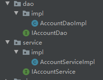
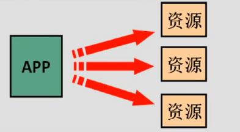
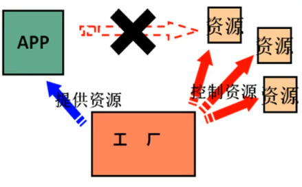

[toc]

# [spring]1.工厂模式解耦

## 1. 问题分析

代码目录如下：



```java
/**
 * 账户持久层接口
 */
public interface IAccountDao {
    /**
     * 模拟保存账户
     */
    void saveAccount();
}
```

```java
/**
 * 账户持久层实现类
 */
public class AccountDaoImpl implements IAccountDao {
    public void saveAccount() {
        System.out.println("保存账户 ");
    }
}
```

```java
/**
 * 账户业务层的接口
 */
public interface IAccountService {
    /**
     * 模拟保存账户
     */
    void saveAccount();
}
```

```java
/**
 * 账户业务层实现类
 */
public class AccountServiceImpl implements IAccountService {
    private IAccountDao accountDao = new AccountDaoImpl();
    public void saveAccount() {
        accountDao.saveAccount();
    }
}
```

代码 `private IAccountDao accountDao = new AccountDaoImpl(); `耦合程度较高，代码独立性差。

## 2.使用工厂模式解耦

首先，我们需要一个创建bean对象的工厂（bean：在计算机英语中，有可重用组件的含义），

这个工厂需要：

+ 需要一个配置文件来配置我们的service和dao

  ​	配置文件的内容：唯一标识=全限定类名 （key=value）

+ 通过读取配置文件中配置的内容，反射创建对象`Class.forName`

`Class.forName`：返回与给定的字符串名称相关联类或接口的Class对象。

`Class.forName`是一个静态方法，同样可以用来加载类。该方法有两种形式：

+ `Class.forName(String name, boolean initialize, ClassLoader loader)`参数 name表示的是类的全名；initialize表示是否初始化类；loader表示加载时使用的类加载器

+ `Class.forName(String className)` 相当于设置了参数 initialize的值为 true，loader的值为当前类的类加载器。

```java
public class BeanFactory {
    //定义一个properties对象
    private static Properties props;
    //使用静态代码块为Properties对象赋值
    static {
        try {
            props = new Properties();
            InputStream in = BeanFactory.class.getClassLoader().getResourceAsStream("bean.properties");
            props.load(in);
        }catch (Exception e){
            throw new ExceptionInInitializerError("初始化properties失败");
        }
    }
    /**
     * 根据bean的名称获取bean对象
     * @param beanName
     * @return
     */
    public static Object getBean(String beanName){
        Object bean =null;
        try {
            String beanPath = props.getProperty(beanName);
            bean = Class.forName(beanPath).newInstance();
        }catch (Exception e){
            e.printStackTrace();
        }
        return bean;
    }
}
```

```java
/**
 * 账户业务层实现类
 */
public class AccountServiceImpl implements IAccountService {
    private IAccountDao accountDao = (IAccountDao) BeanFactory.getBean("accountDao");
    public void saveAccount() {
        accountDao.saveAccount();
    }
}
```

```properties
accountService = com.zcj.service.impl.AccountServiceImpl
accountDao = com.zcj.dao.impl.AccountDaoImpl
```

这样就可以减少代码的耦合程度，同时，在我们需要更改接口为其他接口版本时，就可以通过更改配置文件来更改接口版本。

## 3.容器

每调用`BeanFactory.getBean`就会产生一个新的对象，我们需要记住对象中的属性是会在调用该函数后重新初始化的。当我们需要获取的对象是一个单例时，就需要使用容器来存储单例对象。

```java
public class BeanFactory {
    //定义一个properties对象
    private static Properties props;
    //定义一个map，用于存放我们要创建的对象，我们把它称之为容器
    private static Map<String,Object> beans;
    //使用静态代码块为Properties对象赋值
    static {
        try {
            props = new Properties();
            InputStream in = BeanFactory.class.getClassLoader().getResourceAsStream("bean.properties");
            props.load(in);
            //实例化容器
            beans = new HashMap<String, Object>();
            //取出配置文件中的所有Key
            Enumeration keys = props.keys();
            while (keys.hasMoreElements()){
                //取出每个key
                String key = keys.nextElement().toString();
                //根据key获取value
                String beanPath = props.getProperty(key);
                //反射创建对象
                Object value = Class.forName(beanPath).newInstance();
                //把key和value 存入容器中
                beans.put(key,value);
            }
        }catch (Exception e){
            throw new ExceptionInInitializerError("初始化properties失败");
        }
    }
    /**
     * 根据bean的名称获取bean对象
     * @param beanName
     * @return
     */
    public static Object getBean(String beanName){
        return beans.get(beanName);
    }
}
```

```java
/**
 * 账户业务层实现类
 */
public class AccountServiceImpl implements IAccountService {
    public void saveAccount() {
        IAccountDao accountDao = (IAccountDao) BeanFactory.getBean("accountDao");
        accountDao.saveAccount();
    }
}
```

## 4.IoC(Inversion of Control)

当使用new创建对象时，是app主动的。



当使用工厂模式创建对象时，相当于把主动权从app中让出，交给factory，app断开与资源的联系，这种控制权的转移，称为**控制反转**，可以减低依赖关系，削减耦合程度。



**控制反转**（Inversion of Control，缩写为**IoC**），是[面向对象编程](https://baike.baidu.com/item/面向对象编程)中的一种设计原则，可以用来减低计算机代码之间的[耦合度](https://baike.baidu.com/item/耦合度)。其中最常见的方式叫做**依赖注入**（Dependency Injection，简称**DI**），还有一种方式叫“依赖查找”（Dependency Lookup）。通过控制反转，对象在被创建的时候，由一个调控系统内所有对象的外界实体将其所依赖的对象的引用传递给它。也可以说，依赖被注入到对象中。

spring能主动地帮我们做好IoC。

# [spring]2.Spring中的IoC

## 1. Spring的IoC核心容器

**根据xml配置文件，通过id获取对象**

pom.xml`文件导入spring依赖：

```xml
<?xml version="1.0" encoding="UTF-8"?>
<project xmlns="http://maven.apache.org/POM/4.0.0"
         xmlns:xsi="http://www.w3.org/2001/XMLSchema-instance"
         xsi:schemaLocation="http://maven.apache.org/POM/4.0.0 http://maven.apache.org/xsd/maven-4.0.0.xsd">
    <modelVersion>4.0.0</modelVersion>

    <groupId>org.example</groupId>
    <artifactId>springfactory</artifactId>
    <version>1.0-SNAPSHOT</version>
    <packaging>jar</packaging>
    <dependencies>
        <dependency>
            <groupId>org.springframework</groupId>
            <artifactId>spring-context</artifactId>
            <version>5.0.12.RELEASE</version>
        </dependency>
    </dependencies>
</project>
```

创建`bean.xml`文件，把对象的创建交给spring来管理：

```xml
<?xml version="1.0" encoding="UTF-8"?>
<beans xmlns="http://www.springframework.org/schema/beans"
       xmlns:xsi="http://www.w3.org/2001/XMLSchema-instance"
       xsi:schemaLocation="http://www.springframework.org/schema/beans
        http://www.springframework.org/schema/beans/spring-beans.xsd">
    <bean id="accountService" class="com.zcj2.service.impl.AccountServiceImpl" ></bean>
    <bean id="accountDao" class="com.zcj2.dao.impl.AccountDaoImpl"></bean>
</beans>
```

使用步骤：

+ 1.获取spring的IoC核心容器
+ 2.通过id获取实例化对象

```java
ApplicationContext ac = new ClassPathXmlApplicationContext("bean.xml");
IAccountService as = (IAccountService) ac.getBean("accountService");
IAccountDao adao = ac.getBean("accountDao",IAccountDao.class);
System.out.println(as);
System.out.println(adao);
```

`ApplicationContext`的三个常用实现类：

+ `ClassPathXmlApplicationContext`: 可以加载类路径下的配置文件，要求配置文件必须在类路径下。（更常用）
+ `FileSystemXmlApplicationContext`: 可以加载磁盘任意路径下的配置文件（需要有访问权限）
+ `AnnotationConfigApplicationContext`：读取注解创建容器

`ApplicationContext`两个接口引发出的问题:

+ `ApplicationContext`：在创建核心容器时，创建对象的策略是：立即加载。一读取完配置文件就马上创建配置文中配置的对象。**单例对象适用**，一般使用此接口。

+ `BeanFactory`：在创建核心容器时，创建对象的策略是：延迟加载。什么时候用id获取对象，就什么时候创建对象。**多例对象适用**

  ```java
  Resource resource = new ClassPathResource("bean.xml");
          BeanFactory factory = new XmlBeanFactory(resource);
          IAccountService as1 = (IAccountService) factory.getBean("accountService");
          System.out.println(as1);
  ```

## 2. spring对bean的管理细节

### 1.创建bean的三种方式

+ 1.使用默认构造函数

  在spring的配置文件中使用bean标签，配以id和class属性之后，且没有其他属性和标签时，采用的就是默认构造函数创建bean对象，此时如果该类没有构造函数，则无法创建对象

  ```xml
  <bean id="accountService" class="com.zcj3.service.impl.AccountServiceImpl" ></bean>
  ```

  ```java
  public class AccountServiceImpl implements IAccountService {
      //这么写会报错
      public AccountServiceImpl(String name){
          System.out.println("对象创建了");
      }
      public AccountServiceImpl(){
          System.out.println("对象创建了");
      }
      public void saveAccount() {
          System.out.println("保存账户方法执行了");
      }
  }
  ```

+ 2.使用工厂中的**普通方法**创建对象（使用某个类中的方法创建对象，并存入spring容器）（一般适用于要创建其他导入的jar包的类，他有已经写好的构造函数，而我们无法对其源码进行修改）

  ```xml
  <bean id="instanceFactory" class="com.zcj3.factory.InstanceFactory"></bean>
  <bean id="accountService" factory-bean="instanceFactory" factory-method="getService"></bean>
  ```

  `factory-method` : 创建bean对象的方法，`factory-bean`：为工厂bean的id

  ```java
  public class InstanceFactory {
      public IAccountService getService(){
          return new AccountServiceImpl();
      }
  }
  ```

+ 3.使用工厂中的**静态方法**创建对象，并存入spring容器（一般适用于要创建其他导入的jar包的类，他有已经写好的构造函数，而我们无法对其源码进行修改）

  ```xml
  <bean id="accountService" class="com.zcj3.factory.StaticFactory" factory-method="getService"></bean>
  ```

  ```java
  public class StaticFactory {
      public static IAccountService getService(){
          return new AccountServiceImpl();
      }
  }
  ```

### 2.bean的作用范围

spring创建的bean对象默认是单例的

**bean标签的scope属性：**

+ singletone 单例（默认值）
+ prototype 多例
+ request 作用于web应用的请求范围
+ session 作用于web应用的会话范围
+ global-session 作用于集群环境的会话范围（全局会话范围），当不是集群环境时，他就是session

```xml
<bean id="accountService" class="com.zcj3.service.impl.AccountServiceImpl" scope="prototype"></bean>
```

### 3. bean对象的生命周期

**单例对象：**

+ 出生：容器创建，对象出生

+ 活着：容器还在，对象一直活着

+ 死亡：容器销毁，对象消亡

  容器在，对象就在

**多例对象：**

+ 出生：当我们使用对象时spring框架为我们创建
+ 活着：使用过程中一直活着
+ 死亡：spring不知道对象何时没有使用，所以当对象长时间不用，没有其他对象引用时，java的垃圾回收器回收

```xml
<bean id="accountService" class="com.zcj3.service.impl.AccountServiceImpl" scope="singleton" init-method="init" destroy-method="destory"></bean>
```

```java
public class AccountServiceImpl implements IAccountService {
    public AccountServiceImpl(){
        System.out.println("对象创建了");
    }
    public void saveAccount() {
        System.out.println("保存账户方法执行了");
    }
    public void init(){
        System.out.println("对象初始化了");
    }
    public void destory(){
        System.out.println("对象销毁了");
    }
```

```java
/**
* 获取spring的IOC核心容器，并根据id获取对象
* @param args
*/
public static void main(String[] args) {
	ApplicationContext ac = new ClassPathXmlApplicationContext("bean.xml");
	IAccountService as = (IAccountService) ac.getBean("accountService");
	IAccountService as1 = (IAccountService) ac.getBean("accountService");
	System.out.println(as==as1);
}
```

```xml
对象创建了
对象初始化了
true
```

这是由于对象还来不及销毁，内存就已经释放了

我们可以手动关闭容器：

```java
/**
* 获取spring的IOC核心容器，并根据id获取对象
* @param args
*/
public static void main(String[] args) {
	ClassPathXmlApplicationContext ac = new ClassPathXmlApplicationContext("bean.xml");
	IAccountService as = (IAccountService) ac.getBean("accountService");
	IAccountService as1 = (IAccountService) ac.getBean("accountService");
	System.out.println(as==as1);
    ac.close();
}
```

```xml
对象创建了
对象初始化了
true
对象销毁了
```

## 3. Spring中的依赖注入

**依赖注入**：Dependency Injection

IOC的作用：降低程序间的耦合（依赖关系）

依赖关系的管理，以后都交给spring来管理，当前类需要用到其他类的对象，由spring为我们提供，我们只需要在配置文件中说明，而依赖关系的维护，就称之为**依赖注入**

注入数据的**类型：**

+ 基本类型和string
+ 其他bean类型（在配置文件中或者注解配置过的bean）
+ 复杂类型、集合类型

注入数据的**方式：**

### 1.使用构造函数

`constructor-arg`标签，在`bean`标签的内部，标签中的属性有：

+ `type` 用于指定要注入的数据的类型，该数据类型也是构造函数中某个或某些参数的类型

+ `index` 用于指定要注入的数据给构造函数中指定索引位置的参数赋值，索引的位置是从0开始‘

+ `name` 用于指定给构造函数中指定名称的参数赋值 （常用）

  以上三个用于指定给构造函数中哪个参数赋值

+ `value` 用于提供基本类型和string类型的数据

+ `ref` 用于指定其他的bean类型数据，他指的就是在spring的ioc核心容器中出现过的bean对象

```xml
<bean id="accountService" class="com.zcj4.service.impl.AccountServiceImpl">
    <constructor-arg name="name" value="test"></constructor-arg>
    <constructor-arg name="age" value="18"></constructor-arg>
    <constructor-arg name="birthday" ref="now"></constructor-arg>
</bean>
<!--配置一个日期对象-->
<bean id="now" class="java.util.Date"></bean>
```

```java
public class AccountServiceImpl implements IAccountService {
    //如果是经常变化的数据并不适用于注入的方式
    private String name;
    private Integer age;
    private Date birthday;
    public AccountServiceImpl(String name,Integer age,Date birthday){
        this.name =name;
        this.age = age;
        this.birthday =birthday;
    }
    public void saveAccount() {
        System.out.println("保存账户方法执行了"+name+","+age+","+birthday);
    }
}
```

```java
public static void main(String[] args) {
	ApplicationContext ac = new ClassPathXmlApplicationContext("bean_zcj4.xml");
	IAccountService as = (IAccountService) ac.getBean("accountService");
	as.saveAccount();
}
```

```xml
保存账户方法执行了test,18,Wed Mar 11 14:24:08 CST 2020
```

**优点**：在获取bean对象时，注入数据是必须的操作，否则对象无法创建成功

**弊端**：改变了bean对象的实例化方式，我们在创建对象时，如果用不到这些数据，也必须提供

### 2.使用set方法（更常用）

`property`标签，在`bean`标签的内部，标签中的属性有：

+ `name`:用于指定注入时所调用的set方法名称，除去set后剩下的字段
+ `value`:提供基本类型和string类型的数据
+ `ref`：用于指定其他的bean类型数据，他指的就是在spring的ioc核心容器中出现过的bean对象

```xml
<bean id="accountService" class="com.zcj4.service.impl.AccountServiceImpl">
	<property name="name" value="test"></property>
	<property name="age" value="18"></property>
	<property name="birthday" ref="now"></property>
</bean>
```

```java
public class AccountServiceImpl implements IAccountService {
    //如果是经常变化的数据并不适用于注入的方式
    private String name;
    private Integer age;
    private Date birthday;
    public void setName(String name) {
        this.name = name;
    }
    public void setAge(Integer age) {
        this.age = age;
    }
    public void setBirthday(Date birthday) {
        this.birthday = birthday;
    }
    public void saveAccount() {
        System.out.println("保存账户方法执行了"+name+","+age+","+birthday);
    }
}
```

**优点**：创建对象时没有明确的限制，可以直接使用默认构造函数

**弊端**：如果某个成员必须有值，则获取对象的set方法可能没有执行


**复杂类型、集合类型的注入：**

+ 用于给list结构集合注入的标签：
          list array set
+ 用于给map结构集合注入的标签：
          map props
+ 结构相同，标签可以互换

```java
public class AccountServiceImpl2 implements IAccountService {
    private String[] myStrs;
    private List<String> myList;
    private Set<String> mySet;
    private Map<String,String> myMap;
    private Properties myProps;
    public void setMyStrs(String[] myStrs) {
        this.myStrs = myStrs;
    }
    public void setMyList(List<String> myList) {
        this.myList = myList;
    }
    public void setMySet(Set<String> mySet) {
        this.mySet = mySet;
    }
    public void setMyMap(Map<String, String> myMap) {
        this.myMap = myMap;
    }
    public void setMyProps(Properties myProps) {
        this.myProps = myProps;
    }
    public void saveAccount() {
        System.out.println(Arrays.toString(myStrs));
        System.out.println(myList);
        System.out.println(mySet);
        System.out.println(myMap);
        System.out.println(myProps);
    }
}
```

```xml
<bean id="accountService2" class="com.zcj4.service.impl.AccountServiceImpl2">
	<property name="myStrs">
		<array>
			<value>AAA</value>
            <value>BBB</value>
            <value>AAA</value>
            <value>CCC</value>
        </array>
    </property>
    <property name="myList">
        <list>
            <value>AAA</value>
            <value>BBB</value>
            <value>AAA</value>
            <value>CCC</value>
        </list>
     </property>
     <property name="mySet">
         <set>
            <value>AAA</value>
            <value>BBB</value>
            <value>AAA</value>
            <value>CCC</value>
         </set>
     </property>
     <property name="myMap">
         <map>
             <entry key="testA" value="aaa"></entry>
             <entry key="testB">
                <value>bbbb</value>
             </entry>
         </map>
     </property>
     <property name="myProps">
         <props>
             <prop key="testc">cccc</prop>
             <prop key="testd">dddd</prop>
         </props>
     </property>
</bean>
```

```java
public static void main(String[] args) {
	ApplicationContext ac = new ClassPathXmlApplicationContext("bean_zcj4.xml");
	IAccountService as = (IAccountService) ac.getBean("accountService2");
	as.saveAccount();
}
```

```xml
[AAA, BBB, AAA, CCC]
[AAA, BBB, AAA, CCC]
[AAA, BBB, CCC]
{testA=aaa, testB=bbbb}
{testd=dddd, testc=cccc}
```

### 3.使用注解

配置文件：

```xml
<?xml version="1.0" encoding="UTF-8"?>
<beans xmlns="http://www.springframework.org/schema/beans"
       xmlns:xsi="http://www.w3.org/2001/XMLSchema-instance"
       xmlns:context="http://www.springframework.org/schema/context"
       xsi:schemaLocation="http://www.springframework.org/schema/beans
        http://www.springframework.org/schema/beans/spring-beans.xsd
        http://www.springframework.org/schema/context
        http://www.springframework.org/schema/context/spring-context.xsd">
<!--    告知spring在创建容器时要扫描的包，配置所需要的标签不是在beans的约束中，而是一个名词为context名称空间和约束中-->
    <context:component-scan base-package="com.zcj"></context:component-scan>
</beans>
```

```java
@Component(value = "accountService")
public class AccountServiceImpl implements IAccountService {
    private IAccountDao accountDao;
    public AccountServiceImpl(){
        System.out.println("对象创建了");
    }
}
```

```java
public static void main(String[] args) {
	ApplicationContext ac = new ClassPathXmlApplicationContext("bean.xml");
	IAccountService as = (IAccountService) ac.getBean("accountService");
	as.saveAccount();
}
```

**创建对象的注解：**

+ `Component`

  **作用**：用于把类对象存入spring容器中

  **属性**：

     + `value` ：用于指定`bean`的`id`，当我们不写`value`时，他的默认值是当前首字母小写的类名。如果`Component`只需要这个一个属性时，可以这样简写：`@Component("claaName")`

+ `Controller` 用在表现层

+ `Service`用在业务层

+ `Repository`用在持久层

至于@Controller、@Service、@Repository他们三个是spring框架为我们提供明确的三层使用的注解，使我们的三层对象更加清晰！

**实际上这四个注解实际上没有任何本质区别**，如果你喜欢，你完全可以把这四个注解当成一个注解用

**注入对象的注解：**

+ `Autowired`:自动按照类型注入，只要容器中有唯一的一个bean对象和要注入的变量类型匹配，就可以注入成功。如果IOC容器中没有任何bean的类型和要注入的类型匹配，则报错。如果IOC容器中有多个类型匹配时，则根据要注入的变量名字来匹配。

  

  出现的位置：可以是变量上，也可以是方法上

  在使用注解时，set方法不是必须的

  ```java
  @Component
  public class AccountDaoImpl implements IAccountDao {
      public void saveAccount() {
          System.out.println("保存账户 ");
      }
  }
  ```

  ```java
  @Component(value = "accountService")
  public class AccountServiceImpl implements IAccountService {
      @Autowired
      private IAccountDao accountDao;
      public AccountServiceImpl(){
          System.out.println("对象创建了");
      }
      public void saveAccount() {
          accountDao.saveAccount();
      }
  }
  ```

  如果出现了下面的类：

  ```java
  @Component
  public class AccountDaoImpl2 implements IAccountDao {
      public void saveAccount() {
          System.out.println("保存账户 ");
      }
  }
  ```

  由于有两个类都实现了同一个接口`IAccountDao`,继续使用这样的注解就会报错：

  ```java
  @Autowired
  private IAccountDao accountDao;
  ```

  可以通过修改变量名字来指定要创建的对象：

  ```java
  @Autowired
  private IAccountDao accountDaoImpl;
  ```

  或者使用`Qualifier`来指定

+ `Qualifier`:在按照类中注入的基础之上再按照名称注入。它在给类成员注入时不能单独使用（要和`Autowired`一起使用），但是在给方法参数注入时可以。

  属性：`value`,用于指定注入bean的id

  ```java
  @Autowired
  @Qualifier(value = "accountDaoImpl2")
  private IAccountDao accountDao;
  ```

+ `Resource`：直接按照bean的id注入，可以独立使用

  属性：name,用于指定注入bean的id

  `Autowired` `Qualifier` `Resource`都只能注入其他bean类型的数据，基本类型和String无法实现，集合类型的注入只能通过xml实现

+ `Value`：用于注入基本类型和String类型的数据

  属性：`value`，用于指定数据的值，可以使用spring中的SpEL(也就是spring的el表达式)

  ​		SpEL的写法：`$(表达式)`	

**用于改变作用范围：**

+ `Scope`指定bean的作用范围

  属性：`value`，取值：`singleton`，`prototype`
  
  ```java
  @Component
  @Scope("prototype")
  public class AccountDaoImpl2 implements IAccountDao {
      public void saveAccount() {
          System.out.println("保存账户 ");
      }
  }
  ```

**和生命周期相关：**

+ `PreDestory`:用于指定销毁方法

+ `PostConstruct`:用于指定初始化方法

  ```java
  @Component(value = "accountService")
  public class AccountServiceImpl implements IAccountService {
      @PostConstruct
      public void init() {
          accountDao.saveAccount();
      }
      @PreDestroy
      public void destory() {
          accountDao.saveAccount();
      }
  }
  ```

## 4.Spring的配置注解

+ `Configuration`：指定当前类是配置类

​		当配置类作为`AnnotationConfigApplicationContext`对象创建的参数时，该注解可以不写。

+ `ComponentScan`：用于通过注解指定spring在创建容器时要扫描的包

​		属性：`value`：它和`basePackages`的作用是一样的，都是用于制定创建容器时要扫描的包。

+ `Bean`：把当前的方法的返回值作为bean对象存入spring的IOC容器中

​		属性：`name`：用于指定bean的id，当不写时，默认值是当前方法的名称，当用此注解配置方法时，如果方法有参数，spring框架会去容器中查找有没有可用的bean对象，查找的方式和Autowried的方式一样.

```java
@Configuration
@ComponentScan("com.zcj")
public class SpringConfig {
    @Bean(name = "runner")
    public QueryRunner createQueryRunner(DataSource dataSource){
        return new QueryRunner(dataSource);
    }
    @Bean(name = "dataSource")
    public DataSource createDataSource(){
        try {
            ComboPooledDataSource ds = new ComboPooledDataSource();
            ds.setDriverClass("com.mysql.jdbc.Driver");
            ds.setJdbcUrl("jdbc:mysql://localhost:3306/eesy");
            ds.setUser("root");
            ds.setPassword("123456");
            return ds;
        }catch (Exception e){
            e.printStackTrace();
        }
        return null;
    }
}
```

其作用相当于如下：

```xml
<bean id="accountService" class="com.zcj.service.impl.AccountServiceImpl">
    <property name="accountDao" ref="accountDao"></property>
</bean>
<bean id="accountDao" class="com.zcj.dao.impl.AccountDaoImpl">
    <property name="runner" ref="runner"></property>
</bean>
<bean id="runner" class="org.apache.commons.dbutils.QueryRunner" scope="prototype">
    <constructor-arg name="ds" ref="dataSource"></constructor-arg>
</bean>
<bean id="dataSource" class="com.mchange.v2.c3p0.ComboPooledDataSource">
    <property name="driverClass" value="com.mysql.jdbc.Driver"></property>
    <property name="jdbcUrl" value="jdbc:mysql://localhost:3306/eesy?3useUnicode=true&amp;characterEncoding=utf8"></property>
    <property name="user" value="root"></property>
    <property name="password" value="123456"></property>
</bean>
```

在获取对象时，如下：

```java
ApplicationContext ac = new AnnotationConfigApplicationContext(SpringConfig.class);
```

+ `Import`：用于导入其他的配置类

​		属性： `value`：用于指定其他配置类的字节码。当我们使用Import的注解之后，有Import注解的类就父配置类，而导入的都是子配置类

+ `PropertySource`：用于指定properties文件的位置

​		属性：`value`：指定文件的名称和路径，关键字：`classpath`，表示类路径下

```java
@Import(JdbcConfig.class)
@PropertySource("classpath:jdbcConfig.properties")
public class xxx{}
```

## 5.Spring 整合junit的配置

+ 1.导入spring整合junit的jar（坐标）

  ```xml
  <dependency>
  	<groupId>org.springframework</groupId>
  	<artifactId>spring-test</artifactId>
  	<version>5.0.2.RELEASE</version>
  </dependency>
  ```

+ 2.使用Junit提供的一个注解 `@Runwith`把原有的main方法替换了，替换成spring提供的

+ 3.告知spring的运行器，spring和ioc创建是基于xml还是注解的，并且说明位置：

  `@ContextConfiguration`：有两种方式：

  ​		`locations`：指定xml文件的位置，加上`classpath`关键字，表示在类路径下

  ​		`classes`：指定注解类所在地位置

  ```java
  @RunWith(SpringJUnit4ClassRunner.class)
  @ContextConfiguration(classes = SpringConfiguration.class)
  public class AccountServiceTest {
      @Autowired
      private IAccountService as = null;
      @Test
      public void testFindAll() {
          //3.执行方法
          List<Account> accounts = as.findAllAccount();
          for(Account account : accounts){
              System.out.println(account);
          }
      }
  }
  ```

# [spring]3.Spring中的AOP

**AOP （面向切面编程）**

​	在软件业，AOP为Aspect Oriented Programming的缩写，意为：[面向切面编程](https://baike.baidu.com/item/面向切面编程/6016335)，通过[预编译](https://baike.baidu.com/item/预编译/3191547)方式和运行期间动态代理实现程序功能的统一维护的一种技术。AOP是[OOP](https://baike.baidu.com/item/OOP)的延续，是软件开发中的一个热点，也是[Spring](https://baike.baidu.com/item/Spring)框架中的一个重要内容，是[函数式编程](https://baike.baidu.com/item/函数式编程/4035031)的一种衍生范型。利用AOP可以对业务逻辑的各个部分进行隔离，从而使得业务逻辑各部分之间的[耦合度](https://baike.baidu.com/item/耦合度/2603938)降低，提高程序的可重用性，同时提高了开发的效率。

## 1.AOP相关术语

+ `Joinpoint`(连接点) ：所谓连接点是指那些被拦截到的点。在 spring 中,这些点指的是方法,因为 spring 只支持方法类型的连接点。

+ `Pointcut`(切入点)：所谓切入点是指我们要对哪些 Joinpoint 进行拦截的定义。

  即在动态代理中被增强的连接点就是切入点，而被过滤掉的，没有被增强修改的方法就不是切入点。所有的切入点是连接点，但不是所有的连接点都是切入点。

+ `Advice`(通知/增强)：所谓通知是指拦截到 Joinpoint 之后所要做的事情就是通知。通知的类型：前置通知,后置通知,异常通知,最终通知,环绕通知。

  

+ `Introduction`(引介):引介是一种特殊的通知在不修改类代码的前提下, Introduction 可以在运行期为类动态地添加一些方法或 Field。

+ `Target`( 目标对象)：代理的目标对象。上图的`accountService`就是target

+ `Weaving`( 织入):是指把增强应用到目标对象来创建新的代理对象的过程。

  spring 采用动态代理织入，而 AspectJ 采用编译期织入和类装载期织入。

+ `Proxy` （代理）:一个类被 AOP 织入增强后，就产生一个结果代理类。

+ `Aspect`( 切面) : 是切入点和通知（引介）的结合。

## 2. 使用xml配置AOP

**步骤**

 1. 把通知Bean也交给spring来管理

 2. 使用`aop:config`标签表明开始AOP的配置

 3. 使用`aop:aspect`标签表明配置切面

    `id`属性：是给切面提供一个唯一标识

    `ref`属性：是指定通知类bean的Id。

	4. 在`aop:aspect`标签的内部使用对应标签来配置通知的类型

    + `aop:before`：表示配置前置通知
           `method`属性：用于指定Logger类中哪个方法是前置通知
           `pointcut`属性：用于指定切入点表达式，该表达式的含义指的是对业务层中哪些方法增强

    ```xml
    切入点表达式的写法：
    	关键字：execution(表达式)
    	表达式：
    		访问修饰符  返回值  包名.包名.包名...类名.方法名(参数列表)
    标准的表达式写法：
    	public void com.itheima.service.impl.AccountServiceImpl.saveAccount()
    访问修饰符可以省略
    	void com.itheima.service.impl.AccountServiceImpl.saveAccount()
    返回值可以使用通配符，表示任意返回值
    	* com.itheima.service.impl.AccountServiceImpl.saveAccount()
    包名可以使用通配符，表示任意包。但是有几级包，就需要写几个*.
        * *.*.*.*.AccountServiceImpl.saveAccount())
    包名可以使用..表示当前包及其子包
        * *..AccountServiceImpl.saveAccount()
    类名和方法名都可以使用*来实现通配
        * *..*.*()
    参数列表：
        可以直接写数据类型：
        基本类型直接写名称           int
        引用类型写包名.类名的方式   java.lang.String
        可以使用通配符表示任意类型，但是必须有参数
        可以使用..表示有无参数均可，有参数可以是任意类型
    全通配写法：
        * *..*.*(..)
    
    实际开发中切入点表达式的通常写法：
        切到业务层实现类下的所有方法
        * com.itheima.service.impl.*.*(..)
    ```

    + `aop:after-returning`后置通知：在切入点方法正常执行之后值。它和异常通知永远只能执行一个

    + `aop:after-throwing` 异常通知：在切入点方法执行产生异常之后执行。它和后置通知永远只能执行一个

    + `aop:after `最终通知：无论切入点方法是否正常执行它都会在其后面执行

    + `aop:around` 环绕通知 ，它是spring框架为我们提供的一种可以在代码中手动控制增强方法何时执行的方式。

      Spring框架为我们提供了一个接口：`ProceedingJoinPoint`。该接口有一个方法`proceed()`，此方法就相当于明确调用切入点方法。

    + `aop:pointcut`切入点表达式, id属性用于指定表达式的唯一标识。expression属性用于指定表达式内容
          此标签写在`aop:aspect`标签内部只能当前切面使用。
          它还可以写在`aop:aspect`外面，此时就变成了所有切面可用。

```java
public class AccountServiceImpl implements IAccountService{
    @Override
    public void saveAccount() {
        System.out.println("执行了保存");
//        int i=1/0;
    }
    @Override
    public void updateAccount(int i) {
        System.out.println("执行了更新"+i);

    }
    @Override
    public int deleteAccount() {
        System.out.println("执行了删除");
        return 0;
    }
}
```

```java
/**
 * 用于记录日志的工具类，它里面提供了公共的代码
 */
public class Logger {
    /**
     * 前置通知
     */
    public  void beforePrintLog(){
        System.out.println("前置通知Logger类中的beforePrintLog方法开始记录日志了");
    }
    /**
     * 后置通知
     */
    public  void afterReturningPrintLog(){
        System.out.println("后置通知Logger类中的afterReturningPrintLog方法开始记录日志了");
    }
    /**
     * 异常通知
     */
    public  void afterThrowingPrintLog(){
        System.out.println("异常通知Logger类中的afterThrowingPrintLog方法开始记录日志了");
    }
    /**
     * 最终通知
     */
    public  void afterPrintLog(){
        System.out.println("最终通知Logger类中的afterPrintLog方法开始记录日志了");
    }
    /**
     * 环绕通知
     * 问题：
     *      当我们配置了环绕通知之后，切入点方法没有执行，而通知方法执行了。
     * 分析：
     *      通过对比动态代理中的环绕通知代码，发现动态代理的环绕通知有明确的切入点方法调用，而我们的代码中没有。
     * 解决：
     *      Spring框架为我们提供了一个接口：ProceedingJoinPoint。该接口有一个方法proceed()，此方法就相当于明确调用切入点方法。
     *      该接口可以作为环绕通知的方法参数，在程序执行时，spring框架会为我们提供该接口的实现类供我们使用。
     *
     * spring中的环绕通知：
     *      它是spring框架为我们提供的一种可以在代码中手动控制增强方法何时执行的方式。
     */
    public Object aroundPringLog(ProceedingJoinPoint pjp){
        Object rtValue = null;
        try{
            Object[] args = pjp.getArgs();//得到方法执行所需的参数
            System.out.println("Logger类中的aroundPringLog方法开始记录日志了。。。前置");
            rtValue = pjp.proceed(args);//明确调用业务层方法（切入点方法）
            System.out.println("Logger类中的aroundPringLog方法开始记录日志了。。。后置");
            return rtValue;
        }catch (Throwable t){
            System.out.println("Logger类中的aroundPringLog方法开始记录日志了。。。异常");
            throw new RuntimeException(t);
        }finally {
            System.out.println("Logger类中的aroundPringLog方法开始记录日志了。。。最终");
        }
    }
}
```

```xml
<?xml version="1.0" encoding="UTF-8"?>
<beans xmlns="http://www.springframework.org/schema/beans"
       xmlns:xsi="http://www.w3.org/2001/XMLSchema-instance"
       xmlns:aop="http://www.springframework.org/schema/aop"
       xsi:schemaLocation="http://www.springframework.org/schema/beans
        http://www.springframework.org/schema/beans/spring-beans.xsd
        http://www.springframework.org/schema/aop
        http://www.springframework.org/schema/aop/spring-aop.xsd">
    <!-- 配置srping的Ioc,把service对象配置进来-->
    <bean id="accountService" class="com.itheima.service.impl.AccountServiceImpl"></bean>
    <!-- 配置Logger类 -->
    <bean id="logger" class="com.itheima.utils.Logger"></bean>
    <!--配置AOP-->
    <aop:config>
        <!-- 配置切入点表达式 id属性用于指定表达式的唯一标识。expression属性用于指定表达式内容
              此标签写在aop:aspect标签内部只能当前切面使用。
              它还可以写在aop:aspect外面，此时就变成了所有切面可用
          -->
        <aop:pointcut id="pt1" expression="execution(* com.itheima.service.impl.*.*(..))"></aop:pointcut>
        <!--配置切面 -->
        <aop:aspect id="logAdvice" ref="logger">
            <!-- 配置前置通知：在切入点方法执行之前执行
            <aop:before method="beforePrintLog" pointcut-ref="pt1" ></aop:before>-->
            <!-- 配置后置通知：在切入点方法正常执行之后值。它和异常通知永远只能执行一个
            <aop:after-returning method="afterReturningPrintLog" pointcut-ref="pt1"></aop:after-returning>-->
            <!-- 配置异常通知：在切入点方法执行产生异常之后执行。它和后置通知永远只能执行一个
            <aop:after-throwing method="afterThrowingPrintLog" pointcut-ref="pt1"></aop:after-throwing>-->
            <!-- 配置最终通知：无论切入点方法是否正常执行它都会在其后面执行
            <aop:after method="afterPrintLog" pointcut-ref="pt1"></aop:after>-->
            <!-- 配置环绕通知 详细的注释请看Logger类中-->
            <aop:around method="aroundPringLog" pointcut-ref="pt1"></aop:around>
        </aop:aspect>
    </aop:config>
</beans>
```

## 3.使用注解配置AOP

```java
/**
 * 用于记录日志的工具类，它里面提供了公共的代码
 */
@Component("logger")
@Aspect//表示当前类是一个切面类
public class Logger {
    @Pointcut("execution(* com.itheima.service.impl.*.*(..))")
    private void pt1(){}
    /**
     * 前置通知
     */
//    @Before("pt1()")
    public  void beforePrintLog(){
        System.out.println("前置通知Logger类中的beforePrintLog方法开始记录日志了。。。");
    }
    /**
     * 后置通知
     */
//    @AfterReturning("pt1()")
    public  void afterReturningPrintLog(){
        System.out.println("后置通知Logger类中的afterReturningPrintLog方法开始记录日志了。。。");
    }
    /**
     * 异常通知
     */
//    @AfterThrowing("pt1()")
    public  void afterThrowingPrintLog(){
        System.out.println("异常通知Logger类中的afterThrowingPrintLog方法开始记录日志了。。。");
    }
    /**
     * 最终通知
     */
//    @After("pt1()")
    public  void afterPrintLog(){
        System.out.println("最终通知Logger类中的afterPrintLog方法开始记录日志了。。。");
    }
    @Around("pt1()")
    public Object aroundPringLog(ProceedingJoinPoint pjp){
        Object rtValue = null;
        try{
            Object[] args = pjp.getArgs();//得到方法执行所需的参数
            System.out.println("Logger类中的aroundPringLog方法开始记录日志了。。。前置");
            rtValue = pjp.proceed(args);//明确调用业务层方法（切入点方法）
            System.out.println("Logger类中的aroundPringLog方法开始记录日志了。。。后置");
            return rtValue;
        }catch (Throwable t){
            System.out.println("Logger类中的aroundPringLog方法开始记录日志了。。。异常");
            throw new RuntimeException(t);
        }finally {
            System.out.println("Logger类中的aroundPringLog方法开始记录日志了。。。最终");
        }
    }
}
```

```xml
<?xml version="1.0" encoding="UTF-8"?>
<beans xmlns="http://www.springframework.org/schema/beans"
       xmlns:xsi="http://www.w3.org/2001/XMLSchema-instance"
       xmlns:aop="http://www.springframework.org/schema/aop"
       xmlns:context="http://www.springframework.org/schema/context"
       xsi:schemaLocation="http://www.springframework.org/schema/beans
        http://www.springframework.org/schema/beans/spring-beans.xsd
        http://www.springframework.org/schema/aop
        http://www.springframework.org/schema/aop/spring-aop.xsd
        http://www.springframework.org/schema/context
        http://www.springframework.org/schema/context/spring-context.xsd">
    <!-- 配置spring创建容器时要扫描的包-->
    <context:component-scan base-package="com.itheima"></context:component-scan>
    <!-- 配置spring开启注解AOP的支持 -->
    <aop:aspectj-autoproxy></aop:aspectj-autoproxy>
</beans>
```

# [spring]4.Spring中的JdbcTemplate

**JdbcTemplate**：是 spring 框架中提供的一个对象，是对原始 Jdbc API 对象的简单封装。spring 框架为我们提供了很多的操作模板类

使用方式：

1. 直接使用：

```java
//准备数据源：spring的内置数据源
DriverManagerDataSource ds = new DriverManagerDataSource();
ds.setDriverClassName("com.mysql.jdbc.Driver");
ds.setUrl("jdbc:mysql://localhost:3306/eesy");
ds.setUsername("root");
ds.setPassword("1234");
//1.创建JdbcTemplate对象
JdbcTemplate jt = new JdbcTemplate();
//给jt设置数据源
jt.setDataSource(ds);
//2.执行操作
jt.execute("insert into account(name,money)values('ccc',1000)");
```

1. 使用xml配置，spring容器注入：

```xml
<!--配置JdbcTemplate-->
<bean id="jdbcTemplate" class="org.springframework.jdbc.core.JdbcTemplate">
    <property name="dataSource" ref="dataSource"></property>
</bean>
<!-- 配置数据源-->
<bean id="dataSource" class="org.springframework.jdbc.datasource.DriverManagerDataSource">
   <property name="driverClassName" value="com.mysql.jdbc.Driver"></property>
   <property name="url" value="jdbc:mysql://localhost:3306/eesy"></property>
   <property name="username" value="root"></property>
   <property name="password" value="1234"></property>
</bean>
```

```java
//1.获取容器
ApplicationContext ac = new ClassPathXmlApplicationContext("bean.xml");
//2.获取对象
JdbcTemplate jt = ac.getBean("jdbcTemplate",JdbcTemplate.class);
//3.执行操作
jt.execute("insert into account(name,money)values('ddd',2222)");

```

基本CRUD操作：


