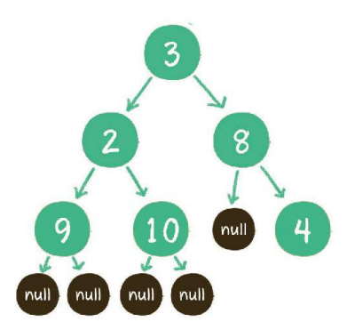
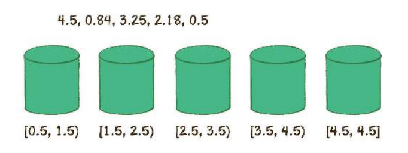
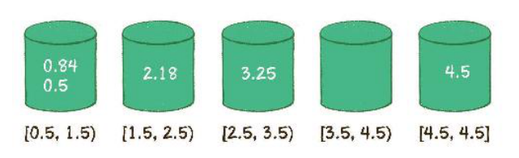
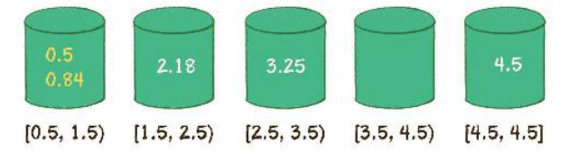
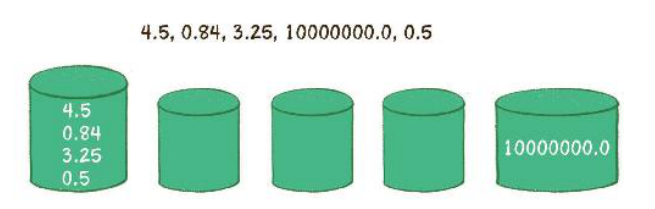
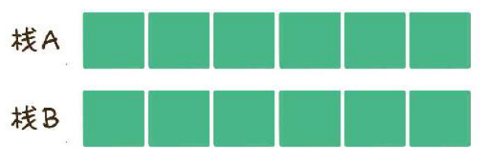
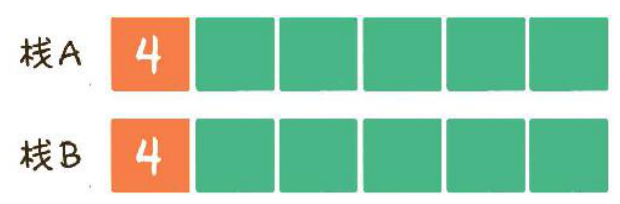
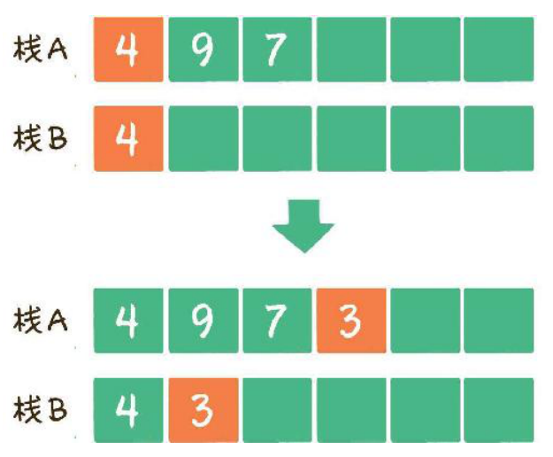
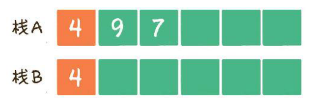

[TOC]

# (一)、数据结构

## 一、数组

####  基本操作

1. 读取元素 O(1)

   根据数组下标读取元素 --随机读取

2. 更新元素  时间复杂度  O(1)

3. 插入元素

   + 尾部插入

   + 中间插入 O(n)

     从数组的中间插入数据，后面的数需要依次后移

     ```java
     //lenth 数组实际内容长度
     public void insertArray(int []array, int lenth,int insertIndex,int element){
         if(lenth > insertIndex || insertIndex < 0){
             throw new IndexOutOfBoundsException("超出数组实际元素范围")
         }
         for(int i = lenth;i>insertIndex;i--){
             array[i] = array[i-1]
         }
         array[insertIndex]=element;
         lenth++;
     }
     ```

   + 超范围插入 O(n)+O(n)=O(n)

     数组已满，插入数据的时候，可以把数组转移到另外一个2倍大的数组里，再进行中间插入

4. 删除元素 O(n)

   如果删除的元素位于数组中间，则需要把后面的元素向前挪动一位

   ```java
   /* array 数组  size 数组实际最后一个元素所在的下标 index 删除的元素所在的下标 */
   public int delete(int index){
       if(index<0||index > size){
           return error;
       }
       int deleteElement = array[index];
       for(int i = index;i<size-1;i++){
           array[i]=array[i+1];
       }
       size--;
       return deleteElement;
   }
   ```

   另一种操作方法：将数组的最后一个元素复制到将要删除的元素所在的位置，然后删除最后一个元素，当然这不是删除元素的主流操作方式。

#### 优缺点

+ 非常高效的随机访问能力（二分查找）
+ 插入删除操作不便
+ 数组适合读操作多，写操作少的场景


## 二、链表

+ 单向链表

  ```java
  private static class Node{
      int data;
      Node next;
  }
  ```

+ 双向链表

  ```java
  private static class Node{
      int data;
      Node prev;
      Node next;
  }
  ```

+ 链表是随机存储的

#### 基本操作

- 查找节点

  从头节点开始遍历，直到查找到目标节点，最坏的时间复杂度是O(n)

- 更新节点

  查找到节点后，对数据进行更新

- 插入节点

  + 尾部插入

    把最后一个节点的next指针指向新的节点

  + 头部插入

    把新节点的next指针指向头节点，把新节点变为链表的头节点

  + 中间插入

    新节点的next指针指向插入位置的节点

    插入位置的前置节点的next指针指向新的节点

- 删除元素

  - 尾部删除

    把倒数第二节点的next指针指向空

  - 头部删除

    把头节点的next指针指向的节点设置为头节点

  - 中间删除

    把删除位置的前置节点的next指针指向删除位置的下一个节点

java有垃圾回收机制，对于没有外部引用指向的节点，会被自动回收。

如果不考虑插入、删除之前查找元素的过程，只考虑纯粹的插入和删除操作，时间复杂度都是O(1)

```java
public class NodeList {
    private static class Node{
        int data;
        Node next;
        Node(int data){
            this.data = data;
        }
    }
    //头节点
    private Node head;
    //尾部节点
    private Node last;
    //链表实际长度
    private int size;

    //根据data的值寻找节点
    public Node find(int data){
        Node findNode = head;
        while (findNode!=null){
            if(findNode.data == data){
                return findNode;
            }else{
                findNode = findNode.next;
            }
        }
        return null;
    }

    //根据index查找第几个节点
    public Node findIndex(int index) throws Exception{
        if(index<0||index>=size){
            throw new IndexOutOfBoundsException("超出链表节点范围");
        }
        Node temp = head;
        for(int i=0;i<index;i++){
            temp = temp.next;
        }
        return temp;
    }

    //插入节点
    public boolean insert(int data,int index)throws Exception{
        if(index<0||index>size){
            throw new IndexOutOfBoundsException("超出链表节点范围");
        }
        Node nodeInsert = new Node(data);
        if(size==0){
            //链表为空
            this.head = nodeInsert;
            this.last = nodeInsert;
        }else if(index==0){
            //插入的位置为头结点
            nodeInsert.next = this.head;
            this.head = nodeInsert;
        }else if(index==size){
            //插入的位置为尾节点
            this.last.next = nodeInsert;
            this.last = nodeInsert;
        }else{
            //插入的位置为中间位置
            Node preNode = findIndex(index-1);
            nodeInsert.next = preNode.next;
            preNode.next=nodeInsert;
        }
        size++;
        return true;
    }

    //删除节点
    public Node delete(int index)throws Exception{
        if(index<0||index>=size){
            throw new IndexOutOfBoundsException("超出链表节点范围");
        }
        Node removeNode = null;
        if(index==0){
            //删除头结点
            removeNode = this.head;
            this.head = this.head.next;
        }else if(index == size-1){
            //删除尾节点
            Node prevNode = findIndex(size-1);
            removeNode = this.last;
            prevNode.next = null;
            this.last = prevNode;
        }else{
            //删除中间节点
            Node prevNode = findIndex(index-1);
            removeNode = prevNode.next;
            prevNode.next = prevNode.next.next;
        }
        size--;
        return removeNode;
    }
}
```

#### 优缺点

数组与链表的对比

|      | 查找 | 更新 | 插入 | 删除 |
| ---- | ---- | ---- | ---- | ---- |
| 数组 | O(1) | O(1) | O(n) | O(n) |
| 链表 | O(n) | O(1) | O(1) | O(1) |

+ 更加灵活地进行插入和删除操作
+ 适合在尾部频繁插入、删除元素

## 三、栈

+ **先入后出** 

  最早进入的元素存放的位置是**栈底**

  最后进入的元素存放的位置是**栈顶**

+ 基本操作  O(1)

  + 入栈
  + 出栈

## 四、队列

+ **先入先出 FIFO**

  出口端叫做**队头**

  入口端叫做**队尾**

  用数组实现时，为了入队操作的方便，把队尾的位置规定为最后入队元素的下一个位置。

+ 基本操作  O(1)

  + 入队
  + 出队

  用数组实现的队列可以使用循环队列的方式来维持队列容量的恒定。

  (队尾下标+1)%数组长度=队头下标时，代表队列已满，队尾指针指向的位置永远空出一位

  所以队列最大容量=数组长度-1

```java
public class MyQueue {
    private int []array;
    private int front;
    private int rear;
    public MyQueue(int size){
        this.array = new int[size];
    }
    //入队
    public void inQueue(int value)throws Exception{
        if((rear+1)%array.length == front){
            throw new Exception("队列已满");
        }
        array[rear]=value;
        rear = (rear+1)%array.length;
    }
    //出队
    public int outQueue()throws Exception{
        if(rear == front){
            throw new Exception("队列已空");
        }
        int outValue = array[front];
        front=(front+1)%array.length;
        return outValue;
    }
    //输出队列
    public void outPutQueue(){
        for (int i=front;i!=rear;i=(i+1)%array.length){
            System.out.println(array[i]);
        }
    }
}
```

#### 栈和队列的应用

+ 实现递归的逻辑，可以使用栈来代替，因为栈可以回溯方法，还有一个著名的应用场景是 **面包屑导航** ，使用户在浏览页面时可以轻松地回溯到上一级或者更上一级页面。
+ 队列应用到多线程中，争夺公平锁的等待队列。网络爬虫把待爬取的网站url存入队列中。
+ **双端队列 deque**  队头队尾均可入队或出队
+ **优先队列** 基于二叉堆来实现，谁的优先级高谁优先出队

## 五、散列表/哈希表 hash table

#### 写操作

在散列表中插入键值对

- 通过哈希函数，把key转换成数组下标
- 保存到数组里

**哈希冲突**

+ 开放寻址法

  寻址当前元素的下一个位置是否为空，为空则可以占用

+ 链表法

  哈希数组的每一个元素不仅是一个Entry对象，还是一个链表的头节点，当有冲突试，插入到对应的链表中即可。

#### 读操作

- 通过哈希函数，把key转换成数组下标x
- 在数组中的下标x处找对应的元素

#### 扩容

散列表会在多次插入后达到一定饱和度，key映射位置发生冲突的概率会提高

**步骤**

- 扩容，创建一个新的entry空数组，长度是原来的2倍
- 重新hash，扩容后hash规则会随之改变，把所有的entry重新hash到新的数组中。

## 六、二叉树

+ 满二叉树
+ 完全二叉树

#### 二叉树的数组存储

父节点的下标是`parent`，则其左孩子节点的下标是`2*parent+1 `,右孩子节点下标是`2*parent+2`

对于稀疏的二叉树来说，用数组表示法是非常浪费空间的。

#### 二叉树的应用

##### 二叉查找树

- 如果左子树不为空，则左子树上所有节点的值均小于根节点的值
- 如果右子树不为空，则右子树上所有节点的值均大于根节点的值
- 左右子树也都是二叉查找树

##### 二叉排序树

​	二叉排序树也就是二叉查找树，新插入节点时根据上述规则来插入数据，但是会造成二叉树不平衡。解决不平衡的方式：红黑树，AVL树，树堆。

#### 二叉树的遍历

##### 1.深度优先遍历

- 前序遍历

  根节点->左子树->右子树

- 中序遍历

  左子树->根节点->右子树

- 后序遍历

  左子树->右子树->根节点

```java
public class LinkTree {
    private static class TreeNode{
        int data;
        TreeNode leftChild;
        TreeNode rightChild;
        TreeNode(int data){
            this.data = data;
        }
    }
    //构建二叉树
    public static TreeNode createBinaryTree(LinkedList<Integer> inputList){
        TreeNode node = null;
        if(inputList==null||inputList.isEmpty()){
            return null;
        }
        Integer data = inputList.removeFirst();
        if(data != null){
            node = new TreeNode(data);
            node.leftChild = createBinaryTree(inputList);
            node.rightChild = createBinaryTree(inputList);
        }
        return node;
    }

    //递归深度优先遍历
    //前序遍历
    public static void preOrderTraveral(TreeNode node){
        if(node==null) return;
        System.out.println(node.data);
        preOrderTraveral(node.leftChild);
        preOrderTraveral(node.rightChild);
    }
    //中序遍历
    public static void inOrderTraveral(TreeNode node){
        if(node==null) return;
        inOrderTraveral(node.leftChild);
        System.out.println(node.data);
        inOrderTraveral(node.rightChild);
    }
    //后序遍历
    public static void postOrderTraveral(TreeNode node){
        if(node==null) return;
        postOrderTraveral(node.leftChild);
        postOrderTraveral(node.rightChild);
        System.out.println(node.data);
    }
    //非递归深度优先遍历
    //二叉树非递归前序遍历 V1
    public void preOrderTravelStackV1(TreeNode root){
        if(root==null) return;
        Stack<TreeNode> stack = new Stack<TreeNode>();
        TreeNode treeNode = root;
        while(treeNode!=null || !stack.isEmpty()){
            while (treeNode!=null){
                System.out.println(treeNode.data);
                stack.push(treeNode);
                treeNode=treeNode.leftChild;
            }
            if(!stack.isEmpty()){
                treeNode = stack.pop();
                treeNode = treeNode.rightChild;
            }
        }
    }
    //二叉树非递归前序遍历 V2
    public void preOrderTravelStackV2(TreeNode root){
        if(root==null) return;
        Stack<TreeNode> stack = new Stack<TreeNode>();
        TreeNode treeNode = root;
        while(treeNode!=null || !stack.isEmpty()){
            if(treeNode!=null){
                System.out.println(treeNode.data);
                stack.push(treeNode);
                treeNode = treeNode.leftChild;
            }else{
                treeNode = stack.pop();
                treeNode = treeNode.rightChild;
            }
        }
    }
    //二叉树非递归前序遍历 V3
    public void preOrderTravelStackV3(TreeNode root){
        if(root==null) return;
        Stack<TreeNode> stack = new Stack<TreeNode>();
        TreeNode treeNode = root;
        stack.push(treeNode);
        while(!stack.isEmpty()){
            System.out.println(treeNode.data);
            if(treeNode.rightChild!=null){
                stack.push(treeNode.rightChild);
            }
            if(treeNode.leftChild!=null){
                treeNode = treeNode.leftChild;
            }else{
                treeNode = stack.pop();
            }
        }
    }
    //二叉树非递归中序遍历 v1
    public void inOrderTravelStackV1(TreeNode root){
        if(root==null) return;
        Stack<TreeNode> stack = new Stack<TreeNode>();
        TreeNode treeNode = root;
        while(treeNode!=null || !stack.isEmpty()){
            while (treeNode!=null){
                stack.push(treeNode);
                treeNode=treeNode.leftChild;
            }
            if(!stack.isEmpty()){
                treeNode = stack.pop();
                System.out.println(treeNode.data);
                treeNode=treeNode.rightChild;
            }
        }
    }
    //二叉树非递归中序遍历 v2
    public void inOrderTravelStackV2(TreeNode root){
        if(root==null) return;
        Stack<TreeNode> stack = new Stack<TreeNode>();
        TreeNode treeNode = root;
        while (treeNode!=null || !stack.isEmpty()){
            if(treeNode==null){
                treeNode = stack.pop();
                System.out.println(treeNode.data);
                treeNode = treeNode.rightChild;
            }else{
                stack.push(treeNode);
                treeNode = treeNode.leftChild;
            }
        }
    }
    //二叉树非递归后序遍历 v1
    public void postOrderTravelStackV1(TreeNode root){
        Stack<TreeNode> stack1 = new Stack<TreeNode>();
        Stack<TreeNode> stack2 = new Stack<TreeNode>();
        TreeNode treeNode = root;
        stack1.push(treeNode);
        while(!stack1.isEmpty()){
            TreeNode cur = stack1.pop();
            stack2.push(cur);
            if(cur.leftChild!=null) stack1.push(cur.leftChild);
            if(cur.rightChild!=null) stack1.push(cur.rightChild);
        }
        while (!stack2.isEmpty()){
            System.out.println(stack2.pop().data);
        }
    }
    //二叉树非递归后序遍历 v2
    public void postOrderTravelStackV2(TreeNode root){
        if(root==null) return;;
        Stack<TreeNode> stack= new Stack<TreeNode>();
        TreeNode lastVisit=null;
        TreeNode treeNode = root;
        while (treeNode!=null){
            stack.push(treeNode);
            treeNode = treeNode.leftChild;
        }
        while (!stack.isEmpty()){
            treeNode = stack.pop();
            //走到这里，treeNode 都是空的，并且已经遍历到左子树底端
            if(treeNode.rightChild == null || treeNode.rightChild == lastVisit){
                System.out.println(treeNode.data);
                lastVisit = treeNode;
            }else {
                //左子树刚被访问过，则需进入右子树(根节点需再次入栈)
                stack.push(treeNode);
                treeNode = treeNode.rightChild;
                while (treeNode!=null){
                    stack.push(treeNode);
                    treeNode = treeNode.leftChild;
                }
            }
        }
    }
    public static void main(String[] args) {
        LinkedList<Integer> inputList = new LinkedList<Integer>(Arrays.asList(
                new Integer[]{
                        3,2,9,null,null,10,null,null,8,null,4
                }
        ));
        TreeNode treeNode = createBinaryTree(inputList);
        System.out.println("前序");
        preOrderTraveral(treeNode);
        System.out.println("中序");
        inOrderTraveral(treeNode);
        System.out.println("后序");
        postOrderTraveral(treeNode);
    }
}
```



##### 2.**广度优先遍历**

层序遍历

```java
//层序遍历
public static void levelOrderTraversal(TreeNode root){
    Queue<TreeNode> queue = new LinkedList<TreeNode>();
    queue.offer(root);
    while (!queue.isEmpty()){
        TreeNode node = queue.poll();
        System.out.println(node.data);
        if(node.leftChild!=null){
            queue.offer(node.leftChild);
        }
        if(node.rightChild!=null){
            queue.offer(node.rightChild);
        }
    }
}
```

## 七、二叉堆

+ 最大堆

  任何一个父节点的值，都大于或等于它左右孩子节点的值

+ 最小堆

  任何一个父节点的值，都小于或等于它左右孩子节点的值

+ 堆顶

  二叉堆的根节点

+ **二叉堆的自我调整**

  + 插入节点 O(logn)

    插入位置是完全二叉树的最后一个位置，如果新节点比父节点的值小（对于最小堆来说）则让新节点‘上浮’，和父节点交换位置。

  + 删除节点 O(logn)

    删除位置为堆顶，把最后一个节点临时补到原本堆顶的位置，当其比左右孩子节点中最小的一个还要大时（对于最小堆来说），则让其‘下沉’，和最小的节点交换位置。

  + 构建二叉堆 O(n)

    把无序的完全二叉树调整为二叉堆，本质就是让所有非叶子节点依次’下沉‘。

```java
public class MyHeap {
    //二叉堆虽然是一个完全二叉树，但其使用顺序存储，均存储在数组中
    //‘上浮’调整
    public static void upAdjust(int[] array){
        int childIndex = array.length-1;
        int parentIndex = (childIndex-1)/2;
        //temp保存插入的叶子节点值，用于最后的赋值
        int temp = array[childIndex];
        while (childIndex>0 && temp<array[parentIndex]){
            //无须真正交换，单向赋值即可
            array[childIndex] = array[parentIndex];
            childIndex = parentIndex;
            parentIndex = (childIndex-1)/2;
        }
        array[childIndex]=temp;
    }
    //‘下沉’调整
    public static void downAdjust(int []array,int parentIndex,int length){
        //temp保存父节点值，用于最后的赋值
        int temp = array[parentIndex];
        int childIndex = 2*parentIndex+1;
        while (childIndex<length){
            //如果有右孩子，且右孩子的小于左孩子的值，则定位到右孩子
            if(childIndex+1<length && array[childIndex+1]<array[childIndex]){
                childIndex++;
            }
            //如果父节点小于任何一个孩子的值，则直接跳出
            if(temp<=array[childIndex])
                break;
            //无须真正交换，单向赋值即可
            array[parentIndex]=array[childIndex];
            parentIndex = childIndex;
            childIndex = 2*childIndex+1;
        }
        array[parentIndex]=temp;
    }
    //构建堆
    public static void buildHeap(int []array){
        for(int i = (array.length-2)/2;i>=0;i--){
            downAdjust(array,i,array.length);
        }
    }

    public static void main(String[] args) {
        int[]array = new int[]{
                1,3,2,6,5,7,8,9,10,0
        };
        upAdjust(array);
        System.out.println(Arrays.toString(array));
        array = new int[]{
                7,1,3,10,5,2,8,9,6
        };
        buildHeap(array);
        System.out.println(Arrays.toString(array));
    }
}
```

## 八、优先队列

+ 最大优先队列

  无论入队顺序如何，都是当前最大的元素优先出队

+ 最小优先队列

  无论入队顺序如何，都是当前最小的元素优先出队

+ 实现

  使用最大堆来实现最大优先队列，那么，每一次入队就是堆的插入操作，每一次出队，就是堆的删除堆顶操作。

```java
public class PriorityQueue {
    private int[] array;
    private int size;
    public PriorityQueue(){
        array = new int[32];
    }
    //入队
    public void enQueue(int key){
        //队列长度超出范围，扩容
        if(size>=array.length){
            resize();
        }
        array[size++]=key;
        upAdjust();
    }
    //出队
    public int deQueue()throws Exception{
        if(size<=0){
            throw new Exception("the queue is empty");
        }
        //获取堆顶元素
        int head = array[0];
        //让最后一个元素移动到堆顶
        array[0]=array[--size];
        downAdjust();
        return head;
    }
    //上浮调整
    private void upAdjust(){
        int childIndex = size-1;
        int parentIndex = (childIndex-1)/2;
        //temp 保存插入的叶子节点值，用于最后的赋值
        int  temp = array[childIndex];
        while (childIndex>0 && temp>array[parentIndex]){
            //无须真正交换，单向赋值即可
            array[childIndex]=array[parentIndex];
            childIndex=parentIndex;
            parentIndex=parentIndex/2;
        }
        array[childIndex]=temp;
    }
    //下沉调整
    private void downAdjust(){
        //temp 保存父节点的值，用于最后的赋值
        int parentIndex = 0;
        int temp = array[parentIndex];
        int childIndex = 1;
        while (childIndex<size){
            //如果有右孩子，且右孩子大于左孩子的值，则定位到右孩子
            if(childIndex+1<size && array[childIndex+1]>array[childIndex]){
                childIndex++;
            }
            //如果父节点大于任何一个孩子的值，直接跳出
            if(temp>=array[childIndex]){
                break;
            }
            //无须真正交换，单向赋值即可
            array[parentIndex]=array[childIndex];
            parentIndex = childIndex;
            childIndex = 2* childIndex +1;
        }
        array[parentIndex]=temp;
    }
    //队列扩容
    private void resize(){
        int newSize = this.size*2;
        this.array = Arrays.copyOf(this.array,newSize);
    }

    public static void main(String[] args) throws Exception {
        PriorityQueue priorityQueue = new PriorityQueue();
        priorityQueue.enQueue(3);
        priorityQueue.enQueue(5);
        priorityQueue.enQueue(10);
        priorityQueue.enQueue(2);
        priorityQueue.enQueue(7);
        System.out.println("出队元素："+priorityQueue.deQueue());
        System.out.println("出队元素："+priorityQueue.deQueue());
    }
}
```

# (二)、排序算法

+ O(n^2)
  + 冒泡
  + 选择排序
  + 插入排序
  + 希尔排序
+ O(nlogn)
  + 快速排序
  + 归并排序
  + 堆排序
+ O(n)
  + 计数排序
  + 桶排序
  + 基数排序

## 一、冒泡排序

```java
public class MySort {
    public static void bubbleSortV1(int array[]){
        for(int i=0;i<array.length-1;i++){
            for(int j=0;j<array.length-i-1;j++){
                int temp =0;
                if(array[j]>array[j+1]){
                    temp = array[j];
                    array[j]=array[j+1];
                    array[j+1]=temp;
                }
            }
        }
    }
    //添加flag提前停止排序
    public static void bubbleSortV2(int array[]){
        for(int i=0;i<array.length-1;i++){
            boolean isSorted = true;
            for(int j=0;j<array.length-i-1;j++){
                int temp =0;
                if(array[j]>array[j+1]){
                    temp = array[j];
                    array[j]=array[j+1];
                    array[j+1]=temp;
                    isSorted = false;
                }
            }
            if(isSorted) break;
        }
    }
    //添加无序数列的边界，减少比对范围
    public static void bubbleSortV3(int array[]){
        //记录最后一次交换的位置
        int lastChange = 0;
        //无序数列的边界，每次比较只需要比到这里为止
        int sortBorder = array.length-1;
        for(int i=0;i<array.length-1;i++){
            boolean isSorted = true;
            for(int j=0;j<sortBorder;j++){
                int temp =0;
                if(array[j]>array[j+1]){
                    temp = array[j];
                    array[j]=array[j+1];
                    array[j+1]=temp;
                    isSorted = false;
                    lastChange = j;
                }
            }
            sortBorder = lastChange;
            if(isSorted) break;
        }
    }
    public static void main(String[] args) {
        int []array = new int[]{
                5,8,6,3,9,2,1,7
        };
        bubbleSortV3(array);
        System.out.println(Arrays.toString(array));
    }
}
```

## 二、鸡尾酒排序

+ 鸡尾酒排序是冒泡排序的优化，元素比较和交换是双向的
+ 适合数组中大多数元素有序的情况
+ 鸡尾酒排序能在特定条件下减少排序的回合数，但是代码量增多了

```java
//鸡尾酒排序
public static void cocktailSort(int array[]){
    int temp=0;
    for(int i =0; i<array.length/2;i++){
        boolean isSort = true;
        for(int j = 0;j<array.length-i-1;j++){
            if(array[j]>array[j+1]){
                temp=array[j];
                array[j]=array[j+1];
                array[j+1]=temp;
                isSort = false;
            }
        }
        if(isSort) break;
        isSort=true;
        for(int j=array.length-i-1;j>i;j--){
            if(array[j]<array[j-1]){
                temp=array[j];
                array[j]=array[j-1];
                array[j-1]=temp;
                isSort = false;
            }
        }
        if(isSort) break;
    }
}
```

## 三、快速排序

在每一轮挑选一个基准元素，把其他比他大的元素移动到数列一边，把比他小的元素移动到数列的另一边，从而把数列拆成两个部分，再进行分治排序。

+ 双边循环法

  从数组的两边交替遍历元素

```java
//快速排序-双边循环法
public static void quickSort(int[]array,int startIndex,int endIndex){
    if(startIndex>=endIndex){
        return;
    }
    //得到基准元素
    int privotIndex = partitionDouble(array,startIndex,endIndex);
    //根据基准元素，分成两部分进行递归排序
    quickSort(array,startIndex,privotIndex-1);
    quickSort(array,privotIndex+1,endIndex);
}
public static int partitionDouble(int[] array,int startIndex,int endIndex){
    //取第一个位置的元素作为基准元素，也可以选择随机位置
    int pivot = array[startIndex];
    int left = startIndex;
    int right = endIndex;
    while (left!=right){
        //控制right指针比较并左移
        while (left<right&&array[right]>pivot){
            right--;
        }
        while (left<right&&array[left]<=pivot){
            left++;
        }
        if(left<right){
            int p = array[left];
            array[left]=array[right];
            array[right]=p;
        }
    }
    //pivot 和指针重合点交换
    array[startIndex]=array[left];
    array[left]=pivot;
    return left;
}
```

+ 单边循环法

  只从数组的一边对元素进行遍历和交换

```java
//快速排序-单边循环法
public static int partitionSingle(int []array,int startIndex,int endIndex){
    //取第一个位置的元素作为基准元素，也可以选择随机位置
    int pivot = array[startIndex];
    int mark = startIndex;
    for(int i = startIndex+1;i<=endIndex;i++){
        if(array[i]<pivot){
            mark++;
            int p = array[mark];
            array[mark]=array[i];
            array[i]=p;
        }
    }
    array[startIndex]=array[mark];
    array[mark]=pivot;
    return mark;
}
```

非递归快速排序，只需要重写quikcSort方法为非递归：

```java
//非递归
public static void quickSortV2(int[]arr,int startIndex,int endIndex){
    //用一个集合栈来代替递归的函数栈
    Stack<Map<String,Integer>> quickSortStack = new Stack<Map<String, Integer>>();
    //整个数列的起止下标，以哈希的形式入栈
    Map rootParam = new HashMap();
    rootParam.put(START_INDEX_KEY,startIndex);
    rootParam.put(END_INDEX_KEY,endIndex);
    quickSortStack.push(rootParam);
    //循环结束条件：栈为空时
    while (!quickSortStack.isEmpty()){
        //栈顶元素出栈，得到起止下标
        Map<String,Integer> param = quickSortStack.pop();
        //得到基准元素位置
        int pivotIndex = partitionSingle(arr,param.get(START_INDEX_KEY),param.get(END_INDEX_KEY));
        //根据基准元素分为两部分，把每一部分的起止下标入栈
        if(param.get(START_INDEX_KEY)<pivotIndex-1){
            Map<String,Integer> leftParam = new HashMap<String, Integer>();
            leftParam.put(START_INDEX_KEY,param.get(START_INDEX_KEY));
            leftParam.put(END_INDEX_KEY,pivotIndex-1);
            quickSortStack.push(leftParam);
        }
        if(pivotIndex+1<param.get(END_INDEX_KEY)){
            Map<String,Integer> rightParam = new HashMap<String, Integer>();
            rightParam.put(START_INDEX_KEY,pivotIndex+1);
            rightParam.put(END_INDEX_KEY,param.get(END_INDEX_KEY));
            quickSortStack.push(rightParam);
        }
    }
}
```

## 四、堆排序

算法步骤：

1. 把无序数组构建成二叉堆。需要从小到达排序，则构建成最大堆；需要从大到小排序，则构建成最小堆。
2. 循环删除堆顶元素，替换到二叉堆的末尾，调整堆产生新的堆顶。

```java
//‘下沉’调整
public static void downAdjustV2(int []array,int parentIndex,int length){
    //temp保存父节点值，用于最后的赋值
    int temp = array[parentIndex];
    int childIndex = 2*parentIndex+1;
    while (childIndex<length){
        //如果有右孩子，且右孩子的大于左孩子的值，则定位到右孩子
        if(childIndex+1<length && array[childIndex+1]>array[childIndex]){
            childIndex++;
        }
        //如果父节点大于任何一个孩子的值，则直接跳出
        if(temp>=array[childIndex])
            break;
        //无须真正交换，单向赋值即可
        array[parentIndex]=array[childIndex];
        parentIndex = childIndex;
        childIndex = 2*childIndex+1;
    }
    array[parentIndex]=temp;
}
//堆排序 （升序）
public static void heapSort(int [] array){
    //1.把无序数组构建成最大堆
    for(int i= (array.length-2)/2;i>=0;i--){
        downAdjustV2(array,i,array.length);
    }
    System.out.println(Arrays.toString(array));
    //2.循环删除堆顶元素，移动到集合尾部，调整堆产生新的堆顶
    for(int i= array.length-1;i>0;i--){
        //最后一个元素和第一个元素进行交换
        int temp = array[i];
        array[i]=array[0];
        array[0]=temp;
        downAdjustV2(array,0,i);
    }
}

public static void main(String[] args) {
    int[]array = new int[]{
            1,3,2,6,5,7,8,9,10,0
    };
    heapSort(array);
    System.out.println(Arrays.toString(array));
}
```

## 五、计数排序

使用数组保存数字出现过的次数，遍历完待排序的数组后，根据统计数组再生成已排序的数组。

```java
//计数排序
public static int[] countSort(int[]array){
    //得到数列的最大值
    int max = array[0];
    for(int i = 1;i<array.length;i++){
        if(array[i]>max) max=array[i];
    }
    //根据数列最大值确定统计数组的长度
    int[] countArray = new int[max+1];
    //遍历数列，填充统计数组
    for(int i=0;i<array.length;i++){
        countArray[array[i]]++;
    }
    //遍历数组，输出结果
    int index = 0;
    int []sortedArray = new int[array.length];
    for(int i=0;i<countArray.length;i++){
        for(int j = 0;j<countArray[i];j++){
            sortedArray[index++]=i;
        }
    }
    return sortedArray;
}
public static void main(String[] args) {
	int []array = new int[]{
		4,4,6,5,3,2,8,1,7,5,6,0,10
	};
	int[]sortedArray = countSort(array);
	System.out.println(Arrays.toString(sortedArray));
}
```

**优化：** 当最大值很大而需要排序的数组长度很小时，可以采用`最大值-最小值`这一偏移量来初始化统计数组，减小统计数组的长度。

**局限性：**

+ 数列最大和最小值差距过大时不适合做计数排序
+ 当数列元素不是整数时也不适合

## 六、桶排序

每一个桶(bucket)代表一个区间范围，里面可以承载一个或这多个元素。

1. 创建桶



​	区间跨度 = (最大值 - 最小值)/(桶的数量 - 1)

2. 遍历原始数列，把元素对号入座放入各个桶中。

   

3. 对每个桶内部的元素分别进行排序

   

4. 遍历所有的桶，输出结果

   0.5  0.84  2.18  3.25  4.5

```java
//桶排序
public static double[] bucketSort(double[] array){
    //1.得到数列的最大值和最小值，计算出差值d
    double max = array[0];
    double min = array[0];
    for(int i=1;i<array.length;i++){
        if(array[i]>max) max = array[i];
        if(array[i]<min) min = array[i];
    }
    double d = max-min;
    //2.初始化桶
    int bucketNum = array.length;
    ArrayList<LinkedList<Double>> bucketList = new ArrayList<LinkedList<Double>>(bucketNum);
    for(int i=0;i<bucketNum;i++){
        bucketList.add(new LinkedList<Double>());
    }
    //3.遍历原始数组，将每个元素放入桶中
    for(int i = 0;i<array.length;i++){
        int num=(int)((array[i]-min)*(bucketNum-1)/d);
        bucketList.get(num).add(array[i]);
    }
    //4.对每个桶内部进行排序
    for(int i =0;i<bucketList.size();i++){
        Collections.sort(bucketList.get(i));
    }
    //5.输出全部元素
    double[] sortedArray = new double[array.length];
    int index =0;
    for(LinkedList<Double>list:bucketList){
        for(double element:list){
            sortedArray[index]=element;
            index++;
        }
    }
    return sortedArray;
}
public static void main(String[] args) {
	double[]array=new double[]{
		4.12,6.421,0.023,3.0,2.123,8.122,4.12,10.09
	};
	double[] sortedArray = bucketSort(array);
	System.out.println(Arrays.toString(sortedArray));
}
```

+ 优点：时间复杂度为O(n)，空间复杂度O(n)
+ 缺点：桶排序的性能并非绝对稳定，如果元素的分布极不均衡，极端情况下，第一个桶中有n-1个元素，最后一个桶有1个元素。此时的时间复杂度将退化为O(nlogn)：



# (三)、面试中的算法

## 一、如何判断链表中有环

类似数学上的追及问题，用两个指针，一个指针的移动速度是两个节点，一个的速度是一个节点，从头结点出发，当两个节点相遇时，则证明有环。

```java
/**
 * 判断是否有环
 * @param head 链表头节点
 * @return
 */
public static boolean isCycle(Node head){
    Node p1 = head;
    Node p2 = head;
    while (p2!=null && p2.next!=null){
        p1=p1.next;
        p2 = p2.next.next;
        if(p1==p2){
            return true;
        }
    }
    return false;
}
```

+ 如果链表有环，如何求出环的长度

  当两个指针首次相遇，则证明有环，让两个指针从相遇点继续循环前进，并统计前进的循环次数，直到两个指针第二次相遇，此时，统计出来的前进次数就是环长。

  ​       **环长=每一次速度差×前进次数=前进次数 **

+ 如果链表有环，如何求出入环点

  当两个指针首次相遇时，把一个指针放回头结点位置，另一个指针保持在首次相遇点，两个指针都是前进一步，他们最终相遇的节点就是入环点

## 二、最小栈的实现

实现一个栈，该栈带有出栈（pop）、入栈（push）、取最小元素（getMin）3个方法。要保证这3个方法的时间复杂度都是O(1)。

**步骤**

1.  设原有的栈叫作栈A，此时创建一个额外的“备胎”栈B，用于辅助栈A

   

   

2.  当第1个元素进入栈A时，让新元素也进入栈B。这个唯一的元素是栈A的当前最小值

   

3.  之后，每当新元素进入栈A时，比较新元素和栈A当前最小值的大小，如果小于栈A当前最小值，则让新元素进入栈B，此时栈B的栈顶元素就是栈A当前最小值

   

4.  每当栈A有元素出栈时，如果出栈元素是栈A当前最小值，则让栈B的栈顶元素也出栈。此时栈B余下的栈顶元素所指向的，是栈A当中原本第2小的元素，代替刚才的出栈元素成为栈A的当前最小值。（备胎转正。）

   

5. 当调用getMin方法时，返回栈B的栈顶所存储的值，这也是栈A的最小值。
   显然，这个解法中进栈、出栈、取最小值的时间复杂度都是O(1)，最坏情况空间复杂度是O(n)。

```java
private Stack<Integer> mainStack = new Stack<Integer>();
private Stack<Integer> minStack = new Stack<Integer>();
/**
 * 入栈操作
 * @param element 入栈的元素
 */
public void push(int element){
    mainStack.push(element);
    //如果辅助栈为空，或者新元素小于或等于辅助栈栈顶，则将新元素压入辅助栈
    if(minStack.empty()||element<=minStack.peek()){
        minStack.push(element);
    }
}
//出栈操作
public Integer pop(){
    //如果出栈元素和辅助栈栈顶元素值相等，辅助栈出栈
    if(mainStack.peek().equals(minStack.peek())){
        minStack.pop();
    }
    return mainStack.pop();
}
//获取栈的最小元素
public int getMin()throws Exception{
    if(mainStack.empty())
        throw new Exception("stack is empty");
    return minStack.peek();
}
```

## 三、最大公约数

#### 1. 辗转相除法 

两个正整数a和b（a>b），它们的最大公约数等于a除以b的余数c和b之间的最大公约数

O(log(max(a,b)))

```java
//辗转相除法求最大公约数
public static int getGreatestCommonDivisor(int a,int b){
    int big = a>b ? a : b;
    int small = a<b ? a : b;
    if(big%small==0){
        return small;
    }
    return getGreatestCommonDivisor(big%small,small);
}
```

#### 2. 更相减损术

两个正整数a和b（a>b），它们的最大公约数等于a-b的差值c和较小数b的最大公约数

O(max(a,b))

```java
//更相减损术求最大公约数
public static int getGreatestCommonDivisorV2(int a,int b){
    if(a==b) return a;
    int big = a>b ? a : b;
    int small = a<b ? a : b;
    return getGreatestCommonDivisor(big-small,small);
}
```

#### 3.更相减损术与移位相结合

O(log(max(a,b)))

```java
//更相减损术与移位相结合
public static int gcd(int a,int b){
    if(a==b) return a;
    if((a&1)==0&&(b&1)==0){
        return gcd(a>>1,b>>1)<<1;
    }else if((a&1)==0 && (b&1)!=0){
        return gcd(a>>1,b);
    }else if((a&1)!=0 && (b&1)==0){
        return gcd(a,b>>1);
    }else{
        int big = a>b?a:b;
        int small = a<b?a:b;
        return gcd(big-small,small);
    }
}
```

## 四、判断一个数为2的整数次幂

对于一个整数n，只需要计算n&(n-1)的结果是不是0，是0则为2的整数次幂

```java
//判断一个数为2的整数次幂
public static boolean isPowerOf2(int num){
    return (num&num-1)==0;
}
```

## 五、最大相邻差

有一个无序整型数组，如何求出该数组排序后的任意两个相邻元素的最大差值？要求时间和空间复杂度尽可能低

1. 利用桶排序的思想，根据原数组的长度n，创建出n个桶，每一个桶代表一个区间范围。其中第1个桶从原数组的最小值min开始，区间跨度是（max-min）/（n-1）。
2. 遍历原数组，把原数组每一个元素插入到对应的桶中，记录每一个桶的最大和最小值。
3. 遍历所有的桶，统计出每一个桶的最大值，和这个桶右侧非空桶的最小值的差，数值最大的差即为原数组排序后的相邻最大差值。

```java
//最大相邻差
public static int getMaxSortedDistance(int []array){
    //1.得到最小值和最大值
    int max = array[0];
    int min = array[0];
    for(int i = 1;i<array.length;i++){
        if(array[i]>max) max = array[i];
        if(array[i]<min) min = array[i];
    }
    int d = max-min;
    //如果max 和min相等，则说明所有元素都相等，返回0
    if(d==0){
        return  0;
    }
    //2.初始化桶
    int bucketNum = array.length;
    Bucket[] buckets = new Bucket[bucketNum];
    for(int i = 0;i<bucketNum;i++){
        buckets[i] = new Bucket();
    }
    //3.遍历原始数组，确定每个桶的最大最小值
    for(int i =0;i<array.length;i++){
        //确定数组元素所属的下标
        int index = ((array[i]-min)*(bucketNum-1)/d);
        if(buckets[index].min==null||buckets[index].min>array[i]){
            buckets[index].min = array[i];
        }
        if(buckets[index].max==null||buckets[index].max<array[i]){
            buckets[index].max = array[i];
        }
    }
    //4.遍历桶，找到最大差值
    int leftMax = buckets[0].max;
    int maxdistance = 0;
    for(int i = 1;i<buckets.length;i++){
        if(buckets[i].min==null){
            continue;
        }
        if(buckets[i].min-leftMax>maxdistance){
            maxdistance = buckets[i].min - leftMax;
        }
        leftMax = buckets[i].max;
    }
    return maxdistance;
}
private static class Bucket{
    Integer min;
    Integer max;
}

public static void main(String[] args) {
    int [] array = new int[]{2,6,3,4,5,10,9};
    System.out.println(getMaxSortedDistance(array));
}
```

## 六、用栈实现队列

用两个堆栈A和Ｂ来实现

把新元素都插入Ａ，当第一次出队时，把Ａ中所有的元素依次弹出，插入到Ｂ,这样顺序就反过来了，然后从Ｂ出栈，只要Ｂ不空，所有的出队操作从Ｂ出，当Ｂ为空时，则再一次把Ａ中所有的元素依次弹出，插入到Ｂ。

```java
//用栈实现队列
private Stack<Integer> stackA = new Stack<Integer>();
private Stack<Integer> stackB = new Stack<Integer>();

//入栈操作
public void enQueue(int element){
    stackA.push(element);
}
//出栈操作
public Integer deQueue(){
    if(stackB.isEmpty()){
        if(stackA.isEmpty()){
            return null;
        }
        transfer();
    }
    return stackB.pop();
}
//栈A转移到栈B
public void transfer(){
    while (!stackA.isEmpty()){
        stackB.push(stackA.pop());
    }
}
```

## 七、寻找全排列的下一个数

给出一个正整数，找出这个正整数所有数字全排列的下一个数。

如果输入12345，则返回12354。
如果输入12354，则返回12435。
如果输入12435，则返回12453。

步骤：

+ 从后向前查看逆序区域，找到逆序区域的前一位，也就是数字置换的边界。
+ 让逆序区域的前一位和逆序区域中大于它的最小的数字交换位置
+ 把原来的逆序区域转为顺序状态 

```java
//寻找全排列的下一个数
public static int[] findNearsetNumber(int[] numbers){
    //1.从后向前查看逆序区域，找到逆序区域的前一位，也就是数字置换的边界
    int index = findTransferPoint(numbers);
    //如果为0，说明数组已经逆序，没有更大的数字
    if(index==0){
        return null;
    }
    //2.把逆序区域的前一位和逆序区域中刚刚大于它的数字交换位置
    int [] numbersCopy = Arrays.copyOf(numbers,numbers.length);
    exchangeHead(numbersCopy,index);
    //3.把原来的逆序区转为顺序
    reverse(numbersCopy,index);
    return numbersCopy;
}
public static int findTransferPoint(int[] numbers){
    for(int i= numbers.length-1;i>0;i--){
        if(numbers[i]>numbers[i-1]){
            return i;
        }
    }
    return 0;
}
public static void exchangeHead(int[]numbers,int index){
    int head = numbers[index-1];
    for(int i=numbers.length-1;i>0;i--){
        if(numbers[i]>head){
            numbers[index-1]=numbers[i];
            numbers[i]=head;
            break;
        }
    }
}
public static int[] reverse(int []num,int index){
    for(int i=index,j=num.length-1;i<j;i++,j--){
        int temp = num[i];
        num[i]=num[j];
        num[j]=temp;
    }
    return num;
}
private static void outputNumbers(int[]numbers){
    for(int i:numbers){
        System.out.print(i);
    }
    System.out.println();
}

public static void main(String[] args) {
    int[]numbers={1,2,3,4,5};
    for(int i=0;i<10;i++){
        numbers = findNearsetNumber(numbers);
        outputNumbers(numbers);
    }
}
```

